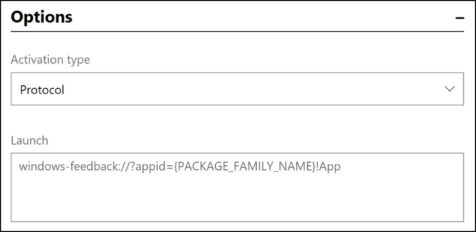

# Send notifications to your app's customers

Engaging with your customers at the right time and with the right message is key to your success as an app developer. Notifications can encourage your customers to take an action, such as rating an app, buying an add-on, trying a new feature, or downloading another app (perhaps for free with a [promotional code](generate-promotional-codes.md) that you provide).

[Partner Center](https://partner.microsoft.com/dashboard) provides a data-driven customer engagement platform you can use to send notifications to all of your app's customers, or only targeted to a subset of your app's Windows 10 or Windows 11 customers who meet the criteria you’ve defined in a [customer segment](create-customer-segments.md). You can also create a notification to be sent to customers of more than one of your apps.

> [!IMPORTANT]
> These notifications can only be used with UWP apps.

When considering the content of your notifications, keep in mind:
- The content in your notifications must comply with the Store [Content Policies](/windows/apps/publish/store-policies-and-code-of-conduct#content_policies).
- Your notification content should not include confidential or potentially sensitive info.
- While we’ll make every effort to deliver your notification as scheduled, there may occasionally be latency issues that impact delivery.
- Be sure not to send notifications too often. More than once every 30 minutes can seem intrusive (and for many scenarios, less frequently than that is preferable).
- Be aware that if a customer who uses your app (and is signed in with their Microsoft account at the time the segment membership is determined) later gives their device to someone to use, the other person may see the notification that was targeted at the original customer. For more info, see [Configure your app for targeted push notifications](/windows/uwp/monetize/configure-your-app-to-receive-dev-center-notifications#notification-customers).
- If you send the same notification to customers of multiple apps, you can't target a segment; the notification will be sent to all customers for the apps you select.

## Getting started with notifications

At a high-level, you need to do three things to use notifications to engage with your customers.

1. **Register your app to receive push notifications.** You do this by adding a reference to the Microsoft Store Services SDK in your app and then adding a few lines of code that registers a notification channel between Partner Center and your app. We’ll use that channel to deliver your notifications to your customers. For details, see [Configure your app for targeted push notifications](/windows/uwp/monetize/configure-your-app-to-receive-dev-center-notifications).
2. **Decide which customers to target.** You can send your notification to all of your app's customers, or (for notifications created for a single app) to a group of customers called a *segment*, which you can define based on demographic or revenue criteria. For more info, see [Create customer segments](create-customer-segments.md).
3. **Create your notification content and send it out.** For example, you might create a notification that encourages new customers to rate your app, or send a notification promoting a special deal to purchase an add-on.

## To create and send a notification

Follow these steps to create a notification in Partner Center and send it to a particular customer segment.

> [!NOTE]
> Before an app can receive notifications from Partner Center, you must first call the [RegisterNotificationChannelAsync](/uwp/api/microsoft.services.store.engagement.storeservicesengagementmanager.registernotificationchannelasync) method in your app to register your app to receive notifications. This method is available in the [Microsoft Store Services SDK](https://marketplace.visualstudio.com/items?itemName=AdMediator.MicrosoftStoreServicesSDK). For more information about how to call this method, including a code example, see [Configure your app for targeted push notifications](/windows/uwp/monetize/configure-your-app-to-receive-dev-center-notifications).

1. In [Partner Center](https://partner.microsoft.com/dashboard), expand the **Engage** section, and then select **Notifications**.
2. On the **Notifications** page, select **New notification**.
3. In the **Select a template** section, choose the [type of notification](#notification-template-types) you want to send and then click **OK**.
4. On the next page, use the drop-down menu to choose either a **Single app** or **Multiple apps** for which you want to generate a notification. You can only select apps that have been [configured to receive notifications using the Microsoft Store Services SDK](/windows/uwp/monetize/configure-your-app-to-receive-dev-center-notifications).
5. In the **Notification settings** section, choose a **Name** for your notification and, if applicable, choose the **Customer group** to which you want to send the notification. (Notifications sent to multiple apps can only be sent to all customers of those apps.) If you wish to use a segment that you haven't created already, select **Create new customer group**. Note that it takes 24 hours before you can use a new segment for notifications. For more info, see [Create customer segments](create-customer-segments.md).
6. If you want to specify when to send the notification, clear the **Send notification immediately** checkbox and choose a specific date and time (in UTC for all customers, unless you specify to use each customer's local time zone).
7. If you want the notification to expire at some point, clear the **Notification never expires** checkbox and choose a specific expiration date and time (in UTC).
8. **For notifications to a single app:** If you want to filter the recipients so that your notification is only delivered to people who use certain languages or are in specific time zones, check the **Use filters** checkbox. You can then specify the language and/or time zone options you want to use.
8. **For notifications to multiple apps:** Specify whether to send the notification only to the last active app on each device (per customer), or to all apps on each device.
10. In the **Notification content** section, in the **Language** menu, choose the languages in which you want your notification to be displayed. For more info, see [Translate your notifications](#translate-your-notifications).
11. In the **Options** section, enter text and configure any other options you’d like. If you started with a template, some of this is provided by default, but you can make any changes you'd like.

    The available options vary, depending on which notification type you are using. Some of the options are:

    * **Activation type** (interactive toast type). You can choose **Foreground**, **Background**, or **Protocol**.
    * **Launch** (interactive toast type). You can choose to have the notification open an app or website.
    * **Track app launch rate** (interactive toast type). If you want to measure how well you’re engaging with your customers through each notification, select this checkbox. For more details, see [Measure notification performance](#measure-notification-performance).
    * **Duration** (interactive toast type). You can choose **Short** or **Long**.
    * **Scenario** (interactive toast type). You can choose **Default**, **Alarm**, **Reminder**, or **Incoming call**.
    * **Base URI** (interactive toast type). For more details, see [BaseUri](/uwp/api/windows.ui.xaml.frameworkelement.baseuri#Windows_UI_Xaml_FrameworkElement_BaseUri).
    * **Add image query** (interactive toast type). For more details, see [addImageQuery](/uwp/schemas/tiles/toastschema/element-visual#attributes-and-elements).
    * **Visual**. An image, video, or sound. For more details, see [visual](/uwp/schemas/tiles/toastschema/element-visual).
    * **Input**/**Action**/**Selection** (interactive toast type). Allows you to let users interact with the notification. For more info, see [Adaptive and interactive toast notifications](/windows/apps/design/shell/tiles-and-notifications/adaptive-interactive-toasts).
    * **Binding** (interactive tile type). The toast template. For more details, see [binding](/uwp/schemas/tiles/toastschema/element-binding).

    > [!TIP]
    > Try using the [Notifications Visualizer](https://www.microsoft.com/store/apps/9nblggh5xsl1) app to design and test your adaptive tiles and interactive toast notifications.

12. Select **Save as draft** to continue working on the notification later, or select **Send** if you’re all done.

## Notification template types

You can choose from a variety of notification templates.

-	**Blank (Toast).** Start with an empty toast notification that you can customize. A toast notification is a pop-up UI that appears on your screen to allow your app to communicate with the customer when the customer is in another app, on the Start screen, or on the desktop.
-	**Blank (Tile).** Start with an empty tile notification that you can customize. Tiles are an app's representation on the Start screen. Tiles can be “live,” which means that the content that they display can change in response to notifications.
-	**Ask for ratings (Toast).** A toast notification that asks your customers to rate your app. When the customer selects the notification, the Store ratings page for your app is displayed.
-	**Ask for feedback (Toast).** A toast notification that asks your customers to provide feedback for your app. When the customer selects the notification, the Feedback Hub page for your app is displayed.
    > [!NOTE]
    > If you choose this template type, in the **Launch** box, remember to replace the {PACKAGE_FAMILY_NAME} placeholder value with your app’s actual Package Family Name (PFN). You can find your app’s PFN on the [App identity](view-app-identity-details.md) page (**App management** > **App identity**).

    

-	**Cross-promote (Toast).** A toast notification to promote a different app of your choosing. When the customer selects the notification, the other app’s Store listing is displayed.
    > [!NOTE]
    > If you choose this template type, in the **Launch** box, remember to replace the **{ProductId you want to promote here}** placeholder value with the actual Store ID of the item you want to cross promote. You can find the Store ID on the [App identity](view-app-identity-details.md) page (**App management** > **App identity**).

    

-	**Promote a sale (Toast).** A toast notification that you can use to announce a deal for your app. When the customer selects the notification, your app’s Store listing is displayed.
-	**Prompt for update (Toast).** A toast notification that encourages customers who are running an older version of your app to install the latest version. When the customer selects the notification, the Store app will launch, showing the **Downloads and updates** list. Note that this template can only be used with a single app, and you can't target a particular customer segment or define a time to send it; we’ll always schedule this notification to be sent within 24 hours, and making our best effort to target all users who are not yet running the latest version of your app.

## Measure notification performance

You can measure how well you’re engaging with your customers through each notification.

### To measure notification performance

1.	When you create a notification, in the **Notification content** section, select the **Track app launch rate** checkbox.
2.	In your app, call the [ParseArgumentsAndTrackAppLaunch](/uwp/api/microsoft.services.store.engagement.storeservicesengagementmanager.parseargumentsandtrackapplaunch) method to notify Partner Center that your app was launched in response to a targeted notification. This method is provided by the Microsoft Store Services SDK. For more information about how to call this method, see [Configure your app to receive Partner Center notifications](/windows/uwp/monetize/configure-your-app-to-receive-dev-center-notifications).

### To view notification performance

When you’ve configured the notification and your app to measure notification performance as described above, you can see how well your notifications are performing.

To review detailed data for each notification:

1.	In Partner Center, expand the **Engage** section and select **Notifications**.
2.  In the table of existing notifications, select **In progress** or **Completed**, and then look at the **Delivery rate** and **App launch rate** columns to see the high-level performance of each notification.
3.  To see more granular performance details, select a notification name. In the **Delivery statistics** section, you can view **Count** and **Percentage** info for the following notification **Status** types:
    * **Failed**: The notification was not delivered for some reason. This can happen, for example, if an issue occurs in the Windows Notification Service.
    * **Channel expiration failure**: The notification could not be delivered because the channel between the app and Partner Center has expired. This can happen, for example, if the customer has not opened your app in a long time.
    * **Sending**: The notification is in the queue to be sent.
    * **Sent**: The notification was sent.
    * **Launches**: The notification was sent, the customer clicked it, and your app was opened as a result. Note that this only tracks app launches. Notifications that invite the customer to take other actions, such as launching the Store to leave a rating, are not included in this status.
    * **Unknown**: We weren’t able to determine the status of this notification.

To analyze user activity data for all your notifications:

1.  In Partner Center, expand the **Engage** section and select **Notifications**.
2.  On the **Notifications** page, click the **Analyze** tab. This tab displays the following data:
    * Graph views of the various user action states for your toasts and action center notifications.
    * World map views of the click-through-rates for your toasts and action center notifications.
3. Near the top of the page, you can select the time period for which you want to show data. The default selection is 30D (30 days), but you can choose to show data for 3, 6, or 12 months, or for a custom data range that you specify. You can also expand **Filters** to filter all of the data by app and market.

## Translate your notifications

To maximize the impact of your notifications, consider translating them into the languages that your customers prefer. Partner Center makes it easy for you to translate your notifications automatically by leveraging the power of the [Microsoft Translator](https://www.microsoft.com/translator/home.aspx) service.

1.	After you’ve written your notification in your default language, select **Add languages** (beneath the **Languages** menu in the **Notification content** section).
2.	In the **Add languages** window, select the additional languages that you want your notifications to appear in, and then select **Update**.
Your notification will be automatically translated into the languages you chose in the **Add languages** window and those languages will be added to the **Language** menu.
3.	To see the translation of your notification, in the **Language** menu, select the language that you just added.

Things to keep in mind about translation:
 - You can override the automatic translation by entering something different in the **Content** box for that language.
 - If you add another text box to the English version of the notification after you’ve overridden an automatic translation, the new text box will not be added to translated notification. In that case, you would need to manually add the new text box to each of translated notifications.
 - If you change the English text after the notification has been translated, we’ll automatically update the translated notifications to match the change. However, this won’t happen if you previously chose to override the initial translation.

## Related topics
- [Tiles for UWP apps](/windows/apps/design/shell/tiles-and-notifications/creating-tiles)
- [Windows Push Notification Services (WNS) overview](/windows/apps/design/shell/tiles-and-notifications/windows-push-notification-services--wns--overview)
- [Notifications Visualizer app](https://www.microsoft.com/store/apps/9nblggh5xsl1)
- [StoreServicesEngagementManager.RegisterNotificationChannelAsync() | registerNotificationChannelAsync() method](/uwp/api/microsoft.services.store.engagement.storeservicesengagementmanager.registernotificationchannelasync)
