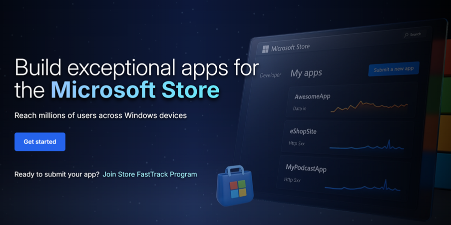
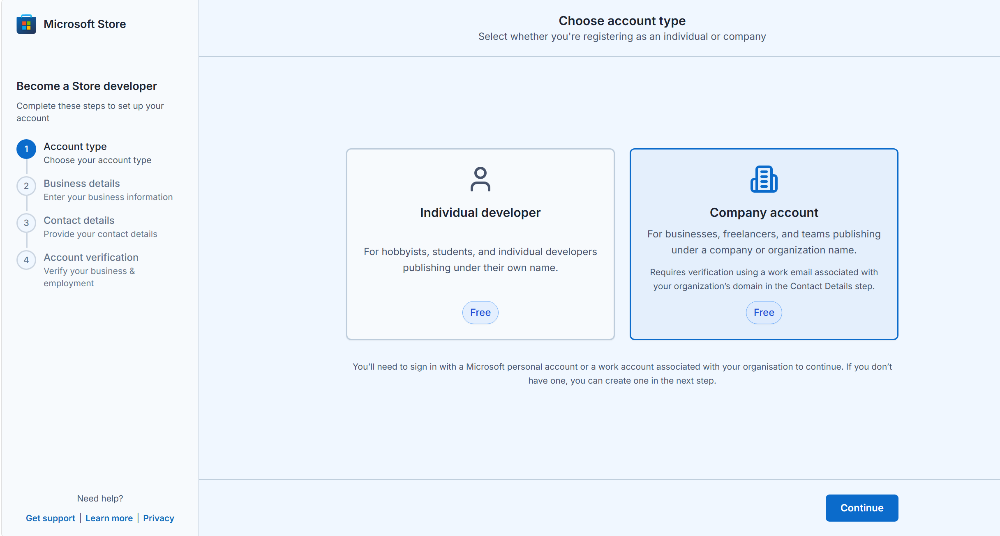
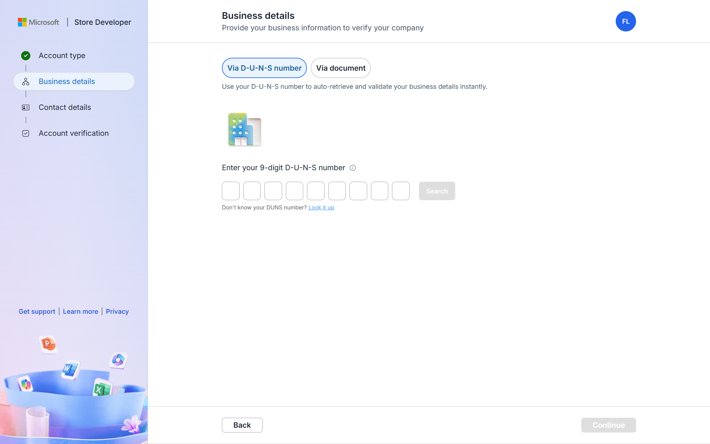
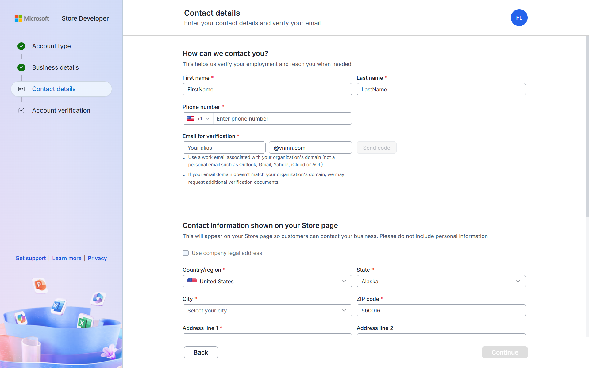
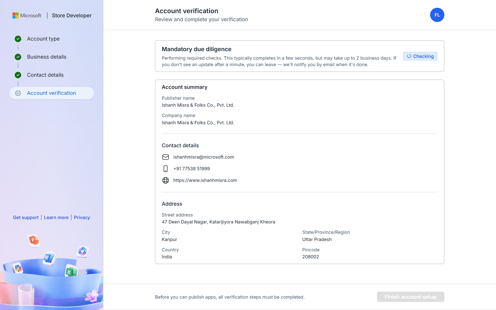
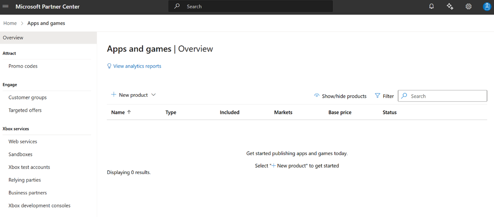
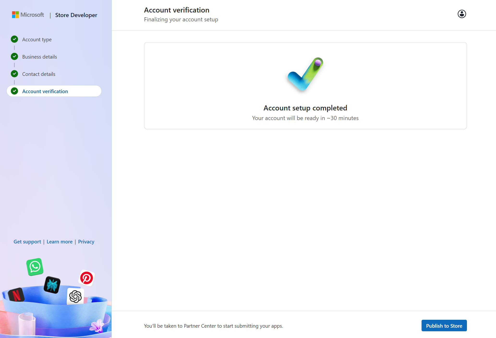

# Revamped company onboarding experience with zero registration fees

The new onboarding process allows company developers to publish apps to the Microsoft Store without any onboarding fees.  

## What’s New

| Feature                           | Description                                                               |
|-----------------------------------|---------------------------------------------------------------------------|
| **Free registration**           | The $99 registration fee is waived in the new flow. |
| **Guided, lightweight onboarding**         | A clean, modern experience with step-by-step guidance and email notifications for verification status updates, so you know what’s happening and what to do next. |
| **Microsoft Entra ID (work account) sign-in support**         | You can now sign in with either a personal Microsoft account (MSA) or a Microsoft Entra ID work account when creating a company developer account. If you sign in with an Entra ID account, your entire organization's tenant is onboarded — meaning other users from the same tenant can also access Partner Center once appropriate roles are assigned. |

## Who should select a company account

* **Independent developers and freelancers** whose distribution of apps through the Store is **in relation to their business, trade, or profession**
* **Businesses and Organizations** such as corporations, LLCs, partnerships, non-profits, or government organizations
* **Teams or Groups** within a company or organization 

Company accounts publish apps under the organization’s legal or trade name and require business and employment verification before apps can be published. 

## Step-by-Step Flow

Before you begin, make sure you have the following: 

#### _For business verification (choose one)_ 

**Option 1: DUNS number (recommended)** 

* A valid 9-digit DUNS number
* Enables faster, automated retrieval of business details 

**Option 2: Official business documents** 

You can verify your business by uploading an official business document, such as: 
* Articles or certificate of incorporation, partnership deed, or equivalent formation document
* Government-issued business registration or license
* Official company registry record from a government website
* Tax filings or stock exchange filings 

If you don’t use a DUNS number, your account will go through **manual review**, which can take longer.  

#### _For contact and employment verification_ 

* A **work email address** associated with your organization’s domain
* If your email domain doesn’t match your organization’s domain, we may request **additional documentation** to verify your association with the company, such as:
   * An **official domain ownership record** showing the domain purchase date and expiration or renewal dates
   * An **official domain purchase invoice or registry confirmation** showing the domain’s purchase date and expiration or renewal dates 

### Steps to create your company developer account 

Uploaded documents must be official, current, and clearly show ownership of the domain. 

1. **Go to** [storedeveloper.microsoft.com](https://storedeveloper.microsoft.com)

   > **Note for existing developers:** If you already have a developer account and sign in with an existing MSA, you will skip Steps 5–10 and be taken directly to Step 11. Alternatively, you can go straight to the [Partner Center apps and games page](https://aka.ms/submitwindowsapp).

2. Click **“Get started”** to begin.

3. Select **Company account** (free).

4. Sign in with your **personal Microsoft account (MSA)** or your **Microsoft Entra ID (work) account**:
* **Personal Microsoft account (MSA)**: Use an existing personal Microsoft account or create a new one.
* **Microsoft Entra ID (work account)**: Sign in with your organization's work account (e.g., user@contoso.com). This option is available for company accounts only. Individual developer accounts must use a personal Microsoft account.

> **Note:**
> * **Tenant-wide onboarding**: When you sign in with an Entra ID account and complete onboarding, your entire Microsoft Entra tenant is onboarded. All users in your organization's tenant are marked as having an active developer account. However, only the user who completes the onboarding process receives Owner permissions by default in Partner Center. Other tenant users will need to be assigned roles (Developer, Manager, Owner, etc.) by an Owner or Manager through [Partner Center → Account settings → User management.](../publish/partner-center/manage-users-in-partner-center.md)
> * **If your organization's tenant is already onboarded**: If someone in your organization has already completed company account onboarding using an Entra ID account, and you sign in with your own Entra ID account from the same tenant, you will be redirected to Partner Center. However, you may not see the Apps & Games workspace in Partner Center. This is expected unless an Owner or Manager has given you the necessary permissions.
> **What to do:**
>   1. Contact your account Owner or Manager and ask them to assign you a role through [Partner Center → Account settings → User management.](../publish/partner-center/manage-users-in-partner-center.md)
>   2. If you don't know who the Owner or Manager of your account is, check with your Microsoft Entra tenant administrator.

5. Enter your business details by verifying with a **D-U-N-S number** (recommended for faster verification) or by uploading **official business documents**. Review and confirm the company information shown.

   > **Note:** Verification using documents may go to manual review and can take up to 3-5 business days.

 

6. Enter **contact** details.  

   Provide your contact information for verification and communication, and the support contact details that will appear on your Store listing. 

   > **Note for ‘Email for verification’:** Use a work email address that matches your company’s domain. Personal emails like Gmail or Yahoo aren’t supported. If the domains don’t match, additional documents may be required for domain verification. 

7. Review and accept the **agreement**.

8. Complete account **verification**

   After you submit your details, your account enters account verification. All verification progress is shown on the Verification summary page, including the status of mandatory due diligence, business verification, and employment verification.  

   > **Note:** Mandatory due diligence is required and is a blocking step. You can’t proceed further until this step is successfully completed. Only after mandatory due diligence passes can business and employment verification continue. 

   For each verification step, one of the following will occur: 
   * Verification completes automatically, typically within a few seconds to a minute, or
   * Verification doesn’t complete automatically, and will move to manual review 

   Manual reviews typically take 2–5 business days. During this time, you can leave the page and wait for an email notification. Once notified, return to the Verification summary page to check the updated status or take any required action. 

9. Take action if verification requires it 

If a verification step requires additional supporting documents, the Verification summary page will show the action required, and you’ll be notified via email. Follow the instructions to upload the requested documents and submit your verification appeal.

Each verification type (business and employment) allows up to three verification appeals, so ensure that all submitted information and documents are accurate and current to avoid delays. You’ll receive an email notification when the verification status changes or further action is required.

  > **Note:** If you realize that any of the information originally provided (such as company name, address, or email domain) was incorrect, you may update your account details. Updating key details will restart the verification process, and any previous appeals or related history will not be carried over.

10. Create your company developer account 

   After your verification is completed, finish your account setup and select **“Publish to Store”**. 

   You’ll first be prompted to choose a Microsoft account (MSA). Make sure to select the same account you used to create your Store developer account. Once signed in, you’ll land on the “Apps & Games overview” page in Partner Center. 

   If you’re not taken there immediately: 
   * Wait about 5 minutes, refresh your browser until the Apps & Games tile appears, and then select it, or 
   * Navigate directly to the [Partner Center Apps & Games page](https://aka.ms/submitwindowsapp)

   From there, you can start submitting apps for publishing to the Microsoft Store. 

   > **Note:** After account creation, it may take up to 30 minutes for your verification status to fully reflect across Partner Center. If app submission isn’t available immediately, wait a few minutes and try again. 

## Need help? Contact us

If you need any assistance for account creation/management, app submission, app certification or app analytics, a support ticket can be raised from [here](https://aka.ms/windowsdevelopersupport). You can also explore guidance in our [publishing documentation](/windows/apps/publish).

## Frequently Asked Questions (FAQs)

### Do I need to pay the registration fee?

No — if you're using the new flow via the [Store marketing page](https://storedeveloper.microsoft.com/).  

### How do I access the new flow?

You must begin your journey at [storedeveloper.microsoft.com](https://storedeveloper.microsoft.com). This is the only supported entry point for company onboarding.

### I already have a developer account—do I need to use this?

No — this flow is only for new company developers creating their account for the first time.

### Can I use my work account (Microsoft Entra ID) to create an Individual developer account?

No, Entra ID (work account) sign-up is currently supported only for Company accounts. If you're signing up as an Individual developer, you must use a personal Microsoft account (MSA).

### I signed in with my Entra ID (work account) but I can't see the Apps & Games workspace in Partner Center. What should I do?

This typically means someone else in your organization has already completed company account onboarding, and your tenant is already registered. You've been redirected to Partner Center, but you haven't been assigned a role yet. Contact your account Owner or Manager and ask them to assign you a role (such as Developer, Manager, or Owner) through [Partner Center → Account settings → User management.](../publish/partner-center/manage-users-in-partner-center.md) If you're unsure who the Owner or Manager is, check with your Microsoft Entra tenant administrator.
