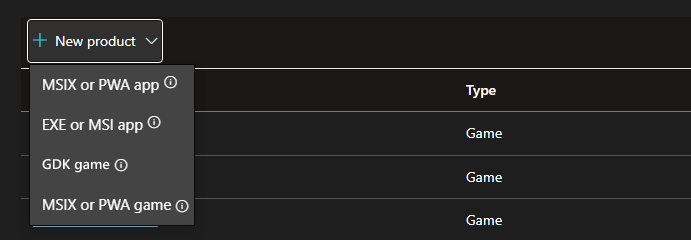

# Publish PC games to the Microsoft Store using the GDK

#### The Microsoft Store on Windows is open to Win32 PC games.

This guidance describes a **simplified, self‑service publishing path** that lets you publish Win32 PC games to the Microsoft Store using the **Microsoft Game Development Kit (GDK)**, without requiring managed partner enrollment or concept approval. 

You continue building a **standard Win32 PC game**, with full access to Win32 APIs, third‑party engines, and extension libraries. Using the GDK adds a Store‑native packaging and servicing model that aligns your game with modern Microsoft gaming workflows.  

> [!NOTE]
> If you want to publish to **Xbox** or PC with Xbox services (including concept approval), please visit [Xbox Developer Programs | Onboarding Hub](https://developer.microsoft.com/games/publish/). 

## Who does this apply to?

This path is designed for developers who want to publish PC‑only games to the Microsoft Store using the same core tools and packaging model used across Microsoft’s gaming ecosystem, while remaining focused on Windows distribution. 

This publishing path is a good fit for your game if you: 

* Are building a **PC‑only game** for Windows
* Use (or plan to use) **Win32‑based engines and toolchains**
* Want a **self‑service publishing experience** that does not require concept approval
* Prefer **modern Microsoft gaming tooling** aligned with future expansion paths

This includes independent developers, small and mid‑size studios, and teams already publishing on other open PC storefronts who want to reach Windows players through the Microsoft Store. 

## What’s new and why this path exists 

This path introduces a clearer and more accessible way to publish Win32 PC games to the Microsoft Store: 

* **Self-service publishing**: Submit and manage releases in Partner Center without joining ID@Xbox or completing concept approval.
* **Modern packaging with MSIXVC**: Use the Store-native packaging model that supports secure installs, streaming installation, and smart updates.
* **Aligned with Microsoft gaming workflows**: Build with the GDK and stay consistent with tooling and packaging used across Microsoft’s gaming ecosystem.
* **Windows-wide discovery**: Benefit from Microsoft Store discovery and merchandising, plus surfaces like Windows Search and Bing.
* **Clear path forward**: Start with PC-only publishing today while keeping options open for future expansion into additional Microsoft gaming programs and device families.  

## How the publishing flow works

This path follows a straightforward, self‑service workflow: 

* **Develop your game** using the publicly available GDK toolchain.
* **Prepare your game package** using the MSIXVC format for Store distribution.
* **Submit through Partner Center** to configure product details, upload packages, manage releases, and complete certification.
* **Publish and service your game** through ongoing updates and submissions in Partner Center.

## Choose your publishing path 
 
Use the quick guide below to choose the right option based on the type of game you have today (or 
plan to build next).

* Win32 game (existing) or starting a new PC game: Microsoft recommends using the GDK Game option.
* UWP game (existing) that you want to publish: choose the MSIX or PWA game option.
* Web-based game (PWA): choose the MSIX or PWA game option. 

## Before you begin

 - Enroll as a Microsoft Store developer. To learn more, see [Microsoft Store Developer Platform](https://storedeveloper.microsoft.com/home).
 - Access your Partner Center account.

## Publishing process

The process to create, configure, and publish a game that's packaged by using the GDK is as follows.

 1. [Create a game](https://learn.microsoft.com/gaming/game-publishing/tutorial-xbox-managed/how-to-create-a-title-and-configure-game-setup?pivots=msow) in Partner Center and configure the **Game setup** page.
 2. Create and upload a [Package](https://learn.microsoft.com/gaming/game-publishing/tutorial-xbox-managed/how-to-create-a-package?pivots=msow).
 3. Configure [Properties](https://learn.microsoft.com/gaming/game-publishing/tutorial-xbox-managed/how-to-configure-properties?pivots=msow).
 4. Configure [Age ratings](https://learn.microsoft.com/gaming/game-publishing/tutorial-xbox-managed/how-to-set-age-ratings?pivots=msow).
 5. Configure [Store listings](https://learn.microsoft.com/gaming/game-publishing/tutorial-xbox-managed/how-to-create-a-store-listing?pivots=msow).
 6. Configure [Pricing and availability](https://learn.microsoft.com/gaming/game-publishing/tutorial-xbox-managed/how-to-configure-pricing-and-availability?pivots=msow).
 7. [Certify](https://learn.microsoft.com/gaming/game-publishing/tutorial-xbox-managed/how-to-certify-a-game?pivots=msow) your product.
 8. [Review and publish](https://learn.microsoft.com/gaming/game-publishing/tutorial-xbox-managed/how-to-publish-a-base-game?pivots=msow) your product to the Microsoft Store.

For detailed guidance on how to publish your PC game, check out the following video:

>[!VIDEO https://learn-video.azurefd.net/vod/player?id=95742aab-25e4-4d23-accb-2c6961ba704a]

### Frequently asked questions

#### Do I need to be an ID@Xbox developer to publish a PC game using this path? 

No. This publishing path does not require ID@Xbox enrollment or managed partner status. It is a self‑service option for publishing PC‑only games to the Microsoft Store on Windows using the GDK. 

If you plan to publish to Xbox consoles in the future, you’ll need to enroll in the appropriate managed Xbox program at that time. 

#### Can I publish Win32 PC games to the Microsoft Store using the GDK? 

Yes. This path is designed for Win32‑based PC games built using the GDK for Windows. It supports modern PC game engines and toolchains and packages games using the MSIXVC format for Store distribution. 

#### Is this the recommended path for new PC games on Windows? 

For developers building new PC‑only games and targeting the Microsoft Store on Windows, this is the recommended publishing path. It provides modern tooling, streamlined onboarding, and a Store‑native packaging and servicing model.

#### I have a game built with Unity or Unreal Engine. Can I publish it to the Microsoft Store using this path?

Yes. Games built with Unity and Unreal Engine can be published using this path. Some engines support creating GDK packages directly from the editor. Refer to your engine's documentation for engine-specific guidance.

#### Do I need Xbox services to publish my PC game? 

No. Xbox services are not required to publish a PC‑only game using this path. You can choose to integrate Xbox services based on your game’s design and feature needs, but they are optional for publishing. 

#### Can I start with PC‑only publishing and move to ID@Xbox later? 

Yes. You can begin by publishing your PC game through this self‑service path and pursue managed Xbox programs later if you decide to expand to console or additional platforms. 

Migration or onboarding into managed programs follows the requirements of those programs and is handled separately. 

#### Does this path support future expansion beyond PC? 

Yes. This path uses the same GDK tooling and MSIXVC packaging model used across Microsoft’s gaming ecosystem. While it focuses on PC‑only distribution today, it keeps your game aligned with workflows used by other Microsoft gaming programs. 

#### When should I not use this path? 

This path may not be the right fit if: 

* You are publishing a UWP‑based game or a PWA
* You are already enrolled in a managed Xbox program and publishing to consoles
* Your game targets non‑PC platforms only
