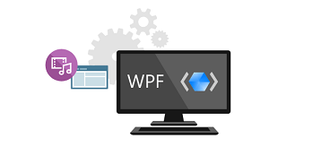

# Speech, voice, and conversation in Windows 10

Speech can be an effective, natural, and enjoyable way for people to interact with your Windows applications, complementing, or even replacing, traditional interaction experiences based on mouse, keyboard, touch, controller, or gestures.

Use speech recognition, dictation, speech synthesis (also known as text-to-speech, or TTS), and conversational capabilities with various voice assistants to provide more robust and inclusive user experiences in your Windows applications, and help people be productive when other devices and experiences might not.

This page provides information on how the various Windows development frameworks provide speech recognition, speech synthesis, and conversation support for developers building Windows applications.

## Platform-specific documentation

:::row:::
   :::column:::
      

      **Universal Windows Platform (UWP)**

      Build speech-enabled apps on the modern platform for Windows 10 applications and games, on any Windows device (including PCs, phones, Xbox One, HoloLens, and more), and publish them to the Microsoft Store.

      [Speech interactions](https://docs.microsoft.com/windows/uwp/design/input/speech-interactions)

      [Speech recognition](https://docs.microsoft.com/windows/uwp/design/input/speech-recognition)

      [Continuous dictation](https://docs.microsoft.com/windows/uwp/design/input/enable-continuous-dictation)

      [Speech synthesis](https://docs.microsoft.com/uwp/api/windows.media.speechsynthesis)

      [Conversational agents](https://docs.microsoft.com/uwp/api/windows.applicationmodel.conversationalagent)
      > Expose your application's functionality through any digital assistant supported by the Windows platform Agent Activation Runtime (AAR).

      [Cortana voice commands](https://docs.microsoft.com/cortana/voice-commands/vcd)
      > Extend the basic functionality of Cortana with voice commands that launch and execute a single action in your Windows application.
   :::column-end:::
   :::column:::
      

      **Win32 platform**

      Develop accessible apps and tools on the original platform for C/C++ Windows applications.

      [What's new in Windows accessibility and automation](https://docs.microsoft.com/windows/desktop/accessibility-whatsnew)

      [Developing accessible applications for Windows](https://docs.microsoft.com/windows/desktop/accessibility-appdev)

      [Developing accessible UI frameworks for Windows](https://docs.microsoft.com/windows/desktop/accessibility-uiframeworkdev)

      [Developing assistive technology for Windows](https://docs.microsoft.com/windows/desktop/accessibility-atdev)

      [Testing for accessibility](https://docs.microsoft.com/windows/desktop/accessibility-testwithuia)

      [Legacy accessibility and automation technology - MSAA to UI Automation](https://docs.microsoft.com/windows/desktop/accessibility-legacy)

      [Windows Accessibility features](https://docs.microsoft.com/windows/desktop/winauto/about-windows-accessibility-features)

      [Guidelines for designing accessible apps](https://docs.microsoft.com/windows/desktop/uxguide/inter-accessibility)
   :::column-end:::
:::row-end:::
:::row:::
   :::column:::
      

      **Windows Presentation Foundation (WPF)**

      Develop accessible apps and tools on the established platform for managed Windows applications with a XAML UI model and the .NET Framework.

      [System.Speech Programming Guide for .NET Framework](https://docs.microsoft.com/previous-versions/office/developer/speech-technologies/hh361625(v=office.14))

      [UI Automation Fundamentals](https://docs.microsoft.com/dotnet/framework/ui-automation/index)

      [UI Automation Providers for Managed Code](https://docs.microsoft.com/dotnet/framework/ui-automation/ui-automation-providers-for-managed-code)

      [UI Automation Clients for Managed Code](https://docs.microsoft.com/dotnet/framework/ui-automation/ui-automation-clients-for-managed-code)

      [UI Automation Control Patterns](https://docs.microsoft.com/dotnet/framework/ui-automation/ui-automation-control-patterns)

      [UI Automation Text Pattern](https://docs.microsoft.com/dotnet/framework/ui-automation/ui-automation-text-pattern)

      [UI Automation Control Types](https://docs.microsoft.com/dotnet/framework/ui-automation/ui-automation-control-types)

      [UI Automation Specification and Community Promise](https://docs.microsoft.com/dotnet/framework/ui-automation/ui-automation-specification-and-community-promise)
   :::column-end:::
   :::column:::
      

      **Windows Forms (WinForms)**

      Develop accessible apps and tools for managed Windows applications with a XAML UI model and the .NET Framework.

      [Windows Forms Accessibility](https://docs.microsoft.com/dotnet/framework/winforms/advanced/windows-forms-accessibility)

      [Creating an Accessible Windows Application](https://docs.microsoft.com/dotnet/framework/winforms/advanced/walkthrough-creating-an-accessible-windows-based-application)

      [Properties on Windows Forms Controls That Support Accessibility Guidelines](https://docs.microsoft.com/dotnet/framework/winforms/advanced/properties-on-windows-forms-controls-that-support-accessibility-guidelines)

      [Providing Accessibility Information for Controls on a Windows Form](https://docs.microsoft.com/dotnet/framework/winforms/controls/providing-accessibility-information-for-controls-on-a-windows-form)
   :::column-end:::
:::row-end:::
:::row:::
   :::column span="2":::
      **Azure speech services**

      Design, build, and test accessible web sites with Azure speech services.
   :::column-end:::
:::row-end:::
:::row:::
   :::column:::
      [Speech to text](https://azure.microsoft.com/services/cognitive-services/speech-to-text/)

      [Text to speech](https://azure.microsoft.com/services/cognitive-services/text-to-speech/)
   :::column-end:::
   :::column:::
      [Speech translation](https://azure.microsoft.com/services/cognitive-services/speech-translation/)

      [Voice-first virtual assistants](https://docs.microsoft.com/azure/cognitive-services/speech-service/voice-first-virtual-assistants)
   :::column-end:::
:::row-end:::

:::row:::
   :::column span="2":::
      **Legacy features**

      Legacy, deprecated, and/or unsupported versions of Microsoft Speech technology.
   :::column-end:::
:::row-end:::
:::row:::
   :::column:::
      [Microsoft Agent](https://docs.microsoft.com/windows/win32/lwef/microsoft-agent)

      [Microsoft Speech Application Software Development Kit (SASDK) Version 1.0](https://www.microsoft.com/download/details.aspx?id=2200)

      [The Bing Speech Recognition Control](https://docs.microsoft.com/previous-versions/bing/speech/dn434583(v%3dmsdn.10))
   :::column-end:::
   :::column:::
      [Speech SDK 5.1](https://www.microsoft.com/download/details.aspx?id=10121)

      [Microsoft Speech API (SAPI) 5.3](https://docs.microsoft.com/previous-versions/windows/desktop/ms723627(v=vs.85))

      [Microsoft Speech API (SAPI) 5.4](https://docs.microsoft.com/previous-versions/windows/desktop/ee125663(v=vs.85))
   :::column-end:::
:::row-end:::

## Samples

Download and run full Windows samples that demonstrate various accessibility features and functionality.

:::row:::
   :::column:::
      [Code sample browser](https://docs.microsoft.com/samples/browse/)

      The new samples browser replacing the MSDN Code Gallery.
   :::column-end:::
   :::column:::
      [MSDN Code Gallery (retired)](https://code.msdn.microsoft.com/site/search?query=accessibility&f%5B0%5D.Value=accessibility&f%5B0%5D.Type=SearchText&ac=2)

      Download samples for Windows, Windows Phone, Microsoft Azure, Office, SharePoint, Silverlight and other products.
   :::column-end:::
:::row-end:::
:::row:::
   :::column:::
      [Windows classic samples on GitHub](https://github.com/microsoft/Windows-classic-samples/search?q=accessibility&unscoped_q=accessibility)

      These samples demonstrate the functionality and programming model for Windows and Windows Server. 
   :::column-end:::
   :::column:::
      [Universal Windows Platform (UWP) samples on GitHub](https://github.com/microsoft/Windows-universal-samples/search?q=accessibility&unscoped_q=accessibility)

      These samples demonstrate the API usage patterns for the Universal Windows Platform (UWP) in the Windows Software Development Kit (SDK) for Windows 10.
   :::column-end:::
:::row-end:::
:::row:::
   :::column span="2":::
      [XAML Controls Gallery](https://github.com/microsoft/Xaml-Controls-Gallery)

      This app demonstrates the various Xaml controls supported in the Fluent Design System.
   :::column-end:::
:::row-end:::

## Videos

Various videos covering how to build accessible Windows applications to general accessibility concerns and how Microsoft addresses them.

:::row:::
   :::column:::
      **How to get started with accessibility in Windows apps**
   :::column-end:::
   :::column:::
      **One Dev Minute: Developing apps for accessibility**
   :::column-end:::
   :::column:::
      **Introduction to disability and accessibility**
   :::column-end:::
:::row-end:::
:::row:::
   :::column:::
      > [!VIDEO https://channel9.msdn.com/Events/Build/2017/P4072/player]
   :::column-end:::
   :::column:::
      > [!VIDEO https://channel9.msdn.com/Blogs/One-Dev-Minute/Developing-Apps-for-Accessibility/player]
   :::column-end:::
   :::column:::
      > [!VIDEO https://www.youtube.com/embed/Kl4CT4DaypM]
   :::column-end:::
:::row-end:::
:::row:::
   :::column:::
      **From hack to product, eye control for Windows 10**
   :::column-end:::
   :::column:::
      **Accessibility on Windows 10**
   :::column-end:::
   :::column:::
      **Introduction to Building Accessible UWP Apps**
   :::column-end:::
:::row-end:::
:::row:::
   :::column:::
      > [!VIDEO https://www.youtube.com/embed/AShNPfmAkvY]
   :::column-end:::
   :::column:::
      > [!VIDEO https://channel9.msdn.com/Events/Build/2016/P541/player]
   :::column-end:::
   :::column:::
      > [!VIDEO https://channel9.msdn.com/Events/Build/2016/P497/player]
   :::column-end:::
:::row-end:::
:::row:::
   :::column:::
      **Designing Windows accessibility features**
   :::column-end:::
   :::column:::
      **Windows 10 accessibility features empower everyone**
   :::column-end:::
   :::column:::
      **Making the mouse pointers easier to see**
   :::column-end:::
:::row-end:::
:::row:::
   :::column:::
      > [!VIDEO https://www.youtube.com/embed/Y_NJbE7wxlk]
   :::column-end:::
   :::column:::
      > [!VIDEO https://www.youtube.com/embed/BseTf-4q9GA]
   :::column-end:::
   :::column:::
      > [!VIDEO https://www.youtube.com/embed/4UzaF7_T3bw]
   :::column-end:::
:::row-end:::

## Other resources

:::row:::
   :::column span="2":::
      **Blogs and news**

      The latest from the world of Microsoft speech.
   :::column-end:::
:::row-end:::
:::row:::
   :::column:::
      [In the news](https://news.microsoft.com/?s=speech)
   :::column-end:::
   :::column:::
      [Speech blogs](https://blogs.windows.com/windowsdeveloper/?s=speech)
   :::column-end:::
:::row-end:::

:::row:::
   :::column span="2":::
      **Community and support**

      A place where Windows developers and users meet and learn together.
   :::column-end:::
:::row-end:::
:::row:::
   :::column:::
      [Windows community - Speech](https://community.windows.com/search?q=speech)
   :::column-end:::
   :::column:::
      [Windows Speech Developer's Forum](https://social.msdn.microsoft.com/Forums/home?filter=alltypes&sort=firstpostdesc&searchTerm=speech)
   :::column-end:::
:::row-end:::
