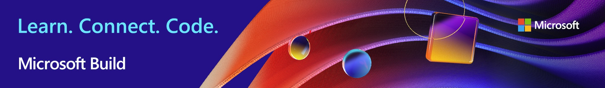

# Microsoft Build - the Windows Documentation

We've gathered together links to documentation that supports the talks given as part of [Microsoft Build 2020](https://mybuild.microsoft.com). We will update this page as the event continues, so check back to see what's new!

## Project Reunion

* [Project Reunion](https://blogs.windows.com/windowsdeveloper/2020/05/19/developing-for-all-1-billion-windows-10-devices-and-beyond/) is the future of Windows development.

## Windows Terminal

* [Install and set up Windows Terminal](/windows/terminal/get-started)
* [Set up custom key bindings](/windows/terminal/customize-settings/key-bindings)
* [Gallery of customized terminals](/windows/terminal/custom-terminal-gallery/retro-command-prompt)

## Windows Subsystem for Linux (WSL)

* [What is WSL? (What is WSL 2?)](/windows/wsl/about)
* [Install WSL 2](/windows/wsl/install-win10)
* [Comparing WSL2 and WSL 1](/windows/wsl/compare-versions)

## Windows Package Manager

* [Windows Package Manager](../../package-manager/index.md) 
* [Submit your packages](../../package-manager/package/index.md)
* [Use the winget tool](../../package-manager/winget/index.md)

## WinUI

* [Overview of WinUI](../winui/index.md)
* [WinUI 3.0 Preview release 1](../winui/winui3/index.md) 
* [WinUI 3.0 for desktop apps](../winui/winui3/get-started-winui3-for-desktop.md)

## Developing for Android on Windows

* [Android development overview](../../android/overview.md)
* [Get started](../../android/native-android.md)
* [Test on an Android device](../../android/emulator.md)

## Dual-screen device development

* [Surface Duo introduction](https://www.microsoft.com/surface/devices/surface-duo)
* [Get the Surface Duo tools](/dual-screen/android/get-duo-sdk?tabs=windows)
* [Use the Surface Duo emulator](/dual-screen/android/use-emulator?tabs=java%252cwindows)