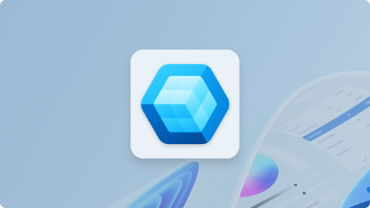
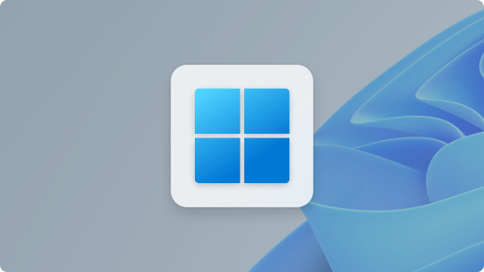

# What's new for developers

This section curates the latest platform capabilities, SDK and API additions, AI integration options, performance and diagnostics improvements, design guidance updates, and productivity tooling enhancements. Bookmark it and check back regularly: we refresh the highlights so you can focus on what moves your app forward.

---

## Latest releases

Find the latest downloads, release notes, and updates for the Windows SDK, Windows App SDK, and WinUI 3.

:::row:::
    :::column:::
         
        **Windows App SDK** 
        Latest stable: 2.3.1 
        [View release notes](https://github.com/microsoft/WindowsAppSDK/releases/tag/v2.3.1) 
        [View downloads](../windows-app-sdk/downloads.md)
    :::column-end:::
    :::column:::
         
        **Windows SDK** 
        Discover what's new 
        [View release notes](../windows-sdk/release-notes.md) 
        [View downloads](../windows-sdk/downloads.md)
    :::column-end:::
:::row-end:::

---

## Announced at Build – June 2026

- **Windows Developer Configurations**: Get from a fresh Windows install to a ready-to-code environment in minutes with curated, open-source configuration files for toolchains, OS settings, and shells — [Windows Developer Configurations](/windows/dev-configs/).
- **Coreutils for Windows**: A collection of essential Unix-style command-line utilities, now available natively on Windows — [Coreutils overview](/windows/core-utils/overview).
- **Intelligent Terminal**: An experimental, open-source fork of Windows Terminal with native agent integration, automatic error detection, and a built-in agent pane for pair-programming in the shell — [Announcing Intelligent Terminal version 0.1](https://devblogs.microsoft.com/commandline/announcing-intelligent-terminal-version-0-1/).
- **WSL Containers**: A built-in way to create, run, and interact with Linux containers on Windows using a new CLI and API, coming soon to public preview — [WSL on GitHub](https://github.com/microsoft/wsl).
- **Windows Development Skills**: Structured knowledge that enables AI agents to build native Windows apps end-to-end using WinUI 3 skills and WinApp CLI — [Get started with Windows Development Skills](https://aka.ms/winui-skills).

---

## Highlights – July 2026

- **Windows App SDK 2.3.1**: The latest stable release (July 16) adds the **Structured JSON Output API** for generating language-model responses constrained to a caller-supplied JSON Schema, the **XamlOptionalChanges API** for opting into optional breaking changes before XAML initialization, a **CompositionEngine API** (Limited Access Feature) that lets apps use the OS as the engine for Composition APIs, Video Super Resolution improvements (NPU detection fix + CPU support), ARM64EC support for Windows ML, and a massive batch of XAML performance optimizations — [Release notes](../windows-app-sdk/release-notes/windows-app-sdk-2-0.md?pivots=stable#version-231)
- **Visual Studio 2026 is here**: Faster, smarter, and a hit with early adopters — now with AI-driven development improvements, integrated Copilot agents for debugging and profiling, and backward compatibility with VS 2022 projects — [Visual Studio 2026 announcement](https://devblogs.microsoft.com/visualstudio/visual-studio-2026-is-here-faster-smarter-and-a-hit-with-early-adopters/)
- **.NET 11 Preview 6**: Features union type support in C#, async validation APIs, AI/agentic workflow enhancements, NativeAOT improvements, and enhanced runtime/JIT performance — [.NET 11 Preview 6](https://devblogs.microsoft.com/dotnet/dotnet-11-preview-6/)
- **PowerToys 0.100**: A milestone release featuring a redesigned Shortcut Guide that detects the active app and shows relevant shortcuts as a side pane, a new Command Palette Extension Gallery for browsing and installing extensions, multi-monitor Dock support, and an upgrade to .NET 10 — [PowerToys 0.100 release notes](https://github.com/microsoft/PowerToys/releases/tag/v0.100.0)
- **WSL Containers**: Run Linux containers on Windows using the new `wslc.exe` CLI or the `Microsoft.WSL.Containers` NuGet package, which provides C#, C++, and C projections for programmatically pulling, running, and interacting with Linux containers — including stdin/stdout, file mounts, networking, and GPU access — from your Windows app — [WSL Containers overview](/windows/wsl/wsl-container)

---

Previous highlights:

## Highlights – June 2026

- **Build 2026: Windows as the trusted platform for development**: Major announcements including developer-optimized Windows 11 and the Microsoft Execution Containers (MXC) SDK. For additional Build highlights, see **Announced at Build – June 2026** above — [Build 2026 blog post](https://blogs.windows.com/windowsdeveloper/2026/06/02/build-2026-furthering-windows-as-the-trusted-platform-for-development/)
- **Developer-optimized Windows 11**: One-command setup for your dev environment with VS Code, GitHub Copilot, WSL, and PowerShell 7. Now generally available.
- **Microsoft Execution Containers (MXC) SDK**: Secure, policy-driven execution containers that let agent apps set containment boundaries on resources like files and networks.
- **Windows App SDK 2.0 features**: AI Video Super Resolution API (VideoScaler), ApplicationData for unpackaged apps, XamlBindingHelper improvements, TitleBar custom drag regions, and semantic versioning — [Release notes](../windows-app-sdk/release-notes/windows-app-sdk-2-0.md)
- **Inside MSIX – Staging: Sharing is Caring**: Deep dive on how MSIX staging works — pkgdir creation, ACL enforcement, and why the immutability guarantee lets the same staged package be safely shared across all users on the system. Part 1 of a series by Howard Kapustein, MSIX Principal Engineer — [Staging: Sharing is Caring](https://devblogs.microsoft.com/insidemsix/staging-sharing-is-caring/)

---

## Highlights – May 2026

- **Inside MSIX blog**: New Microsoft engineering blog with deep dives on MSIX architecture, package identity, deployment operations, and the Stage/Register model — written by Howard Kapustein, MSIX Principal Engineer — [Inside MSIX](https://devblogs.microsoft.com/insidemsix/)
- **WinUI agent plugin for GitHub Copilot and Claude Code**: A new plugin with 8 specialized skills and a dedicated `winui-dev` agent for end-to-end WinUI development — scaffold, build, run, test, package, and migrate from WPF — in 70% fewer tokens than generic agents. Install with `/plugin install winui@awesome-copilot` — [Introducing WinUI agent plugin for GitHub Copilot and Claude Code](https://devblogs.microsoft.com/ifdef-windows/build-native-windows-apps-with-ai-agents-for-winui-and-windows-app-sdk/)
- **`dotnet new` WinUI templates** (preview): New open-source project and item templates for WinUI that let you create and run apps directly from the command line without Visual Studio. Includes Blank, NavigationView, TabView, and MVVM templates, all built around Windows app silhouettes with modern Fluent Design defaults — [Introducing dotnet new WinUI templates](https://devblogs.microsoft.com/ifdef-windows/introducing-dotnet-new-templates-for-winui/)
- **WinApp VS Code extension**: Brings the full Windows App Development CLI into VS Code — initialize, run, debug, package, and sign Windows apps from any framework (WinUI, WPF, C++, Electron, Rust, Tauri, Flutter) without leaving the editor — [Announcing the WinApp VS Code Extension](https://devblogs.microsoft.com/ifdef-windows/announcing-the-winapp-vs-code-extension-run-debug-and-package-windows-apps-in-vs-code/)

---

## Highlights – April 2026

- **WinUI 3 Gallery 2.9**: First release of WinUI Gallery built on Windows App SDK 2.0, with new control samples, updated defaults, and improvements across the board — [Announcing WinUI 3 Gallery 2.9](https://devblogs.microsoft.com/ifdef-windows/announcing-winui-3-gallery-2-9/)
- **Windows App Development CLI v0.3**: New `winapp run` and `winapp ui` commands, `dotnet run` support for packaged apps, and a full run-and-debug experience outside Visual Studio. Unlocks agentic scenarios where agents can run, see, and interact with a running Windows app — [Windows App Development CLI v0.3](https://devblogs.microsoft.com/ifdef-windows/windows-app-development-cli-v0-3-new-run-and-ui-commands-plus-dotnet-run-support-for-packaged-apps/)
- **Agentic AI tools for Windows development**: New guide on enhancing AI coding agents with Windows-specific context — including the [Microsoft Learn MCP Server](/training/support/mcp) for live documentation access, and the [WinUI 3 development plugin for GitHub Copilot](https://github.com/github/awesome-copilot/tree/main/plugins/winui3-development) to generate accurate, modern WinUI 3 code — [Agentic AI tools for Windows](../dev-tools/agentic-tools.md).
- **WinApp CLI cross-framework guides**: The Windows App Development CLI (public preview) now has step-by-step guides for adding Windows capabilities to apps built with **.NET, C++, Rust, Flutter, Electron, and Tauri** — including packaging, identity, AI integration, and notifications — [WinApp CLI guides](../dev-tools/winapp-cli/guides/index.md).
- **MapControl for WinUI**: New documentation for the [MapControl](/windows/windows-app-sdk/api/winrt/microsoft.ui.xaml.controls.mapcontrol), an interactive map powered by Azure Maps with support for pins, layers, and user interaction — [MapControl guide](../develop/ui/controls/map-control.md).
- **Materials documentation**: New dedicated pages covering how to use Mica and Acrylic in your WinUI apps — [Materials overview](../develop/ui/materials.md) and [In-app acrylic](../develop/ui/in-app-acrylic.md).
- **Store API updates**: New sections documenting how to check if an unpackaged app is installed and how to open the Store product detail page for a product — [Send requests to the Store](/windows/uwp/monetize/send-requests-to-the-store).
- **Iconography documentation reorganized**: App icon and iconography docs have been consolidated into a dedicated [Iconography hub](../design/iconography/index.md) for easier navigation.
- **Windows notifications overview**: Confused by `AppNotificationManager` vs `ToastNotificationManager`? New overview page explains which notification API to use for your app type, with a feature comparison table and links to samples — [Windows notifications overview](../develop/notifications/index.md).
- **Performance docs for WinUI**: The full set of Windows app performance documentation — startup, memory, XAML layout, animations, ListView/GridView optimization, and more — is now available under the WinUI developer section at [Windows app performance](../develop/performance/index.md).
- **Visual layer and Composition docs for WinUI**: Documentation for the Visual layer (`Microsoft.UI.Composition`) — including visuals, animations, effects, brushes, lighting, and shadows — is available in the WinUI/Windows App SDK developer section at [Visual layer overview](../develop/composition/visual-layer.md).
- **Command Palette extension toolkit**: New API reference documentation for the PowerToys Command Palette extension toolkit, covering built-in commands (`CopyPathCommand`, `OpenFileCommand`, `OpenInConsoleCommand`, and more) and layout types — [Command Palette extension toolkit](/windows/powertoys/command-palette/microsoft-commandpalette-extensions-toolkit/microsoft-commandpalette-extensions-toolkit).
- **Java getting started for Windows**: New guide for setting up a Java development environment on Windows, covering JDK installation, `JAVA_HOME` configuration, editor options, and WSL considerations — [Java on Windows](/windows/dev-environment/java)).
- **App features overview**: New landing page for the Features section of the Windows developer docs, with entry points to accessibility, AI, files, notifications, UI, and more — [Features for Windows app development](../develop/features-overview.md).

- **PowerToys 0.99**: New Power Display utility for controlling monitors from the system tray, Grab And Move for resizing windows from anywhere, and improvements to Command Palette and the Dock — [PowerToys 0.99 release](https://devblogs.microsoft.com/commandline/powertoys-0-99-is-here-new-monitor-controls-easier-window-management-and-dock-upgrades/) — [Microsoft PowerToys: Utilities to customize Windows](/windows/powertoys/).
- **Windows Terminal 1.25**: New settings page for extensions, improved multi-language Command Palette suggestions, and a completely rebuilt windowing architecture with more reliable tray icon and Quake mode — [Windows Terminal 1.25 release](https://devblogs.microsoft.com/commandline/windows-terminal-preview-1-25-release/)
- **Segoe Fluent Icons Font updated**: The Segoe Fluent Icons Font documentation has been refreshed with the latest icon additions and usage guidance — [View icons](/windows/apps/design/style/segoe-fluent-icons-font).
- **WinUI terminology clarification**: Updated terminology across documentation for clarity — "WinUI 2" is now referred to as "WinUI for UWP" and "WinUI 3" is now simply "WinUI" to reflect current naming conventions.
- **Windows Developer Support hub**: New centralized support page with quick help actions, community channels, and Microsoft support contacts — [Get support](/windows/apps/develop/support).
- **Windows App SDK release notes**: Refactored and consolidated history from 0.5 through 2.0 — find the latest fixes and APIs in one place ([release notes hub](../windows-app-sdk/release-notes/windows-app-sdk-2-0.md)).
- **Windows SDK updates**: New overview and detailed release notes to track SDK changes ([overview](/windows/apps/windows-sdk/) · [release notes](/windows/apps/windows-sdk/release-notes)).
- **WinAppCLI public preview**: The Windows App Development CLI is a command-line interface for managing Windows SDKs, packaging, generating app identity, manifests, certificates, and using build tools with any app framework — ([GitHub repo](https://github.com/microsoft/WinAppCli)).
- **Cross Device Resume (XDR) overview**: Introduces Windows app continuity across devices and technologies available to enable XDR scenarios ([overview](../develop/windows-integration/cross-device-resume-overview.md)).
- **Implement XDR using WNS raw notifications**: Step-by-step guide to integrate app continuity via WNS, including prerequisites and Python/JavaScript examples ([how-to](../develop/windows-integration/integrate-app-continuity.md)).
- **AI on Windows**: Fresh overview for building AI‑powered experiences on Windows, with entry points to APIs and tooling ([Windows AI overview](/windows/ai/)).
- **Packaged vs. unpackaged guidance**: Updated guidance for choosing and configuring packaged or unpackaged apps, including WinUI scenarios ([decision guide](../get-started/intro-pack-dep-proc.md)).
- **UWP capability declarations**: Revised topic clarifying capability types, privacy‑sensitive capabilities, and Store submission considerations ([declare capabilities](/windows/uwp/packaging/app-capability-declarations)).
- **Microsoft Store**: The latest news from the [Microsoft Store](/windows/apps/publish/whats-new-individual-developer) including waived fees and updated analytics.

### Documentation

| Feature | Description |
| :------ | :------ |
| [Start developing Windows apps](/windows/apps/get-started/start-here) | Comprehensive starting point for Windows app development. |
| [WinUI agent plugin](https://devblogs.microsoft.com/ifdef-windows/build-native-windows-apps-with-ai-agents-for-winui-and-windows-app-sdk/) | 8-skill GitHub Copilot / Claude Code plugin for end-to-end WinUI development. |
| [dotnet new WinUI templates](https://devblogs.microsoft.com/ifdef-windows/introducing-dotnet-new-templates-for-winui/) | Command-line project templates for WinUI (Blank, NavigationView, TabView, MVVM). |
| [WinApp VS Code extension](https://devblogs.microsoft.com/ifdef-windows/announcing-the-winapp-vs-code-extension-run-debug-and-package-windows-apps-in-vs-code/) | Run, debug, and package Windows apps from any framework directly in VS Code. |
| [Win32 app isolation overview](/windows/win32/secauthz/app-isolation-overview) | Security and reliability benefits of isolating Win32 apps. |
| [AppWindow.SetIcon](/windows/windows-app-sdk/api/winrt/microsoft.ui.windowing.appwindow.seticon) | API reference for setting a window icon (Windows App SDK). |
| [Get started with Windows AI APIs](/windows/ai/apis/get-started) | Quickstart building apps using Windows AI. |
| [Agentic AI tools for Windows](../dev-tools/agentic-tools.md) | Connect AI coding agents to Windows docs and WinUI 3 best practices. |
| [WinApp CLI overview](../dev-tools/winapp-cli/index.md) | Command-line tool for packaging, identity, and SDK management across frameworks. |
| [MapControl](../develop/ui/controls/map-control.md) | Interactive Azure Maps-powered map control for WinUI apps. |
| [Materials in Windows apps](../develop/ui/materials.md) | Overview of Mica and Acrylic materials for WinUI. |
| [Windows notifications overview](../develop/notifications/index.md) | Which notification API to use: AppNotificationManager vs ToastNotificationManager. |
| [Windows app performance](../develop/performance/index.md) | Performance docs for WinUI apps: startup, memory, XAML layout, and more. |
| [Features for Windows app development](../develop/features-overview.md) | Landing page for Windows platform features: accessibility, AI, files, notifications, and more. |
