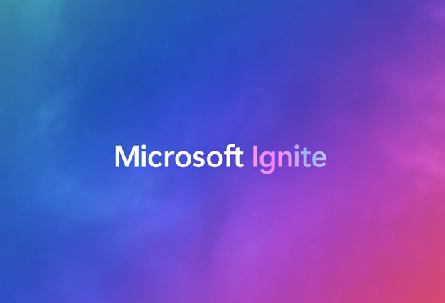
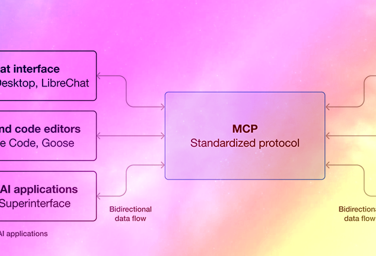
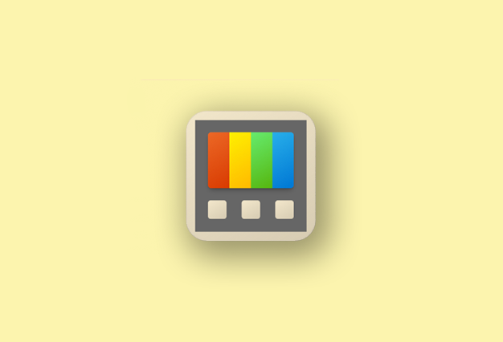
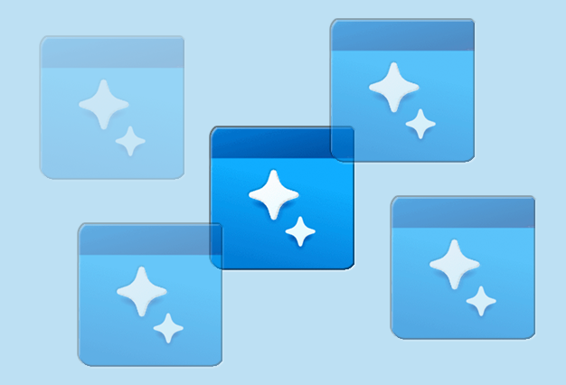

# What's new for developers

This section curates the latest platform capabilities, SDK and API additions, AI integration options, performance and diagnostics improvements, design guidance updates, and productivity tooling enhancements. Bookmark it and check back regularly: we refresh the highlights so you can focus on what moves your app forward.

## Highlights – November 2025

:::row:::
  :::column:::
    
    :::column-end:::
  :::column span="2":::
    **Ignite**

    Explore sessions, workshops, and resources for Windows developers at [Microsoft Ignite](/windows/apps/whats-new/windows-at-ignite) (November 18–21, 2025)
  :::column-end:::
:::row-end:::

:::row:::
  :::column:::
    
    :::column-end:::
  :::column span="2":::
    **MCP on Windows**

    [Model Context Protocol](/windows/ai/mcp/overview) (MCP) on Windows: integrate with local and cloud AI models using a standardized protocol.
  :::column-end:::
:::row-end:::

:::row:::
  :::column:::
    
    :::column-end:::
  :::column span="2":::
    **Power Toys**

   PowerToys [Advanced Paste](../../powertoys/advanced-paste.md) now supports multiple online and on-device AI model providers.
  :::column-end:::
:::row-end:::

:::row:::
  :::column:::
    
    :::column-end:::
  :::column span="2":::
    **Image generation**

    Image generation with Microsoft Foundry on Windows: create images from text prompts using the new [Image Generation API](/windows/ai/apis/image-generation).
  :::column-end:::
:::row-end:::

- Windows App SDK: Phi Silica local language model available via LanguageModel APIs – generate text with built-in moderation ([release notes stable](../windows-app-sdk/stable-channel.md)).
- Phi Silica enhancements: Summarize Conversation and LoRA fine-tuning support for scenario‑specific adaptation ([experimental channel 1.8](../windows-app-sdk/release-notes-archive/experimental-channel-1-8.md)).
- AppWindow.SetIcon API: refined guidance for setting window and taskbar icons (branding improvement) ([API ref](/windows/windows-app-sdk/api/winrt/microsoft.ui.windowing.appwindow.seticon)).
- Win32 app isolation overview: updated security guidance for packaging decisions ([overview](/windows/win32/secauthz/app-isolation-overview)).

## Latest releases

| Component | Latest release notes |
| :-- | :-- |
| Windows App SDK | [Stable channel release notes](../windows-app-sdk/stable-channel.md) * [Preview channel](../windows-app-sdk/preview-channel.md) |
| Windows SDK | [Windows SDK downloads & archive](https://developer.microsoft.com/windows/downloads/sdk-archive) (includes links to latest and Insider preview SDK release notes) |

## Recent documentation highlights

| Feature | Description |
| :------ | :------ |
| [Start developing Windows apps](/windows/apps/get-started/start-here) | Comprehensive starting point for Windows app development. |
| [Win32 app isolation overview](/windows/win32/secauthz/app-isolation-overview) | Security and reliability benefits of isolating Win32 apps. |
| [AppWindow.SetIcon](/windows/windows-app-sdk/api/winrt/microsoft.ui.windowing.appwindow.seticon) | API reference for setting a window icon (Windows App SDK). |
| [PowerToys](/windows/powertoys/) | Power user productivity utilities. |
| [Installing PowerToys](/windows/powertoys/install) | Step-by-step install guidance. |
| [Get started with Windows AI APIs](/windows/ai/apis/get-started) | Quickstart building apps using Windows AI. |

| Feature | Description |
| :------ | :------ |
| [WinUI 3 Gallery](https://github.com/microsoft/WinUI-Gallery) | Reference implementation and control samples; install from Store for offline exploration. |
| [Sample code browser](/samples/browse/?products=windows) | Filterable catalog of official Windows samples. |

## Release notes and resources

- Windows App SDK: [Stable channel](../windows-app-sdk/stable-channel.md) * [Archive](../windows-app-sdk/release-notes-archive/stable-channel-1-7.md)
- Windows SDK: [Download archive and latest](https://developer.microsoft.com/windows/downloads/sdk-archive)
- Insider builds: [Windows Insider for Developers](https://www.microsoft.com/windowsinsider/for-developers-getting-started).
- Modernizing guidance: [Start developing Windows apps](/windows/apps/get-started/start-here)
- Windows dev community: [Windows Dev Center](https://developer.microsoft.com/windows/community/)

## Windows and AI

| Feature | Description |
| :------ | :------ |
| [Windows AI](/windows/ai/) | Enhance your Windows apps with AI through local APIs and machine learning models. |
| [Microsoft Foundry on Windows Overview](/windows/ai/overview) | Microsoft Foundry on Windows introduces new ways of interacting with the operating system that utilize AI, such as Phi Silica, the Small Language Model (SLM) created by Microsoft Research that offers many of the same capabilities found in Large Language Models (LLMs), but is more compact and efficient so that it can run locally on Windows. |

## Developer tools

| Feature | Description |
| :------ | :------ |
| [PowerToys](/windows/powertoys/) | Power user productivity utilities to streamline your Windows experience. |
| [Edit](/windows/edit) | Edit is a lightweight command-line text editor in Windows 11. |
| [WSL (Windows Subsystem for Linux)](/windows/wsl/) | Windows Subsystem for Linux (WSL) lets you run a Linux environment on your Windows machine without the need for a separate VM or dual booting. |

