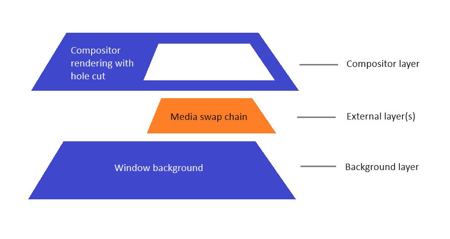

# Enhance UI with the Visual layer (Windows App SDK/WinUI 3)

The Visual layer in the [Windows App SDK/WinUI 3](index.md) provides a high performance, retained-mode API for graphics, effects, animations, and input. It's the foundation for all UI across Windows devices.

The types in [Microsoft.UI.Composition](/windows/windows-app-sdk/api/winrt/microsoft.ui.composition) form the Windows App SDK/WinUI 3 implementation of the Visual layer. It's equivalent to the [UWP Visual layer](/windows/uwp/composition/visual-layer), which is implemented in the **Windows.UI.Composition** namespace.

## Differences from UWP

The primary difference between **Microsoft.UI.Composition** and the UWP Visual layer is the namespace. **Microsoft.UI.Composition** provides access to functionality that's nearly identical to that of the UWP Visual layer. But there are exceptions, and differences.

The Windows App SDK/WinUI 3 uses **Microsoft.UI.Composition** to describe a tree of individual Visuals. Those Visuals are then composited to create the complete rendering of the window. It's very similar to how **Windows.UI.Composition** works (for UWP apps). But one big difference is that the **Microsoft.UI.Composition** compositor runs entirely within a Windows App SDK app; and it has access only to pixels that it drew. That means that any *external* content (content that wasn't drawn by the compositor) is unknown to the compositor. Which creates certain limitations.

An example of external content is the (**Microsoft.UI.Xaml.Controls**) [MediaPlayerElement](/windows/windows-app-sdk/api/winrt/microsoft.ui.xaml.controls.mediaplayerelement). The Windows media stack provides to XAML an opaque media swap chain handle. XAML gives that handle to the compositor, which in turn hands it off to Windows (via **Windows.UI.Composition**) to display. More specifically, since the compositor can't see any of the pixels in the media swap chain, it can't composite that as part of the overall rendering for the window. Instead, it gives the media swap chain to Windows to render it below the compositor's rendering, with a hole cut out of the compositor's rendering in order to allow the media swap chain below it to be visible. Here's a visualization of this setup.

In general, the approach allows external content (such as swap chains) to be part of the overall rendering for the window; and it still allows other content drawn by the compositor to overlap on top of the external content&mdash;for example, XAML's [MediaTransportControls](/windows/windows-app-sdk/api/winrt/microsoft.ui.xaml.controls.mediatransportcontrols) rendering on top of the media.

In the Windows App SDK/WinUI 3, the following APIs all create external content.

* [MediaPlayerElement](/windows/windows-app-sdk/api/winrt/microsoft.ui.xaml.controls.mediaplayerelement)
* [SwapChainPanel](/windows/windows-app-sdk/api/winrt/microsoft.ui.xaml.controls.swapchainpanel)
* [WebView2](/windows/windows-app-sdk/api/winrt/microsoft.ui.xaml.controls.webview2)
* [MicaBackdrop](/windows/windows-app-sdk/api/winrt/microsoft.ui.xaml.media.micabackdrop) and [DesktopAcrylicBackdrop](/windows/windows-app-sdk/api/winrt/microsoft.ui.xaml.media.desktopacrylicbackdrop), as well as the underlying [MicaController](/windows/windows-app-sdk/api/winrt/microsoft.ui.composition.systembackdrops.micacontroller) and [DesktopAcrylicController](/windows/windows-app-sdk/api/winrt/microsoft.ui.composition.systembackdrops.desktopacryliccontroller) that they use.

The model, described above, of handling external content creates these limitations:

* It's not possible to have compositor content behind external content (that is, behind/below the external layer(s) in the diagram above). So, for example, it's not possible to give a **WebView2** a transparent background in order to be able to see XAML buttons or images behind it. The only things that can be behind external content are *other* external content and the window background. Because of that, we discourage/disable transparency for external content.
* It's not possible to have compositor content sample from external content. For example, [AcrylicBrush](/windows/windows-app-sdk/api/winrt/microsoft.ui.xaml.media.acrylicbrush) isn't able to sample and blur any pixels from a **MediaPlayerElement**. **AcrylicBrush** will sample from the compositor's image, which is transparent black for external content areas. So that transparent black will be what **AcrylicBrush** blurs. Similarly, **AcrylicBrush** in front of a **MicaBackdrop** or **DesktopAcrylicBackdrop** can't see any colors that those backdrops will draw; and instead, the brush will blur the transparent black.
* Another scenario is known as *destination invert*, which is used for the caret of text box controls to invert the pixels that the text insertion caret is in front of. That invert similarly samples from the compositor surface, and it will be impacted if the text box doesn't have an opaque background that's drawn by the compositor.
* Because the WinUI 3 [SwapChainPanel](/windows/windows-app-sdk/api/winrt/microsoft.ui.xaml.controls.swapchainpanel) creates external content, it doesn't support transparency. Nor does it support applying [AcrylicBrush](/windows/windows-app-sdk/api/winrt/microsoft.ui.xaml.media.acrylicbrush) and other effects that use a [CompositionBackdropBrush](/windows/windows-app-sdk/api/winrt/microsoft.ui.composition.compositionbackdropbrush) in front of it. **AcrylicBrush** and these other **CompositionBackdropBrush**-based effects are not able to sample from a **SwapChainPanel**.
* In desktop apps (a WinUI 3 app is a desktop app), **Window.Current** is `null`. So you can't retrieve an instance of [Compositor](/windows/windows-app-sdk/api/winrt/microsoft.ui.composition.compositor) from `Window.Current.Compositor`. In XAML apps (both WinUI 3 and UWP), we recommend that you call [ElementCompositionPreview.GetElementVisual(UIElement)](/windows/windows-app-sdk/api/winrt/microsoft.ui.xaml.hosting.elementcompositionpreview.getelementvisual) to get a Composition [Visual](/windows/windows-app-sdk/api/winrt/microsoft.ui.composition.visual), and retrieve the `Compositor` from the visual's [Compositor](/windows/windows-app-sdk/api/winrt/microsoft.ui.composition.compositionobject.compositor) property. In cases where you don't have access to a **UIElement** (for example, if you create a [CompositionBrush](/windows/windows-app-sdk/api/winrt/microsoft.ui.composition.compositionbrush) in a class library), you can call [CompositionTarget.GetCompositorForCurrentThread](/windows/windows-app-sdk/api/winrt/microsoft.ui.xaml.media.compositiontarget.getcompositorforcurrentthread).

For more details about the Visual layer, see the [Visual layer overview](/windows/uwp/composition/visual-layer) in the UWP documentation. In most cases, the documentation and samples are also applicable to **Microsoft.UI.Composition**.

## Prerequisites to using Microsoft.UI.Composition

To use **Microsoft.UI.Composition** APIs in the Windows App SDK/WinUI 3:

1. Download and install the latest release of the Windows App SDK. For more information, see [Install tools for the Windows App SDK](set-up-your-development-environment.md).
2. And then follow the instructions to [Create your first WinUI 3 project](../winui/winui3/create-your-first-winui3-app.md) or to [use the Windows App SDK in an existing project](use-windows-app-sdk-in-existing-project.md).

To learn more about the availability of **Microsoft.UI.Composition** in the Windows App SDK/WinUI 3, see [release channels](release-channels.md).

## Windows Composition Samples Gallery

We've updated the Windows Composition Samples Gallery to now take a dependency on the Windows App SDK Composition APIs. Visit [WindowsCompositionSamples](https://github.com/microsoft/WindowsCompositionSamples) to see the Microsoft.UI.Composition APIs in action.

## Related topics

- [UWP Visual layer overview](/windows/uwp/composition/visual-layer)
- [Using the Visual layer in desktop apps](../desktop/modernize/visual-layer-in-desktop-apps.md)
