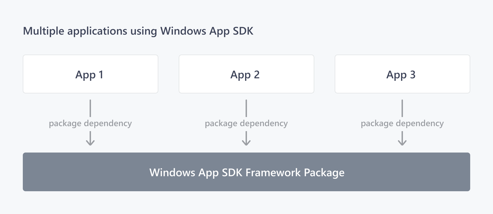
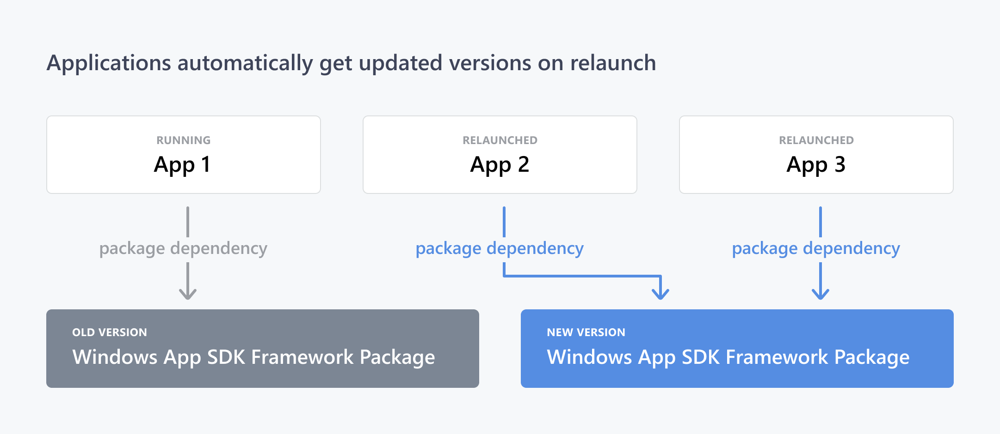

# Deployment architecture and overview for framework-dependent apps

This article explains a high-level architecture of Windows App SDK deployment. The concepts below apply primarily to Windows App SDK framework-dependent apps. A framework-dependent app depends on the Windows App SDK runtime being present on the target machine. 

There are two main options to distribute a framework-dependent app:

| App&nbsp;deployment method  | Requirements |
|------------------------|---------|
| Packaged | - Must declare dependency on Framework package in the package manifest.   - Deployment API is required for Microsoft Store distributed apps and recommended for non-Store distributed apps to ensure runtime dependencies are installed. | 
| Packaged with external location or unpackaged | - Must distribute runtime either using the Installer or by installing required MSIX packages directly.   - Additional runtime requirements: Must initialize access to the Windows App SDK runtime via the Bootstrap API. | 

For more details on these requirements, see the following articles:
- [Windows App SDK deployment guide for framework-dependent packaged apps](deploy-packaged-apps.md) 
- [Windows App SDK deployment guide for framework-dependent apps packaged with external location or unpackaged](deploy-unpackaged-apps.md)

## Key terms

The following sections define key terms for Windows App SDK deployment and additional details on some of these packages.

| Term | Definition |
|------|------------|
| **Windows App SDK runtime** | The MSIX packages required by an app to use the Windows App SDK. These packages include: Framework, Main, Singleton, and DDLM. Depending on the features used and your app deployment method, you will need a certain set of these packages on the target machine. |
| **Framework package** | Contains binaries used at run time by apps (most Windows App SDK features). The framework includes a bootstrapper component that enables apps to automatically install the latest version of the Windows App SDK, which will be updated on a regular release cadence. |
| **Main package** | Package that contains background tasks to keep track of dynamic dependencies, and enables automatic updates to the Framework package from the Microsoft Store. |
| **Singleton package** | Contains background tasks, services, app extensions, and other components not included in the Framework package such as Push Notifications. This is generally a single long-running process that is brokered between apps. |
| **Dynamic Dependency Lifetime Manager (DDLM) package** | Prevents the OS from performing servicing updates to the MSIX packages while a packaged with external location or unpackaged app is in use. |
| **Bootstrapper** | An app-local binary used by packaged with external location and unpackaged apps to locate and load the best Windows App SDK version match as needed by the app.  |
| **Provisioning** | The process of installing and registering packages (including files and registry keys) system-wide to eliminate the need for repeated installation by the other users. It can be done either as part of the OS or done during installation of an app. |
| **Installer** | Refers to the .exe installer which deploys the Framework, Main, Singleton, and DDLM packages. |
| **MSIX** | Modern installer technology that enables users to safely install an app per user, directly from the Microsoft Store or a web site. On Enterprise or shared PCs, apps can be installed for all users via PowerShell and MDM. |

### Framework package

When you build an app that uses the Windows App SDK, your app references a set of Windows App SDK runtime components that are distributed to end users via a *framework package*. The framework package allows apps to access Windows App SDK components through a single shared source on the user's device, instead of bundling them into the app package. The framework package also carries its own resources, such as DLLs and API definitions (COM and Windows Runtime registrations). These resources run in the context of your app, so they inherit the capabilities and privileges of your app, and don't assert any capabilities or privileges of their own. For more information about framework package dependencies, see [MSIX framework packages and dynamic dependencies](../desktop/modernize/framework-packages/framework-packages-overview.md).

The Windows App SDK framework package is an MSIX package that is deployed to end users through the Microsoft Store. It can be easily and quickly updated with servicing releases, which may include security and reliability fixes. All framework-dependent apps that use the Windows App SDK have a dependency on a shared instance of the framework package, as illustrated in the following diagram.

When a new version of the Windows App SDK framework package is serviced, all framework-dependent apps are updated to the new version without themselves having to redistribute a copy. Windows updates to the newest version of frameworks as they are released, and apps will automatically reference the latest framework package version during relaunch. Older framework package versions will not be removed from the system until they are no longer running or being actively used by apps on the system.

Because app compatibility is important to Microsoft and to apps that depend on the Windows App SDK, the Windows App SDK framework package follows [Semantic Versioning 2.0.0](https://semver.org/) rules. This means that after we release version 1.0 of the Windows App SDK, the Windows App SDK framework package will guarantee compatibility between minor and patch version changes, and breaking changes will occur only between major version updates.

### Singleton package

The **singleton package** ensures that a single long-running process can handle services that are used across multiple apps, which may be running on different versions of the Windows App SDK. 

The Windows App SDK singleton is needed to enable [push notifications](notifications/push-notifications/index.md) for unpackaged apps and packaged Win32 applications using Windows versions below 20H1, which cannot be supported by the existing UWP [PushNotificationTrigger](/uwp/api/Windows.ApplicationModel.Background.PushNotificationTrigger) and [ToastNotificationActionTrigger](/uwp/api/windows.applicationmodel.background.toastnotificationactiontrigger) class. Future Windows App SDK features that cannot be supported by the Framework package will be added to the Singleton package.

## Additional requirements for unpackaged apps

### Bootstrapper

The bootstrapper is a library that must be included with your packaged with external location or unpackaged app. It provides the bootstrapper API (see [Use the Windows App SDK runtime for apps packaged with external location or unpackaged](use-windows-app-sdk-run-time.md)), which enables unpackaged apps to perform these important tasks:

- Initialize the Dynamic Dependency Lifetime Manager (DDLM) for the Windows App SDK framework package.
- Find and load the Windows App SDK framework package to the app's package graph.

To accomplish these tasks, the nuget package leverages module initializers to wire up the bootstrapper for you. Simply set `<WindowsPackageType>None</WindowsPackageType>` in your project file. In advanced scenarios, if you want control over the initialization, you can call the bootstrapper API directly in your app's startup code (see [Tutorial: Use the bootstrapper API in an app packaged with external location or unpackaged that uses the Windows App SDK](tutorial-unpackaged-deployment.md)) so that it can properly initialize the system for the unpackaged app. Your app must use the bootstrapper API before it can use Windows App SDK features such as WinUI, App lifecycle, MRT Core, and DWriteCore.

The bootstrapper library in the Windows App SDK 1.0 release includes:

- **Microsoft.WindowsAppRuntime.Bootstrap.dll** (C++ and C#) 
- **Microsoft.WindowsAppRuntime.Bootstrap.Net.dll** (C# wrapper)

### Dynamic Dependency Lifetime Manager (DDLM)

The purpose of the DDLM is to prevent servicing of the Windows App SDK framework package while it is in use by an unpackaged app. It contains a server that must be initialized by the bootstrapper early in an app's startup to provide that functionality.

There is one DDLM for each version and architecture of the Windows App SDK framework package. This means on an `x64` computer, you may have both an `x86` and an `x64` version of the DDLM to support apps of both architectures.

## Additional requirements

* For packaged apps, the VCLibs framework package dependency is a requirement. For more info, see [C++ Runtime framework packages for Desktop Bridge](/troubleshoot/cpp/c-runtime-packages-desktop-bridge).
* For unpackaged apps, the Visual C++ Redistributable is a requirement. For more info, see [Microsoft Visual C++ Redistributable latest supported downloads](/cpp/windows/latest-supported-vc-redist).
* **C#**. For the .NET runtime, see [Download .NET](https://dotnet.microsoft.com/download).

## Related topics

* [Windows App SDK deployment guide for framework-dependent packaged apps](deploy-packaged-apps.md)
* [Windows App SDK deployment guide for framework-dependent apps packaged with external location or unpackaged](deploy-unpackaged-apps.md) 
