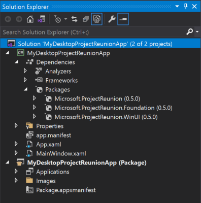

# Build apps with the Windows App SDK

After you [set up your development environment](set-up-your-development-environment.md), you're ready to start developing with the Windows App SDK. This article provides instructions about using the Windows App SDK in new or existing projects.

## Create a new project that uses the Windows App SDK

If you created a project with an earlier preview or release version of the Windows App SDK or WinUI 3, see [Update existing projects to the latest release of the Windows App SDK](update-existing-projects-to-the-latest-release.md) for instructions on updating to the latest version.

To create a new project that uses the Windows App SDK:

1. Follow the instructions in the following articles:

    - [Create your first WinUI 3 app](..\winui\winui3\create-your-first-winui3-app.md)
    - [Build a basic WinUI 3 desktop app](..\winui\winui3\desktop-build-basic-winui3-app.md)

2. After you create your project, you have access to the Windows App SDK APIs and components in addition to all other Windows and .NET APIs that are typically available to desktop and UWP apps. For more information about the available APIs and components, see [release channels](stable-channel.md).

To confirm that your new project uses the Windows App SDK, expand the **Dependencies** > **Packages** node under your project in **Solution Explorer**. You should see several **Microsoft.ProjectReunion** packages listed under this node, similar to the following image. Note that these packages still use the **Project Reunion** code name, but they will be renamed to use the **Windows App SDK** product name in a future release.

## Use the Windows App SDK in an existing project

If you have an existing project in which you want to use the Windows App SDK, you can install the latest version of the Windows App SDK NuGet package from the [stable release channel](stable-channel.md). This scenario has these requirements:

* Only supported for use with **C# .NET 5** or **C++ desktop** projects in production environments. The experimental release channel includes experimental support for UWP projects, and is not supported for use with UWP projects in production environments.

To use the Windows App SDK in an existing project that meets the above requirements:

1. Open an existing desktop project (either C#/.NET 5 or C++/WinRT) or UWP project (if using experimental) in Visual Studio 2019.

    > [!NOTE]
    > If you have a C#/.NET 5 desktop project, make sure the **TargetFramework** element in the project file is assigned to a Windows 10-specific .NET 5 moniker, such as **net5.0-windows10.0.19041.0**, so that it can call Windows Runtime APIs. For more information, see [Call Windows Runtime APIs in desktop apps](../../apps/desktop/modernize/desktop-to-uwp-enhance.md#net-5-use-the-target-framework-moniker-option). Additionally, you must be targeting **18362** or higher as there is a [known issue blocking apps that target **17763**](https://github.com/microsoft/ProjectReunion/issues/921).

2. Make sure [package references](/nuget/consume-packages/package-references-in-project-files) are enabled:

    1. In Visual Studio, click **Tools -> NuGet Package Manager -> Package Manager Settings**.
    2. Make sure **PackageReference** is selected for **Default package management format**.

3. Right-click your project in **Solution Explorer** and choose **Manage NuGet Packages**.

4. In the **NuGet Package Manager** window, select the **Browse** tab and search for `Microsoft.ProjectReunion`. Note that this package still uses the **Project Reunion** code name, but it will be renamed to use the **Windows App SDK** product name in a future release.

5. After the **Microsoft.ProjectReunion** package is found, in the right pane of the **NuGet Package Manager** window click **Install**.

    

    > [!NOTE]
    > The Project Reunion NuGet package (named **Microsoft.ProjectReunion**) contains other sub-packages (including **Microsoft.ProjectReunion.Foundation** and **Microsoft.ProjectReunion.WinUI**) that contain the implementations for components including WinUI, MRT Core, and DWriteCore. You cannot install these sub-packages individually to reference only certain components in your project. You must install the **Microsoft.ProjectReunion** package, which includes all of the components.

6. After you install the **Microsoft.ProjectReunion** package, you can use the following Windows App SDK APIs and components that are available in the stable channel. For the list of available features, see [release channels](stable-channel.md).

> [!NOTE]
> **ASTA to STA threading model** If you're migrating code from an existing UWP app to a new C# .NET 5 or C++ desktop WinUI 3 project that uses Project Reunion, be aware that the new project uses the [single-threaded apartment (STA)](/windows/win32/com/single-threaded-apartments) threading model instead of the [Application STA (ASTA)](https://devblogs.microsoft.com/oldnewthing/20210224-00/?p=104901) threading model used by UWP apps. If your code assumes the non re-entrant behavior of the ASTA threading model, your code may not behave as expected.

## Related topics

- [Build desktop Windows apps with the Windows App SDK](index.md)
- [Release channels and release notes](release-channels.md)
- [Set up your development environment](set-up-your-development-environment.md)
- [Deploy apps that use the Windows App SDK](deploy-apps-that-use-the-windows-app-sdk.md)