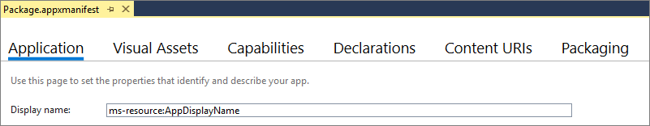
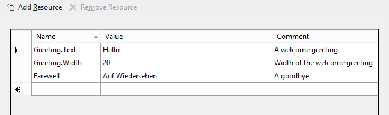
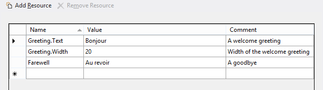
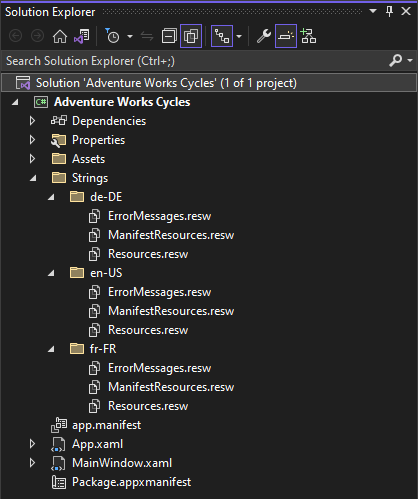

# Localize strings in your UI and the app package manifest

For more info about the value proposition of localizing your Windows App SDK app, see [Globalization and localization](/windows/apps/design/globalizing/globalizing-portal).

If you want your app to support different display languages, and you have string literals in your code or XAML markup or app package manifest, then move those strings into a Resources File (.resw). You can then make a translated copy of that Resources File for each language that your app supports.

Hardcoded string literals can appear in imperative code or in XAML markup, for example as the **Text** property of a **TextBlock**. They can also appear in your app package manifest source file (the `Package.appxmanifest` file), for example as the value for Display name on the Application tab of the Visual Studio Manifest Designer. Move these strings into a Resources File (.resw), and replace the hardcoded string literals in your app and in your manifest with references to resource identifiers.

Unlike image resources, where only one image resource is contained in an image resource file, *multiple* string resources are contained in a string resource file. A string resource file is a Resources File (.resw), and you typically create this kind of resource file in a \Strings folder in your project. For background on how to use qualifiers in the names of your Resources Files (.resw), see [Tailor your resources for language, scale, and other qualifiers](tailor-resources-lang-scale-contrast.md).

## Store strings in a resources file

1. Set your app's default language.
    1. With your solution open in Visual Studio, open `Package.appxmanifest`.
    2. On the Application tab, confirm that the Default language is set appropriately (for example, "en" or "en-US"). The remaining steps will assume that you have set the default language to "en-US".
    > [!NOTE]
    > At a minimum, you need to provide string resources localized for this default language. Those are the resources that will be loaded if no better match can be found for the user's preferred language or display language settings.
2. Create a Resources File (.resw) for the default language.
    1. Under your project node, create a new folder and name it `Strings`.
    2. Under `Strings`, create a new sub-folder and name it `en-US`.
    3. Under `en-US`, create a new Resources File (.resw) (under the **WinUI** file types in the **Add New Item** dialog) and confirm that it is named `Resources.resw`.
    > [!NOTE]
    > If you have .NET Resources Files (.resx) that you want to port, see [Porting XAML and UI](/windows/uwp/porting/wpsl-to-uwp-porting-xaml-and-ui#localization-and-globalization).
3. Open `Resources.resw` and add these string resources.

    `Strings/en-US/Resources.resw`

    

    In this example, "Greeting" is a string resource identifier that you can refer to from your markup, as we'll show. For the identifier "Greeting", a string is provided for a Text property, and a string is provided for a Width property. "Greeting.Text" is an example of a property identifier because it corresponds to a property of a UI element. You could also, for example, add "Greeting.Foreground" in the Name column, and set its Value to "Red". The "Farewell" identifier is a simple string resource identifier; it has no sub-properties and it can be loaded from imperative code, as we'll show. The Comment column is a good place to provide any special instructions to translators.

    In this example, since we have a simple string resource identifier entry named "Farewell", we cannot *also* have property identifiers based on that same identifier. So, adding "Farewell.Text" would cause a Duplicate Entry error when building `Resources.resw`.

    Resource identifiers are case insensitive, and must be unique per resource file. Be sure to use meaningful resource identifiers to provide additional context for translators. And don't change the resource identifiers after the string resources are sent for translation. Localization teams use the resource identifier to track additions, deletions, and updates in the resources. Changes in resource identifiers&mdash;which is also known as "resource identifiers shift"&mdash;require strings to be retranslated, because it will appear as though strings were deleted and others added.

## Refer to a string resource identifier from XAML

You use an [x:Uid directive](/windows/uwp/xaml-platform/x-uid-directive) to associate a control or other element in your markup with a string resource identifier.

```xaml
<TextBlock x:Uid="Greeting"/>
```

At run-time, `\Strings\en-US\Resources.resw` is loaded (since right now that's the only Resources File in the project). The **x:Uid** directive on the **TextBlock** causes a lookup to take place, to find property identifiers inside `Resources.resw` that contain the string resource identifier "Greeting". The "Greeting.Text" and "Greeting.Width" property identifiers are found and their values are applied to the **TextBlock**, overriding any values set locally in the markup. The "Greeting.Foreground" value would be applied, too, if you'd added that. But only property identifiers are used to set properties on XAML markup elements, so setting **x:Uid** to "Farewell" on this TextBlock would have no effect. `Resources.resw` *does* contain the string resource identifier "Farewell", but it contains no property identifiers for it.

When assigning a string resource identifier to a XAML element, be certain that *all* the property identifiers for that identifier are appropriate for the XAML element. For example, if you set `x:Uid="Greeting"` on a **TextBlock** then "Greeting.Text" will resolve because the **TextBlock** type has a Text property. But if you set `x:Uid="Greeting"` on a **Button** then "Greeting.Text" will cause a run-time error because the **Button** type does not have a Text property. One solution for that case is to author a property identifier named "ButtonGreeting.Content", and set `x:Uid="ButtonGreeting"` on the **Button**.

Instead of setting **Width** from a Resources File, you'll probably want to allow controls to dynamically size to content.

> [!NOTE]
> For [attached properties](/windows/uwp/xaml-platform/attached-properties-overview), you need a special syntax in the **Name** column of a .resw file. For example, to set a value for the [AutomationProperties.Name](/windows/windows-app-sdk/api/winrt/microsoft.ui.xaml.automation.automationproperties.nameproperty) attached property for the "Greeting" identifier, this is what you would enter in the **Name** column.

```xml
Greeting.[using:Microsoft.UI.Xaml.Automation]AutomationProperties.Name
```

## Refer to a string resource identifier from code

You can explicitly load a string resource based on a simple string resource identifier.

```csharp
var resourceLoader = new Microsoft.Windows.ApplicationModel.Resources.ResourceLoader();
this.myXAMLTextBlockElement.Text = resourceLoader.GetString("Farewell");
```

You can use this same code from within a Class Library project. At runtime, the resources of the app that's hosting the library are loaded. We recommend that a library loads resources from the app that hosts it, since the app is likely to have a greater degree of localization. If a library does need to provide resources then it should give its hosting app the option to replace those resources as an input.

If a resource name is segmented (it contains "." characters), then replace dots with forward slash ("/") characters in the resource name. Property identifiers, for example, contain dots; so you'd need to do this substitution in order to load one of those from code.

```csharp
this.myXAMLTextBlockElement.Text = resourceLoader.GetString("Fare/Well"); // <data name="Fare.Well" ...> ...
```

If in doubt, you can use [MakePri.exe](/windows/uwp/app-resources/makepri-exe-command-options) to dump your app's PRI file. Each resource's `uri` is shown in the dumped file.

```xml
<ResourceMapSubtree name="Fare"><NamedResource name="Well" uri="ms-resource://<GUID>/Resources/Fare/Well">...
```

## Refer to a string resource identifier from your app package manifest

1. Open your app package manifest source file (the `Package.appxmanifest` file), in which by default your app's `Display name` is expressed as a string literal.

   

2. To make a localizable version of this string, open `Resources.resw` and add a new string resource with the name "AppDisplayName" and the value "Adventure Works Cycles".

3. Replace the Display name string literal with a reference to the string resource identifier that you just created ("AppDisplayName"). You use the `ms-resource` URI (Uniform Resource Identifier) scheme to do this.

   

4. Repeat this process for each string in your manifest that you want to localize. For example, your app's Short name (which you can configure to appear on your app's tile on Start). For a list of all items in the app package manifest that you can localize, see [Localizable manifest items](/uwp/schemas/appxpackage/uapmanifestschema/localizable-manifest-items-win10).

## Localize the string resources

1. Make a copy of your Resources File (.resw) for another language.
    1. Under "Strings", create a new sub-folder and name it "de-DE" for Deutsch (Deutschland).
    > [!NOTE]
    > For the folder name, you can use any [BCP-47 language tag](https://tools.ietf.org/html/bcp47). See [Tailor your resources for language, scale, and other qualifiers](tailor-resources-lang-scale-contrast.md) for details on the language qualifier and a list of common language tags.
    2. Make a copy of `Strings/en-US/Resources.resw` in the `Strings/de-DE` folder.
2. Translate the strings.
    1. Open `Strings/de-DE/Resources.resw` and translate the values in the Value column. You don't need to translate the comments.

    `Strings/de-DE/Resources.resw`

    

If you like, you can repeat steps 1 and 2 for a further language.

`Strings/fr-FR/Resources.resw`



## Test your app

Test the app for your default display language. You can then change the display language in **Settings** > **Time & Language** > **Region & language** > **Languages** and re-test your app. Look at strings in your UI and also in the shell (for example, your title bar&mdash;which is your Display name&mdash;and the Short name on your tiles).

> [!NOTE]
> If a folder name can be found that matches the display language setting, then the Resources File inside that folder is loaded. Otherwise, fallback takes place, ending with the resources for your app's default language.

## Factoring strings into multiple Resources Files

You can keep all of your strings in a single Resources File (resw), or you can factor them across multiple Resources Files. For example, you might want to keep your error messages in one Resources File, your app package manifest strings in another, and your UI strings in a third. This is what your folder structure would look like in that case.



To scope a string resource identifier reference to a particular file, you just add `/<resources-file-name>/` before the identifier. The markup example below assumes that `ErrorMessages.resw` contains a resource whose name is "PasswordTooWeak.Text" and whose value describes the error.

```xaml
<TextBlock x:Uid="/ErrorMessages/PasswordTooWeak"/>
```

You only need to add `/<resources-file-name>/` before the string resource identifier for Resources Files *other than* `Resources.resw`. That's because "Resources.resw" is the default file name, so that's what's assumed if you omit a file name (as we did in the earlier examples in this topic).

The code example below assumes that `ErrorMessages.resw` contains a resource whose name is "MismatchedPasswords" and whose value describes the error.

```csharp
var resourceLoader = new Microsoft.Windows.ApplicationModel.Resources.ResourceLoader("ErrorMessages");
this.myXAMLTextBlockElement.Text = resourceLoader.GetString("MismatchedPasswords");
```

If you were to move your "AppDisplayName" resource out of `Resources.resw` and into `ManifestResources.resw`, then in your app package manifest you would change `ms-resource:AppDisplayName` to `ms-resource:/ManifestResources/AppDisplayName`.

If a resource file name is segmented (it contains "." characters), then leave the dots in the name when you reference it. **Don't** replace dots with forward slash ("/") characters, like you would for a resource name.

```csharp
var resourceLoader = new Microsoft.Windows.ApplicationModel.Resources.ResourceLoader("Err.Msgs");
```

If in doubt, you can use [MakePri.exe](/windows/uwp/app-resources/makepri-exe-command-options) to dump your app's PRI file. Each resource's `uri` is shown in the dumped file.

```xml
<ResourceMapSubtree name="Err.Msgs"><NamedResource name="MismatchedPasswords" uri="ms-resource://<GUID>/Err.Msgs/MismatchedPasswords">...
```

## Load a string for a specific language or other context

The default [ResourceContext](/windows/windows-app-sdk/api/winrt/microsoft.windows.applicationmodel.resources.resourcecontext) (obtained when creating a [ResourceLoader](/windows/windows-app-sdk/api/winrt/microsoft.windows.applicationmodel.resources.resourceloader)) contains a qualifier value for each qualifier name, representing the default runtime context (in other words, the settings for the current user and machine). Resources Files (.resw) are matched&mdash;based on the qualifiers in their names&mdash;against the qualifier values in that runtime context.

But there might be times when you want your app to override the system settings and be explicit about the language, scale, or other qualifier value to use when looking for a matching Resources File to load. For example, you might want your users to be able to select an alternative language for tooltips or error messages.

You can do that by constructing a new **ResourceContext**, overriding its values, and then using that context object in your string lookups.

```csharp
var resourceManager = new Microsoft.Windows.ApplicationModel.Resources.ResourceManager();
var resourceContext = resourceManager.CreateResourceContext();
resourceContext.QualifierValues["Language"] = "de-DE";
var resourceMap = resourceManager.MainResourceMap.GetSubtree("Resources");
this.myXAMLTextBlockElement.Text = resourceMap.GetValue("Farewell", resourceContext).ValueAsString;
```

Using **QualifierValues** as in the code example above works for any qualifier. For the special case of Language, you can alternatively do this instead.

```csharp
resourceContext.Languages = new string[] { "de-DE" };
```

## Load strings from a Class Library

The string resources of a referenced Class Library are typically added into a subfolder of the package in which they're included during the build process. The resource identifier of such a string usually takes the form *LibraryName/ResourcesFileName/ResourceIdentifier*.

A library can get a **ResourceLoader** for its own resources. For example, the following code illustrates how either a library or an app that references it can get a **ResourceLoader** for the library's string resources.

```csharp
var resourceLoader = new Microsoft.Windows.ApplicationModel.Resources.ResourceLoader("ContosoControl/Resources");
this.myXAMLTextBlockElement.Text = resourceLoader.GetString("exampleResourceName");
```

If in doubt about the path, you can specify [MakePri.exe command line options](/windows/uwp/app-resources/makepri-exe-command-options) to dump your component or library's PRI file. Each resource's `uri` is shown in the dumped file.

```xml
<NamedResource name="exampleResourceName" uri="ms-resource://Contoso.Control/Contoso.Control/ReswFileName/exampleResourceName">...
```

## Loading strings from other packages

The resources for an app package are managed and accessed through the package's own top-level [ResourceMap](/windows/windows-app-sdk/api/winrt/microsoft.windows.applicationmodel.resources.resourcemap) that's accessible from the [ResourceManager](/windows/windows-app-sdk/api/winrt/microsoft.windows.applicationmodel.resources.resourcemanager). Within each package, various components can have their own **ResourceMap** subtrees, which you can access via [ResourceMap.GetSubtree](/windows/windows-app-sdk/api/winrt/microsoft.windows.applicationmodel.resources.resourcemap.getsubtree).

A framework package can access its own resources with an absolute resource identifier URI. Also see [URI schemes](/windows/uwp/app-resources/uri-schemes) in the UWP documentation for more information.

## Loading strings in unpackaged applications

As of Windows Version 1903 (May 2019 Update), unpackaged applications can also leverage the Resource Management System.

Just create your Windows App SDK user controls/libraries and [store any strings in a resources file](#store-strings-in-a-resources-file). You can then [refer to a string resource identifier from XAML](#refer-to-a-string-resource-identifier-from-xaml), [refer to a string resource identifier from code](#refer-to-a-string-resource-identifier-from-code), or [load strings from a Class Library](#load-strings-from-a-class-library).

To use resources in unpackaged applications, you should do a few things:

1. Use the overloaded constructor of **ResourceManager** to pass file name of your app's .pri file when resolving resources from code as there is no default view in unpackaged scenarios.
1. Use [MakePri.exe](/windows/uwp/app-resources/compile-resources-manually-with-makepri) to manually generate your app's resources.pri file.
    - Run `makepri new /pr <PROJECTROOT> /cf <PRICONFIG> /of resources.pri`
    - The &lt;PRICONFIG&gt; must omit the "&lt;packaging&gt;" section so that all resources are bundled in a single resources.pri file. If using the default [MakePri.exe configuration file](/windows/uwp/app-resources/makepri-exe-configuration) created by [createconfig](/windows/uwp/app-resources/makepri-exe-command-options), you need to delete the "&lt;packaging&gt;" section manually after it is created.
    - The &lt;PRICONFIG&gt; must contain all relevant indexers required to merge all resources in your project into a single resources.pri file. The default [MakePri.exe configuration file](/windows/uwp/app-resources/makepri-exe-configuration) created by [createconfig](/windows/uwp/app-resources/makepri-exe-command-options) includes all indexers.
    - If you don't use the default config, make sure the PRI indexer is enabled (review the default config for how to do this) to merge PRIs found from project references, NuGet references, and so on, that are located within the project root.
        > [!NOTE]
        > By omitting `/IndexName`, and by the project not having an app manifest, the IndexName/root namespace of the PRI file is automatically set to *Application*, which the runtime understands for unpackaged apps (this removes the previous hard dependency on package ID). When specifying resource URIs, ms-resource:/// references that omit the root namespace infer *Application* as the root namespace for unpackaged apps (or you can specify *Application* explicitly as in ms-resource://Application/).
1. Copy the PRI file to the build output directory of the .exe
1. Run the .exe
    > [!NOTE]
    > The Resource Management System uses the system display language rather than the user preferred language list when resolving resources based on language in unpackaged apps. The user preferred language list is only used for Windows App SDK packaged apps.

> [!IMPORTANT]
> You must manually rebuild PRI files whenever resources are modified. We recommend using a post-build script that handles the [MakePri.exe](/windows/uwp/app-resources/compile-resources-manually-with-makepri) command and copies the resources.pri output to the .exe directory.

## Important APIs

- [ApplicationModel.Resources.ResourceLoader](/windows/windows-app-sdk/api/winrt/microsoft.windows.applicationmodel.resources.resourceloader)

## See also

- [MRT Core sample](https://github.com/microsoft/WindowsAppSDK-Samples/tree/main/Samples/ResourceManagement)
- [How to load string resources](/previous-versions/windows/apps/hh965323(v=win.10))
