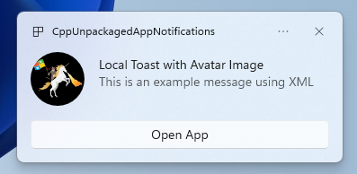
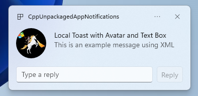

# Quickstart: App notifications in the Windows App SDK


In this quickstart, you will create a desktop Windows application that sends and receives local app notifications, also known as toast notifications, using the [Windows App SDK](../../index.md).

> [!IMPORTANT]
> Notifications for an elevated (admin) app is currently not supported.

## Prerequisites

- [Set up your development environment](../../set-up-your-development-environment.md)
- Either [Create a new project that uses the Windows App SDK](../../../winui/winui3/create-your-first-winui3-app.md) OR [Use the Windows App SDK in an existing project](../../use-windows-app-sdk-in-existing-project.md)

## Sample app

This quickstart covers code from the notifications sample apps found on [GitHub](https://github.com/microsoft/WindowsAppSDK-Samples/tree/main/Samples/Notifications/).

> [!div class="button"]
> [Sample App Code](https://github.com/microsoft/WindowsAppSDK-Samples/tree/main/Samples/Notifications/)
 
## API reference

For API reference documentation for app notifications, see [Microsoft.Windows.AppNotifications Namespace](/windows/windows-app-sdk/api/winrt/microsoft.windows.appnotifications).

## Step 1: Add namespace declarations

Add the namespace for Windows App SDK app notifications `Microsoft.Windows.AppNotifications`.

```csharp
using Microsoft.Windows.AppNotifications;
```

## Step 2: Update your app's manifest

If your app is unpackaged (that is, it lacks package identity at runtime), then skip to **Step 3: Register to handle an app notification**.

If your app is packaged (including packaged with external location):

1. Open your **Package.appxmanifest**.
1. Add `xmlns:com="http://schemas.microsoft.com/appx/manifest/com/windows10"` and `xmlns:desktop="http://schemas.microsoft.com/appx/manifest/desktop/windows10"` namespaces to `<Package>`
1. Add `<desktop:Extension>` for `windows.toastNotificationActivation` to declare your COM activator **[CLSID](/uwp/schemas/appxpackage/uapmanifestschema/element-com-exeserver-class)**. You can obtain a CLSID by navigating to **Create GUID** under **Tools** in Visual Studio.
1. Add `<com:Extension>` for the COM activator using the same CLSID.
    1. Specify your .exe file in the `Executable` attribute. The .exe file must be the same process calling `Register()` when registering your app for notifications, which is described more in **Step 3**. In the example below, we use `Executable="SampleApp\SampleApp.exe"`.
    1. Specify `Arguments="----AppNotificationActivated:"` to ensure that Windows App SDK can process your notification's payload as an AppNotification kind.
    1. Specify a `DisplayName`.

> [!IMPORTANT]
> Warning: If you define a [Windows.Protocol](/uwp/schemas/appxpackage/uapmanifestschema/element-uap-protocol) app extensibility type in your appx manifest with `<uap:Protocol>`, then clicking on notifications will launch new processes of the same app, even if your app is already running.

```xaml
<!--Packaged apps only-->
<!--package.appxmanifest-->

<Package
  xmlns:com="http://schemas.microsoft.com/appx/manifest/com/windows10"
  xmlns:desktop="http://schemas.microsoft.com/appx/manifest/desktop/windows10"
  ...
  <Applications>
    <Application>
      ...
      <Extensions>

        <!--Specify which CLSID to activate when notification is clicked-->   
        <desktop:Extension Category="windows.toastNotificationActivation">
          <desktop:ToastNotificationActivation ToastActivatorCLSID="replaced-with-your-guid-C173E6ADF0C3" />
        </desktop:Extension>

        <!--Register COM CLSID-->    
        <com:Extension Category="windows.comServer">
          <com:ComServer>
            <com:ExeServer Executable="SampleApp\SampleApp.exe" DisplayName="SampleApp" Arguments="----AppNotificationActivated:">
              <com:Class Id="replaced-with-your-guid-C173E6ADF0C3" />
            </com:ExeServer>
          </com:ComServer>
        </com:Extension>
    
      </Extensions>
    </Application>
  </Applications>
 </Package>
```

## Step 3: Register to handle an app notification

Register your app to handle notifications, then unregister when your app terminates.

In your `App.xaml` file, register for [AppNotificationManager::Default().NotificationInvoked](/windows/windows-app-sdk/api/winrt/microsoft.windows.appnotifications.appnotificationmanager.notificationinvoked), then call [AppNotificationManager::Default().Register](/windows/windows-app-sdk/api/winrt/microsoft.windows.appnotifications.appnotificationmanager.register). The order of these calls matters.

> [!IMPORTANT]
> You must call **AppNotificationManager::Default().Register** before calling [AppInstance.GetCurrent.GetActivatedEventArgs](/windows/windows-app-sdk/api/winrt/microsoft.windows.applifecycle.appinstance.getactivatedeventargs).

When your app is terminating, call [AppNotificationManager::Default().Unregister()](/windows/windows-app-sdk/api/winrt/microsoft.windows.appnotifications.appnotificationmanager.unregister) to free up the COM server and allow for subsequent invokes to launch a new process.

#### [C#](#tab/cs)

```cs
// App.xaml.cs
namespace CsUnpackagedAppNotifications
{

    public partial class App : Application
    {
        private Window mainWindow;
        private NotificationManager notificationManager;
        
        public App()
        {
            this.InitializeComponent();
            notificationManager = new NotificationManager();
            AppDomain.CurrentDomain.ProcessExit += new EventHandler(OnProcessExit);
        }

        protected override void OnLaunched(LaunchActivatedEventArgs args)
        {
            mainWindow = new MainWindow();

            notificationManager.Init();
            
            // Complete in Step 5
            
            mainWindow.Activate();
        }

        void OnProcessExit(object sender, EventArgs e)
        {
            notificationManager.Unregister();
        }
    }
}


// NotificationManager.cs
namespace CsUnpackagedAppNotifications
{
    internal class NotificationManager
    {
        private bool m_isRegistered;

        private Dictionary<int, Action<AppNotificationActivatedEventArgs>> c_map;

        public NotificationManager()
        {
            m_isRegistered = false;

            // When adding new a scenario, be sure to add its notification handler here.
            c_map = new Dictionary<int, Action<AppNotificationActivatedEventArgs>>();
            c_map.Add(ToastWithAvatar.ScenarioId, ToastWithAvatar.NotificationReceived);
            c_map.Add(ToastWithTextBox.ScenarioId, ToastWithTextBox.NotificationReceived);
        }

        ~NotificationManager()
        {
            Unregister();
        }

        public void Init()
        {
            // To ensure all Notification handling happens in this process instance, register for
            // NotificationInvoked before calling Register(). Without this a new process will
            // be launched to handle the notification.
            AppNotificationManager notificationManager = AppNotificationManager.Default;

            notificationManager.NotificationInvoked += OnNotificationInvoked;

            notificationManager.Register();
            m_isRegistered = true;
        }

        public void Unregister()
        {
            if (m_isRegistered)
            {
                AppNotificationManager.Default.Unregister();
                m_isRegistered = false;
            }
        }

        public void ProcessLaunchActivationArgs(AppNotificationActivatedEventArgs notificationActivatedEventArgs)
        {
            // Complete in Step 5
        }

    }
}       
```

#### [C++](#tab/cpp)

```cpp
// App.xaml.cpp

// NotificationManager is responsible for registering and unregistering the Sample for App Notifications as well as
// dispatching actioned notifications to the appropriate scenario.
// Registration will happen when Init() is called and Unregistration will happen when this
// instance variable goes out of scope, i.e.: when the App is terminated.
static NotificationManager g_notificationManager;

namespace winrt::CppUnpackagedAppNotifications::implementation
{
    App::App()
    {
        InitializeComponent();
    }

    std::wstring App::GetFullPathToExe()
    {
        TCHAR buffer[MAX_PATH] = { 0 };
        GetModuleFileName(NULL, buffer, MAX_PATH);
        std::wstring::size_type pos = std::wstring(buffer).find_last_of(L"\\/");
        return std::wstring(buffer).substr(0, pos);
    }

    std::wstring App::GetFullPathToAsset(std::wstring const& assetName)
    {
        return GetFullPathToExe() + L"\\Assets\\" + assetName;
    }

    void App::OnLaunched(winrt::Microsoft::UI::Xaml::LaunchActivatedEventArgs const& /*args*/)
    {
        window = make<MainWindow>();

        g_notificationManager.Init();

        // Complete in Step 5
        
        window.Activate();
    }
}

// NotificationManager.cpp
static const std::map<unsigned, std::function<void (winrt::AppNotificationActivatedEventArgs const&)>> c_map
{
    // When adding new a scenario, be sure to add its notification handler here.
    { ToastWithAvatar::ScenarioId, ToastWithAvatar::NotificationReceived },
    { ToastWithTextBox::ScenarioId, ToastWithTextBox::NotificationReceived }
};

NotificationManager::NotificationManager():m_isRegistered(false){}

NotificationManager::~NotificationManager()
{
    if (m_isRegistered)
    {
        winrt::AppNotificationManager::Default().Unregister();
    }
}

void NotificationManager::Init()
{
    auto notificationManager{ winrt::AppNotificationManager::Default() };

    // Always setup the notification hanlder before registering your App, otherwise notifications may get lost.
    const auto token{ notificationManager.NotificationInvoked([&](const auto&, winrt::AppNotificationActivatedEventArgs  const& notificationActivatedEventArgs)
        {
            NotifyUser::NotificationReceived();

            if (!DispatchNotification(notificationActivatedEventArgs))
            {
                NotifyUser::UnrecognizedToastOriginator();
            }
        }) };

    winrt::AppNotificationManager::Default().Register();
    m_isRegistered = true;
}

void NotificationManager::ProcessLaunchActivationArgs(winrt::AppNotificationActivatedEventArgs const& notificationActivatedEventArgs)
{
    // Complete in Step 5
}
```

---


## Step 4: Display an app notification



You **MUST** complete **Step 3: Register to handle an app notification** before proceeding.

Now you will display a simple app notification with an `appLogoOverride` image and a button. 

Construct your app notification using the **AppNotificationBuilder** class and then call `Show`. For more information on how to construct your app notification using XML, please refer to the examples at [Toast content](../../../design/shell/tiles-and-notifications/adaptive-interactive-toasts.md) and the [Notifications XML schema](/uwp/schemas/tiles/toastschema/schema-root). 

> [!NOTE]
> If your app is packaged (including packaged with external location), then your app's icon in the notification's upper left corner is sourced from the `package.manifest`. If your app is unpackaged, then the icon is sourced by first looking into the shortcut, then looking at the resource file in the app process. If all attempts fail, then the Windows default app icon is used. The supported icon file types are `.jpg`, `.png`, `.bmp`, and `.ico`.

#### [C#](#tab/cs)

```csharp
// ToastWithAvatar.cs
class ToastWithAvatar
{
    public const int ScenarioId = 1;
    public const string ScenarioName = "Local Toast with Avatar Image";

    public static bool SendToast()
    {
        var appNotification = new AppNotificationBuilder()
            .AddArgument("action", "ToastClick")
            .AddArgument(Common.scenarioTag, ScenarioId.ToString())
            .SetAppLogoOverride(new System.Uri("file://" + App.GetFullPathToAsset("Square150x150Logo.png")), AppNotificationImageCrop.Circle)
            .AddText(ScenarioName)
            .AddText("This is an example message using XML")
            .AddButton(new AppNotificationButton("Open App")
                .AddArgument("action", "OpenApp")
                .AddArgument(Common.scenarioTag, ScenarioId.ToString()))
            .BuildNotification();

        AppNotificationManager.Default.Show(appNotification);

        return appNotification.Id != 0; // return true (indicating success) if the toast was sent (if it has an Id)
    }

    public static void NotificationReceived(AppNotificationActivatedEventArgs notificationActivatedEventArgs)
    {
        // Complete in Step 5   
    }
}

// Call SendToast() to send a notification. 
```

#### [C++](#tab/cpp)

```cpp
// ToastWithAvatar.cpp

bool ToastWithAvatar::SendToast()
{
    auto appNotification{ winrt::AppNotificationBuilder()
        .AddArgument(L"action", L"ToastClick")
        .AddArgument(Common::scenarioTag, std::to_wstring(ToastWithAvatar::ScenarioId))
        .SetAppLogoOverride(winrt::Windows::Foundation::Uri(L"file://" + winrt::App::GetFullPathToAsset(L"Square150x150Logo.png")), winrt::AppNotificationImageCrop::Circle)
        .AddText(ScenarioName)
        .AddText(L"This is an example message using XML")
        .AddButton(winrt::AppNotificationButton(L"Open App")
            .AddArgument(L"action", L"OpenApp")
            .AddArgument(Common::scenarioTag, std::to_wstring(ToastWithAvatar::ScenarioId)))
        .BuildNotification() };

    winrt::AppNotificationManager::Default().Show(appNotification);

    return appNotification.Id() != 0; // return true (indicating success) if the toast was sent (if it has an Id)
}

void ToastWithAvatar::NotificationReceived(winrt::Microsoft::Windows::AppNotifications::AppNotificationActivatedEventArgs const& notificationActivatedEventArgs)
{
    // Complete in Step 5 
}

// Call SendToast() to send a notification. 
```

---

## Step 5: Process a user selecting a notification

Users can select your notification's body or button. Your app needs to process the invocation in response to a user interacting with your notification.

There are 2 common ways to process this:

1. You choose to have your app launch in a specific UI context OR
2. You choose to have your app evaluate an action-specific behavior (like a button press in the notification body) without rendering any UI. Also known as a background action.

The code example below, which is not from the sample app, illustrates both ways of processing a user-generated action. Add a `launch` value (corresponds to user clicking the notification body), an `input` element (quick reply text box), and a button with an `arguments` value (corresponds to user clicking the button) to your notification's XML payload. In your `ProcessLaunchActivationArgs`, case on each argument.

> [!IMPORTANT]
> Setting `activationType="background"` in the notification XML payload is ignored for desktop apps. You must instead process the activation arguments and decide whether to display a window or not, as stated in this step.



```cpp
// Example of how to process a user either selecting the notification body or inputting a quick reply in the text box. 

// Notification XML payload
//<toast launch="action=openThread&amp;threadId=92187">
//  <visual>
//      <binding template="ToastGeneric">
//          <image placement="appLogoOverride" hint-crop="circle" src="C:\<fullpath>\Logo.png"/>
//          <text>Local Toast with Avatar and Text box</text>
//          <text>This is an example message using</text>
//      </binding>
//  </visual>
//  <actions>
//      <input id="replyBox" type="text" placeHolderContent="Reply" />
//      <action
//          content="Send"
//          hint-inputId="replyBox"
//          arguments="action=reply&amp;threadId=92187" />
//  </actions>
//</toast>

void ProcessLaunchActivationArgs(const winrt::AppNotificationActivatedEventArgs& notificationActivatedEventArgs)
{
    // If the user clicks on the notification body, your app needs to launch the chat thread window
    if (std::wstring(notificationActivatedEventArgs.Argument().c_str()).find(L"openThread") != std::wstring::npos)
    {
        GenerateChatThreadWindow();
    }
    else // If the user responds to a message by clicking a button in the notification, your app needs to reply back to the other user with no window launched
    if (std::wstring(notificationActivatedEventArgs.Argument().c_str()).find(L"reply") != std::wstring::npos)
    {
        auto input = notificationActivatedEventArgs.UserInput();
        auto replyBoxText = input.Lookup(L"replyBox");

        // Process the reply text
        SendReplyToUser(replyBoxText);
    }
}
```

**Follow the below guidelines**:

1. If a notification is selected by the user and your app is not running, it is expected that your app is launched and the user can see the foreground window in the notification's context.
2. If a notification is selected by the user and your app is minimized, it is expected that your app is brought to the foreground and a new window is rendered in the notification's context.
3. If a notification background action is invoked by the user (e.g. the user responds to a notification by typing in the notification text box and hitting reply), your app processes the payload without rendering a foreground window.

See the sample app code found on [GitHub](https://github.com/microsoft/WindowsAppSDK-Samples/tree/main/Samples/Notifications/) for a more detailed example.

## Step 6: Remove notifications

Remove notifications when they are no longer relevant to the user.

In this example, the user has seen all messages from a group chat in your app, so you clear all notifications from the group chat. Then, the user mutes a friend, so you clear all notifications from the friend. You first added the **Group** and **Tag** properties to the notifications before displaying in order to identify them now.

```cpp

void SendNotification(winrt::hstring const& payload, winrt::hstring const& friendId, winrt::hstring const& groupChatId)
{
    winrt::AppNotification notification(payload);

    // Setting Group Id here allows clearing notifications from a specific chat group later
    notification.Group(groupChatId);

    // Setting Tag Id here allows clearing notifications from a specific friend later
    notification.Tag(friendId);

    winrt::AppNotificationManager::Default().Show(notification);
}

winrt::Windows::Foundation::IAsyncAction RemoveAllNotificationsFromGroupChat(const std::wstring groupChatId)
{
    winrt::AppNotificationManager manager = winrt::AppNotificationManager::Default();
    co_await manager.RemoveByGroupAsync(groupChatId);    
}

winrt::Windows::Foundation::IAsyncAction RemoveAllNotificationsFromFriend(const std::wstring friendId)
{
    winrt::AppNotificationManager manager = winrt::AppNotificationManager::Default();
    co_await manager.RemoveByTagAsync(friendId);    
}
```

## Additional features

### Send a cloud-sourced app notification

To send an app notification from the cloud, follow **Send a cloud-sourced app notification** at [Quickstart: Push notifications in the Windows App SDK](../push-notifications/push-quickstart.md).

### Set an expiration time

Set an expiration time on your app notification using the `Expiration` property if the message in your notification is only relevant for a certain period of time. For example, if you send a calendar event reminder, set the expiration time to the end of the calendar event.

> [!NOTE]
> The default and maximum expiration time is 3 days.

```csharp
class ToastWithAvatar
{
    public static bool SendToast()
    {

        var appNotification = new AppNotificationBuilder()
            .SetAppLogoOverride(new System.Uri("ms-appx:///images/logo.png"), AppNotificationImageCrop.Circle)
            .AddText("Example expiring notification")
            .AddText("This is an example message")
            .BuildNotification();


        appNotification.Expiration = DateTime.Now.AddDays(1);
        AppNotificationManager.Default.Show(appNotification);

        return appNotification.Id != 0; // return true (indicating success) if the toast was sent (if it has an Id)
    }
}
```

### Ensure notifications expire on reboot

Set the `ExpiresOnReboot` property to **True** if you'd like notifications to delete on reboot.

#### [C#](#tab/cs)

```csharp
class ToastWithAvatar
{
    public static bool SendToast()
    {

        var appNotification = new AppNotificationBuilder()
            .SetAppLogoOverride(new System.Uri("ms-appx:///images/logo.png"), AppNotificationImageCrop.Circle)
            .AddText("Example ExpiresOnReboot notification")
            .AddText("This is an example message")
            .BuildNotification();


            appNotification.ExpiresOnReboot = true;
            AppNotificationManager.Default.Show(appNotification);

            return appNotification.Id != 0; // return true (indicating success) if the toast was sent (if it has an Id)
    }
}
```

#### [C++](#tab/cpp)

```cpp

bool SendToast()
{

    auto appNotification{ winrt::AppNotificationBuilder()
                .SetAppLogoOverride(winrt::Windows::Foundation::Uri(L"ms-appx:///images/logo.png"), winrt::AppNotificationImageCrop::Circle)
                .AddText(L"Example ExpiresOnReboot notification")
                .AddText(L"This is an example message")
                .BuildNotification() };

    appNotification.ExpiresOnReboot();
    winrt::AppNotificationManager::Default().Show(appNotification);

    return appNotification.Id() != 0; // return true (indicating success) if the toast was sent (if it has an Id)
}
```

---

### Send and update a progress bar notification

You can display progress bar related updates in a notification:


Use the `AppNotificationProgressData` construct to update the progress bar notification.

```cpp
const winrt::hstring c_tag = L"weekly-playlist";
const winrt::hstring c_group = L"downloads";

// Send first Notification Progress Update
void SendUpdatableNotificationWithProgress()
{
    auto notification{ winrt::AppNotificationBuilder()
            .AddText(L"Downloading this week's new music...")
            .AddProgressBar(winrt::AppNotificationProgressBar()
                .BindTitle()
                .BindValue()
                .BindValueStringOverride()
                .BindStatus())
            .BuildNotification() }

    notification.Tag(c_tag);
    notification.Group(c_group);

    // Assign initial values for first notification progress UI
    winrt::AppNotificationProgressData data(1); // Sequence number
    data.Title(L"Weekly playlist"); // Binds to {progressTitle} in xml payload
    data.Value(0.6); // Binds to {progressValue} in xml payload
    data.ValueStringOverride(L"15/26 songs"); // Binds to {progressValueString} in xml payload
    data.Status(L"Downloading..."); // Binds to {progressStatus} in xml payload

    notification.Progress(data);
    winrt::AppNotificationManager::Default().Show(notification);
}

// Send subsequent progress updates
winrt::Windows::Foundation::IAsyncAction UpdateProgressAsync()
{
    // Assign new values
    winrt::AppNotificationProgressData data(2 /* Sequence number */ );
    data.Title(L"Weekly playlist"); // Binds to {progressTitle} in xml payload
    data.Value(0.7); // Binds to {progressValue} in xml payload
    data.ValueStringOverride(L"18/26 songs"); // Binds to {progressValueString} in xml payload
    data.Status(L"Downloading..."); // Binds to {progressStatus} in xml payload

    auto result = co_await winrt::AppNotificationManager::Default().UpdateAsync(data, c_tag, c_group);
    if (result == winrt::AppNotificationProgressResult::AppNotificationNotFound)
    {
        // Progress Update failed since the previous notification update was dismissed by the user! So account for this in your logic by stopping updates or starting a new Progress Update flow.
    }
}
```


## Resources

- [Microsoft.Windows.AppNotifications API details](https://github.com/microsoft/WindowsAppSDK/blob/main/specs/AppNotifications/AppNotifications-spec.md#api-details)
- [Notifications code sample on GitHub](https://github.com/microsoft/WindowsAppSDK-Samples/tree/main/Samples/Notifications/)
- [App notifications spec on GitHub](https://github.com/microsoft/WindowsAppSDK/blob/main/specs/AppNotifications/AppNotifications-spec.md)
- [Toast content](../../../design/shell/tiles-and-notifications/adaptive-interactive-toasts.md)
- [Notifications XML schema](/uwp/schemas/tiles/toastschema/schema-root)
