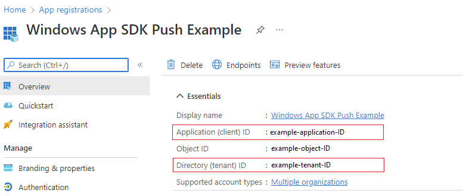
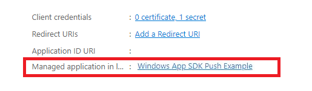
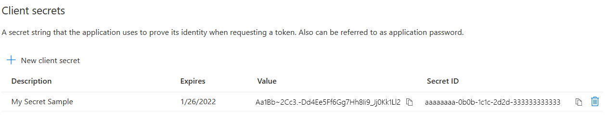

# Quickstart: Push notifications in the Windows App SDK

In this quickstart you will create a desktop Windows application that sends and receives push notifications using the [Windows App SDK](../../index.md).

## Prerequisites

- [Set up your development environment](../../set-up-your-development-environment.md)
- Either [Create a new project that uses the Windows App SDK](../../../winui/winui3/create-your-first-winui3-app.md) OR [Use the Windows App SDK in an existing project](../../use-windows-app-sdk-in-existing-project.md)
- An [Azure Account](https://azure.microsoft.com/free/) is required in order to use Windows App SDK push notifications.
- Read [Push notifications overview](index.md)

## Sample app

This quickstart walks through adding push notifications support to your app. See the example code from this quickstart in context in the sample apps found on [GitHub](https://github.com/microsoft/WindowsAppSDK-Samples/tree/main/Samples/Notifications/Push/).

> [!div class="button"]
> [Sample App Code](https://github.com/microsoft/WindowsAppSDK-Samples/tree/main/Samples/Notifications/Push)
 
## API reference

For API reference documentation for push notifications, see [Microsoft.Windows.PushNotifications Namespace](/windows/windows-app-sdk/api/winrt/microsoft.windows.pushnotifications).

## Configure your app's identity in Azure Active Directory (AAD)

Push notifications in Windows App SDK use identities from Azure Active Directory (AAD). Azure credentials are required when requesting a WNS Channel URI and when requesting access tokens in order to send push notifications. **Note**: We do **NOT** support using Windows App SDK push notifications with Microsoft Partner Center.  

### Step 1: Create an AAD app registration

Login to your Azure account and create a new [**AAD App Registration**](https://ms.portal.azure.com/#blade/Microsoft_AAD_RegisteredApps/ApplicationsListBlade) resource. Select *New registration*.

### Step 2: Provide a name and select a multi-tenant option

1. Provide an app name.
1. Push notifications require the multi-tenant option, so select that. 
    1. For more information about tenants, see [Who can sign in to your app?](/azure/active-directory/develop/single-and-multi-tenant-apps#who-can-sign-in-to-your-app).
1. Select *Register*
1. Take note of your **Application (client) ID**, as this is your **Azure AppId** that you will be using during activation registration and access token request.
1. Take note of your **Directory (tenant) ID**, as this is your **Azure TenantId** that you will be using when requesting an access token.
    > [!IMPORTANT]
    > 
    > Take note of your **Application (client) ID** and **Directory (tenant) ID**.
1. Take note of your **Object ID**, as this is your **Azure ObjectId** that you will be using when requesting a channel request.  Note that this is NOT the object ID listed on the **Essentials** page. Instead, to find the correct **Object ID**, click on the app name in the **Managed application in local directory** field on the **Essentials** page:
    > 
    
    > 
    
    > [!NOTE] 
    > A **service principal** is required to get an Object ID, if there is not one associated with your app, follow the steps in one of the following articles to create one in the Azure portal or using the command line:
    >
    > [Use the portal to create an Azure AD application and service principal that can access resources](/azure/active-directory/develop/howto-create-service-principal-portal)
    >
    > [Use Azure PowerShell to create a service principal with a certificate](/azure/active-directory/develop/howto-authenticate-service-principal-powershell)
    

### Step 3: Create a secret for your app registration

Your secret will be used along with your Azure AppId/ClientId when requesting an access token to send push notifications.



Navigate to **Certificates & secrets** and select **New client secret**.

> [!IMPORTANT]
> Ensure you copy your secret once created and store it in a safe location, like Azure Key Vault. It will only be viewable once right after creation.

### Step 4: Map your app's Package Family Name to its Azure AppId

> [!IMPORTANT]
> Windows Push Notification Service (WNS) is now integrated with Azure Portal. The new registration experience is available in preview. If you're a packaged app (including packaged with external location), you can use this flow to map your app's Package Family Name (PFN) and its Azure AppId.

If your app is a packaged Win32 app, then request access to our new Azure Portal *Preview* experience by emailing [Win_App_SDK_Push@microsoft.com](mailto:Win_App_SDK_Push@microsoft.com) with subject line "Windows App SDK Push Notifications Request" and body "Azure Subscription: \[your Azure Subscription ID\]". Requests are completed on a weekly basis. You will be notified once your mapping request has been completed.

## Configure your app to receive push notifications

### Step 1: Add namespace declarations

Add the namespace for Windows App SDK push notifications `Microsoft.Windows.PushNotifications`.

```cpp
#include <winrt/Microsoft.Windows.PushNotifications.h>

using namespace winrt::Microsoft::Windows::PushNotifications;
```


### Step 2: Add your COM activator to your app's manifest

> [!IMPORTANT]
> If your app is unpackaged (that is, it lacks package identity at runtime), then skip to **Step 3: Register for and respond to push notifications on app startup**.

If your app is packaged (including packaged with external location):
Open your **Package.appxmanifest**. Add the following inside the `<Application>` element. Replace the `Id`, `Executable`, and `DisplayName` values with those specific to your app.


```xaml
<!--Packaged apps only-->
<!--package.appxmanifest-->

<Package
  ...
  xmlns:com="http://schemas.microsoft.com/appx/manifest/com/windows10"
  ...
  <Applications>
    <Application>
      ...
      <Extensions>

        <!--Register COM activator-->    
        <com:Extension Category="windows.comServer">
          <com:ComServer>
              <com:ExeServer Executable="SampleApp\SampleApp.exe" DisplayName="SampleApp" Arguments="----WindowsAppRuntimePushServer:">
                <com:Class Id="[Your app's Azure AppId]" DisplayName="Windows App SDK Push" />
            </com:ExeServer>
          </com:ComServer>
        </com:Extension>
    
      </Extensions>
    </Application>
  </Applications>
 </Package>    
```

### Step 3: Register for and respond to push notifications on app startup

Update your app's `main()` method to add the following:

1. Register your app to receive push notifications by calling [PushNotificationManager::Default().Register()](/windows/windows-app-sdk/api/winrt/microsoft.windows.pushnotifications.pushnotificationmanager.register).
1. Check the source of the activation request by calling [AppInstance::GetCurrent().GetActivatedEventArgs()](). If the activation was triggered from a push notification, respond based on the notification's payload.

> [!IMPORTANT]
> You must call **PushNotificationManager::Default().Register** before calling [AppInstance.GetCurrent.GetActivatedEventArgs](/windows/windows-app-sdk/api/winrt/microsoft.windows.applifecycle.appinstance.getactivatedeventargs).


The following sample is from the sample packaged app found on [GitHub](https://github.com/microsoft/WindowsAppSDK-Samples/tree/main/Samples/Notifications/Push/cpp-console-packaged).

```cpp
// cpp-console.cpp
#include "pch.h"
#include <iostream>
#include <winrt/Microsoft.Windows.PushNotifications.h>
#include <winrt/Microsoft.Windows.AppLifecycle.h>
#include <winrt/Windows.Foundation.h>
#include <wil/result.h>
#include <wil/cppwinrt.h>


using namespace winrt;
using namespace Windows::Foundation;

using namespace winrt::Microsoft::Windows::PushNotifications;
using namespace winrt::Microsoft::Windows::AppLifecycle;

winrt::guid remoteId{ "7edfab6c-25ae-4678-b406-d1848f97919a" }; // Replace this with your own Azure ObjectId


void SubscribeForegroundEventHandler()
{
    winrt::event_token token{ PushNotificationManager::Default().PushReceived([](auto const&, PushNotificationReceivedEventArgs const& args)
    {
        auto payload{ args.Payload() };

        std::string payloadString(payload.begin(), payload.end());
        std::cout << "\nPush notification content received in the FOREGROUND: " << payloadString << std::endl;
    }) };
}

int main()
{
    // Setup an event handler, so we can receive notifications in the foreground while the app is running.
    SubscribeForegroundEventHandler();

    PushNotificationManager::Default().Register();

    auto args{ AppInstance::GetCurrent().GetActivatedEventArgs() };
    switch (args.Kind())
    {
        // When it is launched normally (by the users, or from the debugger), the sample requests a WNS Channel URI and
        // displays it, then waits for notifications. This user can take a copy of the WNS Channel URI and use it to send
        // notifications to the sample
        case ExtendedActivationKind::Launch:
        {
            // Checks to see if push notifications are supported. Certain self-contained apps may not support push notifications by design
            if (PushNotificationManager::IsSupported())
            {
                // Request a WNS Channel URI which can be passed off to an external app to send notifications to.
                // The WNS Channel URI uniquely identifies this app for this user and device.
                PushNotificationChannel channel{ RequestChannel() };
                if (!channel)
                {
                    std::cout << "\nThere was an error obtaining the WNS Channel URI" << std::endl;
    
                    if (remoteId == winrt::guid { "00000000-0000-0000-0000-000000000000" })
                    {
                        std::cout << "\nThe ObjectID has not been set. Refer to the readme file accompanying this sample\nfor the instructions on how to obtain and setup an ObjectID" << std::endl;
                    }
                }
    
                std::cout << "\nPress 'Enter' at any time to exit App." << std::endl;
                std::cin.ignore();
            }
            else
            {
                // App implements its own custom socket here to receive messages from the cloud since Push APIs are unsupported.
            }
        }
        break;

        // When it is activated from a push notification, the sample only displays the notification.
        // It doesn’t register for foreground activation of perform any other actions
        // because background activation is meant to let app perform only small tasks in order to preserve battery life.
        case ExtendedActivationKind::Push:
        {
            PushNotificationReceivedEventArgs pushArgs{ args.Data().as<PushNotificationReceivedEventArgs>() };

            // Call GetDeferral to ensure that code runs in low power
            auto deferral{ pushArgs.GetDeferral() };

            auto payload{ pushArgs.Payload() } ;

            // Do stuff to process the raw notification payload
            std::string payloadString(payload.begin(), payload.end());
            std::cout << "\nPush notification content received in the BACKGROUND: " << payloadString.c_str() << std::endl;
            std::cout << "\nPress 'Enter' to exit the App." << std::endl;

            // Call Complete on the deferral when finished processing the payload.
            // This removes the override that kept the app running even when the system was in a low power mode.
            deferral.Complete();
            std::cin.ignore();
        }
        break;

        default:
            std::cout << "\nUnexpected activation type" << std::endl;
            std::cout << "\nPress 'Enter' to exit the App." << std::endl;
            std::cin.ignore();
            break;
    }

    // We do not call PushNotificationManager::UnregisterActivator
    // because then we wouldn't be able to receive background activations, once the app has closed.
    // Call UnregisterActivator once you don't want to receive push notifications anymore.
}

```

### Step 4: Request a WNS Channel URI and register it with the WNS server

WNS Channel URIs are the HTTP endpoints for sending push notifications. Each client must request a Channel URI and register it with the WNS server to receive push notifications.

> [!NOTE]
> WNS Channel URIs expire after 30 days.

```cpp
auto channelOperation{ PushNotificationManager::Default().CreateChannelAsync(winrt::guid("[Your app's Azure ObjectID]")) };
```

The **PushNotificationManager** will attempt to create a Channel URI, retrying automatically for no more than 15 minutes. Create an event handler to wait for the call to complete. Once the call is complete, if it was successful, register the URI with the WNS  server.

```cpp
// cpp-console.cpp

winrt::Windows::Foundation::IAsyncOperation<PushNotificationChannel> RequestChannelAsync()
{
    // To obtain an AAD RemoteIdentifier for your app,
    // follow the instructions on https://learn.microsoft.com/azure/active-directory/develop/quickstart-register-app
    auto channelOperation = PushNotificationManager::Default().CreateChannelAsync(remoteId);

    // Setup the inprogress event handler
    channelOperation.Progress(
        [](auto&& sender, auto&& args)
        {
            if (args.status == PushNotificationChannelStatus::InProgress)
            {
                // This is basically a noop since it isn't really an error state
                std::cout << "Channel request is in progress." << std::endl << std::endl;
            }
            else if (args.status == PushNotificationChannelStatus::InProgressRetry)
            {
                LOG_HR_MSG(
                    args.extendedError,
                    "The channel request is in back-off retry mode because of a retryable error! Expect delays in acquiring it. RetryCount = %d",
                    args.retryCount);
            }
        });

    auto result = co_await channelOperation;

    if (result.Status() == PushNotificationChannelStatus::CompletedSuccess)
    {
        auto channelUri = result.Channel().Uri();

        std::cout << "channelUri: " << winrt::to_string(channelUri.ToString()) << std::endl << std::endl;

        auto channelExpiry = result.Channel().ExpirationTime();

        // Caller's responsibility to keep the channel alive
        co_return result.Channel();
    }
    else if (result.Status() == PushNotificationChannelStatus::CompletedFailure)
    {
        LOG_HR_MSG(result.ExtendedError(), "We hit a critical non-retryable error with channel request!");
        co_return nullptr;
    }
    else
    {
        LOG_HR_MSG(result.ExtendedError(), "Some other failure occurred.");
        co_return nullptr;
    }

};

PushNotificationChannel RequestChannel()
{
    auto task = RequestChannelAsync();
    if (task.wait_for(std::chrono::seconds(300)) != AsyncStatus::Completed)
    {
        task.Cancel();
        return nullptr;
    }

    auto result = task.GetResults();
    return result;
}
```

### Step 5: Build and install your app

Use Visual Studio to build and install your app. Right click on the solution file in the Solution Explorer and select **Deploy**. Visual Studio will build your app and install it on your machine. You can run the app by launching it via the Start Menu or the Visual Studio debugger.

## Send a push notification to your app

At this point, all configuration is complete and the WNS server can send push notifications to client apps. In the following steps, refer to the [Push notification server request and response headers](../../../design/shell/tiles-and-notifications/push-request-response-headers.md) for more detail.

### Step 1: Request an access token

To send a push notification, the WNS server first needs to request an access token. Send an HTTP POST request with your Azure TenantId, Azure AppId, and secret. For information on retrieving the Azure TenantId and Azure AppId, see [Get tenant and app ID values for signing in](/azure/active-directory/develop/howto-create-service-principal-portal#get-tenant-and-app-id-values-for-signing-in).

HTTP Sample Request:

```HTTP
POST /{tenantID}/oauth2/v2.0/token Http/1.1
Host: login.microsoftonline.com
Content-Type: application/x-www-form-urlencoded
Content-Length: 160

grant_type=client_credentials&client_id=<Azure_App_Registration_AppId_Here>&client_secret=<Azure_App_Registration_Secret_Here>&scope=https://wns.windows.com/.default/
```

C# Sample Request:

```csharp
//Sample C# Access token request
var client = new RestClient("https://login.microsoftonline.com/{tenantID}/oauth2/v2.0");
var request = new RestRequest("/token", Method.Post);
request.AddHeader("Content-Type", "application/x-www-form-urlencoded");
request.AddParameter("grant_type", "client_credentials");
request.AddParameter("client_id", "[Your app's Azure AppId]");
request.AddParameter("client_secret", "[Your app's secret]");
request.AddParameter("scope", "https://wns.windows.com/.default");
RestResponse response = await client.ExecutePostAsync(request);
Console.WriteLine(response.Content);
```

If your request is successful, you will receive a response that contains your token in the **access_token** field.

```json
{
    "token_type":"Bearer",
    "expires_in":"86399",
    "ext_expires_in":"86399",
    "expires_on":"1653771789",
    "not_before":"1653685089",
    "access_token":"[your access token]"
}
```

### Step 2. Send a raw notification

Create an HTTP POST request that contains the access token you obtained in the previous step and the content of the push notification you want to send. The content of the push notification will be delivered to the app.

```http
POST /?token=[The token query string parameter from your channel URL. E.g. AwYAAABa5cJ3...] HTTP/1.1
Host: dm3p.notify.windows.com
Content-Type: application/octet-stream
X-WNS-Type: wns/raw
Authorization: Bearer [your access token]
Content-Length: 46

{ Sync: "Hello from the Contoso App Service" }
```

```csharp
var client = new RestClient("[Your channel URL. E.g. https://wns2-by3p.notify.windows.com/?token=AwYAAABa5cJ3...]");
var request = new RestRequest();
request.Method = Method.Post; 
request.AddHeader("Content-Type", "application/octet-stream");
request.AddHeader("X-WNS-Type", "wns/raw");
request.AddHeader("Authorization", "Bearer [your access token]");
request.AddBody("Notification body");
RestResponse response = await client.ExecutePostAsync(request);");
```

### Step 3: Send a cloud-sourced app notification

If you are only interested in sending raw notifications, disregard this step. To send a cloud-sourced app notification, also known a push toast notification, first follow [Quickstart: App notifications in the Windows App SDK](../app-notifications/app-notifications-quickstart.md). App notifications can either be push (sent from the cloud) or sent locally. Sending a cloud-sourced app notification is similar to sending a raw notification in **Step 2**, except the *X-WNS-Type* header is `toast`, *Content-Type* is `text/xml`, and the content contains the app notification XML payload. See [Notifications XML schema](/uwp/schemas/tiles/toastschema/schema-root) for more on how to construct your XML payload.

Create an HTTP POST request that contains your access token and the content of the cloud-sourced app notification you want to send. The content of the push notification will be delivered to the app.

```http
POST /?token=AwYAAAB%2fQAhYEiAESPobjHzQcwGCTjHu%2f%2fP3CCNDcyfyvgbK5xD3kztniW%2bjba1b3aSSun58SA326GMxuzZooJYwtpgzL9AusPDES2alyQ8CHvW94cO5VuxxLDVzrSzdO1ZVgm%2bNSB9BAzOASvHqkMHQhsDy HTTP/1.1
Host: dm3p.notify.windows.com
Content-Type: text/xml
X-WNS-Type: wns/toast
Authorization: Bearer [your access token]
Content-Length: 180

<toast><visual><binding template="ToastGeneric"><text>Example cloud toast notification</text><text>This is an example cloud notification using XML</text></binding></visual></toast>
```

```csharp
var client = new RestClient("https://dm3p.notify.windows.com/?token=AwYAAAB%2fQAhYEiAESPobjHzQcwGCTjHu%2f%2fP3CCNDcyfyvgbK5xD3kztniW%2bjba1b3aSSun58SA326GMxuzZooJYwtpgzL9AusPDES2alyQ8CHvW94cO5VuxxLDVzrSzdO1ZVgm%2bNSB9BAzOASvHqkMHQhsDy");
client.Timeout = -1;

var request = new RestRequest(Method.POST);
request.AddHeader("Content-Type", "text/xml");
request.AddHeader("X-WNS-Type", "wns/toast");
request.AddHeader("Authorization", "Bearer <AccessToken>");
request.AddParameter("text/xml", "<toast><visual><binding template=\"ToastGeneric\"><text>Example cloud toast notification</text><text>This is an example cloud notification using XML</text></binding></visual></toast>",  ParameterType.RequestBody);
Console.WriteLine(response.Content);
```

## Resources

- [Windows Push Notification Service (WNS)](https://aka.ms/wns)
- [Push notifications sample code on GitHub](https://github.com/microsoft/WindowsAppSDK-Samples/tree/main/Samples/Notifications/Push/)
- [Microsoft.Windows.PushNotifications API details](https://github.com/microsoft/WindowsAppSDK/blob/main/specs/PushNotifications/PushNotifications-spec.md#api-details)
- [Push notifications spec on GitHub](https://github.com/microsoft/WindowsAppSDK/blob/main/specs/PushNotifications/PushNotifications-spec.md)
- [Toast content](../../../design/shell/tiles-and-notifications/adaptive-interactive-toasts.md)
- [Notifications XML schema](/uwp/schemas/tiles/toastschema/schema-root)
