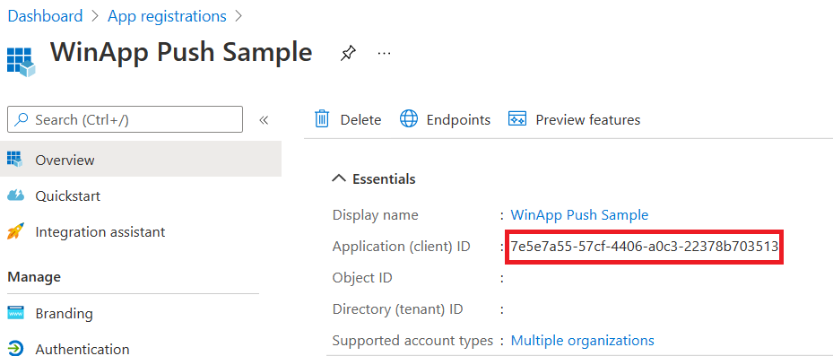
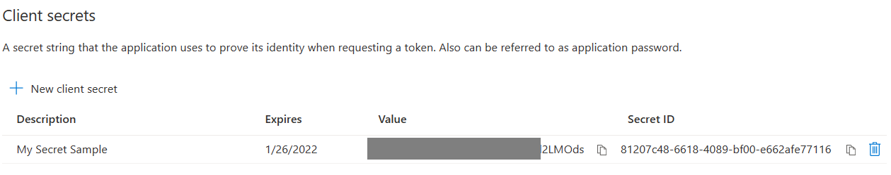

# Quickstart: Push notifications in the Windows App SDK

In this quickstart you will create a packaged Windows application that sends and receives push notifications using the Windows App SDK.

> [!NOTE]
> The working sample code complete sample code can be found [here](https://github.com/microsoft/WindowsAppSDK/tree/main/test/TestApps/PushNotificationsDemoApp).

## Prerequisites

- An [Azure Account](https://azure.microsoft.com/free/) is required in order to use Windows App SDK Push Notifications.
- Sign up for the the [Push Notification Private Preview](https://aka.ms/windowsappsdk/push-private-preview) if you have not already done so.

## Configure your app's identity in Azure Active Directory

Push notifications in the Windows App SDK use identities from Azure Active Directory App Registration. App registration credentials are required when requesting a WNS ChannelURI and when requesting access tokens in order to send push notifications.

### Step 1: Create an AAD app registration

Login to your Azure account and create a new [**AAD App Registration**](https://ms.portal.azure.com/#blade/Microsoft_AAD_RegisteredApps/ApplicationsListBlade) resource. Select *New registration*.

### Step 2: Provide a name and select a multi-tenant option

- Provide an app name.
- Push notifications require the multi-tenant option, so select that.
- For more information about tenants, see [Who can sign in to your app?](/azure/active-directory/develop/single-and-multi-tenant-apps#who-can-sign-in-to-your-app).

> [!IMPORTANT]
> 
> Take note of your AppId since you will be using that during activation registration, channel request, and access token request.

### Step 3: Create a secret for your app registration

Your secret will be used along with your ClientId when requesting an access token to send push notifications.



Navigate to **Certificates & secrets** and select **New client secret**.

> [!IMPORTANT]
> Ensure you copy your secret once created and store it in a safe location, like Azure Key Vault. It will only be viewable once right after creation.

### Step 4: Map your app's package family name to its Azure AppId

> [!IMPORTANT]
> Push notifications are currently experimental and supported only in the [experimental release channel](../../experimental-channel.md) of the Windows App SDK. The API surface is subject to change.
>
> During the experimental phase, the mapping between your app's Package Family Name (PFN) and its Azure AppId must be manually created. In future releases, this functionality will be integrated into the Azure Portal.

Use [this Microsoft Form](https://aka.ms/windowsappsdk-push-mapping) to create a PFN mapping request. During the experimental phase, mapping requests are completed on a weekly basis. You will be notified once your mapping request has been completed.

## Configure your app to receive push notifications

### Step 1: Add your COM activator to your app's manifest

Right click on your application's `Package.appxmanifest` file and select **View code**. Add the following code inside the `Application` element.

```xml
<Extensions>
  <uap:Extension Category="windows.protocol" EntryPoint="Windows.FullTrustApplication">
    <uap:Protocol Name="windowsappsdktestprotocol-packaged">
      <uap:DisplayName>Windows App SDK TestProtocol</uap:DisplayName>
    </uap:Protocol>
  </uap:Extension>
  <com:Extension Category="windows.comServer">
    <com:ComServer>
      <com:ExeServer Executable="PushNotificationsTestApp\PushNotificationsTestApp.exe" DisplayName="SampleBackgroundApp" Arguments="----WindowsAppSDKPushServer">
        <com:Class Id="[Your app's Azure AppId]" DisplayName="Windows App SDK Push" />
      </com:ExeServer>
    </com:ComServer>
  </com:Extension>
</Extensions>    
```

### Step 2: Register for and respond to push notifications on app startup

Update your app's `main()` method to add two pieces of functionality. First, register your app to receive push notifications. Second, check the source of the activation request. If the activation was triggered from a push notification, respond based on the notification's payload.

```cpp
//In int main()
int main()
{
    PushNotificationActivationInfo info(
        PushNotificationRegistrationOptions::PushTrigger | PushNotificationRegistrationOptions::ComActivator,
        winrt::guid("[Your app's Azure AppId]"));

    auto token = PushNotificationManager::RegisterActivator(info);

    auto args = AppInstance::GetCurrent().GetActivatedEventArgs();
    auto kind = args.Kind();
    if (kind == ExtendedActivationKind::Push)
    {
        PushNotificationReceivedEventArgs pushArgs = args.Data().as<PushNotificationReceivedEventArgs>();

        // Call GetDeferral to ensure that code runs in low power
        auto deferral = pushArgs.GetDeferral();

        auto payload = pushArgs.Payload();

        // Do stuff to process the raw payload
        std::string payloadString(payload.begin(), payload.end());

        // Call Complete on the deferral when finished processing the payload.
        // This removes the override that kept the app running even when the system was in a low power mode.
        deferral.Complete();
        std::cin.ignore();
    }
    else if (kind == ExtendedActivationKind::Launch)
    {
        PushNotificationChannel channel = RequestChannel();
        std::cin.ignore();
    }
    else if (kind == ExtendedActivationKind::ToastNotification) //Handles Toast Notification Activation
    {
        printf("ToastNotification received!");
        printf("Press 'Enter' at any time to exit App.");
        std::cin.ignore();
    }

    // Don't unregister PushTrigger because we still want to receive push notifications from background infrastructure.
    PushNotificationManager::UnregisterActivator(token, PushNotificationRegistrationOptions::ComActivator);

    return 0;
}
```

### Step 3: Request a WNS Channel URI and register it with your WNS server

WNS ChannelURIs are the HTTP endpoints for sending push notification. Each client must request a ChannelURI and register it with the WNS server to receive push notifications.

> [!NOTE]
> WNS ChannelURIs expire after 30 days.

```cpp
 auto channelOperation = PushNotificationManager::CreateChannelAsync(winrt::guid("[Your app's Azure AppId]"));
```

The **PushNotificationManager** will attempt to create a ChannelURI, retrying automatically for no more than 15 minutes. Create an event handler to wait for the call to complete. Once the call is complete, if it was successful, register the URI with your WNS server.

```cpp
 auto result = co_await channelOperation;
 if (result.Status() == PushNotificationChannelStatus::CompletedSuccess)
    {
        auto channelUri = result.Channel().Uri();
        
        //You would create a method that sends your channelUri to your cloud service
        //Example: MapWnsChannelUri(channelUri); 

        auto channelExpiry = result.Channel().ExpirationTime();
        result.Channel().PushReceived([](const auto&, PushNotificationReceivedEventArgs const& args)
            {
                auto payload = args.Payload();
                // Do stuff to process the raw payload
                args.Handled(true);
            });
        co_return result.Channel();
    }
    else if (result.Status() == PushNotificationChannelStatus::CompletedFailure)
    {
        LOG_HR_MSG(result.ExtendedError(), "We hit a critical non-retryable error with channel request!");
        co_return nullptr;
    }
    else
    {
        LOG_HR_MSG(result.ExtendedError(), "Some other failure occurred.");
        co_return nullptr;
    }
```

### Step 4: Build and install your app

Use Visual Studio to build and install your app. Right click on the solution file in the Solution Explorer and select **Deploy**. Visual Studio will build your app and install it on your machine. You can run the app by launching it via the Start Menu or the Visual Studio debugger.

## Send a Push Notification to your app

At this point, all configuration is complete and your WNS server can send push notifications to client apps.

### Step 1: Request an access token

To send a push notification, your WNS server first needs to request an access token. Send an HTTP POST request with your Azure AppId and secret.

HTTP Sample Request:

```HTTP
POST /common/oauth2/token HTTP/1.1
Host: login.microsoftonline.com
Content-Type: application/x-www-form-urlencoded
Content-Length: 160

grant_type=client_credentials&client_id=<Azure_App_Registration_AppId_Here>&client_secret=<Azure_App_Registration_Secret_Here>&resource=https://wns.windows.com/
```

C# Sample Request:

```csharp
    //Sample C# Access token requet
    var client = new RestClient("https://login.microsoftonline.com/common/oauth2/token");
    client.Timeout = -1;
    var request = new RestRequest(Method.POST);
    request.AddHeader("Content-Type", "application/x-www-form-urlencoded");
    request.AddParameter("grant_type", "client_credentials");
    request.AddParameter("client_id", "<Azure_App_Registration_AppId_Here>");
    request.AddParameter("client_secret", "<Azure_App_Registration_Secret_Here>");
    request.AddParameter("resource", "https://wns.windows.com/");
    IRestResponse response = client.Execute(request);
    Console.WriteLine(response.Content);
```

If your request is successful, you will receive a response that contains your token in the **access_token** field.

```json
{
  "token_type": "Bearer",
  "expires_in": "86399",
  "ext_expires_in": "86399",
  "expires_on": "1627681190",
  "not_before": "1627594490",
  "resource": "https://wns.windows.com",
  "access_token": "[your access token]"
}
```

### Step 2. Send the push notification to WNS

Create an HTTP POST request that contains the access token you obtained in the previous step and the content of the push notification you want to send. The content of the push notification will be delivered to the app.

```http
POST /?token=AwYAAAB%2fQAhYEiAESPobjHzQcwGCTjHu%2f%2fP3CCNDcyfyvgbK5xD3kztniW%2bjba1b3aSSun58SA326GMxuzZooJYwtpgzL9AusPDES2alyQ8CHvW94cO5VuxxLDVzrSzdO1ZVgm%2bNSB9BAzOASvHqkMHQhsDy HTTP/1.1
Host: dm3p.notify.windows.com
Content-Type: application/octet-stream
X-WNS-Type: wns/raw
Authorization: Bearer [your access token]
Content-Length: 46

{ Sync: "Hello from the Contoso App Service" }
```

```csharp
var client = new RestClient("https://dm3p.notify.windows.com/?token=AwYAAAB%2fQAhYEiAESPobjHzQcwGCTjHu%2f%2fP3CCNDcyfyvgbK5xD3kztniW%2bjba1b3aSSun58SA326GMxuzZooJYwtpgzL9AusPDES2alyQ8CHvW94cO5VuxxLDVzrSzdO1ZVgm%2bNSB9BAzOASvHqkMHQhsDy");
client.Timeout = -1;

var request = new RestRequest(Method.POST);
request.AddHeader("Content-Type", "application/octet-stream");
request.AddHeader("X-WNS-Type", "wns/raw");
request.AddHeader("Authorization", "Bearer <AccessToken>");
request.AddParameter("application/octet-stream", "{ Sync: \"Hello from the Contoso App Service\" }",  ParameterType.RequestBody);
IRestResponse response = client.Execute(request);
Console.WriteLine(response.Content);
```

## Related topics

- [Windows Notification Push Service](https://aka.ms/wns)
- [Push notifications sample code](https://github.com/microsoft/WindowsAppSDK/tree/main/test/TestApps/PushNotificationsDemoApp)
