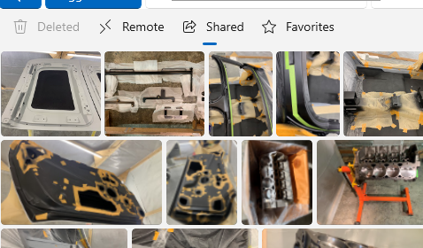

# Stable channel release notes for the Windows App SDK 1.5

The stable channel provides releases of the Windows App SDK that are supported for use by apps in production environments. Apps that use the stable release of the Windows App SDK can also be published to the Microsoft Store.

**Important links:**

- If you'd like to upgrade an existing app from an older version of the Windows App SDK to a newer version, see [Update existing projects to the latest release of the Windows App SDK](../update-existing-projects-to-the-latest-release.md).

**Latest stable channel release:**

- [Latest stable channel release notes for the Windows App SDK](../stable-channel.md)

## Downloads for the Windows App SDK

> [!NOTE]
> The Windows App SDK Visual Studio Extensions (VSIX) are no longer distributed as a separate download. They are available in the Visual Studio Marketplace inside Visual Studio.

### Version 1.5.7 (1.5.241001000)

This is a servicing release of the Windows App SDK that includes critical bug fixes for the 1.5 release.

- Added detection for a rare scenario where the app stops rendering and never recovers.
- Fixed a potential crash when a UI thread uninitializes.
- Fixed a potential issue where a menu off a CommandBar might have incorrectly opened up instead of down when the CommandBar was at the bottom of the window.

### Version 1.5.6 (1.5.240802000)

This is a servicing release of the Windows App SDK that includes critical bug fixes for the 1.5 release.

- Fixed an issue with `InputNonClientPointerSource` sometimes breaking input to the Min/Max/Close buttons. For more info, see GitHub issue [#9749](https://github.com/microsoft/microsoft-ui-xaml/issues/9749).
- Fixed a potential crash when closing a window while using a touchpad.

### Version 1.5.5 (1.5.240627000)

This is a servicing release of the Windows App SDK that includes critical bug fixes for the 1.5 release.

- Fixed a potential crash during image loading when the image source is changed before loading completes.
- Fixed a potential crash when using `InputNonClientPointerSource`.
- Fixed an issue where a window containing only a WebView2 control doesn't correctly set initial keyboard focus into the WebView2, leaving it unusable by keyboard and accessibility tools. For more info, see GitHub issue [WebView2Feedback#2330](https://github.com/MicrosoftEdge/WebView2Feedback/issues/2330).


### Version 1.5.4 (1.5.240607001)

This is a servicing release of the Windows App SDK that includes critical bug fixes for the 1.5 release.

- Fixed an issue with the fix for GitHub issue [#8857](https://github.com/microsoft/microsoft-ui-xaml/issues/8857) to properly merge a library's resources.pri into the app's resources.pri.
- Fixed an issue where WebView2 sent extra `blur` and `focus` events on every click. For more info, see GitHub issue [#9288](https://github.com/microsoft/microsoft-ui-xaml/issues/9288). This also fixes problems with dropdowns not responding, as seen in GitHub issue [#9566](https://github.com/microsoft/microsoft-ui-xaml/issues/9566).
- Fixed an issue where creating a new window or popup canceled any in-progress drag operation. For more info, see GitHub issue [#9360](https://github.com/microsoft/microsoft-ui-xaml/issues/9360).
- Fixed an issue where SVG files defining a negative viewbox no longer rendered. For more info, see GitHub issue [#9415](https://github.com/microsoft/microsoft-ui-xaml/issues/9415).
- Fixed an issue where `x:Bind` didn't check for **null** before using a weak reference, which could result in a crash. For more info, see GitHub issue [#9551](https://github.com/microsoft/microsoft-ui-xaml/issues/9551).
- Fixed an issue where a resize cursor was incorrectly shown at titlebar edges when a window was maximized, which also caused incorrect behavior when clicking or dragging in those areas. For more info, see GitHub issue [#8665](https://github.com/microsoft/microsoft-ui-xaml/issues/8665).


### Version 1.5.3 (1.5.240428000)

This is a servicing release of the Windows App SDK that includes critical bug fixes for the 1.5 release.

- Fixed an issue where `ItemsRepeater` sometimes caused its window to be brought to the front.
- Fixed a potential crash when the transparency state of an `AcrylicBrush` was updated.
- Fixed an issue where `ItemsRepeater` would not generate enough items if it was in a `ShouldConstrainToRootBounds="false"` popup that was taller or wider than the main window.
- Fixed an issue where error **MSB4086** could occur at build time if the project file didn't specify a *TargetPlatformVersion*. This error was hit as part of GitHub issue [#9531](https://github.com/microsoft/microsoft-ui-xaml/issues/9531).

### Version 1.5.2 (1.5.240404000)

This is a servicing release of the Windows App SDK that includes critical bug fixes for the 1.5 release and a new feature for Widget feed providers.

#### Widget feed provider updates

- Feed providers are now able to show announcements in the Widgets Dashboard:
  - The new `FeedManager.TryShowAnnouncement` API allows a Feed Provider to request that the Widget Dashboard show their announcements. To show your announcement, create a `FeedAnnouncement` object and call the `FeedManager.TryShowAnnouncement` API.
  - Feed announcements will have their own badges displayed in the taskbar that can be customized using the `FeedAnnouncement` API.
- Feed providers can now opt in to receive Analytics and Error Reports information about their provider as a user interacts with it. To opt in, implement the `IFeedProviderAnalytics` and/or `IFeedProviderErrors` interfaces by your provider.

The feed provider updates includes the following new APIs:

```C#
Microsoft.Windows.Widgets.Feeds.Providers
 
    FeedAnalyticsInfoReportedArgs
    FeedErrorInfoReportedArgs
    FeedManager
        SendMessageToContent
        TryShowAnnouncement
 
    FeedMessageReceivedArgs
    FeedResourceRequest
    FeedResourceRequestedArgs
    FeedResourceResponse
    IFeedAnnouncementInvokedTarget
    IFeedManager2
    IFeedProviderAnalytics
    IFeedProviderErrors
    IFeedProviderMessage
    IFeedResourceProvider
```

```C#
Microsoft.Windows.Widgets.Notifications
 
    AnnouncementActionKind
    AnnouncementTextColor
    FeedAnnouncement
    FeedAnnouncementInvokedArgs
```

### Bug fixes

- Fixed an issue where `DispatcherTimer` would not fire at the correct time if the primary display wasn't running at 60 Hz.
- Fixed an issue where a textbox input method editor (IME) window would be incorrectly positioned when running at a scale factor other than 100%. For more info, see GitHub issue [#9382](https://github.com/microsoft/microsoft-ui-xaml/issues/9382).
- Fixed an issue where a drag-and-drop operation started from another app might not allow the correct Copy/Move/Link drop operations.
- Fixed a potential crash when a ListView's `ItemsSource` is reset and given focus right away.
- Fixed a problem where `ShouldConstrainToRootBounds="false"` popups/flyouts don't apply any inherited scale transform. For more info, see GitHub issues [#9118](https://github.com/microsoft/microsoft-ui-xaml/issues/9118) and [#9433](https://github.com/microsoft/microsoft-ui-xaml/issues/9433).
- Fixed a potential crash when a Composition object is destroyed with an animation still running.
- Fixed a potential crash on shutdown in `NavigationView::RevokeNavigationViewItemRevokers`.

### Version 1.5.1 (1.5.240311000)

This is a servicing release of the Windows App SDK that includes critical bug fixes for the 1.5 release.

- Fixed an issue where self-contained apps may fail to build due to not being able to copy "map.html".
- Fixed an issue where `MapControl` would fail to initialize due to rejecting valid tokens. For more info, see GitHub issue [#9324](https://github.com/microsoft/microsoft-ui-xaml/issues/9324).
- Fixed an issue where `MapControl` loaded with a blue background. For more info, see GitHub issue [#9377](https://github.com/microsoft/microsoft-ui-xaml/issues/9377).
- Fixed an issue where clicking on the chevron of a `NavigationViewItem` did not correctly expand or collapse on a single click. This also caused menus to show as blank when clicking the chevron in `PaneDisplayMode="Top"` mode. For more info, see GitHub issues [#9423](https://github.com/microsoft/microsoft-ui-xaml/issues/9423) and [#9426](https://github.com/microsoft/microsoft-ui-xaml/issues/9426).
- Fixed an issue where tapping on a `NavigationViewItem` with touch or pen would prevent the item from responding to any future input. For more info, see GitHub issue [#9429](https://github.com/microsoft/microsoft-ui-xaml/issues/9429).
- Fixed a crash when clicking on an item in the `NavigationView.PaneFooter` area. For more info, see GitHub issue [#9396](https://github.com/microsoft/microsoft-ui-xaml/issues/9396).
- Fixed an issue where icons in menus were sometimes showing in the wrong place. For more info, see GitHub issue [#9409](https://github.com/microsoft/microsoft-ui-xaml/issues/9409).
- Fixed an issue where acrylic does not show on menus until switching away from the window and back. For more info, see GitHub issue [#9406](https://github.com/microsoft/microsoft-ui-xaml/issues/9406).
- Fixed a crash which could occur during `TextBox`/`RichEditBox` initialization. For more info, see GitHub issue [#9216](https://github.com/microsoft/microsoft-ui-xaml/issues/9216).
- Fixed some noisy exceptions which `NavigationView` threw and caught on destruction.
- Fixed an issue where a "pinch to zoom" gesture would sometimes show up as a pan or tap due to an incorrect `PointerCaptureLost` message firing.

### Version 1.5

The following sections describe new and updated features and known issues for version 1.5.

In an existing Windows App SDK 1.4 app, you can update your Nuget package to 1.5.240227000 (see the **Update a package** section in [Install and manage packages in Visual Studio using the NuGet Package Manager](/nuget/consume-packages/install-use-packages-visual-studio#update-a-package)).

For the updated runtime and MSIX, see [Downloads for the Windows App SDK](../downloads.md).

### XAML Islands runtime and shutdown updates

There is a behavioral difference between WinAppSDK 1.4 and WinAppSDK 1.5 for XAML Islands-based apps when the last XAML Window on any thread is closed.

  - In WinAppSDK 1.4, the XAML runtime always exits the thread's event loop when the last XAML window on a thread is closed.
  - In WinAppSDK 1.5:
      - If your app is a WinUI Desktop app, the default behavior is still the same as in WinAppSDK 1.4.
      - If you're using XAML for the DesktopWindowXamlSource ("XAML Islands") API, the default behavior is now that XAML does not automatically exit the thread's event loop.
      - In both modes, you can change this behavior by setting the `Application.DispatcherShutdownMode` property.
  
For more information, see the documentation for the `Application.DispatcherShutdownMode` property when available. This completes GitHub proposal [#8492](https://github.com/microsoft/microsoft-ui-xaml/issues/8492).

There is a behavioral difference between WinAppSDK 1.4 and WinAppSDK 1.5 for XAML Islands-based apps in the lifetime of the XAML runtime:

  - In WinAppSDK 1.4, the XAML runtime shuts down on a thread if either all `WindowsXamlManager` and `DesktopWindowXamlSource` objects on a given thread are closed or shut down, or the `DispatcherQueue` running on that thread is shut down (in this case, the XAML runtime shuts down during the `DispatcherQueue.FrameworkShutdownStarting` stage).
  - In WinAppSDK 1.5, the XAML runtime shuts down on a thread only when the DispatcherQueue running on that thread is shut down (the Xaml runtime always shuts down during the `DispatcherQueue.FrameworkShutdownStarting` stage).

For more information, see the documentation for the `WindowsXamlManager` class when available.

There is a behavioral difference in `WindowsXamlManager.InitializeForCurrentThread()`:

  - In WinAppSDK 1.4, `WindowsXamlManager.InitializeForCurrentThread()` returns a unique instance of a `WindowsXamlManager` object with each call.
  - In WinAppSDK 1.5, `WindowsXamlManager.InitializeForCurrentThread()` returns an existing instance if one already exists on the thread. `Close/Dispose()` is now ignored.

### WinUI Maps control

The WinUI `Maps` control is now available! This control is powered by WebView2 and Azure Maps, providing the following features:

- Panning and zooming with either the map buttons or touch.
- Changing the style of the map to satellite, terrain, or street view. 
- Programmatically adding interactable pins with developer-customizable icons to the map. 
- Developer customization for where the map is centered on initial load.
- Control for developers over hiding or showing the buttons for panning, zooming, and map styles.


> [!NOTE]
> To use the `Maps` control, you'll need an Azure Maps key. To create the key, see the [Azure Maps documentation page for creating a web app](/azure/azure-maps/quick-demo-map-app#get-the-subscription-key-for-your-account).

The `Maps` control is entirely new and we welcome your feedback to evaluate its future direction!

### New SelectorBar control

In 1.5, we've added a new `SelectorBar` control for enabling users to switch between multiple views of data. This control was previously known as "SegmentedControl" on our 1.5 roadmap.



### Labels in the CommandBarFlyout primary commands

The visuals of the `CommandBarFlyout` have been updated to display a text label for the items in the primary commands area if the `Label` property has been set on the `AppBarButton`. Previously, the primary commands in the `CommandBarFlyout` area only displayed an icon, but now they can show both an icon and a label for improved usability.


### WebView2 support for custom environment/options

The WinUI `WebView2` control now exposes the ability to customize the underlying `CoreWebView2` object with a custom `CoreWebView2Environment` and `CoreWebView2ControllerOptions`. This enables the app author to specify an alternate path from which to load the WebView2Runtime, choose to use a different *UserDataFolder*, or set options such as *IsPrivateModeEnabled* and *ScriptLocale*.

### Support for .NET 8

We added support for .NET 8 in a recent 1.4 servicing release, but that still kept the warning for the use of platform-specific RIDs. In 1.5, we completed that work so that the warning is no longer present.

### Improved debugging and source availability

We now inject Github source server information for code in the microsoft-ui-xaml repo into our public symbols, allowing debuggers to automatically download source code. We also made other fixes and improvements to our symbols across the entire WinAppSDK to improve the debugging experience.

### Improved functionality for debugging layout cycles

Debugging layout cycles in a WinUI app can be a challenge, so in 1.5 the `DebugSettings` object now exposes options to enable improved logging and breakpoints for the layout process to make it easier to debug and fix layout cycles in the app.

### Other new features from across the WinAppSDK

- Added support for the PublishSingleFile deployment model. For more info about PublishSingleFile, see the [Single-file deployment documentation](/dotnet/core/deploying/single-file/overview). 
- Added improvements to screen reader support, text scaling support, and other accessibility features.
- Various stability and performance improvements based on our prioritized GitHub bug backlog.

### New features being released separately

New versions of the WinAppSDK Visual Studio Templates for C# and C++ are being released through the Visual Studio Marketplace and they will appear a few weeks after the release of 1.5. With the new version, the templates may now be released independently of WinAppSDK releases, giving us much more flexibility in getting updates to customers.

### Other previously planned features

In 1.5, we made progress on the following features that we announced on our roadmap, but did not complete them. They will continue into the 1.6 timeframe.

- Tabbed windows
- Drag-n-drop support for WebView2
  - To clarify, in 1.5 dragging *into* WebView2 is supported, such as dragging a PNG from File Explorer into Bing for Visual Search. Work is ongoing in 1.6 to support dragging *out* of WebView2.
- Investigations into the table view and ink controls

Dynamic lighting has been removed from the roadmap for the time being.

### Known issues

- When using libraries which contain resources such as .xaml files, you may hit an error message at runtime indicating that those resources cannot be found. In this case, it might be necessary to insert `<ShouldComputeInputPris>true</ShouldComputeInputPris>` in the project file to ensure those resources get included.
- Clicking on the chevron of a `NavigationViewItem` no longer correctly expands or collapses on a single click. Double-clicking still works, as does clicking elsewhere on the `NavigationViewItem`.

### Bug fixes

- Fixed an issue where `StackPanel` applied spacing to collapsed items. For more info, see GitHub issue [#916](https://github.com/microsoft/microsoft-ui-xaml/issues/916).
- Fixed problems with scrolling controls no longer working after closing another app window. Fore more info, see GitHub issues [#9292](https://github.com/microsoft/microsoft-ui-xaml/issues/9292) and [#9355](https://github.com/microsoft/microsoft-ui-xaml/issues/9355).
- Fixed a crash when setting `DebugSettings.EnableFrameRateCounter` to *true* before the first frame rendered. For more info, see GitHub issue [#2835](https://github.com/microsoft/microsoft-ui-xaml/issues/2835).
- Fixed a potential compile error for C++ where some headers did not include necessary dependencies. Note that the change of `#include` order might impact some apps, such as possibly causing a compile error for `IInspectable` if the app is using a version of C++/WinRT older than 2023. For more info, see GitHub issue [#9014](https://github.com/microsoft/microsoft-ui-xaml/issues/9014).
- Fixed an issue where `ElementName` bindings didn't work inside the `ItemsRepeater` `DataTemplate`. For more info, see GitHub issue [#560](https://github.com/microsoft/microsoft-ui-xaml/issues/560).
- Fixed crashes when running an app under Visual Studio with the in-app toolbar enabled. Visual Studio 17.8 Preview 2 or later is required to fully get the fixes. For more info, see GitHub issue [#8806](https://github.com/microsoft/microsoft-ui-xaml/issues/8806).
- Fixed an issue where `AnnotatedScrollbar` could sometimes crash when quickly scrolling.
- Fixed an issue where menu text would sometimes get truncated.
- Fixed an issue where teaching tips did not receive proper focus. For more info, see GitHub issue [#3257](https://github.com/microsoft/microsoft-ui-xaml/issues/3257).
- Fixed an issue that crashed the application when setting the `TailVisibility` of a `TeachingTip` to *Collapsed* on startup. For more info, see GitHub issue [#8731](https://github.com/microsoft/microsoft-ui-xaml/issues/8731).
- Fixed an issue with how PRI files were handled when using libraries. For more info, see GitHub issue [#8857](https://github.com/microsoft/microsoft-ui-xaml/issues/8857).
- Fixed an issue from the 1.5-experimental2 release where the projection DLL was not generated. For more info, see GitHub issue [#4152](https://github.com/microsoft/WindowsAppSDK/issues/4152).
- Fixed an issue where the ellipsis button on the text formatting popup of the `RichEditBox` was not displaying the list of actions properly. For more info, see GitHub issue [#9140](https://github.com/microsoft/microsoft-ui-xaml/issues/9140).
- Fixed an issue where `ListView` didn't handle keyboard accelerators properly. For more info, see GitHub issue [#8063](https://github.com/microsoft/microsoft-ui-xaml/issues/8063).
- Fixed an access violation issue with using `AccessKey` to close a window. For more info, see GitHub issue [#8648](https://github.com/microsoft/microsoft-ui-xaml/issues/8648).
- Fixed a crash when using an `AccessKey` to close a window. For more info, see GitHub issue [#9002](https://github.com/microsoft/microsoft-ui-xaml/issues/9002).
- Fixed an issue affecting text alignment in a `MenuFlyoutItem` within a `MenuBar`. For more info, see GitHub issue [#8755](https://github.com/microsoft/microsoft-ui-xaml/issues/8755).
- Fixed an issue where highlighted text would not remain highlighted upon right-click. For more info, see GitHub issue [#1801](https://github.com/microsoft/microsoft-ui-xaml/issues/1801).
- Fixed an issue causing inactive windows to crash the app when closed. For more info, see GitHub issue [#8913](https://github.com/microsoft/microsoft-ui-xaml/issues/8913).
- Fixed an issue that could hang applications when scrolling with the middle mouse button and left-clicking immediately afterwards. For more info, see GitHub issue [#9233](https://github.com/microsoft/microsoft-ui-xaml/issues/9233).
- Fixed an issue causing apps to crash on startup when using a custom `NavigationViewItem`. For more info, see GitHub issue [#8814](https://github.com/microsoft/microsoft-ui-xaml/issues/8814).
- Fixed a `NavigationView` issue where the ellipsis button would incorrectly generate an error. For more info, see GitHub issue [#8380](https://github.com/microsoft/microsoft-ui-xaml/issues/8380).
- Fixed an issue where a `SystemBackdrop` would not render properly in a multi-window app. For more info, see GitHub issue [#8423](https://github.com/microsoft/microsoft-ui-xaml/issues/8423).
- Fixed a duplication issue when inserting into the beginning of an `ObservableCollection`. For more info, see GitHub issue [#8370](https://github.com/microsoft/microsoft-ui-xaml/issues/8370).

## Related topics

- [Latest preview channel release notes for the Windows App SDK](../preview-channel.md)
- [Latest experimental channel release notes for the Windows App SDK](../experimental-channel.md)
- [Install tools for the Windows App SDK](../set-up-your-development-environment.md)
- [Create your first WinUI 3 (Windows App SDK) project](../../winui/winui3/create-your-first-winui3-app.md)
- [Use the Windows App SDK in an existing project](../use-windows-app-sdk-in-existing-project.md)
- [Deployment overview](../../package-and-deploy/index.md#use-the-windows-app-sdk)
