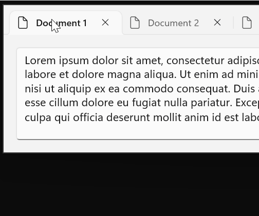

# Windows App SDK 1.6 release notes

[!INCLUDE [wasdk-releasenotes](../../../includes/wasdk-release-notes.md)]

:::zone pivot="stable"

## Version 1.6.9 (1.6.250602001)

<details><summary>Bug Fixes</summary>

> - Fixed a potential crash in WindowChrome::SetTitleBar when closing a window. For more info, see GitHub issue [#9203](https://github.com/microsoft/microsoft-ui-xaml/issues/9203).
>

</details>

---

## Version 1.6.8 (1.6.250430001)

<details><summary>ApplicationData.MachinePath folder creation support</summary>

> ApplicationData.MachineFolder is now easier to use on Windows >=10.0.26100.0 (Ge). Windows will [create the Machine folder](https://github.com/microsoft/WindowsAppSDK/blob/main/specs/applicationdata/ApplicationData.md#343-machine-path-creationdeletion) when a [package manifesting opt-in support](https://github.com/microsoft/WindowsAppSDK/blob/main/specs/applicationdata/ApplicationData.md#342-manifested-opt-in) is added to a system if Windows App SDK 1.6.8 is present on the system. For more details see the [ApplicationData spec](https://github.com/microsoft/WindowsAppSDK/blob/main/specs/applicationdata/ApplicationData.md).
>

</details>

<details><summary>Bug Fixes</summary>

> - Fixed PackageDeploymentManager telemetry to properly capture when completion status. For more info, see GitHub issue [#5297](https://github.com/microsoft/WindowsAppSDK/pull/5297).
> - Fixed a crash when using pen input on an x86 app.
> - Fixed a potential crash if the window is already destroyed when WinUI is attempting to initialize for scrolling.
> - Fixed the WINDOWSAPPSDK_RELEASE_PATCH define and Microsoft::WindowsAppSDK::Release::Patch values in WindowsAppSDK-VersionInfo.h to not always be 0. The define is now the yymmdd date of the build, and the Patch value is the mmdd date. This change provides better runtime information on the version being used without changing any variable sizes or the version scheme.
>

</details>

---

## Version 1.6.7 (1.6.250402001)

<details><summary>Bug Fixes</summary>

- Improved the telemetry for failure scenarios in `WindowsAppRuntimeInstall-<arch>.exe`. For more info, see GitHub issue [#5291](https://github.com/microsoft/WindowsAppSDK/pull/5291).
- Fixed an issue where pointer input would stop working when using arrow keys at the same time. For more info, see GitHub issue [#10126](https://github.com/microsoft/microsoft-ui-xaml/issues/10126).
- Fixed an issue where apps in remote desktop stop responding to pointer input. For more info, see GitHub issue [#10009](https://github.com/microsoft/microsoft-ui-xaml/issues/10009). (This is the same fix as the pointer input plus arrow keys fix, due to remote desktop automatically sending some key input during the switch away and back.)
- Fixed a potential crash trying to restore focus if a window activation event is delivered for a window which is closing.
- Fixed a performance regression introduced in Windows App SDK 1.6 due to WinUI binaries missing some linker optimizations.
- Fixed a small performance issue when creating multiple WinUI windows/islands.
- Fixed a potential crash if `ProgressBar::SetProgressBarIndicatorWidth` is called on a ProgressBar which is not in the tree.
- Fixed a potential crash caused by `CPopup::EnsureBridgeClosed` sometimes triggering reentrancy.
- Fixed a potential crash when closing a popup due to `CUIElement::FlushPendingKeepVisibleOperations` using a null children collection.
- Fixed `PackageDeploymentManager.EnsurePackage*Ready` to ensure version supersedence. For more info, see GitHub issue [#5225](https://github.com/microsoft/WindowsAppSDK/pull/5225).

</details>

---

## Version 1.6.6 (1.6.250228001)

<details><summary>Bug Fixes</summary>
This is a servicing release of the Windows App SDK that includes critical bug fixes for the 1.6 release.

- Fixed an issue where a child window posting WM_NCMOUSELEAVE to the parent window would result in a loop that blocks new mouse input events.
- Fixed a crash which would occur on the next AppWindow.Changed event after a WebView2 process failure.
- Fixed a potential crash when using an Accessibility tool and closing a window.
- Fixed an issue where a textbox would not accept key input if given focus by clicking in the area of the clear button of the textbox. For more info, see GitHub issue [#7703](https://github.com/microsoft/microsoft-ui-xaml/issues/7703).
- Fixed an issue where a tooltip is not shown for the Minimize button in the titlebar when using `ExtendsContentIntoTitleBar=true`. For more info, see GitHub issue [#9149](https://github.com/microsoft/microsoft-ui-xaml/issues/9149).

This release includes the following new APIs: 

A new `IsPlaceholderContent` property on `WidgetInfo` and `WidgetUpdateRequestOptions` enables a Widget provider to indicate that it would display placeholder content if rendered. For example, a Widget that shows weather information should set IsPlaceholderContent to true if the user has not yet specified a weather location and the Widget is merely showing weather information for a default location like Seattle. When a Widget is marked as placeholder, certain hosts may decide to hide the Widget or prioritize other Widgets.

```
Microsoft.Windows.Widgets.Providers

    WidgetInfo
        IsPlaceholderContent

    WidgetUpdateRequestOptions
        IsPlaceholderContent
```
</details>

---

## Version 1.6.5 (1.6.250205002)

<details><summary>Bug Fixes</summary>
- Fixed several memory leak issues.
</details>

---

## Version 1.6.4 (1.6.250108002)

<details><summary>Bug Fixes</summary>
- Fixed an issue with text selection highlighting in a multi-line TextBox. For more info, see GitHub issue [#9965](https://github.com/microsoft/microsoft-ui-xaml/issues/9965).
- Fixed an issue where the DDLM package would sometimes not install, preventing launch of unpackaged apps. For more info, see GitHub issue [#3855](https://github.com/microsoft/WindowsAppSDK/issues/3855).
- Fixed a potential crash in Detours in some scenarios. For more info, see GitHub issue [#4937](https://github.com/microsoft/WindowsAppSDK/pull/4937).
- Fixed another potential issue where a menu off a CommandBar may incorrectly open up instead of down when the CommandBar is at the bottom of the window.
- Fixed a potential crash when running on older graphics hardware.
- Fixed a potential crash in pointer event handling when closing a window.
- Fixed a potential crash caused by `CUIAWindow::InitIds` sometimes triggering reentrancy.
- Fixed a potential crash when using `CompositionCapabilities.Changed` event.
- Fixed an issue with some Unicode characters displaying as squares in TextBox/RichEditBox.
- Fixed `PackageDeploymentManager.EnsurePackage*Async()` handling of `options.RegisterNewerIfAvailable`. For more info, see GitHub issue [#4864](https://github.com/microsoft/WindowsAppSDK/issues/4864).

</details>

---

## Version 1.6.3 (1.6.241114003)

<details><summary>Bug Fixes</summary>
This is a servicing release of the Windows App SDK that includes critical bug fixes for the 1.6 release.
- Fixed an issue where reading the `AppWindow.ExtendsContentIntoTitleBar` property turns on custom titlebar rendering. For more info, see GitHub issue [#9988](https://github.com/microsoft/microsoft-ui-xaml/issues/9988). 
- Fixed a potential crash during destruction of a `TextBox`/`RichEditBox`. For more info, see GitHub issue [#9070](https://github.com/microsoft/microsoft-ui-xaml/issues/9070). 
- Fixed an issue where `PackageDeploymentManager.IsPackageReadyOrNewerAvailable()` failed. For more info, see GitHub issue [#4817](https://github.com/microsoft/WindowsAppSDK/issues/4817). 
- Fixed an issue where `ScrollViewer` would leak. 
- Added detection for a rare scenario where the app stops rendering and never recovers. 
- Fixed an issue where `PackageDeploymentManager.RegisterPackageSetAsync()` requires URI when it should be optional to register by PackageFamilyName. 
- Fixed an issue that prevented apps from being installed or uninstalled. For more info, see GitHub issue [#4881](https://github.com/microsoft/WindowsAppSDK/issues/4881).

This release includes the following new APIs which allow for providers of Widgets to incorporate web content in their Widgets: 

```C# 
Microsoft.Windows.Widgets.Providers 
  IWidgetManager2 
  IWidgetProviderMessage 
  IWidgetResourceProvider 
  WidgetManager 
     SendMessageToContent 

  WidgetMessageReceivedArgs 
  WidgetResourceRequest 
  WidgetResourceRequestedArgs 
  WidgetResourceResponse 
```
</details>

---

## Version 1.6.1 (1.6.240923002)

<details><summary>Bugfixes</summary>

> - Fixed a crash when using FocusVisualKind.Reveal(). For more info, see GitHub issue [#9966](https://github.com/microsoft/microsoft-ui-xaml/issues/9966).
> - Fixed noisy C++ exceptions from Bcp47Langs.dll. For more info, see GitHub issue [#4691](https://github.com/microsoft/WindowsAppSDK/issues/4691). Note that this fix removes the synchronization with `Windows.Globalization.ApplicationLanguages.PrimaryLanguageOverride`.
> - Fixed an issue where an extra `Unloaded` event was raised immediately after showing a `ContentDialog`. For more info, see GitHub issue [#8402](https://github.com/microsoft/microsoft-ui-xaml/issues/8402).
> - Fixed an issue where a CommandBar menu might have incorrectly opened up even when there was room for it to open down.
> - Fixed some issues where input to `InputNonClientPointerSource` regions was not handled correctly when the top-level window was running in right-to-left mode.
> - Fixed the compile-time check for the Windows SDK framework version to handle the slightly different framework name used for .NET 9.

</details>

---

## Version 1.6

<details><summary>C++ project changes</summary>

> When updating a C++ project to 1.6, you'll need to add a project reference to the `Microsoft.Web.WebView2` package. If you update via NuGet Package Manager in Visual Studio, this dependency will be added for you.
>

</details>

<details><summary>C# project changes</summary>

> In 1.6, Windows App SDK managed apps require [Microsoft.Windows.SDK.NET.Ref](https://www.nuget.org/packages/Microsoft.Windows.SDK.NET.Ref) `*.*.*.38` or later, which can be specified via [WindowsSdkPackageVersion](/dotnet/core/compatibility/sdk/5.0/override-windows-sdk-package-version) in your `csproj` file. For example:
>
> ```XML
> <Project Sdk="Microsoft.NET.Sdk">
>    <PropertyGroup>
>        <OutputType>WinExe</OutputType>
>        <TargetFramework>net8.0-windows10.0.22621.0</TargetFramework>
>        <TargetPlatformMinVersion>10.0.17763.0</TargetPlatformMinVersion>
>        <WindowsSdkPackageVersion>10.0.22621.38</WindowsSdkPackageVersion>
>    </PropertyGroup>
>    ...
> ```
>
> In addition, Windows App SDK managed apps should update to [Microsoft.Windows.CsWinRT](https://www.nuget.org/packages/Microsoft.Windows.CsWinRT) `2.1.1` (or later).
>
>[!NOTE]
> These manual references will no longer be needed once the next .NET SDK servicing update is released.
>

</details>

<details><summary>Native AOT support</summary>

> 
>
> The .NET `PublishAot` project property is now supported for native Ahead-Of-Time compilation. For details on Native AOT, see [Native AOT Deployment](/dotnet/core/deploying/native-aot/?tabs=net8plus%2Cwindows). Because AOT builds on Trimming support, much of the following trimming-related guidance applies to AOT as well.
>
> For `PublishAot` support and trimming support, in addition to the C# project changes described in the previous section you'll also need a package reference to [Microsoft.Windows.CsWinRT](https://www.nuget.org/packages/Microsoft.Windows.CsWinRT) `2.1.1` (or later) to enable the source generator from that package until the next .NET SDK servicing update is released when it will no longer be required. 
>
> For more info, see the [CsWinRT Trimming / AOT support doc](https://github.com/microsoft/CsWinRT/blob/master/docs/aot-trimming.md) and the [CsWinRT 2.1.1 Release Notes](https://github.com/microsoft/CsWinRT/releases/tag/2.1.1.240807.2).
>
> Because the Windows App SDK invokes publishing targets when F5 deploying, we recommend enabling `PublishAot` at NuGet restore time by adding this to your `csproj` file:
>
> ```XML
> <PublishAot>true</PublishAot>
> ```
>

</details>

<details><summary>Resolving AOT Issues</summary>

> In this release, the developer is responsible for ensuring that all types are properly rooted to avoid trimming (such as with reflection-based `{Binding}` targets). Later releases will enhance both C#/WinRT and the XAML Compiler to automate rooting where possible, alert developers to trimming risks, and provide mechanisms to resolve.
>
> **Partial Classes**
>
> C#/WinRT also includes `PublishAot` support in version 2.1.1. To enable a class for AOT publishing with C#/WinRT, it must first be marked `partial`. This allows the C#/WinRT AOT source analyzer to attribute the classes for static analysis. Only classes (which contain methods, the targets of trimming) require this attribute.
>
> **Unsafe Code Error**
>
> The CsWinRT source generator might generate code that makes use of `unsafe`. If you hit such an error during compilation or a diagnostic warning for it ([CS0227](/dotnet/csharp/misc/cs0227) for "Unsafe code may only appear if compiling with /unsafe"), you should set EnableUnsafeBlocks to true. For more info, see GitHub issue [CsWinRT #1721](https://github.com/microsoft/CsWinRT/issues/1721).
>
> **WebView2 not yet AOT compatible**
>
> The WebView2 projections in `Microsoft.Web.WebView2` package version 1.0.2651.64 are not yet AOT compatible. This will be fixed in an upcoming release of the `Microsoft.Web.WebView2` package, which you can then reference in your project.
>
> **Reflection-Free Techniques**
>
> To enable AOT compatibility, reflection-based techniques should be replaced with statically typed serialization, AppContext.BaseDirectory, typeof(), etc. For details, see [Introduction to trim warnings](/dotnet/core/deploying/trimming/fixing-warnings).
>
> **Rooting Types**
>
> Until full support for `{Binding}` is implemented, types may be preserved from trimming as follows:
>
> Given project `P` consuming assembly `A` with type `T` in namespace `N`, which is only dynamically referenced (so normally trimmed), `T` can be preserved via:
>
> `P.csproj`:
>
> ```xml
> <ItemGroup>
>     <TrimmerRootDescriptor Include="ILLink.Descriptors.xml" />
> </ItemGroup>
> ```
>
> `ILLink.Descriptors.xml`:
>
> ```xml
> <?xml version="1.0" encoding="utf-8"?>
> <linker>
>     <assembly fullname="A">
>         <type fullname="N.T" preserve="all" />
>     </assembly>
> </linker>
> ```
>
> For complete root descriptor XML expression syntax, see [Root Descriptors](/dotnet/core/deploying/trimming/trimming-options?pivots=dotnet-8-0#root-descriptors).
>
> [!NOTE]
> Dependency packages that have not yet adopted AOT support may exhibit runtime issues.
>

</details>

<details><summary>Decoupled WebView2 versioning</summary>

>
> The Windows App SDK now consumes the Edge WebView2 SDK as a NuGet reference rather than embedding a hardcoded version of the Edge WebView2 SDK. The new model allows apps to choose a newer version of the `Microsoft.Web.WebView2` package instead of being limited to the version with which the Windows App SDK was built. The new model also allows apps to reference NuGet packages which also reference the Edge WebView2 SDK. For more info, see GitHub issue [#5689](https://github.com/microsoft/microsoft-ui-xaml/issues/5689).
>

</details>

<details><summary>New Package Deployment APIs</summary>

>
> The Package Management API has received several enhancements including Is\*ReadyOrNewerAvailable\*(), EnsureReadyOptions.RegisterNewerIfAvailable, Is\*Provisioned\*(), IsPackageRegistrationPending(), and several bug fixes. See [PackageManagement.md](https://github.com/microsoft/WindowsAppSDK/blob/main/specs/packagemanager/PackageManagement.md) and [Pull Request #4453](https://github.com/microsoft/WindowsAppSDK/pull/4453) for more details. 
>

</details>

<details><summary>Improved TabView tab tear-out</summary>

>
> 
>
> `TabView` supports a new `CanTearOutTabs` mode which provides an enhanced experience for dragging tabs and dragging out to a new window. When this new option is enabled, tab dragging is very much like the tab drag experience in Edge and Chrome where a new window is immediately created during the drag, allowing the user to drag it to the edge of the screen to maximize or snap the window in one smooth motion. This implementation also doesn't use drag-and-drop APIs, so it isn't impacted by any limitations in those APIs. Notably, tab tear-out is supported in processes running elevated as Administrator.
>

</details>

<details><summary>Other notable changes</summary>

>
> - Added a new `ColorHelper.ToDisplayName()` API, filling that gap from UWP.
> - Added a new `Microsoft.Windows.Globalization.ApplicationLanguages` class, which notably includes a new `PrimaryLanguageOverride` feature. For more info, see GitHub issue [#4523](https://github.com/microsoft/WindowsAppSDK/pull/4523).
> - Unsealed `ItemsWrapGrid`. This should be a backward-compatible change.
> - `PipsPager` supports a new mode where it can wrap between the first and last items.
>
> 
>
> - `RatingControl` is now more customizable, by moving some hard-coded style properties to theme resources. This allows apps to override these values to better customize the appearance of RatingControl.
>
> 
>
> - WinUI 3 has changed to the typographic model for font selection rather than the legacy weight/stretch/style model. The typographic model is required for some newer fonts, including Segoe UI Variable, and enables enhanced font capabilities. Some older fonts which rely on the weight/stretch/style model for selection may not be found with the typographic model.
>

</details>

<details><summary>Known issues</summary>

>
> - If the debugger is set to break on all C++ exceptions, it will break on some noisy exceptions on start-up in the BCP47 (Windows Globalization) code. For more info, see GitHub issue [#4691](https://github.com/microsoft/WindowsAppSDK/issues/4691).
> - Component library packages which reference the Windows App SDK 1.6 package will not correctly get the referenced WebView2 package contents. For more info, see [WebView2Feedback #4743](https://github.com/MicrosoftEdge/WebView2Feedback/issues/4743). A workaround is to add a direct reference to the `Microsoft.Web.WebView2` package where needed.
> - Apps compiled with Native AOT might sometimes experience a hanging issue after page navigation due to a race condition in the .NET runtime's GC thread. For more info, see [.NET issue #104582](https://github.com/dotnet/runtime/issues/104582).
> - The initial release of 1.6.0 introduced an issue with one of our dependencies that we expect will be resolved in an upcoming release of the .NET SDK. If you experience an error with the version of your Microsoft.Windows.SDK.NET reference, you'll need to explicitly reference the version of the .NET SDK that is specified by your error message. For example, if the error says you need version 10.0.19041.38, add the following to your `.csproj` file:
>     - `<WindowsSdkPackageVersion>10.0.19041.38</WindowsSdkPackageVersion>`.
>

</details>

<details><summary>Bug fixes</summary>

>
> - Fixed a crash when setting `InfoBar.IsOpen` in .xaml. For more info, see GitHub issue [#8391](https://github.com/microsoft/microsoft-ui-xaml/issues/8391).
> - Fixed an issue where HTML elements would lose pointer capture when the mouse moved outside of the `WebView2` bounds. For more info, see GitHub issue [#8677](https://github.com/microsoft/microsoft-ui-xaml/issues/8677).
> - Fixed an issue where drag and drop into a flyout with `ShouldConstrainToRootBounds=false` did not work. For more info, see GitHub issue [#9276](https://github.com/microsoft/microsoft-ui-xaml/issues/9276).
> - Fixed an issue where `ms-appx://` references did not work when `PublishSingleFile` is enabled. For more info, see GitHub issue [#9468](https://github.com/microsoft/microsoft-ui-xaml/issues/9468).
> - Fixed an issue where debugger symbols weren't working correctly for some binaries. For more info, see GitHub issue [#4633](https://github.com/microsoft/windowsappsdk/issues/4633).
> - Fixed a potential crash when subclassing `NavigationView`.
> - Fixed an issue where table borders in a `RichEditBox` would not correctly erase when scrolling or reducing the size of the table.
> - Fixed an issue where flyouts from `MediaTransportControls` had a fully transparent background.
> - Fixed an issue where dragging into a WebView2 would fail or drop in the wrong location on display scale factors other than 100% or when system text scaling is enabled.
> - Fixed an issue where `TextBox`/`RichEditBox` would not announce to Accessibility tools when input is blocked due to being at the `MaxLength` limit.
> - Fixed a few issues around handling of custom titlebar scenarios. For more info, see GitHub issues [#7629](https://github.com/microsoft/microsoft-ui-xaml/issues/7629), [#9670](https://github.com/microsoft/microsoft-ui-xaml/issues/9670), [#9709](https://github.com/microsoft/microsoft-ui-xaml/issues/9709) and [#8431](https://github.com/microsoft/microsoft-ui-xaml/issues/8431).
> - Fixed an issue where `InfoBadge` icon was not visible. For more info, see GitHub issue [#8176](https://github.com/microsoft/microsoft-ui-xaml/issues/8176).
> - Fixed an issue with icons sometimes showing in the wrong position in `CommandBarFlyout`. For more info, see GitHub issue [#9409](https://github.com/microsoft/microsoft-ui-xaml/issues/9409).
> - Fixed an issue with keyboard focus in menus when opening or closing a sub menu. For more info, see GitHub issue [#9519](https://github.com/microsoft/microsoft-ui-xaml/issues/9519).
> - Fixed an issue with `TreeView` using the incorrect `IsExpanded` state when recycling items. For more info, see GitHub issue [#9549](https://github.com/microsoft/microsoft-ui-xaml/issues/9549).
> - Fixed an issue when using an ElementName binding in an `ItemsRepeater.ItemTemplate`. For more info, see GitHub issue [#9715](https://github.com/microsoft/microsoft-ui-xaml/issues/9715).
> - Fixed an issue with the first item in an `ItemsRepeater` sometimes having an incorrect position. For more info, see GitHub issue [#9743](https://github.com/microsoft/microsoft-ui-xaml/issues/9743).
> - Fixed an issue with `InputNonClientPointerSource` sometimes breaking input to the min/max/close buttons. For more info, see GitHub issue [#9749](https://github.com/microsoft/microsoft-ui-xaml/issues/9749).
> - Fixed a compile error when using Microsoft.UI.Interop.h with clang-cl. For more info, see GitHub issue [#9771](https://github.com/microsoft/microsoft-ui-xaml/issues/9771).
> - Fixed an issue where the `CharacterReceived` event was not working in `ComboBox`/`TextBox`. For more info, see GitHub issue [#9786](https://github.com/microsoft/microsoft-ui-xaml/issues/9786).
> - Fixed an issue where duplicate `KeyUp` events were raised for arrow and tab keys. For more info, see GitHub issue [#9399](https://github.com/microsoft/microsoft-ui-xaml/issues/9399).
> - Fixed an issue where the `PowerManager.SystemSuspendStatusChanged` event was unusable to get the `SystemSuspendStatus`. For more info, see GitHub issue [#2833](https://github.com/microsoft/WindowsAppSDK/issues/2833).
> - Fixed an issue where initial keyboard focus was not correctly given to a `WebView2` when that was the only control in the window.
> - Fixed an issue when using `ExtendsContentIntoTitleBar=true` where the Min/Max/Close buttons did not correctly appear in the UI Automation, which prevented Voice Access from showing numbers for those buttons.
> - Fixed an issue where an app might crash in a lock check due to unexpected reentrancy.
> - Fixed an issue where `Hyperlink` colors did not correctly update when switching into a high contrast theme.
> - Fixed an issue where changing the collection of a `ListView` in a background window may incorrectly move that window to the foreground and take focus.
> - Fixed an issue where calling `ItemsRepeater.StartBringIntoView` could sometimes cause items to disappear.
> - Fixed an issue where touching and dragging on a `Button` in a `ScrollViewer` would leave it in a pressed state.
> - Updated IntelliSense, which was missing information for many newer types and members.
> - Fixed an issue where clicking in an empty area of a `ScrollViewer` would always move focus to the first focusable control in the `ScrollViewer` and scroll that control into view. For more info, see GitHub issue [#597](https://github.com/microsoft/microsoft-ui-xaml/issues/597).
> - Fixed an issue where the `Window.Activated` event sometimes fired multiple times. For more info, see GitHub issue [#7343](https://github.com/microsoft/microsoft-ui-xaml/issues/7343).
> - Fixed an issue where setting the `NavigationViewItem.IsSelected` property to `true` prevented its children from showing when expanded. For more info, see GitHub issue [#7930](https://github.com/microsoft/microsoft-ui-xaml/issues/7930).
> - Fixed an issue where `MediaPlayerElement` would not properly display captions with `None` or `DropShadow` edge effects. For more info, see GitHub issue [#7981](https://github.com/microsoft/microsoft-ui-xaml/issues/7981).
> - Fixed an issue where the `Flyout.ShowMode` property was not used when showing the flyout. For more info, see GitHub issue [#7987](https://github.com/microsoft/microsoft-ui-xaml/issues/7987).
> - Fixed an issue where `NumberBox` would sometimes have rounding errors. For more info, see GitHub issue [#8780](https://github.com/microsoft/microsoft-ui-xaml/issues/8780).
> - Fixed an issue where using a library compiled against an older version of Windows App SDK could hit an error trying to find a type or property. 
> For more info, see GitHub issue [#8810](https://github.com/microsoft/microsoft-ui-xaml/issues/8810).
> - Fixed an issue where initial keyboard focus was not set when launching a window. For more info, see GitHub issue [#8816](https://github.com/microsoft/microsoft-ui-xaml/issues/8816).
> - Fixed an issue where `FlyoutShowMode.TransientWithDismissOnPointerMoveAway` didn't work after the first time it was shown. 
> For more info, see GitHub issue [#8896](https://github.com/microsoft/microsoft-ui-xaml/issues/8896).
> - Fixed an issue where some controls did not correctly template bind `Foreground` and `Background` properties. For more info, see GitHub issue [#7070](https://github.com/microsoft/microsoft-ui-xaml/issues/7070), [#9020](https://github.com/microsoft/microsoft-ui-xaml/issues/9020), [#9029](https://github.com/microsoft/microsoft-ui-xaml/issues/9029), [#9083](https://github.com/microsoft/microsoft-ui-xaml/issues/9083) and [#9102](https://github.com/microsoft/microsoft-ui-xaml/issues/9102).
> - Fixed an issue where `ThemeResource`s used in `VisualStateManager` setters wouldn't update on theme change. This commonly affected controls in flyouts. For more info, see GitHub issue [#9198](https://github.com/microsoft/microsoft-ui-xaml/issues/9198).
> - Fixed an issue where `WebView` would lose key focus, resulting in extra blur/focus events and other issues. 
> For more info, see GitHub issue [#9288](https://github.com/microsoft/microsoft-ui-xaml/issues/9288).
> - Fixed an issue where `NavigationView` could show a binding error in debug output. For more info, see GitHub issue [#9384](https://github.com/microsoft/microsoft-ui-xaml/issues/9384).
> - Fixed an issue where SVG files defining a negative viewbox no longer rendered. For more info, see GitHub issue [#9415](https://github.com/microsoft/microsoft-ui-xaml/issues/9415).
> - Fixed an issue where changing `ItemsView.Layout` orientation caused an item to be removed. For more info, see GitHub issue [#9422](https://github.com/microsoft/microsoft-ui-xaml/issues/9422).
> - Fixed an issue where scrolling a `ScrollView` generated a lot of debug output. For more info, see GitHub issue [#9434](https://github.com/microsoft/microsoft-ui-xaml/issues/9434).
> - Fixed an issue where `MapContorl.InteractiveControlsVisible` did not work properly. For more info, see GitHub issue [#9486](https://github.com/microsoft/microsoft-ui-xaml/issues/9486).
> - Fixed an issue where `MapControl.MapElementClick` event didn't properly fire. For more info, see GitHub issue [#9487](https://github.com/microsoft/microsoft-ui-xaml/issues/9487).
> - Fixed an issue where x:Bind didn't check for null before using a weak reference, which could result in a crash. For more info, see GitHub issue [#9551](https://github.com/microsoft/microsoft-ui-xaml/issues/9551).
> - Fixed an issue where changing the `TeachingTip.Target` property didn't correctly update its position. For more info, see GitHub issue [#9553](https://github.com/microsoft/microsoft-ui-xaml/issues/9553).
> - Fixed an issue where dropdowns did not respond in WebView2. For more info, see GitHub issue [#9566](https://github.com/microsoft/microsoft-ui-xaml/issues/9566).
> - Fixed a memory leak when using `GeometryGroup`. For more info, see GitHub issue [#9578](https://github.com/microsoft/microsoft-ui-xaml/issues/9578).
> - Fixed an issue where scrolling through a very large number of items from an `ItemRepeater` in a `ScrollView` could cause blank render frames. For more info, see GitHub issue [#9643](https://github.com/microsoft/microsoft-ui-xaml/issues/9643).
> - Fixed an issue where `SceneVisual` wasn't working.
>

</details>

<details><summary>New APIs</summary>

>
> Version 1.6.0 includes the following new APIs compared to the stable 1.5 release:
>
> ```C#
> Microsoft.UI
>
>     ColorHelper
>         ToDisplayName
> ```
>
> ```C#
> Microsoft.UI.Input
>
>     EnteredMoveSizeEventArgs
>     EnteringMoveSizeEventArgs
>     ExitedMoveSizeEventArgs
>     InputNonClientPointerSource
>         EnteredMoveSize
>         EnteringMoveSize
>         ExitedMoveSize
>         WindowRectChanged
>         WindowRectChanging
>
>     MoveSizeOperation
>     WindowRectChangedEventArgs
>     WindowRectChangingEventArgs
> ```
>
> ```C#
> Microsoft.UI.Xaml
>
>     XamlRoot
>         CoordinateConverter
> ```
>
> ```C#
> Microsoft.UI.Xaml.Automation.Peers
>
>     ScrollPresenterAutomationPeer
> ```
>
> ```C#
> Microsoft.UI.Xaml.Controls
>
>     PipsPager
>         WrapMode
>         WrapModeProperty
>
>     PipsPagerWrapMode
>     TabView
>         CanTearOutTabs
>         CanTearOutTabsProperty
>         ExternalTornOutTabsDropped
>         ExternalTornOutTabsDropping
>         TabTearOutRequested
>         TabTearOutWindowRequested
>
>     TabViewExternalTornOutTabsDroppedEventArgs
>     TabViewExternalTornOutTabsDroppingEventArgs
>     TabViewTabTearOutRequestedEventArgs
>     TabViewTabTearOutWindowRequestedEventArgs
> ```
>
> ```C#
> Microsoft.Windows.Globalization
>
>     ApplicationLanguages
> ```
>
> ```C#
> Microsoft.Windows.Management.Deployment
>
>     EnsureReadyOptions
>         RegisterNewerIfAvailable
>
>     PackageDeploymentFeature
>     PackageDeploymentManager
>         IsPackageDeploymentFeatureSupported
>         IsPackageProvisioned
>         IsPackageProvisionedByUri
>         IsPackageReadyOrNewerAvailable
>         IsPackageReadyOrNewerAvailableByUri
>         IsPackageSetProvisioned
>         IsPackageSetReadyOrNewerAvailable
>
>     PackageReadyOrNewerAvailableStatus
> ```
>
> ```C#
> Microsoft.Windows.Storage
>
>     ApplicationData
>     ApplicationDataContainer
>     ApplicationDataContract
>     ApplicationDataCreateDisposition
>     ApplicationDataLocality
> ```
>

</details>


:::zone-end

:::zone pivot="preview"

## Version 1.6 Preview 2 (1.6.0-preview2)

This is the latest release of the preview channel for version 1.6.

In an existing Windows App SDK 1.5 (from the stable channel) app, you can update your Nuget package to 1.6.0-preview2 (see the **Update a package** section in [Install and manage packages in Visual Studio using the NuGet Package Manager](/nuget/consume-packages/install-use-packages-visual-studio#update-a-package)).

For the updated runtime and MSIX, see [Downloads for the Windows App SDK](../../windows-app-sdk/downloads.md).

<details>
<summary>Native AOT support</summary>

>
> 1.6-preview2 includes significant changes to update to the released [Microsoft.Windows.CsWinRT](https://www.nuget.org/packages/Microsoft.Windows.CsWinRT) version 2.1.1 and make building more reliable for native Ahead-Of-Time compilation.
>

</details>

<details>
<summary>Updated Edge WebView2 SDK Integration</summary>

>
> This release now references the released 1.0.2651.64 version of the `Microsoft.Web.WebView2` package, which should fix issues hit with the prerelease version referenced in 1.6-preview1. As noted in 1.6-preview1, apps are now able to choose a newer version of the `Microsoft.Web.WebView2` package if desired.
>

</details>

<details>
<summary>Bug fixes</summary>

>
> 1.6-preview2 contains the following new fixes since 1.6-preview1's release:
>
> - Fixed a crash when setting `InfoBar.IsOpen` in .xaml. For more info, see GitHub issue [#8391](https://github.com/microsoft/microsoft-ui-xaml/issues/8391).
> - Fixed an issue where HTML elements would lose pointer capture when the mouse moved outside of the `WebView2` bounds. For more info, see GitHub issue [#8677](https://github.com/microsoft/microsoft-ui-xaml/issues/8677).
> - Fixed an issue where drag and drop into a flyout with `ShouldConstrainToRootBounds=false` did not work. For more info, see GitHub issue [#9276](https://github.com/microsoft/microsoft-ui-xaml/issues/9276).
> - Fixed an issue where `ms-appx://` references did not work when `PublishSingleFile` is enabled. For more info, see GitHub issue [#9468](https://github.com/microsoft/microsoft-ui-xaml/issues/9468).
> - Fixed an issue where debugger symbols weren't working correctly for some binaries. For more info, see GitHub issue [#4633](https://github.com/microsoft/windowsappsdk/issues/4633).
> - Fixed a build break when using `/permissive-`. For more info, see GitHub issue [#4643](https://github.com/microsoft/windowsappsdk/issues/4643).
> - Fixed a couple of API breaking changes in 1.6-preview1 caused by renamed parameters. For more info, see GitHub issue [#4645](https://github.com/microsoft/windowsappsdk/issues/4645).
> - Fixed type conflict build breaks hit by some projects in 1.6-preview1, particularly with `Windows.UI.Text` types. 
> - Fixed an issue with resource lookups by control libraries in 1.6-preview1. For more info, see GitHub issue [#4649](https://github.com/microsoft/windowsappsdk/issues/4649).
> - Fixed a potential crash when subclassing `NavigationView`.
> - Fixed an issue where table borders in a `RichEditBox` would not correctly erase when scrolling or reducing the size of the table.
> - Fixed an issue where flyouts from `MediaTransportControls` had a fully transparent background.
> - Fixed an issue where dragging into a WebView2 would fail or drop in the wrong location on display scale factors other than 100% or when system text scaling is enabled.
> - Fixed an issue where `TextBox`/`RichEditBox` would not announce to Accessibility tools when input is blocked due to being at the `MaxLength` limit.
>

</details>

---

## Version 1.6 Preview 1 (1.6.0-preview1)

>
> [!NOTE]
> The new TitleBar control we released in 1.6-experimental1 is not yet available in non-experimental builds of 1.6 to allow more time to evaluate and respond to community feedback. We received a lot of great input here and want to make sure we take the time needed to address it.
>


<details>
<summary>Required C# project changes for 1.6-preview1</summary>

>
> In 1.6-preview1, Windows App SDK managed apps require [Microsoft.Windows.SDK.NET.Ref](https://www.nuget.org/packages/Microsoft.Windows.SDK.NET.Ref) `*.*.*.38`, which can be specified via [WindowsSdkPackageVersion](/dotnet/core/compatibility/sdk/5.0/override-windows-sdk-package-version) in your `csproj` file. For example:
>
> ```XML
> <Project Sdk="Microsoft.NET.Sdk">
>    <PropertyGroup>
>        <OutputType>WinExe</OutputType>
>        <TargetFramework>net8.0-windows10.0.22621.0</TargetFramework>
>        <TargetPlatformMinVersion>10.0.17763.0</TargetPlatformMinVersion>
>        <WindowsSdkPackageVersion>10.0.22621.38</WindowsSdkPackageVersion>
>    </PropertyGroup>
>    ...
> ```
>
> In addition, Windows App SDK managed apps should update to [Microsoft.Windows.CsWinRT](https://www.nuget.org/packages/Microsoft.Windows.CsWinRT) `2.1.1` (or later).
>

</details>

<details>
<summary>Native AOT support</summary>

>
> The .NET `PublishAot` project property is now supported for native Ahead-Of-Time compilation. For details on Native AOT, see [Native AOT Deployment](/dotnet/core/deploying/native-aot/). Because AOT builds on Trimming support, much of the Trimming-related guidance previously described in the 1.6-experimental1 release applies as well. See [Native AOT support](/windows/apps/windows-app-sdk/experimental-channel#native-aot-support) for more info.
>
> As noted above, C# projects should have a package reference to [Microsoft.Windows.CsWinRT](https://www.nuget.org/packages/Microsoft.Windows.CsWinRT) 2.1.1 (or later).This version includes an AOT-safe `ICustomPropertyProvider` implementation. Types used with this support should be marked with the `WinRT.GeneratedBindableCustomProperty` attribute along with being made `partial`.
>

</details>

<details>
<summary>Changed Edge WebView2 SDK Integration</summary>

>
> The Windows App SDK now consumes the Edge WebView2 SDK as a NuGet reference rather than embedding a hardcoded version of the Edge WebView2 SDK. The new model allows apps to choose a newer version of the `Microsoft.Web.WebView2` package instead of being limited to the version with which the Windows App SDK was built. The new model also allows apps to reference NuGet packages which also reference the Edge WebView2 SDK. For more info, see GitHub issue [#5689](https://github.com/microsoft/microsoft-ui-xaml/issues/5689).
>

</details>

<details>
<summary>New Package Deployment APIs</summary>

>
> The Package Management API has received several enhancements including Is\*ReadyOrNewerAvailable\*(), EnsureReadyOptions.RegisterNewerIfAvailable, Is\*Provisioned\*(), IsPackageRegistrationPending(), and several bug fixes. See [PackageManagement.md](https://github.com/microsoft/WindowsAppSDK/blob/main/specs/packagemanager/PackageManagement.md) and [Pull Request #4453](https://github.com/microsoft/WindowsAppSDK/pull/4453) for more details. 
>

</details>

<details>
<summary>Improved TabView tab tear-out</summary>

>
> `TabView` supports a new `CanTearOutTabs` mode which provides an enhanced experience for dragging tabs and dragging out to a new window. When this new option is enabled, tab dragging is very much like the tab drag experience in Edge and Chrome where a new window is immediately created during the drag, allowing the user to drag it to the edge of the screen to maximize or snap the window in one smooth motion. This implementation also doesn't use drag-and-drop APIs, so it isn't impacted by any limitations in those APIs. Notably, tab tear-out is supported in processes running elevated as Administrator.
>

</details>

<details>
<summary>Other notable changes</summary>

>
> - We added a new `ColorHelper.ToDisplayName()` API, filling that gap from UWP.
> - Added a new `Microsoft.Windows.Globalization.ApplicationLanguages` class, which notably includes a new `PrimaryLanguageOverride` feature. For more info, see GitHub issue [#4523](https://github.com/microsoft/WindowsAppSDK/pull/4523).
> - Unsealed `ItemsWrapGrid`. This should be a backward-compatible change.
> - `PipsPager` supports a new mode where it can wrap between the first and list items.
> - `RatingControl` is now more customizable, by moving some hard-coded style properties to theme resources. This allows apps to override these values to better customize the appearance of RatingControl.
>

</details>

<details>
<summary>Known issues</summary>

>
> - If the debugger is set to break on all C++ exceptions, it will break on a pair of noisy exceptions on start-up in the BCP47 (Windows Globalization) code.
>

</details>

<details>
<summary>Bug fixes</summary>

>
> - Fixed a few issues around handling of custom titlebar scenarios. For more info, see GitHub issues [#7629](https://github.com/microsoft/microsoft-ui-xaml/issues/7629), [#9670](https://github.com/microsoft/microsoft-ui-xaml/issues/9670), [#9709](https://github.com/microsoft/microsoft-ui-xaml/issues/9709) and [#8431](https://github.com/microsoft/microsoft-ui-xaml/issues/8431).
> - Fixed an issue where `InfoBadge` icon was not visible. For more info, see GitHub issue [#8176](https://github.com/microsoft/microsoft-ui-xaml/issues/8176).
> - Fixed an issue with icons sometimes showing in the wrong position in `CommandBarFlyout`. For more info, see GitHub issue [#9409](https://github.com/microsoft/microsoft-ui-xaml/issues/9409).
> - Fixed an issue with keyboard focus in menus when opening or closing a sub menu. For more info, see GitHub issue [#9519](https://github.com/microsoft/microsoft-ui-xaml/issues/9519).
> - Fixed an issue with `TreeView` using the incorrect `IsExpanded` state when recycling items. For more info, see GitHub issue [#9549](https://github.com/microsoft/microsoft-ui-xaml/issues/9549).
> - Fixed an issue when using an ElementName binding in an `ItemsRepeater.ItemTemplate`. For more info, see GitHub issue [#9715](https://github.com/microsoft/microsoft-ui-xaml/issues/9715).
> - Fixed an issue with the first item in an `ItemsRepeater` sometimes having an incorrect position. For more info, see GitHub issue [#9743](https://github.com/microsoft/microsoft-ui-xaml/issues/9743).
> - Fixed an issue with `InputNonClientPointerSource` sometimes breaking input to the min/max/close buttons. For more info, see GitHub issue [#9749](https://github.com/microsoft/microsoft-ui-xaml/issues/9749).
> - Fixed a compile error when using Microsoft.UI.Interop.h with clang-cl. For more info, see GitHub issue [#9771](https://github.com/microsoft/microsoft-ui-xaml/issues/9771).
> - Fixed an issue where the `CharacterReceived` event was not working in `ComboBox`/`TextBox`. For more info, see GitHub issue [#9786](https://github.com/microsoft/microsoft-ui-xaml/issues/9786).
> - Fixed the issue in the 1.6-experimental builds where pointer input behavior for `CanTearOutTabs` was incorrect on monitors with scale factor different than 100%. For more info, see GitHub issue [#9791](https://github.com/microsoft/microsoft-ui-xaml/issues/9791).
> - Fixed the issue in the 1.6-experimental2 build where some language translations had character encoding issues for `ColorHelper.ToDisplayName()`.
> - Fixed an issue from 1.6-experimental1 where `NumberBox` wasn't using the correct foreground and background colors. For more info, see GitHub issue [#9714](https://github.com/microsoft/microsoft-ui-xaml/issues/9714).
> - Fixed an issue where duplicate `KeyUp` events were raised for arrow and tab keys. For more info, see GitHub issue [#9399](https://github.com/microsoft/microsoft-ui-xaml/issues/9399).
> - Fixed an issue where the `PowerManager.SystemSuspendStatusChanged` event was unusable to get the `SystemSuspendStatus`. For more info, see GitHub issue [#2833](https://github.com/microsoft/WindowsAppSDK/issues/2833).
> - Fixed an issue where initial keyboard focus was not correctly given to a `WebView2` when that was the only control in the window.
> - Fixed an issue when using `ExtendsContentIntoTitleBar=true` where the Min/Max/Close buttons did not correctly appear in the UI Automation, which prevented Voice Access from showing numbers for those buttons.
> - Fixed an issue where an app might crash in a lock check due to unexpected reentrancy.
> - Fixed an issue where `Hyperlink` colors did not correctly update when switching into a high contrast theme.
> - Fixed an issue where changing the collection of a `ListView` in a background window may incorrectly move that window to the foreground and take focus.
> - Fixed an issue from 1.6-experimental1 where setting `AcrylicBrush.TintLuminosityOpacity` in .xaml in a class library project would crash with a type conversion error.
> - Fixed an issue where calling `ItemsRepeater.StartBringIntoView` could sometimes cause items to disappear.
> - Fixed an issue where touching and dragging on a `Button` in a `ScrollViewer` would leave it in a pressed state.
> - Updated IntelliSense, which was missing information for many newer types and members.
> - Fixed an issue where clicking in an empty area of a `ScrollViewer` would always move focus to the first focusable control in the `ScrollViewer` and scroll that control into view. For more info, see GitHub issue [#597](https://github.com/microsoft/microsoft-ui-xaml/issues/597).
> - Fixed an issue where the `Window.Activated` event sometimes fired multiple times. For more info, see GitHub issue [#7343](https://github.com/microsoft/microsoft-ui-xaml/issues/7343).
> - Fixed an issue where setting the `NavigationViewItem.IsSelected` property to `true` prevented its children from showing when expanded. For more info, see GitHub issue [#7930](https://github.com/microsoft/microsoft-ui-xaml/issues/7930).
> - Fixed an issue where `MediaPlayerElement` would not properly display captions with `None` or `DropShadow` edge effects. For more info, see GitHub issue [#7981](https://github.com/microsoft/microsoft-ui-xaml/issues/7981).
> - Fixed an issue where the `Flyout.ShowMode` property was not used when showing the flyout. For more info, see GitHub issue [#7987](https://github.com/microsoft/microsoft-ui-xaml/issues/7987).
> - Fixed an issue where `NumberBox` would sometimes have rounding errors. For more info, see GitHub issue [#8780](https://github.com/microsoft/microsoft-ui-xaml/issues/8780).
> - Fixed an issue where using a library compiled against an older version of Windows App SDK could hit an error trying to find a type or property. 
> For more info, see GitHub issue [#8810](https://github.com/microsoft/microsoft-ui-xaml/issues/8810).
> - Fixed an issue where initial keyboard focus was not set when launching a window. For more info, see GitHub issue [#8816](https://github.com/microsoft/microsoft-ui-xaml/issues/8816).
> - Fixed an issue where `FlyoutShowMode.TransientWithDismissOnPointerMoveAway` didn't work after the first time it was shown. 
> For more info, see GitHub issue [#8896](https://github.com/microsoft/microsoft-ui-xaml/issues/8896).
> - Fixed an issue where some controls did not correctly template bind `Foreground` and `Background` properties. For more info, see GitHub issue [#7070](https://github.com/microsoft/microsoft-ui-xaml/issues/7070), [#9020](https://github.com/microsoft/microsoft-ui-xaml/issues/9020), [#9029](https://github.com/microsoft/microsoft-ui-xaml/issues/9029), [#9083](https://github.com/microsoft/microsoft-ui-xaml/issues/9083) and [#9102](https://github.com/microsoft/microsoft-ui-xaml/issues/9102).
> - Fixed an issue where `ThemeResource`s used in `VisualStateManager` setters wouldn't update on theme change. This commonly affected controls in flyouts. For more info, see GitHub issue [#9198](https://github.com/microsoft/microsoft-ui-xaml/issues/9198).
> - Fixed an issue where `WebView` would lose key focus, resulting in extra blur/focus events and other issues. 
> For more info, see GitHub issue [#9288](https://github.com/microsoft/microsoft-ui-xaml/issues/9288).
> - Fixed an issue where `NavigationView` could show a binding error in debug output. For more info, see GitHub issue [#9384](https://github.com/microsoft/microsoft-ui-xaml/issues/9384).
> - Fixed an issue where SVG files defining a negative viewbox no longer rendered. For more info, see GitHub issue [#9415](https://github.com/microsoft/microsoft-ui-xaml/issues/9415).
> - Fixed an issue where changing `ItemsView.Layout` orientation caused an item to be removed. For more info, see GitHub issue [#9422](https://github.com/microsoft/microsoft-ui-xaml/issues/9422).
> - Fixed an issue where scrolling a `ScrollView` generated a lot of debug output. For more info, see GitHub issue [#9434](https://github.com/microsoft/microsoft-ui-xaml/issues/9434).
> - Fixed an issue where `MapContorl.InteractiveControlsVisible` did not work properly. For more info, see GitHub issue [#9486](https://github.com/microsoft/microsoft-ui-xaml/issues/9486).
> - Fixed an issue where `MapControl.MapElementClick` event didn't properly fire. For more info, see GitHub issue [#9487](https://github.com/microsoft/microsoft-ui-xaml/issues/9487).
> - Fixed an issue where x:Bind didn't check for null before using a weak reference, which could result in a crash. For more info, see GitHub issue [#9551](https://github.com/microsoft/microsoft-ui-xaml/issues/9551).
> - Fixed an issue where changing the `TeachingTip.Target` property didn't correctly update its position. For more info, see GitHub issue [#9553](https://github.com/microsoft/microsoft-ui-xaml/issues/9553).
> - Fixed an issue where dropdowns did not respond in WebView2. For more info, see GitHub issue [#9566](https://github.com/microsoft/microsoft-ui-xaml/issues/9566).
> - Fixed a memory leak when using `GeometryGroup`. For more info, see GitHub issue [#9578](https://github.com/microsoft/microsoft-ui-xaml/issues/9578).
> - Fixed an issue where scrolling through a very large number of items from an `ItemRepeater` in a `ScrollView` could cause blank render frames. For more info, see GitHub issue [#9643](https://github.com/microsoft/microsoft-ui-xaml/issues/9643).
> - Fixed an issue where `SceneVisual` wasn't working.
>

</details>

<details>
<summary>New APIs in 1.6.0-preview1</summary>

>
> Version 1.6-preview1 includes the following new APIs compared to the stable 1.5 release:
>
> ```C#
> Microsoft.UI
>
>     ColorHelper
>         ToDisplayName
> ```
>
> ```C#
> Microsoft.UI.Input
>
>     EnteredMoveSizeEventArgs
>     EnteringMoveSizeEventArgs
>     ExitedMoveSizeEventArgs
>     InputNonClientPointerSource
>         EnteredMoveSize
>         EnteringMoveSize
>         ExitedMoveSize
>         WindowRectChanged
>         WindowRectChanging
>
>     MoveSizeOperation
>     WindowRectChangedEventArgs
>     WindowRectChangingEventArgs
> ```
>
> ```C#
> Microsoft.UI.Xaml
>
>     XamlRoot
>         CoordinateConverter
> ```
>
> ```C#
> Microsoft.UI.Xaml.Automation.Peers
>
>     ScrollPresenterAutomationPeer
> ```
>
> ```C#
> Microsoft.UI.Xaml.Controls
>
>     PipsPager
>         WrapMode
>         WrapModeProperty
>
>     PipsPagerWrapMode
>     TabView
>         CanTearOutTabs
>         CanTearOutTabsProperty
>         ExternalTornOutTabsDropped
>         ExternalTornOutTabsDropping
>         TabTearOutRequested
>         TabTearOutWindowRequested
>
>     TabViewExternalTornOutTabsDroppedEventArgs
>     TabViewExternalTornOutTabsDroppingEventArgs
>     TabViewTabTearOutRequestedEventArgs
>     TabViewTabTearOutWindowRequestedEventArgs
> ```
>
> ```C#
> Microsoft.Windows.Globalization
>
>     ApplicationLanguages
> ```
>
> ```C#
> Microsoft.Windows.Management.Deployment
>
>     EnsureReadyOptions
>         RegisterNewerIfAvailable
>
>     PackageDeploymentFeature
>     PackageDeploymentManager
>         IsPackageDeploymentFeatureSupported
>         IsPackageProvisioned
>         IsPackageProvisionedByUri
>         IsPackageReadyOrNewerAvailable
>         IsPackageReadyOrNewerAvailableByUri
>         IsPackageSetProvisioned
>         IsPackageSetReadyOrNewerAvailable
>
>     PackageReadyOrNewerAvailableStatus
> ```
>
> ```C#
> Microsoft.Windows.Storage
>
>     ApplicationData
>     ApplicationDataContainer
>     ApplicationDataContract
>     ApplicationDataCreateDisposition
>     ApplicationDataLocality
> ```
>

</details>

:::zone-end

:::zone pivot="experimental"

## Version 1.6 Experimental (1.6.0-experimental2)

> [!NOTE]
> Phi Silica and OCR APIs are not included in this release. These will be coming in a future 1.6 release.

<details>
<summary>Native AOT support updates</summary>

>
> In 1.6-experimental1, the XAML compiler was generating `XamlTypeInfo.g.cs` with code that wasn't safe for AOT/Trimming. This relates to GitHub issue [#9675](https://github.com/microsoft/microsoft-ui-xaml/issues/9675), though it does not fully fix that issue.
>

</details>

<details>
<summary>Changed Edge WebView2 SDK Integration</summary>

>
> The Windows App SDK now consumes the Edge WebView2 SDK as a NuGet reference rather than embedding a hardcoded version of the Edge WebView2 SDK. The new model allows apps to choose a newer version of the `Microsoft.Web.WebView2` package instead of being limited to the version with which the Windows App SDK was built. The new model also allows apps to reference NuGet packages which also reference the Edge WebView2 SDK. For more info, see GitHub issue [#5689](https://github.com/microsoft/microsoft-ui-xaml/issues/5689).
>

</details>

<details>
<summary>New Package Deployment APIs</summary>

>
> The Package Management API has received several enhancements including Is\*ReadyOrNewerAvailable\*(), EnsureReadyOptions.RegisterNewerIfAvailable, Is\*Provisioned\*(), IsPackageRegistrationPending(), and several bug fixes. See [PackageManagement.md](https://github.com/microsoft/WindowsAppSDK/blob/main/specs/packagemanager/PackageManagement.md) and [Pull Request #4453](https://github.com/microsoft/WindowsAppSDK/pull/4453) for more details. 
>

</details>

<details>
<summary>Other notable changes</summary>

>
> - Starting with 1.6-experimental2, the latest WinUI 3 source will now publish to the main branch in the microsoft-ui-xaml GitHub repo, which will enable source searching in that repo.
> - We added a new `ColorHelper.ToDisplayName()` API, filling that gap from UWP.
>     - **Known issue:** Some language translations have character encoding issues. This will be fixed in the next 1.6 release.
> - Added a new `Microsoft.Windows.Globalization.ApplicationLanguages` class, which notably includes a new `PrimaryLanguageOverride` feature. For more info, see GitHub issue [#4523](https://github.com/microsoft/WindowsAppSDK/pull/4523).
> - New extensions enable Widget Providers to provide Widgets with web content and announcements for Widgets.
>

</details>

<details>
<summary>New APIs for 1.6-experimental2</summary>

>
> 1.6-experimental2 includes the following new APIs. These APIs are not experimental, but are not yet included in a stable release version of the Windows App SDK.
>
> ```C#
> Microsoft.UI.Xaml.Controls
>
>     PipsPager
>         WrapMode
>         WrapModeProperty
>
>     PipsPagerWrapMode
> ```
>
> ```C#
> Microsoft.Windows.Globalization
>
>     ApplicationLanguages
> ```
>
> ```C#
> Microsoft.Windows.Management.Deployment
>
>     EnsureReadyOptions
>         RegisterNewerIfAvailable
>
>     PackageDeploymentFeature
>     PackageDeploymentManager
>         IsPackageDeploymentFeatureSupported
>         IsPackageProvisioned
>         IsPackageProvisionedByUri
>         IsPackageReadyOrNewerAvailable
>         IsPackageReadyOrNewerAvailableByUri
>         IsPackageSetProvisioned
>         IsPackageSetReadyOrNewerAvailable
>
>     PackageReadyOrNewerAvailableStatus
> ```
>

</details>

<details>
<summary>Additional 1.6-experimental2 APIs</summary>

>
> This release includes the following new and modified experimental APIs:
>
> ```C#
> Microsoft.UI
>
>     ColorHelper
>         ToDisplayName
> ```
>
> ```C#
> Microsoft.UI.Composition
>
>     CompositionNotificationDeferral
> ```
>
> ```C#
> Microsoft.UI.Composition.Experimental
>
>     ExpCompositionVisualSurface
>     ExpExpressionNotificationProperty
>     IExpCompositionPropertyChanged
>     IExpCompositionPropertyChangedListener
>     IExpCompositor
>     IExpVisual
> ```
>
> ```C#
> Microsoft.UI.Content
>
>     AutomationOptions
>     ChildContentLink
>     ContentAppWindowBridge
>     ContentDisplayOrientations
>     ContentExternalBackdropLink
>     ContentExternalOutputLink
>     ContentIsland
>         Children
>         Compositor
>         Connected
>         ConnectionInfo
>         ConnectRemoteEndpoint
>         Create
>         Disconnected
>         FindAllForCompositor
>         FragmentRootAutomationProvider
>         GetByVisual
>         IsRemoteEndpointConnected
>         NextSiblingAutomationProvider
>         Offset
>         ParentAutomationProvider
>         PreviousSiblingAutomationProvider
>         Root
>         RotationAngleInDegrees
>
>     ContentIslandEnvironment
>         AutomationOption
>         CurrentOrientation
>         DisplayScale
>         NativeOrientation
>         ThemeChanged
>
>     ContentSite
>         Compositor
>         Offset
>         RotationAngleInDegrees
>         SetContentNodeParent
>         SetIsInputPassThrough
>         SiteVisual
>         TryGetAutomationProvider
>
>     ContentSiteAutomationProviderRequestedEventArgs
>     ContentSiteEnvironment
>         CurrentOrientation
>         DisplayScale
>         NativeOrientation
>         NotifyThemeChanged
>
>     ContentSiteView
>         Offset
>         RotationAngleInDegrees
>
>     CoreWindowSiteBridge
>     CoreWindowTopLevelWindowBridge
>     DesktopChildSiteBridge
>         AcceptRemoteEndpoint
>         ConnectionInfo
>         IsRemoteEndpointConnected
>         RemoteEndpointConnecting
>         RemoteEndpointDisconnected
>         RemoteEndpointRequestedStateChanged
>
>     DesktopSiteBridge
>         TryCreatePopupSiteBridge
>
>     EndpointConnectionEventArgs
>     EndpointRequestedStateChangedEventArgs
>     IContentIslandEndpointConnectionPrivate
>     IContentLink
>     IContentNodeOwner
>     IContentSiteBridge2
>     IContentSiteBridgeAutomation
>     IContentSiteBridgeEndpointConnectionPrivate
>     PopupWindowSiteBridge
>     ProcessStarter
>     ReadOnlyDesktopSiteBridge
>     SystemVisualSiteBridge
> ```
>
> ```C#
> Microsoft.UI.Input
>
>     EnteredMoveSizeEventArgs
>     EnteringMoveSizeEventArgs
>     ExitedMoveSizeEventArgs
>     InputKeyboardSource
>         GetForWindowId
>
>     InputLayoutPolicy
>     InputLightDismissAction
>         GetForIsland
>
>     InputNonClientPointerSource
>         EnteredMoveSize
>         EnteringMoveSize
>         ExitedMoveSize
>         WindowRectChanged
>         WindowRectChanging
>
>     InputPointerActivationBehavior
>     InputPointerSource
>         ActivationBehavior
>         DirectManipulationHitTest
>         GetForVisual
>         GetForWindowId
>         RemoveForVisual
>         TouchHitTesting
>         TrySetDeviceKinds
>
>     MoveSizeOperation
>     ProximityEvaluation
>     TouchHitTestingEventArgs
>     WindowRectChangedEventArgs
>     WindowRectChangingEventArgs
> ```
>
> ```C#
> Microsoft.UI.Input.Experimental
>
>     ExpInputSite
>     ExpPointerPoint
> ```
>
> ```C#
> Microsoft.UI.Windowing
>
>     AppWindow
>         DefaultTitleBarShouldMatchAppModeTheme
>
>     DisplayArea
>         GetMetricsFromWindowId
> ```
>
> ```C#
> Microsoft.UI.Xaml
>
>     XamlIsland
>     XamlRoot
>         CoordinateConverter
>         TryGetContentIsland
> ```
>
> ```C#
> Microsoft.UI.Xaml.Automation.Peers
>
>     PagerControlAutomationPeer
>     ScrollPresenterAutomationPeer
> ```
>
> ```C#
> Microsoft.UI.Xaml.Controls
>
>     ContentDialogPlacement
>         UnconstrainedPopup
>
>     ElementFactory
>     FlowLayout
>     FlowLayoutAnchorInfo
>     FlowLayoutLineAlignment
>     FlowLayoutState
>     IApplicationViewSpanningRects
>     IndexPath
>     ISelfPlayingAnimatedVisual
>     ItemContainer
>         CanUserInvoke
>         CanUserInvokeProperty
>         CanUserSelect
>         CanUserSelectProperty
>         ItemInvoked
>         MultiSelectMode
>         MultiSelectModeProperty
>
>     ItemContainerInteractionTrigger
>     ItemContainerInvokedEventArgs
>     ItemContainerMultiSelectMode
>     ItemContainerUserInvokeMode
>     ItemContainerUserSelectMode
>     LayoutPanel
>     NumberBox
>         InputScope
>         InputScopeProperty
>         TextAlignment
>         TextAlignmentProperty
>
>     PagerControl
>     PagerControlButtonVisibility
>     PagerControlDisplayMode
>     PagerControlSelectedIndexChangedEventArgs
>     PagerControlTemplateSettings
>     ProgressRing
>         DeterminateSource
>         DeterminateSourceProperty
>         IndeterminateSource
>         IndeterminateSourceProperty
>
>     RecyclePool
>     RecyclingElementFactory
>     ScrollingViewChangingEventArgs
>     ScrollView
>         ViewChanging
>
>     SelectionModel
>     SelectionModelChildrenRequestedEventArgs
>     SelectionModelSelectionChangedEventArgs
>     SelectTemplateEventArgs
>     StackLayout
>         IsVirtualizationEnabled
>         IsVirtualizationEnabledProperty
>
>     StackLayoutState
>     TabView
>         CanTearOutTabs
>         CanTearOutTabsProperty
>         ExternalTornOutTabsDropped
>         ExternalTornOutTabsDropping
>         TabTearOutRequested
>         TabTearOutWindowRequested
>
>     TabViewExternalTornOutTabsDroppedEventArgs
>     TabViewExternalTornOutTabsDroppingEventArgs
>     TabViewTabTearOutRequestedEventArgs
>     TabViewTabTearOutWindowRequestedEventArgs
>     TitleBar
>     TitleBarAutomationPeer
>     TitleBarTemplateSettings
>     UniformGridLayoutState
> ```
>
> ```C#
> Microsoft.UI.Xaml.Controls.Primitives
>
>     ScrollPresenter
>         ViewChanging
> ```
>
> ```C#
> Microsoft.Windows.ApplicationModel.WindowsAppRuntime
>
>     DeploymentManager
>         Repair
>
>     DeploymentStatus
>         PackageRepairFailed
>
>     ReleaseInfo
>     RuntimeInfo
>     VersionInfoContract
> ```
>
> ```C#
> Microsoft.Windows.Widgets.Feeds.Providers
>
>     FeedManager
>         TryRemoveAnnouncementById
>
>     IFeedManager3
> ```
>
> ```C#
> Microsoft.Windows.Widgets.Notifications
>
>     WidgetAnnouncement
>     WidgetAnnouncementInvokedArgs
> ```
>
> ```C#
> Microsoft.Windows.Widgets.Providers
>
>     IWidgetAnnouncementInvokedTarget
>     IWidgetManager2
>     IWidgetManager3
>     IWidgetProviderMessage
>     IWidgetResourceProvider
>     WidgetManager
>         SendMessageToContent
>         TryRemoveAnnouncementById
>         TryShowAnnouncement
>
>     WidgetMessageReceivedArgs
>     WidgetResourceRequest
>     WidgetResourceRequestedArgs
>     WidgetResourceResponse
> ```
>

</details>

<details>
<summary>Known issues</summary>

>
> - For TabView tab tear-out, pointer input behavior for *CanTearOutTabs* is incorrect on monitors with scale factor different from 100%. This will be fixed in the next 1.6 release.
>

</details>

<details>
<summary>Bug fixes</summary>

>
> - Fixed an issue from 1.6-experimental1 where `NumberBox` wasn't using the correct foreground and background colors. For more info, see GitHub issue [#9714](https://github.com/microsoft/microsoft-ui-xaml/issues/9714).
> - Fixed an issue where duplicate `KeyUp` events were raised for arrow and tab keys. For more info, see GitHub issue [#9399](https://github.com/microsoft/microsoft-ui-xaml/issues/9399).
> - Fixed an issue where the `PowerManager.SystemSuspendStatusChanged` event was unusable to get the `SystemSuspendStatus`. For more info, see GitHub issue [#2833](https://github.com/microsoft/WindowsAppSDK/issues/2833).
> - Fixed an issue where initial keyboard focus was not correctly given to a `WebView2` when that was the only control in the window.
> - Fixed an issue when using `ExtendsContentIntoTitleBar=true` where the Min/Max/Close buttons did not correctly appear in the UI Automation, which prevented Voice Access from showing numbers for those buttons.
> - Fixed an issue where an app might crash in a lock check due to unexpected reentrancy.
> - Fixed an issue from 1.6-experimental1 where `TitleBar` only showed the Icon and Title because some elements did not show up on load.
> - Fixed an issue where `Hyperlink` colors did not correctly update when switching into a high contrast theme.
> - Fixed an issue where changing the collection of a `ListView` in a background window may incorrectly move that window to the foreground and take focus.
> - Fixed an issue from 1.6-experimental1 where setting `AcrylicBrush.TintLuminosityOpacity` in .xaml in a class library project would crash with a type conversion error.
> - Fixed an issue where calling `ItemsRepeater.StartBringIntoView` could sometimes cause items to disappear.
> - Fixed an issue where touching and dragging on a `Button` in a `ScrollViewer` would leave it in a pressed state.
> - Updated IntelliSense, which was missing information for many newer types and members.
>

</details>

---

## Version 1.6 Experimental (1.6.0-experimental1)

This is the latest release of the experimental channel.

To download, retarget your Windows App SDK NuGet version to `1.6.240531000-experimental1`.

<details>
<summary>Required C# project changes for 1.6-experimental1</summary>

>
> In 1.6-experimental1, Windows App SDK managed apps require [Microsoft.Windows.SDK.NET.Ref](https://www.nuget.org/packages/Microsoft.Windows.SDK.NET.Ref) `*.*.*.35-preview` (or later), which can be specified via [WindowsSdkPackageVersion](/dotnet/core/compatibility/sdk/5.0/override-windows-sdk-package-version) in your `csproj` file. For example:
>
> ```XML
> <Project Sdk="Microsoft.NET.Sdk">
>    <PropertyGroup>
>        <OutputType>WinExe</OutputType>
>        <TargetFramework>net8.0-windows10.0.22621.0</TargetFramework>
>        <TargetPlatformMinVersion>10.0.17763.0</TargetPlatformMinVersion>
>        <WindowsSdkPackageVersion>10.0.22621.35-preview</WindowsSdkPackageVersion>
>    </PropertyGroup>
>    ...
> ```
>
> In addition, Windows App SDK managed apps using C#/WinRT should update to [Microsoft.Windows.CsWinRT](https://www.nuget.org/packages/Microsoft.Windows.CsWinRT) `2.1.0-prerelease.240602.1` (or later).
>

</details>

<details>
<summary>Native AOT support</summary>

>
> [!NOTE]
> For Windows App SDK 1.6.0 stable, the following guidance is obsolete. Projects should instead simply set `PublishAot` to **true** unconditionally.
>
> The .NET `PublishAot` project property is now supported for native Ahead-Of-Time compilation. For details, see [Native AOT Deployment](/dotnet/core/deploying/native-aot/). Because AOT builds on Trimming support, much of the following trimming-related guidance applies to AOT as well.
>
> For `PublishAot` support, in addition to the C# project changes described in the previous section you'll also need a package reference to [Microsoft.Windows.CsWinRT](https://www.nuget.org/packages/Microsoft.Windows.CsWinRT) `2.1.0-prerelease.240602.1` (or later) to enable the source generator from that package. 
>
> Because the Windows App SDK invokes publishing targets when F5 deploying, we recommend enabling `PublishAot` at NuGet restore time by adding this to your `csproj` file:
>
> ```XML
> <PublishAot Condition="'$(ExcludeRestorePackageImports)'=='true'">true</PublishAot>
> ```
>
> In addition, we recommend conditionally enabling `PublishAot` when publishing release configurations, either in publish profiles or the project:
>
> ```XML
> <PublishAot Condition="'$(Configuration)'=='Release'">true</PublishAot>
> ```
>
> #### Resolving AOT Issues
>
> In this release, the developer is responsible for ensuring that all types are properly rooted to avoid trimming (such as with reflection-based `{Binding}` targets). Later releases will enhance both C#/WinRT and the XAML Compiler to automate rooting where possible, alert developers to trimming risks, and provide mechanisms to resolve.
>
> ##### Partial Classes
>
> C#/WinRT also includes `PublishAot` support in version 2.1.0-prerelease.240602.1. To enable a class for AOT publishing with C#/WinRT, it must first be marked `partial`. This allows the C#/WinRT AOT source analyzer to attribute the classes for static analysis. Only classes (which contain methods, the targets of trimming) require this attribute.
>
> ##### Reflection-Free Techniques
>
> To enable AOT compatibility, reflection-based techniques should be replaced with statically typed serialization, AppContext.BaseDirectory, typeof(), etc. For details, see [Introduction to trim warnings](/dotnet/core/deploying/trimming/fixing-warnings).
>
> ##### Rooting Types
>
> Until full support for `{Binding}` is implemented, types may be preserved from trimming as follows:
> Given project `P` consuming assembly `A` with type `T` in namespace `N`, which is only dynamically referenced (so normally trimmed), `T` can be preserved via:
>
> `P.csproj`:
>
> ```xml
> <ItemGroup>
>     <TrimmerRootDescriptor Include="ILLink.Descriptors.xml" />
> </ItemGroup>
> ```
>
> `ILLink.Descriptors.xml`:
>
> ```xml
> <?xml version="1.0" encoding="utf-8"?>
> <linker>
>     <assembly fullname="A">
>         <type fullname="N.T" preserve="all" />
>     </assembly>
> </linker>
> ```
>
> For complete root descriptor XML expression syntax, see [Root Descriptors](/dotnet/core/deploying/trimming/trimming-options?pivots=dotnet-8-0#root-descriptors).
>
> [!NOTE]
> Dependency packages that have not yet adopted AOT support may exhibit runtime issues.
>

</details>

<details>
<summary>Improved TabView tab tear-out</summary>

>
> `TabView` supports a new `CanTearOutTabs` mode which provides an enhanced experience for dragging tabs and dragging out to a new window. When this new option is enabled, tab dragging is very much like the tab drag experience in Edge and Chrome, where a new window is immediately created during the drag, allowing the user to drag it to the edge of the screen to maximize or snap the window in one smooth motion. This implementation also doesn't use drag-and-drop APIs, so it isn't impacted by any limitations in those APIs. Notably, tab tear-out is supported in processes running elevated as Administrator.
>
> **Known issue:** In this release, pointer input behavior for `CanTearOutTabs` is incorrect on monitors with scale factor different than 100%. This will be fixed in the next 1.6 release.
>

</details>

<details>
<summary>New TitleBar control</summary>

>
> A new `TitleBar` control makes it easy to create a great, customizable titlebar for your app with the following features:
>
> - Configurable Icon, Title, and Subtitle properties
> - An integrated back button
> - The ability to add a custom control like a search box
> - Automatic hiding and showing of elements based on window width
> - Affordances for showing active or inactive window state
> - Support for default titlebar features including draggable regions in empty areas, theme responsiveness, default caption (min/max/close) buttons, and built-in accessibility support
>
> The `TitleBar` control is designed to support various combinations of titlebars, making it flexible to create the experience you want without having to write a lot of custom code. We took feedback from the [community toolkit titlebar prototype](https://github.com/CommunityToolkit/Labs-Windows/discussions/454) and look forward to additional feedback!
>
> **Known issue:** In this release, the `TitleBar` only shows the Icon and Title due to an issue where some elements don't show up on load. To work around this, use the following code to load the other elements (Subtitle, Header, Content, and Footer):
>
> ```C#
> public MainWindow()
>   {
>       this.InitializeComponent();
>       this.ExtendsContentIntoTitleBar = true;
>       this.SetTitleBar(MyTitleBar);
>
>       MyTitleBar.Loaded += MyTitleBar_Loaded;
>   }
>
>   private void MyTitleBar_Loaded(object sender, RoutedEventArgs e)
>   {
>       // Parts get delay loaded. If you have the parts, make them visible.
>       VisualStateManager.GoToState(MyTitleBar, "SubtitleTextVisible", false);
>       VisualStateManager.GoToState(MyTitleBar, "HeaderVisible", false);
>       VisualStateManager.GoToState(MyTitleBar, "ContentVisible", false);
>       VisualStateManager.GoToState(MyTitleBar, "FooterVisible", false);
>
>       // Run layout so we re-calculate the drag regions.
>       MyTitleBar.InvalidateMeasure();
>   }
> ```
>
> This issue will be fixed in the next 1.6 release.
>

</details>

<details>
<summary>Other notable changes</summary>

>
> - Unsealed `ItemsWrapGrid`. This should be a backward-compatible change.
> - `PipsPager` supports a new mode where it can wrap between the first and list items.
> - `RatingControl` is now more customizable, by moving some hard-coded style properties to theme resources. This allows apps to override these values to better customize the appearance of RatingControl.
>

</details>

<details>
<summary>New APIs for 1.6-experimental1</summary>

>
> 1.6-experimental1 includes the following new APIs. These APIs are not experimental, but are not yet included in a stable release version of the Windows App SDK.
>
> ```C#
> Microsoft.UI.Xaml.Controls
>
>     PipsPager
>         WrapMode
>         WrapModeProperty
>
>     PipsPagerWrapMode
>         None
>         Wrap
> ```
>

</details>

<details>
<summary>Additional 1.6-experimental1 APIs</summary>

>
> This release includes the following new and modified experimental APIs:
>
> ```C#
> Microsoft.UI.Content
>
>     ChildContentLink
>     ContentExternalOutputLink
>         IsAboveContent
>
>     ContentIsland
>         Children
>         Create
>         FindAllForCompositor
>         GetByVisual
>         Offset
>         RotationAngleInDegrees
>
>     ContentSite
>         Offset
>         RotationAngleInDegrees
>
>     ContentSiteView
>         Offset
>         RotationAngleInDegrees
>
>     IContentLink
>     IContentSiteBridge2
>     ReadOnlyDesktopSiteBridge
> ```
>
> ```C#
> Microsoft.UI.Input
>
>     EnteredMoveSizeEventArgs
>     EnteringMoveSizeEventArgs
>     ExitedMoveSizeEventArgs
>     InputNonClientPointerSource
>         EnteredMoveSize
>         EnteringMoveSize
>         ExitedMoveSize
>         WindowRectChanged
>         WindowRectChanging
>
>     MoveSizeOperation
>     WindowRectChangedEventArgs
>     WindowRectChangingEventArgs
> ```
>
> ```C#
> Microsoft.UI.Windowing
>
>     AppWindow
>         DefaultTitleBarShouldMatchAppModeTheme
> ```
>
> ```C#
> Microsoft.UI.Xaml
>
>     XamlRoot
>         CoordinateConverter
>         TryGetContentIsland
> ```
>
> ```C#
> Microsoft.UI.Xaml.Controls
>
>     ScrollingViewChangingEventArgs
>     ScrollView
>         ViewChanging
>
>     StackLayout
>         IsVirtualizationEnabled
>         IsVirtualizationEnabledProperty
>
>     TabView
>         CanTearOutTabs
>         CanTearOutTabsProperty
>         ExternalTornOutTabsDropped
>         ExternalTornOutTabsDropping
>         TabTearOutRequested
>         TabTearOutWindowRequested
>
>     TabViewExternalTornOutTabsDroppedEventArgs
>     TabViewExternalTornOutTabsDroppingEventArgs
>     TabViewTabTearOutRequestedEventArgs
>     TabViewTabTearOutWindowRequestedEventArgs
>     TitleBar
>     TitleBarAutomationPeer
>     TitleBarTemplateSettings
> ```
>
> ```C#
> Microsoft.UI.Xaml.Controls.Primitives
>
>     ScrollPresenter
>         ViewChanging
> ```
>

</details>

<details>
<summary>Other known issues</summary>

>
> - Non-XAML applications that use `Microsoft.UI.Content.ContentIslands` and do not handle the *ContentIsland.AutomationProviderRequested* event (or return *nullptr* as the automation provider) will crash if any accessibility or UI automation tool is enabled such as Voice Access, Narrator, Accessibility Insights, Inspect.exe, etc.
>

</details>

<details>
<summary>Bug fixes</summary>

>
> This release includes the following bug fixes:
>
> - Fixed an issue where clicking in an empty area of a `ScrollViewer` would always move focus to the first focusable control in the `ScrollViewer` and scroll that control into view. For more info, see GitHub issue [#597](https://github.com/microsoft/microsoft-ui-xaml/issues/597).
> - Fixed an issue where the `Window.Activated` event sometimes fired multiple times. For more info, see GitHub issue [#7343](https://github.com/microsoft/microsoft-ui-xaml/issues/7343).
> - Fixed an issue setting the `NavigationViewItem.IsSelected` property to `true` prevents its children from showing when expanded. For more info, see GitHub issue [#7930](https://github.com/microsoft/microsoft-ui-xaml/issues/7930).
> - Fixed an issue where `MediaPlayerElement` would not properly display captions with `None` or `DropShadow` edge effects. For more info, see GitHub issue [#7981](https://github.com/microsoft/microsoft-ui-xaml/issues/7981).
> - Fixed an issue where the `Flyout.ShowMode` property was not used when showing the flyout. For more info, see GitHub issue [#7987](https://github.com/microsoft/microsoft-ui-xaml/issues/7987).
> - Fixed an issue where `NumberBox` would sometimes have rounding errors. For more info, see GitHub issue [#8780](https://github.com/microsoft/microsoft-ui-xaml/issues/8780).
> - Fixed an issue where using a library compiled against an older version of Windows App SDK can hit a trying to find a type or property. 
> For more info, see GitHub issue [#8810](https://github.com/microsoft/microsoft-ui-xaml/issues/8810).
> - Fixed an issue where initial keyboard focus is not set when launching a window. For more info, see GitHub issue [#8816](https://github.com/microsoft/microsoft-ui-xaml/issues/8816).
> - Fixed an issue where `FlyoutShowMode.TransientWithDismissOnPointerMoveAway` didn't work after the first time it is shown. 
> For more info, see GitHub issue [#8896](https://github.com/microsoft/microsoft-ui-xaml/issues/8896).
> - Fixed an issue where some controls did not correctly template bind `Foreground` and `Background` properties. For more info, see GitHub issue [#7070](https://github.com/microsoft/microsoft-ui-xaml/issues/7070), [#9020](https://github.com/microsoft/microsoft-ui-xaml/issues/9020), [#9029](https://github.com/microsoft/microsoft-ui-xaml/issues/9029), [#9083](https://github.com/microsoft/microsoft-ui-xaml/issues/9083) and [#9102](https://github.com/microsoft/microsoft-ui-xaml/issues/9102).
> - Fixed an issue where `ThemeResource`s used in `VisualStateManager` setters wouldn't update on theme change. This commonly affected controls in flyouts. For more info, see GitHub issue [#9198](https://github.com/microsoft/microsoft-ui-xaml/issues/9198).
> - Fixed an issue where `WebView` would lose key focus, resulting in extra blur/focus events and other issues. 
> For more info, see GitHub issue [#9288](https://github.com/microsoft/microsoft-ui-xaml/issues/9288).
> - Fixed an issue where `NavigationView` can show a binding error in debug output. For more info, see GitHub issue [#9384](https://github.com/microsoft/microsoft-ui-xaml/issues/9384).
> - Fixed an issue where SVG files defining a negative viewbox no longer rendered. For more info, see GitHub issue [#9415](https://github.com/microsoft/microsoft-ui-xaml/issues/9415).
> - Fixed an issue where changing `ItemsView.Layout` orientation caused an item to be removed. For more info, see GitHub issue [#9422](https://github.com/microsoft/microsoft-ui-xaml/issues/9422).
> - Fixed an issue where scrolling a `ScrollView` generated a lot of debug output. For more info, see GitHub issue [#9434](https://github.com/microsoft/microsoft-ui-xaml/issues/9434).
> - Fixed an issue where `MapContorl.InteractiveControlsVisible` does not work properly. For more info, see GitHub issue [#9486](https://github.com/microsoft/microsoft-ui-xaml/issues/9486).
> - Fixed an issue where `MapControl.MapElementClick` event doesn't properly fire. For more info, see GitHub issue [#9487](https://github.com/microsoft/microsoft-ui-xaml/issues/9487).
> - Fixed an issue where x:Bind doesn't check for null before using a weak reference, which can result in a crash. For more info, see GitHub issue [#9551](https://github.com/microsoft/microsoft-ui-xaml/issues/9551).
> - Fixed an issue where changing the `TeachingTip.Target` property doesn't correctly update its position. For more info, see GitHub issue [#9553](https://github.com/microsoft/microsoft-ui-xaml/issues/9553).
> - Fixed an issue where dropdowns did not respond in WebView2. For more info, see GitHub issue [#9566](https://github.com/microsoft/microsoft-ui-xaml/issues/9566).
> - Fixed a memory leak when using `GeometryGroup`. For more info, see GitHub issue [#9578](https://github.com/microsoft/microsoft-ui-xaml/issues/9578).
> - Fixed an issue where scrolling through a very large number of items from an `ItemRepeater` in a `ScrollView` can cause blank render frames. For more info, see GitHub issue [#9643](https://github.com/microsoft/microsoft-ui-xaml/issues/9643).
> - Fixed an issue where `SceneVisual` wasn't working.
>

</details>

:::zone-end
