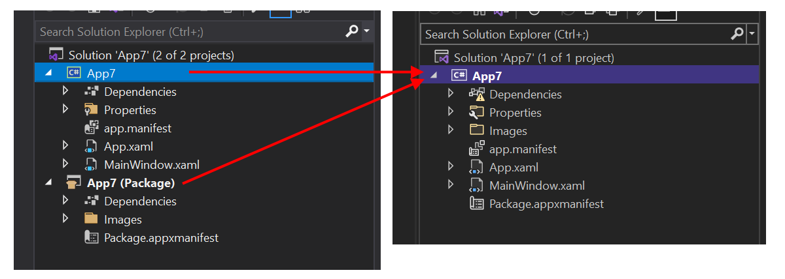
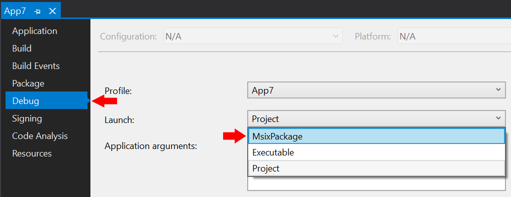
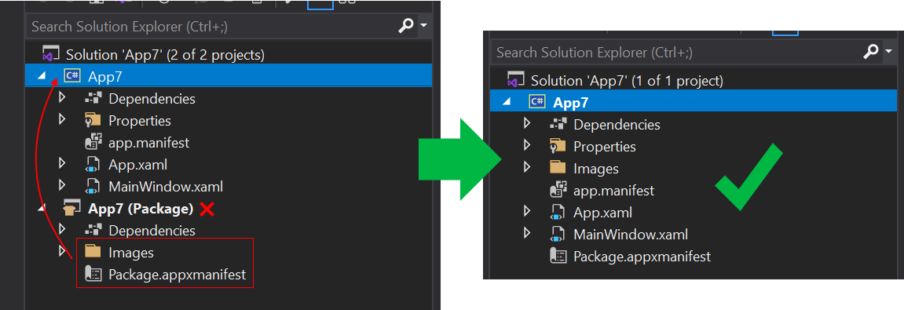
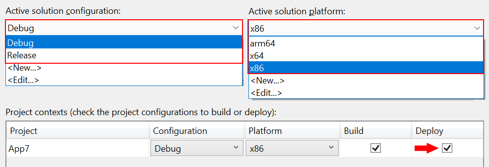

# Package your app using single-project MSIX

Single-project MSIX is a feature that lets you build a packaged WinUI 3 desktop app without the need for a separate packaging project. A WinUI 3 app is one that uses the [Windows UI Library (WinUI) 3](/windows/apps/winui/winui3/) framework for its user interface (UI); and it uses the Windows App SDK. To package a desktop app that's *not* a WinUI 3 app, see [Set up your desktop application for MSIX packaging in Visual Studio](/windows/msix/desktop/desktop-to-uwp-packaging-dot-net).

The single-project MSIX feature is available as a Visual Studio extension that you can use for these scenarios:

- Create a *new* WinUI 3 desktop app using the **Blank App, Packaged (WinUI 3 in Desktop)** Visual Studio project template that comes with the Windows App SDK. That project is configured to build your app into an MSIX package without needing a separate packaging project.
- Modify an *existing* WinUI 3 desktop app that uses a separate packaging project. The modification involves removing the separate packaging project, as shown in the illustration below.

[ ](images/single-project-overview.png#lightbox)

## Overview

This section introduces some important details about the single-project MSIX feature.

### Benefits

Before the introduction of the single-project MSIX feature, if you wanted to build a packaged WinUI 3 desktop app, then you needed two projects in your solution&mdash;your app project, plus an additional **Windows Application Packaging Project** (see [Set up your desktop application for MSIX packaging in Visual Studio](/windows/msix/desktop/desktop-to-uwp-packaging-dot-net)). The single-project MSIX feature enables you to develop and build your app using only a project for your app. That provides a cleaner project structure and a more straightforward development experience. For example, you no longer need to select the separate packaging project as your startup project.

### Supported project types

The single-project MSIX feature supports [WinUI 3 templates in Visual Studio](../winui/winui3/winui-project-templates-in-visual-studio.md) (C# and C++) for the Windows App SDK.

### Limitations

Single-project MSIX supports only a single executable in the generated MSIX package. If you need to combine multiple executables into a single MSIX package, then you'll need to continue using a Windows Application Packaging Project in your solution.

## Install the single-project MSIX packaging tools

The single-project MSIX packaging tools include Visual Studio project templates that you can use to create new packaged WinUI 3 desktop apps. Those tools are included with the Windows App SDK extension for Visual Studio. For installation instructions for the Windows App SDK, see [Install tools for the Windows App SDK](set-up-your-development-environment.md).

**Windows App SDK 0.8 and C# version of 1.0 Preview 3:** The single-project MSIX packaging tools are *not* included with the Windows App SDK extension for Visual Studio for Windows App SDK version 0.8, or for C# projects with up to and including Preview 3 of the Windows App SDK 1.0. So if you're using those versions, then you *might* need to explicitly install the single-project MSIX packaging tools. See the info below:

  - **Visual Studio 2022 version 17.1 and later:** The Single-project MSIX Packaging Tools for Visual Studio 2022 VSIX extension is built into Visual Studio 2022 version 17.1 and later.

  - **Visual Studio 2022 prior to version 17.1:** Install the [Single-project MSIX Packaging Tools for Visual Studio 2022 VSIX extension](https://marketplace.visualstudio.com/items?itemName=ProjectReunion.MicrosoftSingleProjectMSIXPackagingToolsDev17).

  - **Visual Studio 2019:** Install the [Single-project MSIX Packaging Tools for Visual Studio 2019 VSIX extension](https://marketplace.visualstudio.com/items?itemName=ProjectReunion.MicrosoftSingleProjectMSIXPackagingTools). The extension requires Visual Studio 2019 version 16.10.x or later.

You can then, in Visual Studio, confirm that you have the extension installed. Click **Extensions** > **Manage Extensions** > **Installed** > **All**, and confirm that *Single-project MSIX Packaging Tools* is listed.

## Create a new project

If you're using Windows App SDK 1.0 Preview 2 or later, then you can create a new WinUI 3-based app that includes single-project MSIX support simply by using the **Blank App, Packaged (WinUI 3 in Desktop)** template. For more information, see [Create your first WinUI 3 project](../winui/winui3/create-your-first-winui3-app.md).

## Modify an existing project

Follow the steps in this section to modify an existing WinUI 3-based app that uses a separate packaging project. The steps include moving the package manifest (and other support needed to build an MSIX package) into the application project, and then removing the separate packaging project.

### Step 1: Create or open an existing packaging project

If you already have a solution for a WinUI 3 desktop app (see [WinUI 3 templates in Visual Studio](../winui/winui3/winui-project-templates-in-visual-studio.md)) that includes a **Windows Application Packaging Project** (see [Set up your desktop application for MSIX packaging in Visual Studio](/windows/msix/desktop/desktop-to-uwp-packaging-dot-net)), then open that solution in Visual Studio now.

If not, then create a new WinUI 3 desktop app in Visual Studio by using the **Blank App, Packaged with Windows Application Packaging Project (WinUI 3 in Desktop)** template. Your solution will look similiar to the screenshot below.


### Step 2: Edit the application project settings

Next, edit some configuration settings to use the single-project MSIX feature. There are different instructions depending on your project type and Visual Studio version.

#### [C#](#tab/csharp)

1. In **Solution Explorer**, double-click the project node for your application to open the **.csproj** file in the XML editor. Add the following XML to the main **\<PropertyGroup\>** element.

    ```xml
    <EnableMsixTooling>true</EnableMsixTooling>
    <PublishProfile>Properties\PublishProfiles\win10-$(Platform).pubxml</PublishProfile>
    ```

    When you're done, the **\<PropertyGroup\>** element should look similar to this.

    ```xml
    <Project Sdk="Microsoft.NET.Sdk">
      <PropertyGroup>
        <OutputType>WinExe</OutputType>
        <TargetFramework>net6.0-windows10.0.19041.0</TargetFramework>
        ...
        <UseWinUI>true</UseWinUI>
        <EnableMsixTooling>true</EnableMsixTooling>
        <PublishProfile>Properties\PublishProfiles\win10-$(Platform).pubxml</PublishProfile>
      </PropertyGroup>
    ```

2. Save your changes, and close the **.csproj** file.

3. Perform one of the following procedures, depending on your version of Visual Studio.

    **For Visual Studio 2022 or later**:

    1. In **Solution Explorer**, right-click the **Properties** folder under the project node for your application, and select **Add** > **New Item...**.

    2. Select **Text File**, name the new file **launchSettings.json**, and click **Add**. Make sure the new file is in the **Properties** folder of your application project.

    3. Copy the following settings into the new file. You're free to change the values as needed for your scenario. The **MyApp** value can be any string; it doesn't need to match the name of your application.

        ```json
        {
            "profiles": {
                "MyApp": {
                    "commandName": "MsixPackage",
                    "commandLineArgs": "", /* Command line arguments to pass to the app. */
                    "alwaysReinstallApp": false, /* Uninstall and then reinstall the app. All information about the app state is deleted. */
                    "remoteDebugEnabled": false, /* Indicates that the debugger should attach to a process on a remote machine. */
                    "allowLocalNetworkLoopbackProperty": true, /* Allow the app to make network calls to the device it is installed on. */
                    "authenticationMode": "Windows", /* The authentication scheme to use when connecting to the remote machine. */
                    "doNotLaunchApp": false, /* Do not launch the app, but debug my code when it starts. */
                    "remoteDebugMachine": "", /* The name of the remote machine. */
                    "nativeDebugging": false /* Enable debugging for managed and native code together, also known as mixed-mode debugging. */
                }
            }
        }
        ```

    4. Save and close the **launchSettings.json** file.

    **For Visual Studio 2019**:

    1. In **Solution Explorer**, right-click the project node for your application, and select **Properties**.

    2. Select the **Debug** tab and set the **Launch** property to **MsixPackage**. You might have to select this twice if it reverts back on the first attempt.

        [ ](images/single-project-msixpackageoption.png#lightbox)

    3. Save your changes.

#### [C++](#tab/cpp)

1. In **Solution Explorer**, right-click the project node for your application, and select **Unload Project**.

2. Right-click the project node again, and select **Edit *project-name*.vcxproj** to open the **.vcxproj** file in the XML editor.

3. Make the following changes to the XML in the **.vcxproj** file:

    1. Add `<EnableMsixTooling>true</EnableMsixTooling>` to the main `<PropertyGroup>` element.
    2. Change the value of `<AppxPackage>` to `true`.

    When you're done, the contents of the **.vcxproj** file should look similar to this.

    ```xml
    <?xml version="1.0" encoding="utf-8"?>
    <Project ToolsVersion="15.0" DefaultTargets="Build" xmlns="http://schemas.microsoft.com/developer/msbuild/2003">
      <PropertyGroup Label="Globals">
        ...
        <MinimumVisualStudioVersion>16.0</MinimumVisualStudioVersion>
        <AppContainerApplication>false</AppContainerApplication>
        <AppxPackage>true</AppxPackage>
        <ApplicationType>Windows Store</ApplicationType>
        <ApplicationTypeRevision>10.0</ApplicationTypeRevision>
        <WindowsTargetPlatformVersion>10.0</WindowsTargetPlatformVersion>
        <WindowsTargetPlatformMinVersion>10.0.17763.0</WindowsTargetPlatformMinVersion>
        <UseWinUI>true</UseWinUI>
        <EnableMsixTooling>true</EnableMsixTooling>
      </PropertyGroup>
    ```

4. Save and close the **.vcxproj** file.

5. In **Solution Explorer**, right-click the project node and select **Reload Project**.

---

### Step 3: Move files to the application project

Next, move several important files to the application project. There are different instructions depending on your project type.

#### [C#](#tab/csharp)

1. In **File Explorer**, move the **Package.appxmanifest** file and the **Images** folder from your packaging project to your application project. Place this file and folder in the top level of the application project's folder hierarchy.
1. In Visual Studio, in **Solution Explorer**, multi-select all of the images inside the **Images** folder. In the **Properties** window, set **Build Action** to *Content*.
1. Remove the packaging project from your solution.

[ ](images/single-project-move-to-one.png#lightbox)

#### [C++](#tab/cpp)

1. In **File Explorer**, move the **Package.appxmanifest** file and the **Images** folder from your packaging project to your application project. Place this file and folder in the top level of the application project's folder hierarchy.
2. In Visual Studio, select the application project in **Solution Explorer** and click **Show all files**.
3. In **Solution Explorer**, select the **Package.appxmanifest** file and all files in the **Images** folder. Right-click the selected files and select **Include in Project**.
4. Remove the packaging project from your solution.

---

### Step 4: Enable deploying in Configuration Manager

1. Select **Build** > **Configuration Manager**.
2. In **Configuration Manager**, click the **Deploy** check box for every combination of configuration and platform (for example, **Debug** and **x86**, **Debug** and **arm64**, **Release** and **x64**, and more).
    > [!NOTE]
    > Be sure to use the **Active solution configuration** and **Active solution platform** drop-downs at the top instead of the **Configuration** and **Platform** drop-downs in the same row as the **Deploy** check box.

[ ](images/single-project-configmanager.png#lightbox)

### Step 5: Deploy your app

Build and deploy your application project. Visual Studio will build your application into an MSIX package, install the package, and then run your application.

### Step 6: Package your app for publishing
Use the [Package & Publish command in Visual Studio](/windows/msix/package/packaging-uwp-apps) to package your application to publish it to the Microsoft Store.

## Automate building and packaging your single-project MSIX app

You can use `msbuild` to build and package your single-project MSIX app, thereby allowing you to automate the workflow. The technique for a single-project solution, and the command-line, is only slightly different from what you might already be doing if you have a two-project solution&mdash;one that has a **Windows Application Packaging Project** (see [Set up your desktop application for MSIX packaging in Visual Studio](/windows/msix/desktop/desktop-to-uwp-packaging-dot-net)).

The important build command option for a single-project solution is `/p:GenerateAppxPackageOnBuild=true`. Without that option, the project will build, but you won't get an MSIX package. Include that option, and that will cause the MSIX package to be generated.

There's a full example in the form of [a GitHub Action that builds a WinUI 3 single-project solution](https://github.com/andrewleader/WindowsAppSDKGallery/blob/main/.github/workflows/dotnet-desktop.yml#L102).

> [!NOTE]
> Single-project MSIX doesn't currently support producing MSIX bundles (see [Bundling MSIX packages](/windows/msix/package/bundling-overview)). It produces only a single MSIX. But you can bundle `.msix` files into an MSIX bundle by using the [MSIX Bundler](https://github.com/marketplace/actions/msix-bundler) GitHub Action.

## How a packaged desktop app runs on Windows

For a deeper dive on what happens to files and registry entries when you create a Windows app package for your desktop application, see [Understanding how packaged desktop apps run on Windows](/windows/msix/desktop/desktop-to-uwp-behind-the-scenes).

## Provide feedback

To send us your feedback, report problems, or ask questions about the single-project MSIX feature, post a discussion or issue on the [Windows App SDK GitHub repository](https://github.com/microsoft/WindowsAppSDK).
