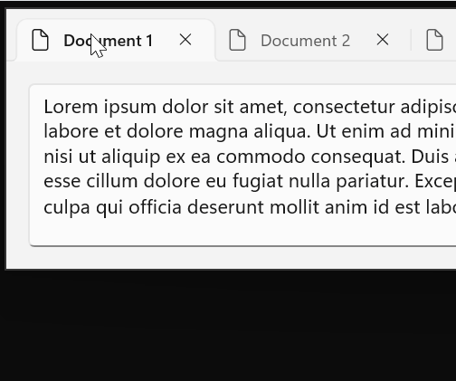

# Latest stable channel release notes for the Windows App SDK

The stable channel provides releases of the Windows App SDK that are supported for use by apps in production environments. Apps that use the stable release of the Windows App SDK can also be published to the Microsoft Store.

**Important links**:

- If you'd like to upgrade an existing app from an older version of the Windows App SDK to a newer version, see [Update existing projects to the latest release of the Windows App SDK](update-existing-projects-to-the-latest-release.md).

**Stable channel release note archive:**

- [Stable channel release notes for the Windows App SDK 1.5](release-notes-archive/stable-channel-1.5.md)
- [Stable channel release notes for the Windows App SDK 1.4](release-notes-archive/stable-channel-1.4.md)
- [Stable channel release notes for the Windows App SDK 1.3](release-notes-archive/stable-channel-1.3.md)
- [Stable channel release notes for the Windows App SDK 1.2](release-notes-archive/stable-channel-1.2.md)
- [Stable channel release notes for the Windows App SDK 1.1](release-notes-archive/stable-channel-1.1.md)
- [Stable channel release notes for the Windows App SDK 1.0](release-notes-archive/stable-channel-1.0.md)
- [Stable channel release notes for the Windows App SDK 0.8](release-notes-archive/stable-channel-0.8.md)
- [Stable channel release notes for the Windows App SDK 0.5](release-notes-archive/stable-channel-0.5.md)

## Downloads for the Windows App SDK

> [!NOTE]
> The Windows App SDK Visual Studio Extensions (VSIX) are no longer distributed as a separate download. They are available in the Visual Studio Marketplace inside Visual Studio.

### Version 1.6.1 (1.6.240923002)

This is a servicing release of the Windows App SDK that includes critical bug fixes for the 1.6 release.

- Fixed a crash when using FocusVisualKind.Reveal(). For more info, see GitHub issue [#9966](https://github.com/microsoft/microsoft-ui-xaml/issues/9966).
- Fixed noisy C++ exceptions from Bcp47Langs.dll. For more info, see GitHub issue [#4691](https://github.com/microsoft/WindowsAppSDK/issues/4691). Note that this fix removes the synchronization with `Windows.Globalization.ApplicationLanguages.PrimaryLanguageOverride`.
- Fixed an issue where an extra `Unloaded` event was raised immediately after showing a `ContentDialog`. For more info, see GitHub issue [#8402](https://github.com/microsoft/microsoft-ui-xaml/issues/8402).
- Fixed an issue where a CommandBar menu might have incorrectly opened up even when there was room for it to open down.
- Fixed some issues where input to `InputNonClientPointerSource` regions was not handled correctly when the top-level window was running in right-to-left mode.
- Fixed the compile-time check for the Windows SDK framework version to handle the slightly different framework name used for .NET 9.

## Version 1.6

The following sections describe new and updated features and known issues for version 1.6.

In an existing Windows App SDK 1.5 app, you can update your Nuget package to 1.6.240829007 (see the **Update a package** section in [Install and manage packages in Visual Studio using the NuGet Package Manager](/nuget/consume-packages/install-use-packages-visual-studio#update-a-package)).

For the updated runtime and MSIX, see [Downloads for the Windows App SDK](./downloads.md).

### Required project changes for 1.6

#### C++ project changes

When updating a C++ project to 1.6, you'll need to add a project reference to the `Microsoft.Web.WebView2` package. If you update via NuGet Package Manager in Visual Studio, this dependency will be added for you.

####  C# project changes

In 1.6, Windows App SDK managed apps require [Microsoft.Windows.SDK.NET.Ref](https://www.nuget.org/packages/Microsoft.Windows.SDK.NET.Ref) `*.*.*.38` or later, which can be specified via [WindowsSdkPackageVersion](/dotnet/core/compatibility/sdk/5.0/override-windows-sdk-package-version) in your `csproj` file. For example:

```XML
<Project Sdk="Microsoft.NET.Sdk">
   <PropertyGroup>
       <OutputType>WinExe</OutputType>
       <TargetFramework>net8.0-windows10.0.22621.0</TargetFramework>
       <TargetPlatformMinVersion>10.0.17763.0</TargetPlatformMinVersion>
       <WindowsSdkPackageVersion>10.0.22621.38</WindowsSdkPackageVersion>
   <PropertyGroup>
   ...
```

In addition, Windows App SDK managed apps should update to [Microsoft.Windows.CsWinRT](https://www.nuget.org/packages/Microsoft.Windows.CsWinRT) `2.1.1` (or later).

>[!NOTE]
> These manual references will no longer be needed once the next .NET SDK servicing update is released.

### Native AOT support


The .NET `PublishAot` project property is now supported for native Ahead-Of-Time compilation. For details on Native AOT, see [Native AOT Deployment](/dotnet/core/deploying/native-aot/?tabs=net8plus%2Cwindows). Because AOT builds on Trimming support, much of the following trimming-related guidance applies to AOT as well.

For `PublishAot` support and trimming support, in addition to the C# project changes described in the previous section you'll also need a package reference to [Microsoft.Windows.CsWinRT](https://www.nuget.org/packages/Microsoft.Windows.CsWinRT) `2.1.1` (or later) to enable the source generator from that package until the next .NET SDK servicing update is released when it will no longer be required. 

For more info, see the [CsWinRT Trimming / AOT support doc](https://github.com/microsoft/CsWinRT/blob/master/docs/aot-trimming.md) and the [CsWinRT 2.1.1 Release Notes](https://github.com/microsoft/CsWinRT/releases/tag/2.1.1.240807.2).

Because the Windows App SDK invokes publishing targets when F5 deploying, we recommend enabling `PublishAot` at NuGet restore time by adding this to your `csproj` file:

```XML
<PublishAot>true</PublishAot>
```

#### Resolving AOT Issues

In this release, the developer is responsible for ensuring that all types are properly rooted to avoid trimming (such as with reflection-based `{Binding}` targets). Later releases will enhance both C#/WinRT and the XAML Compiler to automate rooting where possible, alert developers to trimming risks, and provide mechanisms to resolve.

##### Partial Classes

C#/WinRT also includes `PublishAot` support in version 2.1.1. To enable a class for AOT publishing with C#/WinRT, it must first be marked `partial`. This allows the C#/WinRT AOT source analyzer to attribute the classes for static analysis. Only classes (which contain methods, the targets of trimming) require this attribute.

##### Unsafe Code Error

The CsWinRT source generator might generate code that makes use of `unsafe`. If you hit such an error during compilation or a diagnostic warning for it ([CS0227](/dotnet/csharp/misc/cs0227) for "Unsafe code may only appear if compiling with /unsafe"), you should set EnableUnsafeBlocks to true. For more info, see GitHub issue [CsWinRT #1721](https://github.com/microsoft/CsWinRT/issues/1721).

##### WebView2 not yet AOT compatible

The WebView2 projections in `Microsoft.Web.WebView2` package version 1.0.2651.64 are not yet AOT compatible. This will be fixed in an upcoming release of the `Microsoft.Web.WebView2` package, which you can then reference in your project.

##### Reflection-Free Techniques

To enable AOT compatibility, reflection-based techniques should be replaced with statically typed serialization, AppContext.BaseDirectory, typeof(), etc. For details, see [Introduction to trim warnings](/dotnet/core/deploying/trimming/fixing-warnings).

##### Rooting Types

Until full support for `{Binding}` is implemented, types may be preserved from trimming as follows:

Given project `P` consuming assembly `A` with type `T` in namespace `N`, which is only dynamically referenced (so normally trimmed), `T` can be preserved via:

`P.csproj`:

```xml
<ItemGroup>
    <TrimmerRootDescriptor Include="ILLink.Descriptors.xml" />
</ItemGroup>
```

`ILLink.Descriptors.xml`:

```xml
<?xml version="1.0" encoding="utf-8"?>
<linker>
    <assembly fullname="A">
        <type fullname="N.T" preserve="all" />
    </assembly>
</linker>
```

For complete root descriptor XML expression syntax, see [Root Descriptors](/dotnet/core/deploying/trimming/trimming-options?pivots=dotnet-8-0#root-descriptors).

> [!NOTE]
> Dependency packages that have not yet adopted AOT support may exhibit runtime issues.

### Decoupled WebView2 versioning

The Windows App SDK now consumes the Edge WebView2 SDK as a NuGet reference rather than embedding a hardcoded version of the Edge WebView2 SDK. The new model allows apps to choose a newer version of the `Microsoft.Web.WebView2` package instead of being limited to the version with which the Windows App SDK was built. The new model also allows apps to reference NuGet packages which also reference the Edge WebView2 SDK. For more info, see GitHub issue [#5689](https://github.com/microsoft/microsoft-ui-xaml/issues/5689).

### New Package Deployment APIs

The Package Management API has received several enhancements including Is\*ReadyOrNewerAvailable\*(), EnsureReadyOptions.RegisterNewerIfAvailable, Is\*Provisioned\*(), IsPackageRegistrationPending(), and several bug fixes. See [PackageManagement.md](https://github.com/microsoft/WindowsAppSDK/blob/main/specs/packagemanager/PackageManagement.md) and [Pull Request #4453](https://github.com/microsoft/WindowsAppSDK/pull/4453) for more details. 

### Improved TabView tab tear-out



`TabView` supports a new `CanTearOutTabs` mode which provides an enhanced experience for dragging tabs and dragging out to a new window. When this new option is enabled, tab dragging is very much like the tab drag experience in Edge and Chrome where a new window is immediately created during the drag, allowing the user to drag it to the edge of the screen to maximize or snap the window in one smooth motion. This implementation also doesn't use drag-and-drop APIs, so it isn't impacted by any limitations in those APIs. Notably, tab tear-out is supported in processes running elevated as Administrator.

### Other notable changes

- Added a new `ColorHelper.ToDisplayName()` API, filling that gap from UWP.
- Added a new `Microsoft.Windows.Globalization.ApplicationLanguages` class, which notably includes a new `PrimaryLanguageOverride` feature. For more info, see GitHub issue [#4523](https://github.com/microsoft/WindowsAppSDK/pull/4523).
- Unsealed `ItemsWrapGrid`. This should be a backward-compatible change.
- `PipsPager` supports a new mode where it can wrap between the first and last items.


- `RatingControl` is now more customizable, by moving some hard-coded style properties to theme resources. This allows apps to override these values to better customize the appearance of RatingControl.


- WinUI 3 has changed to the typographic model for font selection rather than the legacy weight/stretch/style model. The typographic model is required for some newer fonts, including Segoe UI Variable, and enables enhanced font capabilities. Some older fonts which rely on the weight/stretch/style model for selection may not be found with the typographic model.

### Known Issues

- If the debugger is set to break on all C++ exceptions, it will break on some noisy exceptions on start-up in the BCP47 (Windows Globalization) code. For more info, see GitHub issue [#4691](https://github.com/microsoft/WindowsAppSDK/issues/4691).
- Component library packages which reference the WinAppSDK 1.6 package will not correctly get the referenced WebView2 package contents. For more info, see [WebView2Feedback #4743](https://github.com/MicrosoftEdge/WebView2Feedback/issues/4743). A workaround is to add a direct reference to the `Microsoft.Web.WebView2` package where needed.
- Apps compiled with Native AOT might sometimes experience a hanging issue after page navigation due to a race condition in the .NET runtime's GC thread. For more info, see [.NET issue #104582](https://github.com/dotnet/runtime/issues/104582).
- The initial release of 1.6.0 introduced an issue with one of our dependencies that we expect will be resolved in an upcoming release of the .NET SDK. If you experience an error with the version of your Microsoft.Windows.SDK.NET reference, you’ll need to explicitly reference the version of the .NET SDK that is specified by your error message. For example, if the error says you need version 10.0.19041.38, add the following to your `.csproj` file:
    - `<WindowsSdkPackageVersion>10.0.19041.38</WindowsSdkPackageVersion>`.

### Bug Fixes

- Fixed a crash when setting `InfoBar.IsOpen` in .xaml. For more info, see GitHub issue [#8391](https://github.com/microsoft/microsoft-ui-xaml/issues/8391).
- Fixed an issue where HTML elements would lose pointer capture when the mouse moved outside of the `WebView2` bounds. For more info, see GitHub issue [#8677](https://github.com/microsoft/microsoft-ui-xaml/issues/8677).
- Fixed an issue where drag and drop into a flyout with `ShouldConstrainToRootBounds=false` did not work. For more info, see GitHub issue [#9276](https://github.com/microsoft/microsoft-ui-xaml/issues/9276).
- Fixed an issue where `ms-appx://` references did not work when `PublishSingleFile` is enabled. For more info, see GitHub issue [#9468](https://github.com/microsoft/microsoft-ui-xaml/issues/9468).
- Fixed an issue where debugger symbols weren't working correctly for some binaries. For more info, see GitHub issue [#4633](https://github.com/microsoft/windowsappsdk/issues/4633).
- Fixed a potential crash when subclassing `NavigationView`.
- Fixed an issue where table borders in a `RichEditBox` would not correctly erase when scrolling or reducing the size of the table.
- Fixed an issue where flyouts from `MediaTransportControls` had a fully transparent background.
- Fixed an issue where dragging into a WebView2 would fail or drop in the wrong location on display scale factors other than 100% or when system text scaling is enabled.
- Fixed an issue where `TextBox`/`RichEditBox` would not announce to Accessibility tools when input is blocked due to being at the `MaxLength` limit.
- Fixed a few issues around handling of custom titlebar scenarios. For more info, see GitHub issues [#7629](https://github.com/microsoft/microsoft-ui-xaml/issues/7629), [#9670](https://github.com/microsoft/microsoft-ui-xaml/issues/9670), [#9709](https://github.com/microsoft/microsoft-ui-xaml/issues/9709) and [#8431](https://github.com/microsoft/microsoft-ui-xaml/issues/8431).
- Fixed an issue where `InfoBadge` icon was not visible. For more info, see GitHub issue [#8176](https://github.com/microsoft/microsoft-ui-xaml/issues/8176).
- Fixed an issue with icons sometimes showing in the wrong position in `CommandBarFlyout`. For more info, see GitHub issue [#9409](https://github.com/microsoft/microsoft-ui-xaml/issues/9409).
- Fixed an issue with keyboard focus in menus when opening or closing a sub menu. For more info, see GitHub issue [#9519](https://github.com/microsoft/microsoft-ui-xaml/issues/9519).
- Fixed an issue with `TreeView` using the incorrect `IsExpanded` state when recycling items. For more info, see GitHub issue [#9549](https://github.com/microsoft/microsoft-ui-xaml/issues/9549).
- Fixed an issue when using an ElementName binding in an `ItemsRepeater.ItemTemplate`. For more info, see GitHub issue [#9715](https://github.com/microsoft/microsoft-ui-xaml/issues/9715).
- Fixed an issue with the first item in an `ItemsRepeater` sometimes having an incorrect position. For more info, see GitHub issue [#9743](https://github.com/microsoft/microsoft-ui-xaml/issues/9743).
- Fixed an issue with `InputNonClientPointerSource` sometimes breaking input to the min/max/close buttons. For more info, see GitHub issue [#9749](https://github.com/microsoft/microsoft-ui-xaml/issues/9749).
- Fixed a compile error when using Microsoft.UI.Interop.h with clang-cl. For more info, see GitHub issue [#9771](https://github.com/microsoft/microsoft-ui-xaml/issues/9771).
- Fixed an issue where the `CharacterReceived` event was not working in `ComboBox`/`TextBox`. For more info, see GitHub issue [#9786](https://github.com/microsoft/microsoft-ui-xaml/issues/9786).
- Fixed an issue where duplicate `KeyUp` events were raised for arrow and tab keys. For more info, see GitHub issue [#9399](https://github.com/microsoft/microsoft-ui-xaml/issues/9399).
- Fixed an issue where the `PowerManager.SystemSuspendStatusChanged` event was unusable to get the `SystemSuspendStatus`. For more info, see GitHub issue [#2833](https://github.com/microsoft/WindowsAppSDK/issues/2833).
- Fixed an issue where initial keyboard focus was not correctly given to a `WebView2` when that was the only control in the window.
- Fixed an issue when using `ExtendsContentIntoTitleBar=true` where the Min/Max/Close buttons did not correctly appear in the UI Automation, which prevented Voice Access from showing numbers for those buttons.
- Fixed an issue where an app might crash in a lock check due to unexpected reentrancy.
- Fixed an issue where `Hyperlink` colors did not correctly update when switching into a high contrast theme.
- Fixed an issue where changing the collection of a `ListView` in a background window may incorrectly move that window to the foreground and take focus.
- Fixed an issue where calling `ItemsRepeater.StartBringIntoView` could sometimes cause items to disappear.
- Fixed an issue where touching and dragging on a `Button` in a `ScrollViewer` would leave it in a pressed state.
- Updated IntelliSense, which was missing information for many newer types and members.
- Fixed an issue where clicking in an empty area of a `ScrollViewer` would always move focus to the first focusable control in the `ScrollViewer` and scroll that control into view. For more info, see GitHub issue [#597](https://github.com/microsoft/microsoft-ui-xaml/issues/597).
- Fixed an issue where the `Window.Activated` event sometimes fired multiple times. For more info, see GitHub issue [#7343](https://github.com/microsoft/microsoft-ui-xaml/issues/7343).
- Fixed an issue where setting the `NavigationViewItem.IsSelected` property to `true` prevented its children from showing when expanded. For more info, see GitHub issue [#7930](https://github.com/microsoft/microsoft-ui-xaml/issues/7930).
- Fixed an issue where `MediaPlayerElement` would not properly display captions with `None` or `DropShadow` edge effects. For more info, see GitHub issue [#7981](https://github.com/microsoft/microsoft-ui-xaml/issues/7981).
- Fixed an issue where the `Flyout.ShowMode` property was not used when showing the flyout. For more info, see GitHub issue [#7987](https://github.com/microsoft/microsoft-ui-xaml/issues/7987).
- Fixed an issue where `NumberBox` would sometimes have rounding errors. For more info, see GitHub issue [#8780](https://github.com/microsoft/microsoft-ui-xaml/issues/8780).
- Fixed an issue where using a library compiled against an older version of WinAppSDK could hit an error trying to find a type or property. 
For more info, see GitHub issue [#8810](https://github.com/microsoft/microsoft-ui-xaml/issues/8810).
- Fixed an issue where initial keyboard focus was not set when launching a window. For more info, see GitHub issue [#8816](https://github.com/microsoft/microsoft-ui-xaml/issues/8816).
- Fixed an issue where `FlyoutShowMode.TransientWithDismissOnPointerMoveAway` didn't work after the first time it was shown. 
For more info, see GitHub issue [#8896](https://github.com/microsoft/microsoft-ui-xaml/issues/8896).
- Fixed an issue where some controls did not correctly template bind `Foreground` and `Background` properties. For more info, see GitHub issue [#7070](https://github.com/microsoft/microsoft-ui-xaml/issues/7070), [#9020](https://github.com/microsoft/microsoft-ui-xaml/issues/9020), [#9029](https://github.com/microsoft/microsoft-ui-xaml/issues/9029), [#9083](https://github.com/microsoft/microsoft-ui-xaml/issues/9083) and [#9102](https://github.com/microsoft/microsoft-ui-xaml/issues/9102).
- Fixed an issue where `ThemeResource`s used in `VisualStateManager` setters wouldn't update on theme change. This commonly affected controls in flyouts. For more info, see GitHub issue [#9198](https://github.com/microsoft/microsoft-ui-xaml/issues/9198).
- Fixed an issue where `WebView` would lose key focus, resulting in extra blur/focus events and other issues. 
For more info, see GitHub issue [#9288](https://github.com/microsoft/microsoft-ui-xaml/issues/9288).
- Fixed an issue where `NavigationView` could show a binding error in debug output. For more info, see GitHub issue [#9384](https://github.com/microsoft/microsoft-ui-xaml/issues/9384).
- Fixed an issue where SVG files defining a negative viewbox no longer rendered. For more info, see GitHub issue [#9415](https://github.com/microsoft/microsoft-ui-xaml/issues/9415).
- Fixed an issue where changing `ItemsView.Layout` orientation caused an item to be removed. For more info, see GitHub issue [#9422](https://github.com/microsoft/microsoft-ui-xaml/issues/9422).
- Fixed an issue where scrolling a `ScrollView` generated a lot of debug output. For more info, see GitHub issue [#9434](https://github.com/microsoft/microsoft-ui-xaml/issues/9434).
- Fixed an issue where `MapContorl.InteractiveControlsVisible` did not work properly. For more info, see GitHub issue [#9486](https://github.com/microsoft/microsoft-ui-xaml/issues/9486).
- Fixed an issue where `MapControl.MapElementClick` event didn't properly fire. For more info, see GitHub issue [#9487](https://github.com/microsoft/microsoft-ui-xaml/issues/9487).
- Fixed an issue where x:Bind didn't check for null before using a weak reference, which could result in a crash. For more info, see GitHub issue [#9551](https://github.com/microsoft/microsoft-ui-xaml/issues/9551).
- Fixed an issue where changing the `TeachingTip.Target` property didn't correctly update its position. For more info, see GitHub issue [#9553](https://github.com/microsoft/microsoft-ui-xaml/issues/9553).
- Fixed an issue where dropdowns did not respond in WebView2. For more info, see GitHub issue [#9566](https://github.com/microsoft/microsoft-ui-xaml/issues/9566).
- Fixed a memory leak when using `GeometryGroup`. For more info, see GitHub issue [#9578](https://github.com/microsoft/microsoft-ui-xaml/issues/9578).
- Fixed an issue where scrolling through a very large number of items from an `ItemRepeater` in a `ScrollView` could cause blank render frames. For more info, see GitHub issue [#9643](https://github.com/microsoft/microsoft-ui-xaml/issues/9643).
- Fixed an issue where `SceneVisual` wasn't working.

### New APIs in 1.6.0

Version 1.6.0 includes the following new APIs compared to the stable 1.5 release:

```C#
Microsoft.UI

    ColorHelper
        ToDisplayName
```

```C#
Microsoft.UI.Input

    EnteredMoveSizeEventArgs
    EnteringMoveSizeEventArgs
    ExitedMoveSizeEventArgs
    InputNonClientPointerSource
        EnteredMoveSize
        EnteringMoveSize
        ExitedMoveSize
        WindowRectChanged
        WindowRectChanging

    MoveSizeOperation
    WindowRectChangedEventArgs
    WindowRectChangingEventArgs
```

```C#
Microsoft.UI.Xaml

    XamlRoot
        CoordinateConverter
```

```C#
Microsoft.UI.Xaml.Automation.Peers

    ScrollPresenterAutomationPeer
```

```C#
Microsoft.UI.Xaml.Controls

    PipsPager
        WrapMode
        WrapModeProperty

    PipsPagerWrapMode
    TabView
        CanTearOutTabs
        CanTearOutTabsProperty
        ExternalTornOutTabsDropped
        ExternalTornOutTabsDropping
        TabTearOutRequested
        TabTearOutWindowRequested

    TabViewExternalTornOutTabsDroppedEventArgs
    TabViewExternalTornOutTabsDroppingEventArgs
    TabViewTabTearOutRequestedEventArgs
    TabViewTabTearOutWindowRequestedEventArgs
```

```C#
Microsoft.Windows.Globalization

    ApplicationLanguages
```

```C#
Microsoft.Windows.Management.Deployment

    EnsureReadyOptions
        RegisterNewerIfAvailable

    PackageDeploymentFeature
    PackageDeploymentManager
        IsPackageDeploymentFeatureSupported
        IsPackageProvisioned
        IsPackageProvisionedByUri
        IsPackageReadyOrNewerAvailable
        IsPackageReadyOrNewerAvailableByUri
        IsPackageSetProvisioned
        IsPackageSetReadyOrNewerAvailable

    PackageReadyOrNewerAvailableStatus
```

```C#
Microsoft.Windows.Storage

    ApplicationData
    ApplicationDataContainer
    ApplicationDataContract
    ApplicationDataCreateDisposition
    ApplicationDataLocality
```

## Related topics

- [Preview channel](preview-channel.md)
- [Experimental channel](experimental-channel.md)
- [Install tools for the Windows App SDK](set-up-your-development-environment.md)
- [Create your first WinUI 3 project](../winui/winui3/create-your-first-winui3-app.md)
- [Use the Windows App SDK in an existing project](use-windows-app-sdk-in-existing-project.md)
- [Deploy apps that use the Windows App SDK](../package-and-deploy/index.md#use-the-windows-app-sdk)
