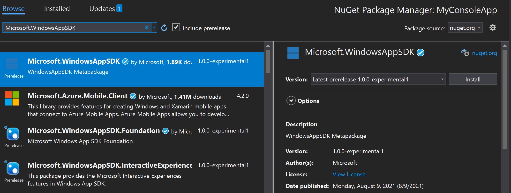

# Use the Windows App SDK in an existing project

If you have a desktop project in which you want to use the Windows App SDK, then you can install the Windows App SDK NuGet package in your project (the latest version, or any version that you need). Unpackaged apps (that is, apps that don't use MSIX for their deployment technology) *must* follow this procedure if they're to use the Windows App SDK. But packaged apps *can* do it, too.

[!INCLUDE [UWP migration guidance](./includes/uwp-app-sdk-migration-pointer.md)]

> [!NOTE]
> This procedure is supported in C# .NET 6 (and later) projects and C++ desktop projects. Those project types can use NuGet packages from either the [stable release channel](stable-channel.md), the [preview release channel](preview-channel.md), or the [experimental release channel](experimental-channel.md).

## Prerequisites

* Visual Studio 2019 or later.
* The workloads and components for Windows app development. For more info, see [Install tools for the Windows App SDK](set-up-your-development-environment.md).

## Instructions

1. Open an existing project in Visual Studio.

    > [!NOTE]
    > If you have a C# desktop project, then make sure that the **TargetFramework** element in the project file is set to a Windows 10-specific moniker (such as **net6.0-windows10.0.19041.0**) so that you can call Windows Runtime APIs. For more info, see [Call Windows Runtime APIs in desktop apps](../../apps/desktop/modernize/desktop-to-uwp-enhance.md#net-6-and-later-use-the-target-framework-moniker-option). Additionally, you must be targeting **18362** or later, since there's a known issue blocking apps that target **17763** (see [Build errors when using TFM of 17763](https://github.com/microsoft/WindowsAppSDK/issues/921) on GitHub).

2. Make sure that [package references](/nuget/consume-packages/package-references-in-project-files) are enabled:

    1. In Visual Studio, click **Tools** > **NuGet Package Manager** > **Package Manager Settings**.
    2. Make sure that **PackageReference** is selected for **Default package management format**.

3. Right-click your project in **Solution Explorer**, and choose **Manage NuGet Packages**.

4. In the **NuGet Package Manager** window, select the **Include prerelease** check box near the top of the window, select the **Browse** tab, and search for one of the following packages:

    - To install one of the [1.0 or later releases](downloads.md), search for the **Microsoft.WindowsAppSDK** package.
    - To install one of the [0.8 releases](downloads.md), search for the **Microsoft.ProjectReunion** package.

5. After you've found the appropriate Windows App SDK NuGet package, select the package, and click **Install** in the right-hand pane of the **NuGet Package Manager** window.

    

    > [!NOTE]
    > The Windows App SDK NuGet package contains other sub-packages (including **Microsoft.WindowsAppSDK.Foundation**, **Microsoft.WindowsAppSDK.WinUI**, and others) that contain the implementations for specific components in the Windows App SDK. You can't install these sub-packages individually in order to reference only certain components in your project. You must install the main Windows App SDK NuGet package, which includes all of the components.

6. **For unpackaged apps only**. Before your unpackaged app can use Windows App SDK APIs and components, your app must first load the Windows App SDK runtime to reference the Windows App SDK framework package. For more info, see [Use the Windows App SDK runtime for apps packaged with external location or unpackaged](use-windows-app-sdk-run-time.md) and [Tutorial: Use the bootstrapper API in an app packaged with external location or unpackaged that uses the Windows App SDK](tutorial-unpackaged-deployment.md).

7. Your app can now use Windows App SDK APIs and components that are available in the release channel that you installed. For the list of available features, see [release channels](release-channels.md).

## Further info

If your existing project is a C++ project, and you want to call Windows Runtime APIs in the Windows App SDK, then you'll need to add support for C++/WinRT. See [Visual Studio support for C++/WinRT, XAML, the VSIX extension, and the NuGet package](/windows/uwp/cpp-and-winrt-apis/intro-to-using-cpp-with-winrt#visual-studio-support-for-cwinrt-xaml-the-vsix-extension-and-the-nuget-package). Look for info there about the **Microsoft.Windows.CppWinRT NuGet** package. Without that package, your project won't be able to find the namespace header files for Windows Runtime APIs in the Windows App SDK.

If you encounter a *Class not registered* error when you try to use a Windows App SDK component, then you might have to add to your project a dynamic dependency on the Windows App SDK Framework package. For more info, see [MSIX framework packages and dynamic dependencies](../desktop/modernize/framework-packages/framework-packages-overview.md).

## See Also

- [Windows App SDK](index.md)
- [Release channels and release notes](release-channels.md)
- [Install tools for the Windows App SDK](set-up-your-development-environment.md)
- [Deploy apps that use the Windows App SDK](../package-and-deploy/index.md#use-the-windows-app-sdk)
- [Windows App SDK and supported Windows releases](support.md)
