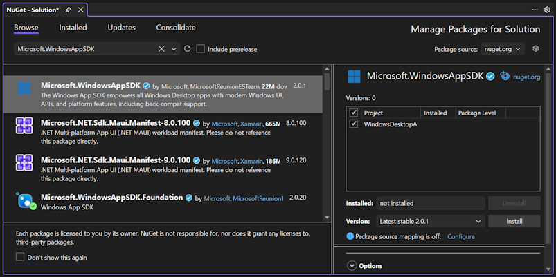

# Use the Windows App SDK in an existing project

If you have a WPF, WinForms, or Win32 desktop project in which you want to use features of the Windows App SDK, then you can install the Windows App SDK NuGet package in your project.

## Prerequisites

Before you install and use the Windows App SDK NuGet package in your app, be sure these requirements are met:

- Visual Studio is installed and configured for Windows app development.
  
  > [!div class="nextstepaction"]
  > [Set up your development environment](../get-started/start-here.md#set-up-your-development-environment).

- Your WPF, WinForms, or Win32 project is configured to call WinRT APIs.

  > [!div class="nextstepaction"]
  > [Call Windows Runtime APIs in desktop apps](../desktop/modernize/winrt-apis-desktop-apps.md).

## Instructions

1. Open an existing WPF, WinForms, or Win32 project in Visual Studio. Ensure that it's configured to [Call Windows Runtime APIs](../desktop/modernize/winrt-apis-desktop-apps.md).

1. In Visual Studio, open the **NuGet Package Manager**:

    1. Click **Tools > NuGet Package Manager > Manage NuGet Packages for Solution...**.
    <br/>– OR –
    1. Right-click your project in **Solution Explorer**, and choose **Manage NuGet Packages for Solution...**.

1. In the **NuGet Package Manager** window select the **Browse** tab and search for the following package:

    - **Microsoft.WindowsAppSDK**.

1. After you've found the appropriate Windows App SDK NuGet package, select the package, check the box in the right-hand pane of the **NuGet Package Manager** window next to the project where you want to install the package, then click **Install**.

    [ ](images/reunion-nuget-install.png#lightbox)

    > [!NOTE]
    > The Windows App SDK NuGet package contains other sub-packages (including **Microsoft.WindowsAppSDK.Foundation**, **Microsoft.WindowsAppSDK.WinUI**, and others) that contain the implementations for specific components in the Windows App SDK. In general, we recommend that you install the main Windows App SDK NuGet package, which includes all of the components. In some cases, you can install a sub-package individually in order to reference only certain components in your project. For example, see [Install and deploy Windows ML](/windows/ai/new-windows-ml/distributing-your-app).

### Additional steps for unpackaged apps

If your app is unpackaged (which desktop apps are by default), then there are some additional steps needed to use the Windows App SDK.

For more info about the terms *packaged* and *unpackaged*, see [Packaging overview](/windows/apps/package-and-deploy/packaging/).


#### 1. Install the Windows App SDK Runtime

The Windows App SDK Runtime needs to be installed on any machine where the app will run.

For your development machine, we recommend that you visit [Latest Windows App SDK downloads](/windows/apps/windows-app-sdk/downloads), then download, unzip, and run either:

-	The latest stable release under **Runtime downloads**.
-	A version and release channel of the runtime that matches the version and release channel of the **Microsoft.WindowsAppSDK** NuGet package that you installed.

Choose the appropriate Installer option for your machine’s architecture.

> [!IMPORTANT]
> When your app is deployed, you will be responsible for deploying required Windows App SDK runtime packages to your end users. For more information, see [Windows App SDK deployment guide for framework-dependent apps packaged with external location or unpackaged](deploy-unpackaged-apps.md#prerequisites). 

#### 2. Initialize the Windows App SDK Runtime

By default, a WPF, WinForms, or Win32 desktop app is unpackaged. An unpackaged app must initialize the Windows App SDK runtime before using any other feature of the Windows App SDK. 

You can do that automatically when your app starts via *auto-initialization*.

:::zone pivot="dotnet"

1. In **Solution Explorer**, right-click your project, and choose **Edit Project File**.

2. Inside the `PropertyGroup` element, add a `WindowsPackageType` element set to `None`. 

```xml
<WindowsPackageType>None</WindowsPackageType>
```
When you build your project, these files are added to your project in Visual Studio:
-	MddBootstrapAutoInitializer.cs
-	WindowsAppSDK-VersionInfo.cs

:::zone-end

:::zone pivot="win32"

1. Manually edit your .cxproj file.

2. Inside the `<PropertyGroup Label="Globals">` element, add a `WindowsPackageType` element set to `None`. 

```xml
<WindowsPackageType>None</WindowsPackageType>
```

:::zone-end

> [!NOTE]
> If you have advanced needs (such as custom error handling, or to load a specific version of the Windows App SDK), then instead of *auto-initialization* you can call the bootstrapper API explicitly&mdash;for more info, see [Use the Windows App SDK runtime for apps packaged with external location or unpackaged](/windows/apps/windows-app-sdk/use-windows-app-sdk-run-time) and [Tutorial: Use the bootstrapper API in an app packaged with external location or unpackaged that uses the Windows App SDK](tutorial-unpackaged-deployment.md).

## Further info

If you encounter a *Class not registered* error when you try to use a Windows App SDK component, then you might have to add to your project a dynamic dependency on the Windows App SDK Framework package. For more info, see [MSIX framework packages and dynamic dependencies](../desktop/modernize/framework-packages/framework-packages-overview.md).

## See Also

- [Windows App SDK](index.md)
- [Release channels and release notes](release-channels.md)
- [Install tools for the Windows App SDK](set-up-your-development-environment.md)
- [Deploy apps that use the Windows App SDK](../package-and-deploy/index.md)
- [Windows App SDK and supported Windows releases](support.md)
