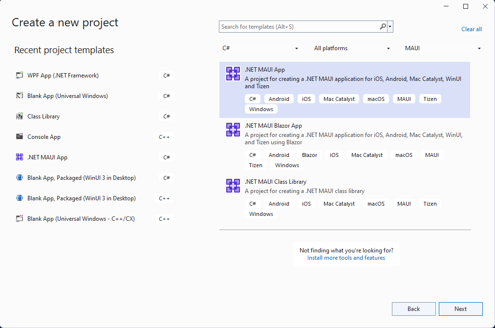
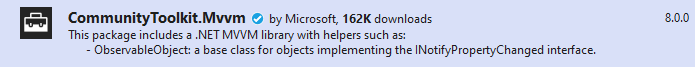
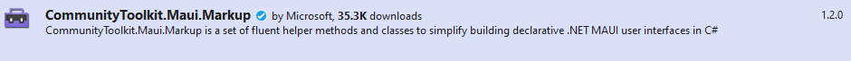
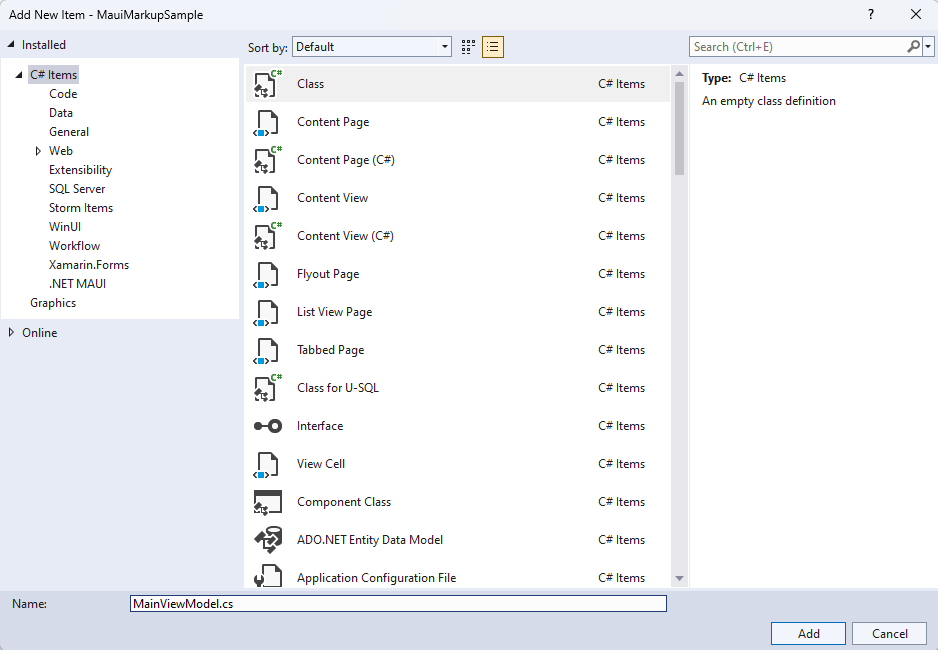
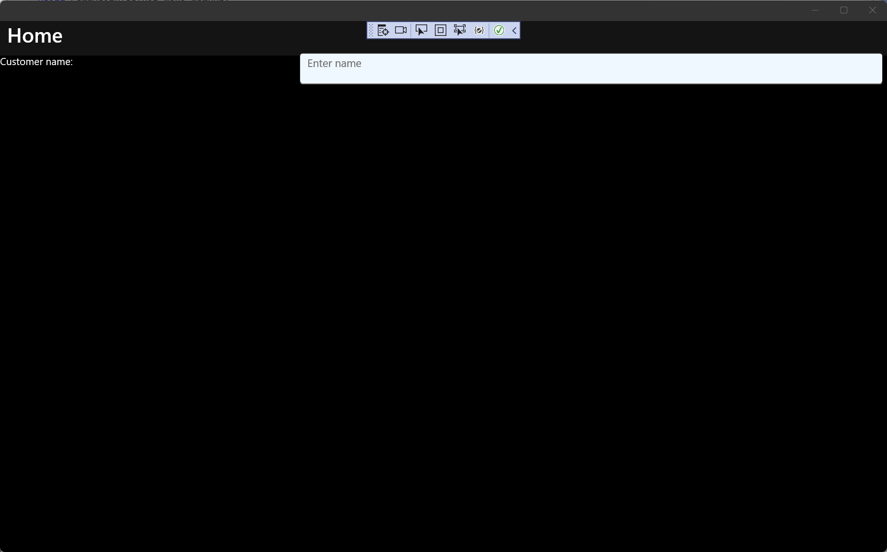

# Tutorial: Create a .NET MAUI app with C# Markup and the Community Toolkit

Build a **.NET MAUI** app with a user interface created without XAML by using **C# Markup** from the [.NET MAUI Community Toolkit](/dotnet/communitytoolkit/maui/).

## Introduction

The **.NET MAUI Community Toolkit** is a set of extensions, behaviors, animations, and other helpers. One of the features, [C# Markup](/dotnet/communitytoolkit/maui/markup/markup), provides the ability to create a user interface entirely in C# code. In this tutorial, you'll learn how to create a .NET MAUI app for Windows that uses C# Markup to create the user interface.

## Setting up the environment

If you haven't already set up your environment for .NET MAUI development, please follow the steps to [Get started with .NET MAUI on Windows](index.md#get-started-with-net-maui-on-windows).

## Creating the .NET MAUI project

> [!NOTE]
> If you are already familiar with setting up a .NET MAUI project, you can skip to the next section.

Launch Visual Studio, and in the start window click **Create a new project** to create a new project.

In the **Create a new project** window, select **MAUI** in the All project types drop-down, select the **.NET MAUI App** template, and click the **Next** button:



Next, on the **Configure your new project** screen, give your project a name, choose a location for it, and click the **Next** button.

On the final screen, **Additional information**, click the **Create** button.

Wait for the project to be created, and for its dependencies to be restored.

In the Visual Studio toolbar, press the **Windows Machine** button to build and run the app. Click the **Click me** button and verify that the button content updates with the number of clicks.

Now that you have verified that the .NET MAUI app on Windows is working as expected, we can integrate the MVVM Toolkit and C# Markup packages. In the next section, you'll add these packages to your new project.

## Add C# Markup from the .NET MAUI Community Toolkit

Now that you have your .NET MAUI app running on Windows, let's add a couple of NuGet packages to the project to integrate with the [MVVM Toolkit](/dotnet/communitytoolkit/mvvm/) and **C# Markup** from the **.NET MAUI Community Toolkit**.

Right-click the project in **Solution Explorer** and select **Manage NuGet Packages...** from the context menu.

In the **NuGet Package Manager** window, select the **Browse** tab and search for **CommunityToolkit.MVVM**:



Add the latest stable version of the **CommunityToolkit.MVVM** package to the project by clicking **Install**.

Next, search for CommunityToolkit.Maui:



Add the latest stable version of the **CommunityToolkit.Maui.Markup** package to the project by clicking **Install**.

Close the **NuGet Package Manager** window after the new packages have finished installing.

## Add a ViewModel to the project

We are going to add a simple **Model-View-ViewModel (MVVM)** implementation with the MVVM Toolkit. Let's start by creating a viewmodel to pair with our view (**MainPage**). Right-click the project again and select **Add | Class** from the context menu.

In the **Add New Item** window that appears, name the class **MainViewModel** and click **Add**:



We are going to leverage the power of the MVVM Toolkit in `MainViewModel`. Replace the contents of the class with the following code:

```csharp
using CommunityToolkit.Mvvm.ComponentModel;
using System.ComponentModel;
using System.Diagnostics;

namespace MauiMarkupSample
{
    [INotifyPropertyChanged]
    public partial class MainViewModel
    {
        [ObservableProperty]
        private string name;
        partial void OnNameChanging(string value)
        {
            Debug.WriteLine($"Name is about to change to {value}");
        }
        partial void OnNameChanged(string value)
        {
            Debug.WriteLine($"Name has changed to {value}");
        }
    }
}
```

If you have completed the [Build your first .NET MAUI app for Windows](walkthrough-first-app.md) tutorial, you will understand what the code above does. The `MainViewModel` class is decorated with the `INotifyPropertyChanged` attribute, which allows the MVVM Toolkit to generate the `INotifyPropertyChanged` implementation for the class. Marking `MainViewModel` as a `partial class` is required for the .NET source generator to work. The `ObservableProperty` attribute on the `name` private field will add a `Name` property for the class with the proper `INotifyPropertyChanged` implementation in the generated partial class. Adding the `OnNameChanging` and `OnNameChanged` partial methods is optional, but allows you to add custom logic when the `Name` property is changing or has changed.

## Build a UI with C# Markup

When building a UI with C# Markup, the first step is to update the `CreateMauiApp()` method in **MauiProgram.cs**. Replace the contents of the method with the following code:

```csharp
public static MauiApp CreateMauiApp()
{
    var builder = MauiApp.CreateBuilder();

    builder
        .UseMauiApp<App>()
        .UseMauiCommunityToolkitMarkup();

    return builder.Build();
}
```

You also need to add a new `using` statement to the top of the file: `using CommunityToolkit.Maui.Markup;`. The call to `UseMauiCommunityToolkitMarkup()` will add the C# Markup support to the app, allowing you to construct your UI with C# code instead of XAML.

The **MainPage.xaml** file will no longer be used when rendering the UI, so you can remove the contents of the `ContentPage`.

```xaml
<?xml version="1.0" encoding="utf-8" ?>
<ContentPage xmlns="http://schemas.microsoft.com/dotnet/2021/maui"
             xmlns:x="http://schemas.microsoft.com/winfx/2009/xaml"
             x:Class="MauiMarkupSample.MainPage">
</ContentPage>
```

In **MainPage.xaml.cs**, remove the click event handler and add three private members to the class:

```csharp
private readonly MainViewModel ViewModel = new();
private enum Row { TextEntry }
private enum Column { Description, Input }
```

The `ViewModel` property will create an instance of the `MainViewModel` class to be used when data binding the UI. The `Row` and `Column` enums will be used to define the layout of the UI with C# Markup. It's a simple UI with a single row and two columns which we'll be defining in the next step.

Because the UI elements are going to be defined in the C# code, the `InitializeComponent()` method will not be needed. Remove the call and replace it with the following code to create the UI:

```csharp
public MainPage()
{
    Content = new Grid
    {
        RowDefinitions = Rows.Define(
            (Row.TextEntry, 36)),

        ColumnDefinitions = Columns.Define(
            (Column.Description, Star),
            (Column.Input, Stars(2))),

        Children =
        {
            new Label()
                .Text("Customer name:")
                .Row(Row.TextEntry).Column(Column.Description),

            new Entry
            {
                Keyboard = Keyboard.Numeric,
                BackgroundColor = Colors.AliceBlue,
            }.Row(Row.TextEntry).Column(Column.Input)
                .FontSize(15)
                .Placeholder("Enter name")
                .TextColor(Colors.Black)
                .Height(44)
                .Margin(6, 6)
                .Bind(Entry.TextProperty, nameof(ViewModel.Name), BindingMode.TwoWay)
        }
    };
}
```

The new code in the `MainPage` constructor is leveraging C# Markup to define the UI. A `Grid` is set as the `Content` of the page. Our new grid defines a row with a height of 36 pixels and two columns with their widths defined using **Star** values, rather than absolute pixel values. The `Input` column will always be twice the width of the `Description` column. The equivalent XAML for these definitions would be:

```xaml
<Grid.RowDefinitions>
    <RowDefinition Height="36" />
</Grid.RowDefinitions>
<Grid.ColumnDefinitions>
    <ColumnDefinition Width="*" />
    <ColumnDefinition Width="2*" />
</Grid.ColumnDefinitions>
```

The rest of the code to create the grid adds two `Children`, a `Label` and an `Entry`. The `Text`, `Row`, and `Column` properties are set on the `Label` element, and the `Entry` is created with the following properties:

| Property | Value | Description |
|--------|--------|--------|
| `Row` | `Row.TextEntry` | Defines the row number. |
| `Column` | `Column.Input` | Defines the column number. |
| `FontSize` | `15` | Sets the font size. |
| `Placeholder` | `"Enter name"` | Sets the placeholder text to display when the element is empty. |
| `TextColor` | `Colors.Black` | Sets the text color. |
| `Height` | `44` | Sets the height of the element. |
| `Margin` | `6, 6` | Defines the margin around the element. |
| `Bind` | `Entry.TextProperty, nameof(ViewModel.Name), BindingMode.TwoWay` | Binds the `Text` property of the element to the `Name` property of the view model using two-way data binding. |

The equivalent XAML to define these child elements would be:

```xaml
<Label Text="Customer name:"
       Grid.Row="0" Grid.Column="0" />
<Entry Grid.Row="1" Grid.Column="0"
       FontSize="15"
       Placeholder="Enter name"
       HeightRequest="44"
       Margin="6, 6"
       Text="{Binding Path=ViewModel.Name, Mode=TwoWay}" />
```

You may have noticed that the `TextColor` property is not set in the markup above. Setting the `TextColor` of a control requires setting a custom style. For more information about using styles in .NET MAUI, see [Style apps using XAML](/dotnet/maui/user-interface/styles/xaml). This is one example where setting properties in C# Markup can be more streamlined than the equivalent XAML. However, using styles in adds ease of reuse and inheritance.

You're now ready to run the app. Press **F5** to build and run the project. The app should look like the following screenshot:



You've now created your first C# Markup app on Windows with .NET MAUI. To learn more about what you can do with C# Markup, see [C# Markup documentation](/dotnet/communitytoolkit/maui/markup/markup).

## Related topics

[Resources for learning .NET MAUI](/dotnet/maui/get-started/resources)

[.NET MAUI Community Toolkit documentation](/dotnet/communitytoolkit/maui/)

[C# Markup documentation](/dotnet/communitytoolkit/maui/markup/markup)
