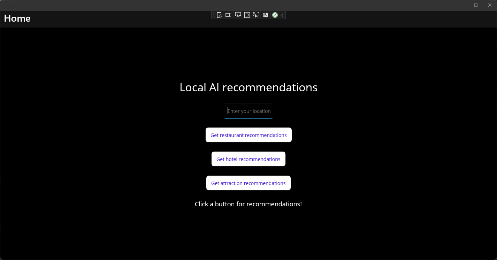
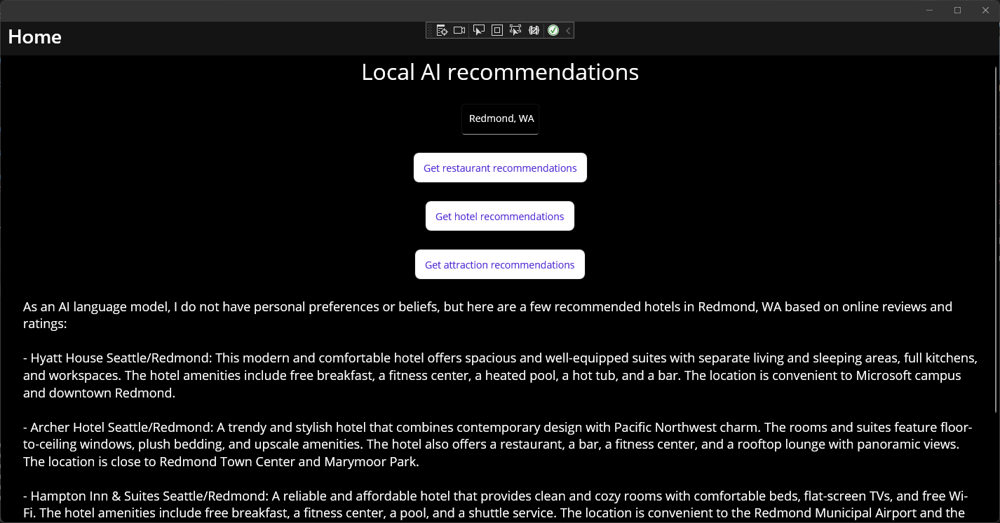

# Tutorial: Create a recommendation app with .NET MAUI and ChatGPT

In this tutorial, you'll learn how to create a .NET MAUI app for Windows in Visual Studio that calls OpenAI's ChatGPT APIs to provide recommendations based on the user's location. The app will have a simple UI that allows the user to enter a location and get recommendations for restaurants, hotels, and attractions.

In this tutorial, you learn how to:

> [!div class="checklist"]
> * Create a simple user interface for your .NET MAUI app
> * Reference and bootstrap the ChatGptNet library
> * Use an API key to link your app to an OpenAI API account
> * Make calls to the ChatGptNet library to get recommendations

## Prerequisites

* An OpenAI [account](https://platform.openai.com/login?launch)
* An OpenAI [API key](https://platform.openai.com/docs/guides/production-best-practices/api-keys)
* The .NET MAUI [installation requirements](/dotnet/maui/get-started/installation)
* If you are new to .NET MAUI on Windows, you should start with the [Build your first .NET MAUI app for Windows](/windows/apps/windows-dotnet-maui/walkthrough-first-app) tutorial.

## Create a new .NET MAUI project with the required UI elements

We're going to start by creating a new .NET MAUI project in Visual Studio. We'll use the **.NET MAUI App** template and add some UI elements to the **MainPage** to provide users with some recommendations based on a provided location. The UI will have buttons to get recommendations for restaurants, hotels, and attractions.

1. In Visual Studio, create a new **.NET MAUI App** project named **ChatGptRecommendationApp**.
1. Run the new project to make sure the app builds and runs successfully.
1. Open **MainPage.xaml** from the Solution Explorer.
1. Replace the contents of the `VerticalStackLayout` with the following XAML markup:

    ```xaml
    <Label
        Text="Local AI recommendations"
        SemanticProperties.HeadingLevel="Level1"
        FontSize="32"
        HorizontalOptions="Center" />
    
    <Entry
        x:Name="LocationEntry"
        Placeholder="Enter your location"
        SemanticProperties.Hint="Enter the location for recommendations"
        HorizontalOptions="Center"/>
    
    <Button
        x:Name="RestaurantBtn"
        Text="Get restaurant recommendations"
        SemanticProperties.Hint="Gets restaurant recommendations when you click"
        Clicked="OnRestaurantClicked"
        HorizontalOptions="Center" />
    
    <Button
        x:Name="HotelBtn"
        Text="Get hotel recommendations"
        SemanticProperties.Hint="Gets hotel recommendations when you click"
        Clicked="OnHotelClicked"
        HorizontalOptions="Center" />
    
    <Button
        x:Name="AttractionBtn"
        Text="Get attraction recommendations"
        SemanticProperties.Hint="Gets attraction recommendations when you click"
        Clicked="OnAttractionClicked"
        HorizontalOptions="Center" />
    
    <Label x:Name="SmallLabel"
        Text="Click a button for recommendations!"
        SemanticProperties.HeadingLevel="Level2"
        FontSize="18"
        HorizontalOptions="Center" />
    ```

1. In order to build the project, you will need to add `Clicked` event handlers for each of the buttons. Add the following code to the **MainPage.xaml.cs** file and remove the existing event handler:

    ```csharp
    private async void OnRestaurantClicked(object sender, EventArgs e)
    {
    }
    
    private async void OnHotelClicked(object sender, EventArgs e)
    {
    }
    
    private async void OnAttractionClicked(object sender, EventArgs e)
    {
    }
    ```

The event handlers are all marked as `async` because we will be making asynchronous calls to the ChatGptNet library. Now when you run the app, you should see the following UI:



Users can enter their location in the `Entry` control and click one of the buttons to get recommendations for restaurants, hotels, or attractions. The `Label` control at the bottom of the UI will display the results.

Next, let's add the ChatGptNet library to the project and get it ready to make some API calls.

## Reference and bootstrap the ChatGptNet library

To call OpenAI's ChatGPT APIs, we're going to use an open-source library from the .NET community called [ChatGPT for .NET (ChatGptNet)](https://github.com/marcominerva/ChatGptNet). This library provides a simple interface for making calls to the OpenAI API. We'll add the library to our project and bootstrap it with our API key.

1. Open the **Package Manager Console** from the **Tools** menu in Visual Studio.
1. Install the ChatGptNet library by running the following command:

    ```powershell
    Install-Package ChatGptNet
    ```

1. Open **MauiProgram.cs** and add the following code to the CreateMauiApp method before the `#if DEBUG` statement:

    ```csharp
    builder.Services.AddChatGpt(options =>
        {
            options.ApiKey = "<your-api-key-here>";
            options.Organization = null; // Optional
            options.DefaultModel = ChatGptModels.Gpt35Turbo; // Default: ChatGptModels.Gpt35Turbo
            options.MessageLimit = 10; // Default: 10
            options.MessageExpiration = TimeSpan.FromMinutes(5); // Default: 1 hour
        });
    ```

    This will bootstrap the ChatGptNet library with your API key and set some default options. You can create your API key on the [OpenAI API settings page](https://platform.openai.com/account/api-keys). The `builder` class is part of .NET MAUI's dependency injection system. We're using it to add the ChatGptNet library to the dependency injection container so that we can use it in our app.

1. In order to compile the project, you will need to add the following `using` statements to the top of the **MauiProgram.cs** file:

    ```csharp
    using ChatGptNet;
    using ChatGptNet.Models;
    ```

Now we're ready to put it all together. In the next section, we'll add some code to the three event handlers to make calls to the ChatGptNet library and display the recommendation results.

## Add ChatGPT API calls and test the app

It's time to add the code to our code-behind file that will use the ChatGptNet library to make calls to the OpenAI ChatGPT API. We'll add the code to the three event handlers we created earlier. The code will get the user's location from the `Entry` control and pass it to the ChatGptNet library to get recommendations. Then we'll display the results in the `Label` control at the bottom of the UI.

1. First, we need some code to get an instance of the ChatGptNet library. Add the following code to the top of the **MainPage.xaml.cs** file:

    ```csharp
    private IChatGptClient _chatGptClient;
    
    public MainPage()
    {
        InitializeComponent();
        this.Loaded += MainPage_Loaded;
    }

    private void MainPage_Loaded(object sender, EventArgs e)
    {
        _chatGptClient = Handler.MauiContext.Services.GetService<IChatGptClient>();
    }
    ```

    This code uses the dependency injection (DI) system to get an instance of the ChatGptNet library. The DI system won't be initialized until after the `MainPage` has loaded, so we'll put the code in an event handler for the `Loaded` event. We'll use this instance to make calls to the OpenAI ChatGPT API

1. Next, we'll create an async method named `GetRecommendation` and call it from each of the event handlers:

    ```csharp
    private async void OnRestaurantClicked(object sender, EventArgs e)
    {
        await GetRecommendation("restaurant");
    }

    private async void OnHotelClicked(object sender, EventArgs e)
    {
        await GetRecommendation("hotel");
    }

    private async void OnAttractionClicked(object sender, EventArgs e)
    {
        await GetRecommendation("attraction");
    }

    private async Task GetRecommendation(string recommendationType)
    {
        if (string.IsNullOrWhiteSpace(LocationEntry.Text))
        {
            await DisplayAlert("Empty location", "Please enter a location (city or postal code)", "OK");
            return;
        }

        if (_sessionGuid == Guid.Empty)
        {
            _sessionGuid = Guid.NewGuid();
        }

        ChatGptResponse response = await _chatGptClient.AskAsync(_sessionGuid,
                                    ""What is a recommended " + recommendationType + " near " + LocationEntry.Text);
        var message = response.GetMessage();
        SmallLabel.Text = message;
    }

    private Guid _sessionGuid = Guid.Empty;
    ```

    This code first checks to make sure the user has entered a location in the `Entry` control. If not, it displays an alert and returns. If the user has entered a location, it calls the `AskAsync` method on the ChatGptNet library to make a call to the OpenAI ChatGPT API. The `AskAsync` method takes two parameters: a `Guid` that identifies the user's session and a string containing the question to ask the API. The `AskAsync` method returns a `ChatGptResponse` object that contains the response from the API. We'll use the `GetMessage` method on the `ChatGptResponse` object to get the response text and display it in the `Label` control at the bottom of the UI.

1. Add the following `using` statements to the top of the **MainPage.xaml.cs** file:

    ```csharp
    using ChatGptNet;
    using ChatGptNet.Models;
    ```

1. Run the app, enter a location, and test the recommendation buttons. You should see a response from the API in the `Label` control at the bottom of the UI:

    

That's it! You've successfully created a Windows .NET MAUI app that uses the OpenAI ChatGPT API to provide recommendations for restaurants, hotels, and attractions. Try changing the prompts to see if you can improve the results. You can also try changing the `ChatGptModels` enum value in the `AddChatGpt` method in **MauiProgram.cs** to see if you get better results from a different model.

>[!NOTE]
>Remember to keep an eye on your API usage after your trial period has expired. You can also set monthly spending limits on your OpenAI account to avoid unexpected charges.

## Next steps

Advance to the next article to learn how to...
> [!div class="nextstepaction"]
> [Create a .NET MAUI app with C# Markup and the Community Toolkit](tutorial-csharp-ui-maui-toolkit.md)

## See also

[Build Windows apps with .NET MAUI](index.md)

[ChatGPT for .NET](https://github.com/marcominerva/ChatGptNet)
