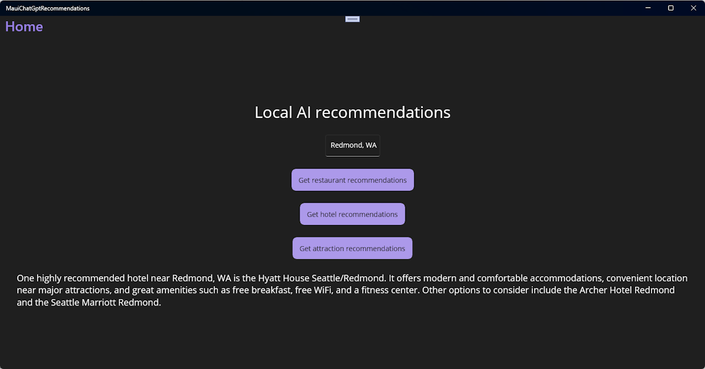

# Tutorial: Create a recommendation app with .NET MAUI and ChatGPT

In this tutorial, you'll learn how to create a .NET MAUI app for Windows in Visual Studio that calls OpenAI's ChatGPT APIs to provide recommendations based on a location entered by the user. The app will have a simple UI that allows the user to enter a location and get recommendations for restaurants, hotels, and attractions.

In this tutorial, you learn how to:

> [!div class="checklist"]
> * Create a simple user interface for your .NET MAUI app
> * Reference and bootstrap the Azure.AI.OpenAI library
> * Use an API key to link your app to an OpenAI API account
> * Make calls to the OpenAI chat APIs to get recommendations

## Prerequisites

* An OpenAI [account](https://platform.openai.com/login?launch)
* An OpenAI [API key](https://platform.openai.com/docs/guides/production-best-practices/api-keys)
* The .NET MAUI [installation requirements](/dotnet/maui/get-started/installation)
* If you are new to .NET MAUI on Windows, you should start with the [Build your first .NET MAUI app for Windows](/windows/apps/windows-dotnet-maui/walkthrough-first-app) tutorial.

## Create a new .NET MAUI project with the required UI elements

We're going to start by creating a new .NET MAUI project in Visual Studio. We'll use the **.NET MAUI App** template and add some UI elements to the **MainPage** to provide users with some recommendations based on a provided location. The UI will have buttons to get recommendations for restaurants, hotels, and attractions.

1. In Visual Studio, create a new **.NET MAUI App** project named **ChatGptRecommendationApp**.
1. Run the new project to make sure the app builds and runs successfully.
1. Open **MainPage.xaml** from the Solution Explorer.
1. Replace the contents of the `VerticalStackLayout` with the following XAML markup:

    ```xaml
    <Label
        Text="Local AI recommendations"
        SemanticProperties.HeadingLevel="Level1"
        FontSize="32"
        HorizontalOptions="Center" />
    
    <Entry
        x:Name="LocationEntry"
        Placeholder="Enter your location"
        SemanticProperties.Hint="Enter the location for recommendations"
        HorizontalOptions="Center"/>
    
    <Button
        x:Name="RestaurantBtn"
        Text="Get restaurant recommendations"
        SemanticProperties.Hint="Gets restaurant recommendations when you click"
        Clicked="OnRestaurantClicked"
        HorizontalOptions="Center" />
    
    <Button
        x:Name="HotelBtn"
        Text="Get hotel recommendations"
        SemanticProperties.Hint="Gets hotel recommendations when you click"
        Clicked="OnHotelClicked"
        HorizontalOptions="Center" />
    
    <Button
        x:Name="AttractionBtn"
        Text="Get attraction recommendations"
        SemanticProperties.Hint="Gets attraction recommendations when you click"
        Clicked="OnAttractionClicked"
        HorizontalOptions="Center" />
    
    <Label x:Name="SmallLabel"
        Text="Click a button for recommendations!"
        SemanticProperties.HeadingLevel="Level2"
        FontSize="18"
        HorizontalOptions="Center" />
    ```

1. In order to build the project, you will need to add `Clicked` event handlers for each of the buttons. Add the following code to the **MainPage.xaml.cs** file and remove the existing event handler:

    ```csharp
    private async void OnRestaurantClicked(object sender, EventArgs e)
    {
    }
    
    private async void OnHotelClicked(object sender, EventArgs e)
    {
    }
    
    private async void OnAttractionClicked(object sender, EventArgs e)
    {
    }
    ```

The event handlers are all marked as `async` because we will be making asynchronous calls to the Azure.AI.OpenAI library. Now when you run the app, you should see the following UI:


Users can enter their location in the `Entry` control and click one of the buttons to get recommendations for restaurants, hotels, or attractions. The `Label` control at the bottom of the UI will display the results.

Next, let's add the Azure.AI.OpenAI library to the project and get it ready to make some API calls.

## Reference and initialize the Azure.AI.OpenAI library

To call OpenAI's ChatGPT APIs, we're going to use an pre-release NuGet package from the Microsoft Azure team called [Azure.AI.OpenAI](https://www.nuget.org/packages/Azure.AI.OpenAI/). This library provides .NET APIs for making calls to both the OpenAI and Azure OpenAI APIs. We'll add the library to our project and bootstrap it with our API key.

1. Open the **Package Manager Console** from the **Tools** menu in Visual Studio.
1. Install the Azure.AI.OpenAI library by running the following command. The `IncludePrerelease` flag is required because the library is still in preview:

    ```powershell
    Install-Package Azure.AI.OpenAI -IncludePrerelease
    ```

1. Open **MainPage.xaml.cs**, the code-behind file for the **MainPage**. Add the following code to the top of the file to reference the Azure.AI.OpenAI library and create a variable to hold your OpenAI API key. Update the constructor to call the `MainPage_Loaded` method when the page is loaded, and add the `MainPage_Loaded` method to initialize the Azure OpenAI library:

    ```csharp
    private OpenAIClient _chatGptClient;
    private string openAIKey = "<your-api-key-here>";
    private string openAIEndpoint = null;

    public MainPage()
    {
        InitializeComponent();
        this.Loaded += MainPage_Loaded;
    }

    private void MainPage_Loaded(object sender, EventArgs e)
    {
        _chatGptClient = !string.IsNullOrWhiteSpace(openAIEndpoint)
            ? new OpenAIClient(
                new Uri(openAIEndpoint),
                new AzureKeyCredential(openAIKey))
            : new OpenAIClient(openAIKey);
    }
    ```

    This will bootstrap the Azure OpenAI library with your API key and set some default options. You can create your API key on the [OpenAI API settings page](https://platform.openai.com/account/api-keys). The code is written so you could also set an endpoint if you are using the Azure OpenAI API. If you are using the OpenAI API, you will leave the `openAIEndpoint` variable set to `null`.

1. In order to compile the project, you will need to add the following `using` statements to the top of the **MainPage.xaml.cs** file:

    ```csharp
    using Azure.AI.OpenAI;
    using Azure;
    ```

Now we're ready to put it all together. In the next section, we'll add some code to the three event handlers to make calls to the Azure.AI.OpenAI library and display the recommendation results.

## Add ChatGPT API calls and test the app

It's time to add the code to our code-behind file that will use the Azure.AI.OpenAI library to make calls to the OpenAI ChatGPT API. We'll add the code to the three event handlers we created earlier. The code will get the user's location from the `Entry` control and pass it to the API to get recommendations. Then we'll display the results in the `Label` control at the bottom of the UI.

1. Create an `async` method named `GetRecommendationAsync` and call it from each of the event handlers:

    ```csharp
    private async void OnRestaurantClicked(object sender, EventArgs e)
    {
        await GetRecommendationAsync("restaurant");
    }

    private async void OnHotelClicked(object sender, EventArgs e)
    {
        await GetRecommendationAsync("hotel");
    }

    private async void OnAttractionClicked(object sender, EventArgs e)
    {
        await GetRecommendationAsync("attraction");
    }

    private async Task GetRecommendationAsync(string recommendationType)
    {
        if (string.IsNullOrWhiteSpace(LocationEntry.Text))
        {
            await DisplayAlert("Empty location", "Please enter a location (city or postal code)", "OK");
            return;
        }

        string prompt = $"What is a recommended {recommendationType} near {LocationEntry.Text}";

        // DeploymentName must match your custom deployment name (Azure OpenAI)
        // Or a default deployment name (such as OpenAI's GPT-3.5-turbo-0125) can be used
        ChatCompletionsOptions options = new()
        {
            DeploymentName = "gpt-3.5-turbo-0125",
            Messages =
            {
                new ChatRequestUserMessage(prompt)
            },
            ChoiceCount = 1,
            MaxTokens = 100,
        };

        var message = new ChatRequestUserMessage(prompt);
        options.Messages.Add(message);
        Response<ChatCompletions> response = await _chatGptClient.GetChatCompletionsAsync(options);
        SmallLabel.Text = response.Value.Choices[0].Message.Content;
    }
    ```

    This code first checks to make sure the user has entered a location in the `Entry` control. If not, it displays an alert and returns. If the user has entered a location, it calls the `GetChatCompletionsAsync` method on the Azure.AI.OpenAI library to make a call to OpenAI. The `GetChatCompletionsAsync` method takes a `ChatCompletionOptions` parameter. This parameter was created with the following options:

    * **DeploymentName** - This is the name of the deployment (model) you want to use.
    * **Messages** - This is a collection of `ChatRequestUserMessage` objects. We're only using one message in this example, but you can add more to the collection to provide more context to the API.
    * **ChoiceCount** - This is the number of recommendations you want to get back from the API. We're only asking for one recommendation in this example.
    * **MaxTokens** - This is the maximum number of tokens (words) you want the API to return in the response. We're asking for 100 tokens in this example.

    The `GetChatCompletionsAsync` method returns a `Response<ChatCompletions>` object containing the response from the API. We'll get the `Message.Content` response text from the first `Choice` in the `response.Value.Choices` collection and display it in a control at the bottom of the UI.

1. The following `using` statements at the top of the **MainPage.xaml.cs** file are also needed for the code we added in this section:

    ```csharp
    using Azure.AI.OpenAI;
    using Azure;
    ```

1. Run the app, enter a location, and test the recommendation buttons. You should see a response from the API in the `Label` control at the bottom of the UI:

    

That's it! You've successfully created a Windows .NET MAUI app that uses the OpenAI ChatGPT API to provide recommendations for restaurants, hotels, and attractions. Try changing the prompts to see if you can improve the results. You can also try changing the `DeploymentName` value in the `ChatCompletionsOptions` object in `GetRecommendationAsync` to see if you get better results from a different model.

> [!IMPORTANT]
> Remember to keep an eye on your API usage after your trial period has expired. You can also set monthly spending limits on your OpenAI account to avoid unexpected charges.

## Next steps

Advance to the next article to learn how to...
> [!div class="nextstepaction"]
> [Create a .NET MAUI app with C# Markup and the Community Toolkit](tutorial-csharp-ui-maui-toolkit.md)

## See also

[Build Windows apps with .NET MAUI](index.md)

[Get started with OpenAI in .NET](https://devblogs.microsoft.com/dotnet/getting-started-azure-openai-dotnet/)

[Get started using GPT-35-Turbo and GPT-4 with Azure OpenAI Service](/azure/ai-services/openai/chatgpt-quickstart)

[Microsoft DevRadio Video: How to build an app with OpenAI and .NET MAUI](https://www.youtube.com/watch?v=G1sUld48b_A)
