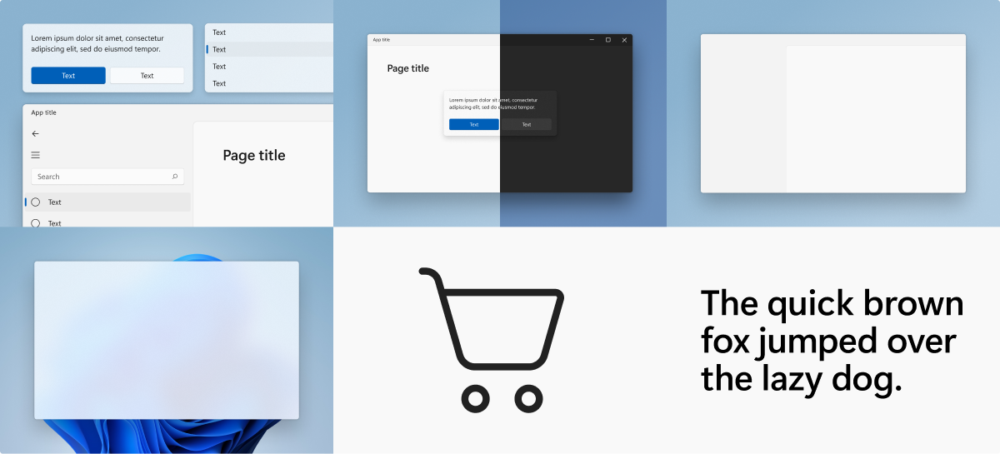

# WinUI for UWP (WinUI 2)

> [!NOTE]
> For more information on building Windows desktop apps with the latest version of WinUI, see [WinUI 3](../index.md).

WinUI 2 is tightly integrated with [Windows SDKs](https://developer.microsoft.com/windows/downloads/windows-10-sdk/) and provides official native Windows UI controls and other user interface elements for UWP applications (and desktop applications using [XAML Islands](../../desktop/modernize/xaml-islands.md)).

Maintaining down-level compatibility with earlier versions of Windows 10 enables WinUI 2 controls to work even if users don't have the latest OS.

**See the latest [WinUI 2 Release Notes](release-notes/index.md).**

## Features

For details on the work planned for the next release and to provide feedback, see the [WinUI 2.8 milestone](https://github.com/microsoft/microsoft-ui-xaml/milestone/14).

- **New controls**: WinUI contains new controls that aren't shipped as part of the default Windows platform.

- **Updated versions of existing controls**: The library also contains updated versions of existing Windows platform controls that you can use with earlier versions of Windows 10.

- **Support for earlier versions of Windows 10**: WinUI APIs work on earlier versions of Windows 10, so you don't have to include version checks or conditional XAML to support users who might not be running the very latest OS.

- **Support for XamlDirect**: The Xaml Direct APIs, designed for middleware developers, gives you access to a lower-level Xaml features which provide better CPU and working set performance. XamlDirect enables you to use XamlDirect APIs on earlier versions of Windows 10 without needing to write special code to handle multiple target Windows 10 versions.

## Examples

> [!TIP]
> For more info, design guidance, and code examples, see [Design and code Windows apps](../../design/index.md).
>
> The **WinUI 2 Gallery** app includes interactive examples of most WinUI 2 controls, features, and functionality.
>
> If the gallery app is installed already, click [**WinUI 2 Gallery**](winui2gallery:) to open it.
>
> If not installed, download the [**WinUI 2 Gallery**](https://www.microsoft.com/store/productId/9MSVH128X2ZT) from the Microsoft Store.
>
> You can also get the source code from [GitHub](https://github.com/Microsoft/WinUI-Gallery) (select the *winui2* branch).

## Documentation

How-to articles for WinUI controls are included with the [Universal Windows Platform controls documentation](/windows/uwp/design/controls-and-patterns/).

API reference docs are located at [WinUI APIs](/windows/winui/api/).

## Install and use WinUI

For instructions on installing and using the WinUI 2 library, see [Getting started with WinUI](getting-started.md).

## Developer engagement

We welcome bug reports, feature requests and community code contributions in the [microsoft-ui-xaml repo](https://github.com/microsoft/microsoft-ui-xaml/issues) on GitHub.

## NuGet package list

For details on WinUI NuGet packages, see [WinUI NuGet package list](nuget-packages.md).

## See also

- [WinUI 2 API docs](/windows/winui/api/)
- [Windows App SDK](../../windows-app-sdk/index.md)
- [Stable release channel for the Windows App SDK](../../windows-app-sdk/stable-channel.md)
- [Windows App SDK WinRT API docs](/windows/windows-app-sdk/api/winrt/)
- [Windows App SDK Win32 API docs](/windows/windows-app-sdk/api/win32/)
- [Windows App SDK Samples](https://github.com/microsoft/WindowsAppSDK-Samples)
