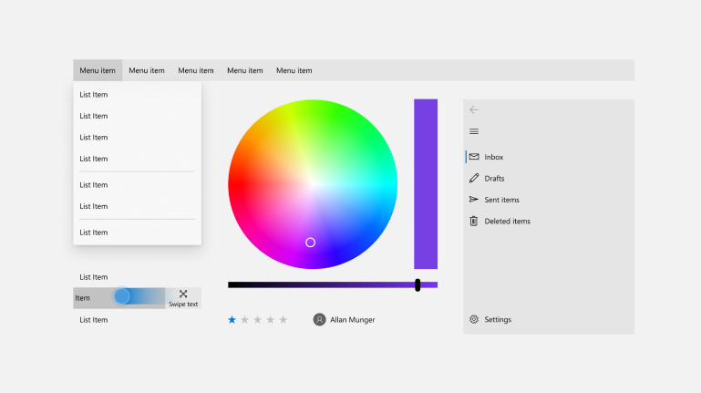

# Windows UI Library 2.x

The Windows UI Library provides official native Windows UI controls and other user interface elements for Windows apps.

It maintains down-level compatibility with earlier versions of Windows 10, so your app works even if users don't have the latest OS.

> [!NOTE]
> Check out the [Windows UI Library 3 Preview 2 (July 2020)](../winui3/index.md), a major update to the Windows 10 UI platform.

## Features

* **New controls**: The Windows UI Library contains new controls that aren't shipped as part of the default Windows platform.

* **Updated versions of existing controls**: The library also contains updated versions of existing Windows platform controls that you can use with earlier versions of Windows 10.

* **Support for earlier versions of Windows 10**: Windows UI Library APIs work on earlier versions of Windows 10, so you don't have to include version checks or conditional XAML to support users who might not be running the very latest OS.

* **Support for XamlDirect**: The Xaml Direct APIs, designed for middleware developers, gives you access to a lower-level Xaml features which provide better CPU and working set performance. XamlDirect enables you to use XamlDirect APIs on earlier versions of Windows 10 without needing to write special code to handle multiple target Windows 10 versions.

## Examples

The Xaml Controls Gallery sample app includes interactive demos and sample code for using WinUI controls.

* Install the XAML Controls Gallery app from the [Microsoft Store](
https://www.microsoft.com/p/xaml-controls-gallery/9msvh128x2zt)

* The Xaml Controls Gallery is also [open source on GitHub](
https://github.com/Microsoft/Xaml-Controls-Gallery)

## Documentation

How-to articles for Windows UI Library controls are included with the [Universal Windows Platform controls documentation](/windows/uwp/design/controls-and-patterns/).

API reference docs are located here: [Windows UI Library APIs](/uwp/api/overview/winui/).

## Install and use the Windows UI Library

For instructions, see [Getting started with the Windows UI Library](getting-started.md).

## Open source and developer roadmap

WinUI is an open source project hosted on GitHub. We welcome bug reports, feature requests and community code contributions in the [Windows UI Library repo](https://aka.ms/winui).

We are continuing to develop and evolve WinUI to support more developer scenarios. For the latest details about our plans for WinUI, see our [roadmap](https://github.com/microsoft/microsoft-ui-xaml/blob/master/docs/roadmap.md) on the Windows UI Library repo.

## NuGet package list

The Windows UI Library contains multiple NuGet packages: [Windows UI Library NuGet package list](nuget-packages.md).

## See also

[Windows UI Library 2.x Release Notes](release-notes/index.md)
