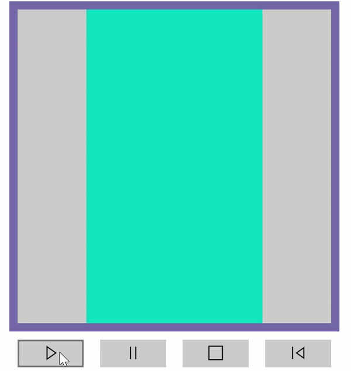
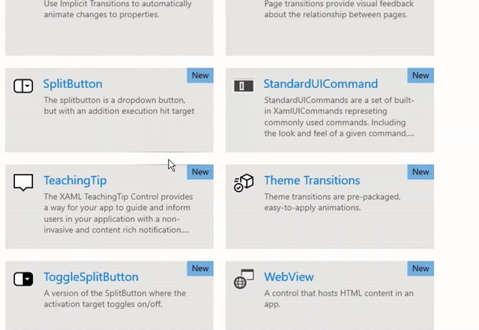
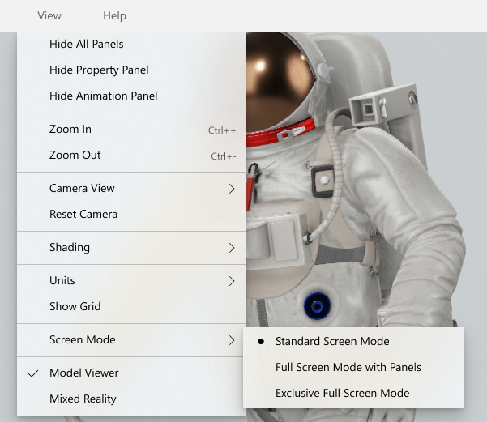
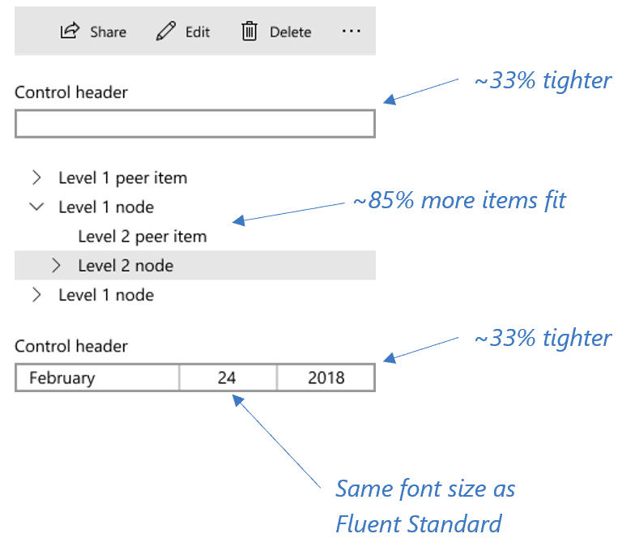

# WinUI 2.1

The first open-source version of WinUI – WinUI 2.1 (released April 2019).

WinUI gives you many of the latest Windows UX platform features, including up-to-date Fluent controls and styles, available in a way you can use right away, backward-compatible to Windows 10 Anniversary Update (14393). The [WinUI 2 Gallery](/windows/uwp/design/controls-and-patterns/#xaml-controls-gallery) gives you samples to explore all the cool new features added to the library.

Download the [WinUI 2.1 NuGet package](https://www.nuget.org/packages/Microsoft.UI.Xaml/2.1.190405004)

You can choose to use the WinUI packages in your app using the NuGet package manager: see [Getting Started with WinUI](/uwp/toolkits/winui/getting-started) for more information.

WinUI is hosted on [GitHub](https://github.com/microsoft/microsoft-ui-xaml) where we encourage you to file bug reports, feature requests and community code contributions.

## What's new in this release

### ItemsRepeater

Use an ItemsRepeater to create custom collection experiences using a flexible layout system, custom views, and virtualization.
Unlike ListView, ItemsRepeater does not provide a comprehensive end-user experience – it has no default UI and provides no policy around focus, selection, or user interaction. Instead, it's a building block that you can use to create your own unique collection-based experiences and custom controls. It supports building of richer and more performant experiences.

[Documentation](/windows/uwp/design/controls-and-patterns/items-repeater)

### AnimatedVisualPlayer

The AnimatedVisualPlayer hosts and controls playback of animated visuals, enabling you to add high performance custom motion graphics to your app. For instance, the AnimatedVisualPlayer is used to display and control Lottie animations.

[Documentation](/windows/communitytoolkit/animations/lottie)

### TeachingTip

TeachingTip provides an engaging and Fluent way for applications to guide and inform users with non-invasive and content-rich tips. TeachingTip can bring focus to new or important features, teach users how to perform tasks, and enhance workflow by providing contextually relevant information to your task at hand.

[Documentation](/windows/uwp/design/controls-and-patterns/dialogs-and-flyouts/teaching-tip)

### RadioMenuFlyoutItem

Includes the ability to have 'Radio Button' style options in a MenuBar. This enables groups of options with bullets that are tied together like a radio button group. The logic is handled for the developer.

[Documentation](/windows/uwp/design/controls-and-patterns/menus#create-a-menu-flyout-or-a-context-menu)

### CompactDensity

Compact mode enables developers to create comfortable experiences for any number of scenarios. Simply by adding a resource dictionary your application can fit on average ~33% more UI.

[Documentation](/windows/uwp/design/style/spacing)

### Shadows

Creating a visual hierarchy of elements in your UI makes the UI easy to scan and conveys what is important to focus on. Elevation, the act of bringing select elements of your UI forward, is often used to achieve such a hierarchy in software. 

With Windows 10 May 2019 Update, many of our common controls add elevation by using z-depth and shadow by default. The NavigationView and TeachingTip controls in WinUI 2.1 will also have default shadows when running on an OS with Windows 10 May 2019 Update. The full list of controls that have default shadows and how to use additional APIs will be available once the Windows 10 May 2019 Update is released and the link will be posted here.

## Examples

> [!TIP]
> For more info, design guidance, and code examples, see [Design and code Windows apps](../../../design/index.md).
>
> The **WinUI 3 Gallery** and **WinUI 2 Gallery** apps include interactive examples of most WinUI 3 and WinUI 2 controls, features, and functionality.
>
> If installed already, open them by clicking the following links: [**WinUI 3 Gallery**](winui3gallery:/item/AnimatedIcon) or [**WinUI 2 Gallery**](winui2gallery:/item/AnimatedIcon).
>
> If they are not installed, you can download the [**WinUI 3 Gallery**](https://www.microsoft.com/store/productId/9P3JFPWWDZRC) and the [**WinUI 2 Gallery**](https://www.microsoft.com/store/productId/9MSVH128X2ZT) from the Microsoft Store.
>
> You can also get the source code for both from [GitHub](https://github.com/Microsoft/WinUI-Gallery) (use the *main* branch for WinUI 3 and the *winui2* branch for WinUI 2).

## Documentation

How-to articles for WinUI controls are included with the [Universal Windows Platform controls documentation](/windows/uwp/design/controls-and-patterns/).

API reference docs are located here: [WinUI APIs](/windows/winui/api/).

## Microsoft.UI.Xaml 2.1 Version History

### Microsoft.UI.Xaml 2.1 Official release

April 2019

[GitHub release page](https://github.com/Microsoft/microsoft-ui-xaml/releases)

[NuGet package download](https://www.nuget.org/packages/Microsoft.UI.Xaml/2.1.190405004)

#### New feature (not included in earlier pre-releases)

* [CompactDensity](/windows/uwp/design/style/spacing):
Compact mode enable developers to create comfortable experiences for any number of scenarios. Simply by adding a resource dictionary your application can fit on average ~33% more UI.

* Shadows:
Creating a visual hierarchy of elements in your UI makes the UI easy to scan and conveys what is important to focus on. Elevation, the act of bringing select elements of your UI forward, is often used to achieve such a hierarchy in software. Many of our common controls add elevation by using z-depth and shadow by default.  

### Microsoft.UI.Xaml 2.1.190218001-prerelease

February 2019

[GitHub release page](https://github.com/Microsoft/microsoft-ui-xaml/releases/tag/v2.1.190219001-prerelease)

[NuGet package download](https://www.nuget.org/packages/Microsoft.UI.Xaml/2.1.190218001-prerelease)

New experimental features:

* [TeachingTip control](https://github.com/Microsoft/microsoft-ui-xaml/issues/21)  
  This new control provides a way for your app to guide and inform users in your application with a non-invasive and content rich notification. TeachingTip can be used for bringing focus to a new or important feature, teaching users how to perform a task, or enhancing the user workflow by providing contextually relevant information to their task at hand.

### Microsoft.UI.Xaml 2.1.190131001-prerelease

February 2019

[GitHub release page](https://github.com/Microsoft/microsoft-ui-xaml/releases/tag/v2.1.190131001-prerelease)

[NuGet package download](https://www.nuget.org/packages/Microsoft.UI.Xaml/2.1.190131001-prerelease)

New experimental features:

* [AnimatedVisualPlayer](/uwp/api/microsoft.ui.xaml.controls.animatedvisualplayer)  
  This new control enables playing complex high performance vector animations, including [Lottie](https://github.com/airbnb/lottie) animations created using [Lottie-Windows](/windows/communitytoolkit/animations/lottie).

### Microsoft.UI.Xaml 2.1.181217001-prerelease

December 2018

[GitHub release page](https://github.com/Microsoft/microsoft-ui-xaml/releases/tag/v2.1.181217001-prerelease)

[NuGet package download](https://www.nuget.org/packages/Microsoft.UI.Xaml/2.1.181217001-prerelease)

New experimental features:

* [ItemsRepeater](/uwp/api/microsoft.ui.xaml.controls.itemsrepeater)

* [RadioButtons](/uwp/api/microsoft.ui.xaml.controls.radiobuttons)

* [RadioMenuFlyoutItem](/uwp/api/microsoft.ui.xaml.controls.radiomenuflyoutitem)