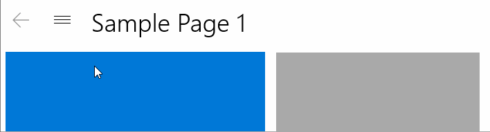
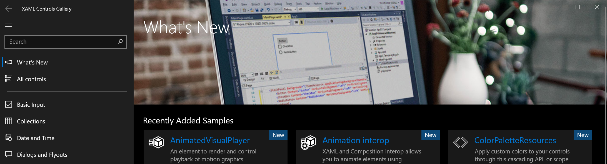
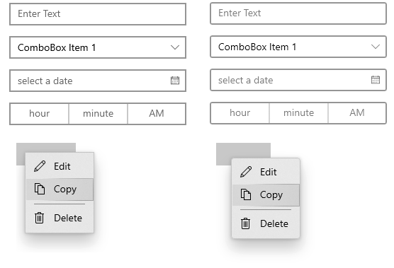
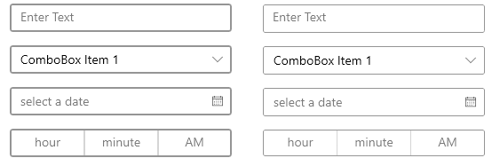
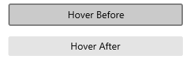
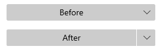
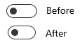

# WinUI 2.2

WinUI 2.2 is the August 2019 release of WinUI.

You can add WinUI packages to your app using the NuGet package manager: see [Getting Started with WinUI](../getting-started.md) for more information.

WinUI is hosted on [GitHub](https://github.com/microsoft/microsoft-ui-xaml) where we encourage you to file bug reports, feature requests and community code contributions.

## Microsoft.UI.Xaml 2.2 Version History

### WinUI 2.2 Official Release

AUGUST 2019

[GitHub release page](https://github.com/microsoft/microsoft-ui-xaml/releases)

[NuGet package download](https://www.nuget.org/packages/Microsoft.UI.Xaml)

### New Features

#### TabView

#### Description

The TabView control is a collection of tabs that each represents a new page or document in your app. TabView is useful when your app has several pages of content and the user expects to be able to add, close, and rearrange the tabs. The new [Windows Terminal](https://github.com/Microsoft/Terminal) uses TabView to show multiple command line interfaces.

#### Documentation

/uwp/api/microsoft.ui.xaml.controls.tabview?view=winui-2.2&preserve-view=true

#### NavigationView Updates

##### a) NavigationView's Back Button update

##### Description

In NavigationView's minimal mode, the back button no longer disappears. When opening and closing the pane, users no longer need to move their cursor to click the hamburger button. This feature will work by default. You don't need to make any code changes to make this work.

##### b) NavigationView - No Auto Padding

##### Description

App developers can now reclaim all pixels within their app window when they use the NavigationView control and extend into the title bar area.

##### Documentation

/windows/uwp/design/controls-and-patterns/navigationview#top-whitespace

#### Visual Style Updates

##### a) Corner Radius Update

##### Description

CornerRadius attribute was added. Default controls were updated to use slightly rounded corners. Developers can easily customize the corner radius to give your app a unique look if desired.

##### GitHub Spec Link

https://github.com/microsoft/microsoft-ui-xaml/issues/524

##### b) Border Thickness Update

##### Description

BorderThickness property was made easier to customize. Default controls were updated to reduce the outlines to be thinner for a cleaner and familiar look.

##### GitHub Spec Link

https://github.com/microsoft/microsoft-ui-xaml/issues/835

##### c) Button Visual Update

##### Description: 
Default Button's visual was updated to remove outline that appeared during hover to give it a cleaner look.

##### GitHub Spec Link:  
https://github.com/microsoft/microsoft-ui-xaml/issues/953

##### d) SplitButton Visual Update

##### Description: 
Default SplitButton's visual was updated to make it more distinct from DropDownButton.

##### GitHub Spec Link: 
https://github.com/microsoft/microsoft-ui-xaml/issues/986

##### e) ToggleSwitch Visual Update

##### Description: 
Default ToggleSwitch's width was reduced from 44px to 40px so it is balanced visually while retaining usability.

##### GitHub Spec Link: 
https://github.com/microsoft/microsoft-ui-xaml/issues/836

##### f) CheckBox and RadioButton Visual Update

##### Description: 
CheckBox and RadioButton visuals were updated to be consistent with the rest of the visual style change.

##### GitHub Spec Link: 
https://github.com/microsoft/microsoft-ui-xaml/issues/839

## Examples

> [!TIP]
> For more info, design guidance, and code examples, see [Design and code Windows apps](../../../design/index.md).
>
> The **WinUI 3 Gallery** and **WinUI 2 Gallery** apps include interactive examples of most WinUI 3 and WinUI 2 controls, features, and functionality.
>
> If installed already, open them by clicking the following links: [**WinUI 3 Gallery**](winui3gallery:/item/AnimatedIcon) or [**WinUI 2 Gallery**](winui2gallery:/item/AnimatedIcon).
>
> If they are not installed, you can download the [**WinUI 3 Gallery**](https://www.microsoft.com/store/productId/9P3JFPWWDZRC) and the [**WinUI 2 Gallery**](https://www.microsoft.com/store/productId/9MSVH128X2ZT) from the Microsoft Store.
>
> You can also get the source code for both from [GitHub](https://github.com/Microsoft/WinUI-Gallery) (use the *main* branch for WinUI 3 and the *winui2* branch for WinUI 2).

## Documentation

How-to articles for WinUI controls are included with the [Universal Windows Platform controls documentation](/windows/uwp/design/controls-and-patterns/).

API reference docs are located here: [WinUI APIs](/windows/winui/api/).

## Microsoft.UI.Xaml 2.2-prerelease Version History

### Microsoft.UI.Xaml 2.2.190702001-prerelease

July 2019

[GitHub release page](https://github.com/microsoft/microsoft-ui-xaml/releases/tag/v2.2.190702001-prerelease)

[NuGet package download](https://www.nuget.org/packages/Microsoft.UI.Xaml/2.2.190702001-prerelease)

### Experimental Feature

* [TabView](/uwp/api/microsoft.ui.xaml.controls.tabview?view=winui-2.2&preserve-view=true)

### Microsoft.UI.Xaml 2.2.20190416001-prerelease

April 2019

[GitHub release page](https://github.com/Microsoft/microsoft-ui-xaml/releases/tag/v2.2.190416008-prerelease)

[NuGet package download](https://www.nuget.org/packages/Microsoft.UI.Xaml/2.2.190416008-prerelease)

#### Experimental features

* [FlowLayout](/uwp/api/microsoft.ui.xaml.controls.flowlayout)

* [LayoutPanel](/uwp/api/microsoft.ui.xaml.controls.layoutpanel)

* [RadioButtons](/uwp/api/microsoft.ui.xaml.controls.radiobuttons)

* [ScrollView](/uwp/api/microsoft.ui.xaml.controls.scrollview)