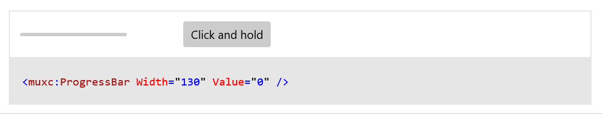
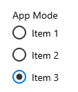

# WinUI 2.3

WinUI 2.3 is the January 2020 release of WinUI.

WinUI is hosted on [GitHub](https://github.com/microsoft/microsoft-ui-xaml) where we encourage you to file bug reports, feature requests and community code contributions.

WinUI Releases: [GitHub release page](https://github.com/microsoft/microsoft-ui-xaml/releases)

WinUI packages can be added to Visual Studio projects through the NuGet package manager. For more information, see [Getting Started with WinUI](../getting-started.md).

NuGet package download: [Microsoft.UI.Xaml](https://www.nuget.org/packages/Microsoft.UI.Xaml)

## New Features

### Progress Bar Visual Refresh

The **ProgressBar** has two different visual represetations.

#### Indeterminate Progress Bar

Shows that a task is ongoing, but doesn't block user interaction.

#### Determinate Progress Bar

Shows how much progress has been made on a known amount of work. 

[Doc link](/windows/uwp/design/controls-and-patterns/progress-controls)

[Sample link](/windows/uwp/design/controls-and-patterns/progress-controls#examples)

### NumberBox

A **NumberBox** represents a control that can be used to display and edit numbers. This supports validation, increment stepping, and computing inline calculations of basic equations, such as multiplication, division, addition, and subtraction.

[Doc and sample link](/windows/uwp/design/controls-and-patterns/number-box)

### RadioButtons

**RadioButtons** is a new container control that enables you to create related groups of RadioButton elements easily, while also correctly supporting keyboarding and narrator/screen reader functionality

[Doc and sample link](https://github.com/microsoft/microsoft-ui-xaml-specs/blob/c8d3d3668af546091656dfc37436b13cd062f52d/active/radiobuttons/RadioButtons_Spec.md)

## Examples

> [!TIP]
> For more info, design guidance, and code examples, see [Design and code Windows apps](../../../design/index.md).
>
> The **WinUI 3 Gallery** and **WinUI 2 Gallery** apps include interactive examples of most WinUI 3 and WinUI 2 controls, features, and functionality.
>
> If installed already, open them by clicking the following links: [**WinUI 3 Gallery**](winui3gallery:/item/AnimatedIcon) or [**WinUI 2 Gallery**](winui2gallery:/item/AnimatedIcon).
>
> If they are not installed, you can download the [**WinUI 3 Gallery**](https://www.microsoft.com/store/productId/9P3JFPWWDZRC) and the [**WinUI 2 Gallery**](https://www.microsoft.com/store/productId/9MSVH128X2ZT) from the Microsoft Store.
>
> You can also get the source code for both from [GitHub](https://github.com/Microsoft/WinUI-Gallery) (use the *main* branch for WinUI 3 and the *winui2* branch for WinUI 2).

## Documentation

How-to articles for WinUI controls are included with the [Universal Windows Platform controls documentation](/windows/uwp/design/controls-and-patterns/).

API reference docs are located here: [WinUI APIs](/windows/winui/api/).