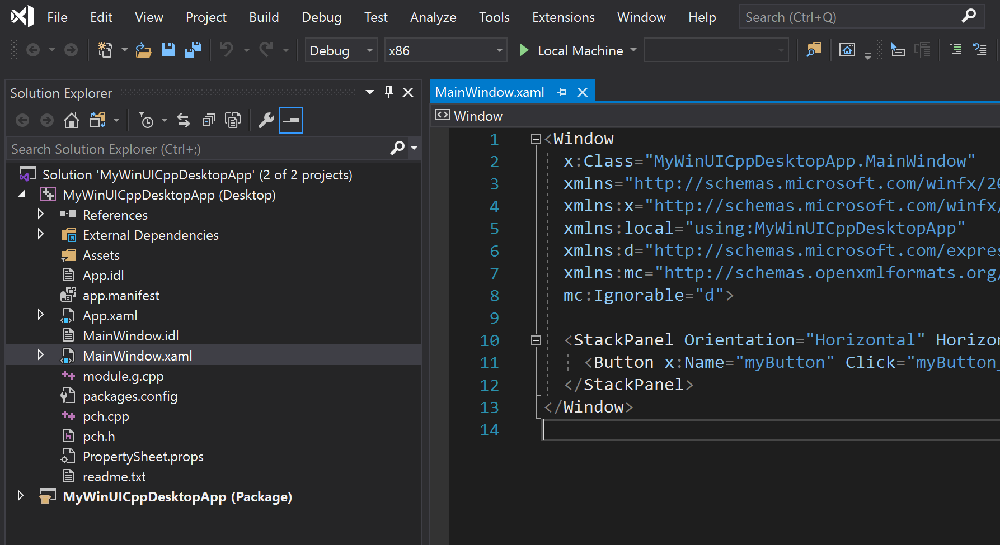

# Create a WinUI 3 app

::: zone pivot="winui3-packaged"

<!-- The [Windows App SDK](../../windows-app-sdk/index.md) includes WinUI 3 project templates that enable you to create desktop and UWP apps with an entirely WinUI-based user interface. When you create apps using these project templates, the entire user interface of your application is implemented using windows, controls, and other UI types provided by WinUI 3. For a complete list of the project templates, see [Project templates for WinUI 3](winui-project-templates-in-visual-studio.md#project-templates-for-winui-3).

## Prerequisites

To use the WinUI 3 project templates described in this article, configure your development computer and install the Windows App SDK extension for Visual Studio. For details, see [Set up your development environment](../../windows-app-sdk/set-up-your-development-environment.md).

> [!NOTE]
> Certain fundamental WinRT types including [CoreWindow](/uwp/api/Windows.UI.Core.CoreWindow), [ApplicationView](/uwp/api/Windows.UI.ViewManagement.ApplicationView), [CoreApplicationView](/uwp/api/Windows.ApplicationModel.Core.CoreApplicationView) [CoreDispatcher](/uwp/api/Windows.UI.Core.CoreDispatcher), and their dependencies are not available in desktop apps. These types were designed specifically for UI scenarios in UWP apps, and they do not behave properly in desktop apps due to threading models and other platform differences. For more information including recommended alternative APIs, see [Windows Runtime APIs not supported in desktop apps](../../desktop/modernize/desktop-to-uwp-supported-api.md). -->

## Instructions for WinUI 3 packaged apps

To create a WinUI 3 desktop app with C# and .NET 5 using Windows App SDK 1.0 Preview 3:

1. In Visual Studio, select **File** -> **New** -> **Project**.

2. In the project drop-down filters, select **C#**, **Windows**, and **WinUI**, respectively.

3. Select one of the following project types and click **Next**.

    - **Blank App, Packaged (WinUI 3 in Desktop)**: Creates a desktop C# .NET app with a WinUI-based user interface. The generated project is configured with the package manifest and other support needed to build the app into an [MSIX package](/windows/msix/overview) without the use of a separate packaging project. For more information about this project type, see [Package your app using single-project MSIX](../../windows-app-sdk/single-project-msix.md).

        > [!NOTE]
        > If you installed the Windows App SDK 1.0 Preview 2 with Visual Studio 2019, this project template has a known issue that results in a build error. To resolve this issue, install the [Single-project MSIX Packaging Tools for Visual Studio 2019 VSIX extension](https://marketplace.visualstudio.com/items?itemName=ProjectReunion.MicrosoftSingleProjectMSIXPackagingTools) after you install the Windows App SDK 1.0 Preview 2.

    - **Blank App, Packaged with WAP (WinUI 3 in Desktop)**: Creates a desktop C# .NET app with a WinUI-based user interface. The generated solution includes a separate [Windows Application Packaging Project](/windows/msix/desktop/desktop-to-uwp-packaging-dot-net) that is configured to build the app into an [MSIX package](/windows/msix/overview).

    

4. Enter a project name, choose any other options as desired, and click **Create**.

5. In the following dialog box, set the **Target version** to Windows 10, version 2004 (build 19041) and **Minimum version** to Windows 10, version 1809 (build 17763) and then click **OK**.

    

6. At this point, Visual Studio generates one or more projects:

    - **_Project name_ (Desktop)**: This project contains your app's code. The **App.xaml** file and **App.xaml.cs** code-behind file define an `Application` class that represents your app instance. The **MainWindow.xaml** file and **MainWindow.xaml.cs** code-behind file define a `MainWindow` class that represents the main window displayed by your app. These classes derive from types in the **Microsoft.UI.Xaml** namespace provided by WinUI.

        If you used the **Blank App, Packaged (WinUI 3 in Desktop)** project template, this project also includes the package manifest for building the app into an [MSIX package](/windows/msix/overview).

        

    - **_Project name_ (Package)**: This project is generated only if you use the **Blank App, Packaged with WAP (WinUI 3 in Desktop)** project template. This project is a [Windows Application Packaging Project](/windows/msix/desktop/desktop-to-uwp-packaging-dot-net) that is configured to build the app into an [MSIX package](/windows/msix/overview). This project contains the [package manifest](/uwp/schemas/appxpackage/uapmanifestschema/schema-root) for your app, and it is the startup project for your solution by default.

        

7. Enable deployment for your project in **Configuration Manager**. If you do not follow these steps to enable deployment, you will encounter the following error when you try to run or debug your project on your development computer: "The project needs to be deployed before we can debug. Please enable Deploy in the Configuration Manager".

    1. Select **Build** -> **Configuration Manager**.
    2. In **Configuration Manager**, click the **Deploy** check box for every combination of configuration and platform (for example, **Debug** and **x86**, **Debug** and **arm64**, **Release** and **x64**, and more).
        > [!NOTE]
        > Be sure to use the **Active solution configuration** and **Active solution platform** drop-downs at the top instead of the **Configuration** and **Platform** drop-downs in the same row as the **Deploy** check box.

        

8. To add a new item to your app project, right-click the **_Project name_ (Desktop)** project node in **Solution Explorer** and select **Add** -> **New Item**. In the **Add New Item** dialog box, select the **WinUI** tab, choose the item you want to add, and then click **Add**. For more details about the available items, see [Item templates for WinUI 3](winui-project-templates-in-visual-studio.md#item-templates-for-winui-3).

    

9. Build and run your solution on your development computer to confirm that the app runs without errors.

<!-- ### Localize your WinUI desktop app

To support multiple languages in a WinUI desktop app, and ensure proper localization of your packaged project, add the appropriate resources to the project (see [App resources and the Resource Management System](/windows/uwp/app-resources/)) and declare each supported language in the **package.appxmanifest** file of your project. When you build the project, the specified languages are added to the generated app manifest (**AppxManifest.xml**) and the corresponding resources are used.

1. Open the .wapproj's `package.appxmanifest` in a text editor and locate the following section:

    ```xml
    <Resources>
        <Resource Language="x-generate"/>
    </Resources>
    ```

2. Replace the `<Resource Language="x-generate">` with `<Resource />` elements for each of your supported languages. For example, the following markup specifies that "en-US" and "es-ES" localized resources are available:

    ```xml
    <Resources>
        <Resource Language="en-US"/>
        <Resource Language="es-ES"/>
    </Resources>
    ``` -->

::: zone-end

::: zone pivot="winui3-unpackaged"

<!-- To create a WinUI 3 application with MSIX packaging, choose from one of the following sets of instructions depending on the project language and the version of the Windows App SDK you have installed. -->

<!-- ### [C# with 1.0 Preview 3](#tab/csharp)

To create a WinUI 3 desktop app with C# and .NET 5 using Windows App SDK 1.0 Preview 3:

1. In Visual Studio, select **File** -> **New** -> **Project**.

2. In the project drop-down filters, select **C#**, **Windows**, and **WinUI**, respectively.

3. Select one of the following project types and click **Next**.

    - **Blank App, Packaged (WinUI 3 in Desktop)**: Creates a desktop C# .NET app with a WinUI-based user interface. The generated project is configured with the package manifest and other support needed to build the app into an [MSIX package](/windows/msix/overview) without the use of a separate packaging project. For more information about this project type, see [Package your app using single-project MSIX](../../windows-app-sdk/single-project-msix.md).

        > [!NOTE]
        > If you installed the Windows App SDK 1.0 Preview 2 with Visual Studio 2019, this project template has a known issue that results in a build error. To resolve this issue, install the [Single-project MSIX Packaging Tools for Visual Studio 2019 VSIX extension](https://marketplace.visualstudio.com/items?itemName=ProjectReunion.MicrosoftSingleProjectMSIXPackagingTools) after you install the Windows App SDK 1.0 Preview 2.

    - **Blank App, Packaged with WAP (WinUI 3 in Desktop)**: Creates a desktop C# .NET app with a WinUI-based user interface. The generated solution includes a separate [Windows Application Packaging Project](/windows/msix/desktop/desktop-to-uwp-packaging-dot-net) that is configured to build the app into an [MSIX package](/windows/msix/overview).

    

4. Enter a project name, choose any other options as desired, and click **Create**.

5. In the following dialog box, set the **Target version** to Windows 10, version 2004 (build 19041) and **Minimum version** to Windows 10, version 1809 (build 17763) and then click **OK**.

    

6. At this point, Visual Studio generates one or more projects:

    - **_Project name_ (Desktop)**: This project contains your app's code. The **App.xaml** file and **App.xaml.cs** code-behind file define an `Application` class that represents your app instance. The **MainWindow.xaml** file and **MainWindow.xaml.cs** code-behind file define a `MainWindow` class that represents the main window displayed by your app. These classes derive from types in the **Microsoft.UI.Xaml** namespace provided by WinUI.

        If you used the **Blank App, Packaged (WinUI 3 in Desktop)** project template, this project also includes the package manifest for building the app into an [MSIX package](/windows/msix/overview).

        

    - **_Project name_ (Package)**: This project is generated only if you use the **Blank App, Packaged with WAP (WinUI 3 in Desktop)** project template. This project is a [Windows Application Packaging Project](/windows/msix/desktop/desktop-to-uwp-packaging-dot-net) that is configured to build the app into an [MSIX package](/windows/msix/overview). This project contains the [package manifest](/uwp/schemas/appxpackage/uapmanifestschema/schema-root) for your app, and it is the startup project for your solution by default.

        

7. Enable deployment for your project in **Configuration Manager**. If you do not follow these steps to enable deployment, you will encounter the following error when you try to run or debug your project on your development computer: "The project needs to be deployed before we can debug. Please enable Deploy in the Configuration Manager".

    1. Select **Build** -> **Configuration Manager**.
    2. In **Configuration Manager**, click the **Deploy** check box for every combination of configuration and platform (for example, **Debug** and **x86**, **Debug** and **arm64**, **Release** and **x64**, and more).
        > [!NOTE]
        > Be sure to use the **Active solution configuration** and **Active solution platform** drop-downs at the top instead of the **Configuration** and **Platform** drop-downs in the same row as the **Deploy** check box.

        

8. To add a new item to your app project, right-click the **_Project name_ (Desktop)** project node in **Solution Explorer** and select **Add** -> **New Item**. In the **Add New Item** dialog box, select the **WinUI** tab, choose the item you want to add, and then click **Add**. For more details about the available items, see [Item templates for WinUI 3](winui-project-templates-in-visual-studio.md#item-templates-for-winui-3).

    

9. Build and run your solution on your development computer to confirm that the app runs without errors.

### Localize your WinUI desktop app

To support multiple languages in a WinUI desktop app, and ensure proper localization of your packaged project, add the appropriate resources to the project (see [App resources and the Resource Management System](/windows/uwp/app-resources/)) and declare each supported language in the **package.appxmanifest** file of your project. When you build the project, the specified languages are added to the generated app manifest (**AppxManifest.xml**) and the corresponding resources are used.

1. Open the .wapproj's `package.appxmanifest` in a text editor and locate the following section:

    ```xml
    <Resources>
        <Resource Language="x-generate"/>
    </Resources>
    ```

2. Replace the `<Resource Language="x-generate">` with `<Resource />` elements for each of your supported languages. For example, the following markup specifies that "en-US" and "es-ES" localized resources are available:

    ```xml
    <Resources>
        <Resource Language="en-US"/>
        <Resource Language="es-ES"/>
    </Resources>
    ```

### [C# with earlier releases](#tab/csharp-earlier)

To create a WinUI 3 desktop app with C# and .NET 5 using Windows App SDK 1.0 Experimental and earlier releases:

1. In Visual Studio, select **File** -> **New** -> **Project**.

2. In the project drop-down filters, select **C#**, **Windows**, and **WinUI**, respectively.

3. Select **Blank App, Packaged (WinUI 3 in Desktop)** and click **Next**. Enter a project name, choose any other options as desired, and click **Create**.

4. In the following dialog box, set the **Target version** to Windows 10, version 2004 (build 19041) and **Minimum version** to Windows 10, version 1809 (build 17763) and then click **OK**.

    

5. At this point, Visual Studio generates two projects:

    - **_Project name_ (Desktop)**: This project contains your app's code. The **App.xaml** file and **App.xaml.cs** code-behind file define an `Application` class that represents your app instance. The **MainWindow.xaml** file and **MainWindow.xaml.cs** code-behind file define a `MainWindow` class that represents the main window displayed by your app. These classes derive from types in the **Microsoft.UI.Xaml** namespace provided by WinUI.

        

    - **_Project name_ (Package)**: This is a [Windows Application Packaging Project](/windows/msix/desktop/desktop-to-uwp-packaging-dot-net) that is configured to build the app into an [MSIX package](/windows/msix/overview). This project contains the [package manifest](/uwp/schemas/appxpackage/uapmanifestschema/schema-root) for your app, and it is the startup project for your solution by default.

        

        > [!NOTE]
        > Optionally, you can install the single-project MSIX packaging tools extension for Visual Studio and combine the packaging project settings into your application project. This extension enables you to develop and build your MSIX-packaged application without requiring a separate packaging project. For more information, see [Package your app using single-project MSIX](../../windows-app-sdk/single-project-msix.md).

6. To add a new item to your app project, right-click the **_Project name_ (Desktop)** project node in **Solution Explorer** and select **Add** -> **New Item**. In the **Add New Item** dialog box, select the **WinUI** tab, choose the item you want to add, and then click **Add**. For more details about the available items, see [Item templates for WinUI 3](winui-project-templates-in-visual-studio.md#item-templates-for-winui-3).

    

7. Build and run your solution to confirm that the app runs without errors.

#### Localize your WinUI desktop C# app

To support multiple languages in a WinUI desktop app, and ensure proper localization of your packaged project, add the appropriate resources to the project (see [App resources and the Resource Management System](/windows/uwp/app-resources/)) and declare each supported language in the **package.appxmanifest** file of your project. When you build the project, the specified languages are added to the generated app manifest (**AppxManifest.xml**) and the corresponding resources are used.

1. Open the .wapproj's `package.appxmanifest` in a text editor and locate the following section:

    ```xml
    <Resources>
        <Resource Language="x-generate"/>
    </Resources>
    ```

2. Replace the `<Resource Language="x-generate">` with `<Resource />` elements for each of your supported languages. For example, the following markup specifies that "en-US" and "es-ES" localized resources are available:

    ```xml
    <Resources>
        <Resource Language="en-US"/>
        <Resource Language="es-ES"/>
    </Resources>
    ```

### [C++ with 1.0 Preview 3](#tab/cpp)

To create a WinUI 3 desktop app with C++ using Windows App SDK 1.0 Preview 2:

1. In Visual Studio, select **File** -> **New** -> **Project**.

2. In the project drop-down filters, select **C++**, **Windows**, and **WinUI**.

3. Select one of the following project types and click **Next**.

    - **Blank App, Packaged (WinUI 3 in Desktop)**: Creates a desktop C++ app with a WinUI-based user interface. The generated project is configured with the package manifest and other support needed to build the app into an [MSIX package](/windows/msix/overview) without the use of a separate packaging project. For more information about this project type, see [Package your app using single-project MSIX](../../windows-app-sdk/single-project-msix.md).

        > [!NOTE]
        > This project type only supports a single executable in the generated MSIX package. If you need to combine multiple executables into a single MSIX package, you must use the **Blank App, Packaged with WAP (WinUI 3 in Desktop)** project template or add a Windows Application Packaging Project to your solution.

    - **Blank App, Packaged with WAP (WinUI 3 in Desktop)**: Creates a desktop C++ app with a WinUI-based user interface. The generated solution includes a separate [Windows Application Packaging Project](/windows/msix/desktop/desktop-to-uwp-packaging-dot-net) that is configured to build the app into an [MSIX package](/windows/msix/overview).

    

4. Enter a project name, choose any other options as desired, and click **Create**.

5. In the following dialog box, set the **Target version** to Windows 10, version 2004 (build 19041) and **Minimum version** to Windows 10, version 1809 (build 17763) and then click **OK**.

    

6. At this point, Visual Studio generates one or more projects:

    - **_Project name_ (Desktop)**: This project contains your app's code. The **App.xaml** and various **App** code files define an `Application` class that represents your app instance, and the **MainWindow.xaml** and various **MainWindow** code files define a `MainWindow` class that represents the main window displayed by your app. These classes derive from types in the **Microsoft.UI.Xaml** namespace provided by WinUI.

        If you used the **Blank App, Packaged (WinUI 3 in Desktop)** project template, this project also includes the package manifest for building the app into an [MSIX package](/windows/msix/overview).

        

    - **_Project name_ (Package)**: This project is generated only if you use the **Blank App, Packaged with WAP (WinUI 3 in Desktop)** project template. This project is a [Windows Application Packaging Project](/windows/msix/desktop/desktop-to-uwp-packaging-dot-net) that is configured to build the app into an [MSIX package](/windows/msix/overview). This project contains the [package manifest](/uwp/schemas/appxpackage/uapmanifestschema/schema-root) for your app, and it is the startup project for your solution by default.

        

7. To add a new item to your app project, right-click the **_Project name_ (Desktop)** project node in **Solution Explorer** and select **Add** -> **New Item**. In the **Add New Item** dialog box, select the **WinUI** tab, choose the item you want to add, and then click **Add**. For more details about the available items, see [Item templates for WinUI 3](winui-project-templates-in-visual-studio.md#item-templates-for-winui-3).

    

8. Build and run your solution on your development computer to confirm that the app runs without errors.

   > [!NOTE]
   > On Visual Studio 2022 version 17.0 releases up to Preview 4, you will encounter the error "There were deployment errors" the first time you try to run your solution. To resolve this issue, run or deploy your solution a second time. This issue will be fixed in Visual Studio 2022 version 17.0 Preview 5.

#### Localize your WinUI desktop C++ app

To support multiple languages in a WinUI desktop app, and ensure proper localization of your packaged project, add the appropriate resources to the project (see [App resources and the Resource Management System](/windows/uwp/app-resources/)) and declare each supported language in the **package.appxmanifest** file of your project. When you build the project, the specified languages are added to the generated app manifest (**AppxManifest.xml**) and the corresponding resources are used.

1. Open the .wapproj's **package.appxmanifest** in a text editor and locate the following section:

    ```xml
    <Resources>
        <Resource Language="x-generate"/>
    </Resources>
    ```

2. Replace the `<Resource Language="x-generate">` with `<Resource />` elements for each of your supported languages. For example, the following markup specifies that "en-US" and "es-ES" localized resources are available:

    ```xml
    <Resources>
        <Resource Language="en-US"/>
        <Resource Language="es-ES"/>
    </Resources>
    ```

### [C++ with earlier releases](#tab/cpp-earlier)

To create a WinUI 3 desktop app with C++ using Windows App SDK 1.0 Experimental and earlier releases:

1. In Visual Studio, select **File** -> **New** -> **Project**.

2. In the project drop-down filters, select **C++**, **Windows**, and **WinUI**.

3. Select **Blank App, Packaged (WinUI 3 in Desktop)** and click **Next**. Enter a project name, choose any other options as desired, and click **Create**.

4. In the following dialog box, set the **Target version** to Windows 10, version 2004 (build 19041) and **Minimum version** to Windows 10, version 1809 (build 17763) and then click **OK**.

    

5. At this point, Visual Studio generates two projects:

    - **_Project name_ (Desktop)**: This project contains your app's code. The **App.xaml** and various **App** code files define an `Application` class that represents your app instance, and the **MainWindow.xaml** and various **MainWindow** code files define a `MainWindow` class that represents the main window displayed by your app. These classes derive from types in the **Microsoft.UI.Xaml** namespace provided by WinUI.

        

    - **_Project name_ (Package)**: This is a [Windows Application Packaging Project](/windows/msix/desktop/desktop-to-uwp-packaging-dot-net) that is configured to build the app into an [MSIX package](/windows/msix/overview). This provides a modern deployment experience, the ability to integrate with Windows 10 and later features via package extensions, and much more. This project contains the [package manifest](/uwp/schemas/appxpackage/uapmanifestschema/schema-root) for your app, and it is the startup project for your solution by default.

        

        > [!NOTE]
        > Optionally, you can install the single-project MSIX packaging tools extension for Visual Studio and combine the packaging project settings into your application project. This extension enables you to develop and build your MSIX-packaged application without requiring a separate packaging project. For more information, see [Package your app using single-project MSIX](../../windows-app-sdk/single-project-msix.md).

6. To add a new item to your app project, right-click the **_Project name_ (Desktop)** project node in **Solution Explorer** and select **Add** -> **New Item**. In the **Add New Item** dialog box, select the **WinUI** tab, choose the item you want to add, and then click **Add**. For more details about the available items, see [Item templates for WinUI 3](winui-project-templates-in-visual-studio.md#item-templates-for-winui-3).

    

7. Build and run your solution to confirm that the app runs without errors.

   > [!NOTE]
   > Only the packaged project will launch, so make sure that one is set as the Startup Project.

#### Localize your WinUI desktop C++ app

To support multiple languages in a WinUI desktop app, and ensure proper localization of your packaged project, add the appropriate resources to the project (see [App resources and the Resource Management System](/windows/uwp/app-resources/)) and declare each supported language in the **package.appxmanifest** file of your project. When you build the project, the specified languages are added to the generated app manifest (**AppxManifest.xml**) and the corresponding resources are used.

1. Open the .wapproj's **package.appxmanifest** in a text editor and locate the following section:

    ```xml
    <Resources>
        <Resource Language="x-generate"/>
    </Resources>
    ```

2. Replace the `<Resource Language="x-generate">` with `<Resource />` elements for each of your supported languages. For example, the following markup specifies that "en-US" and "es-ES" localized resources are available:

    ```xml
    <Resources>
        <Resource Language="en-US"/>
        <Resource Language="es-ES"/>
    </Resources>
    ```

--- -->

## Instructions for WinUI 3 unpackaged apps

<!-- > [!NOTE]
> WinUI 3 support for unpackaged apps is currently in **preview**, and is not production-ready. You must download the [Windows App SDK Preview Extension for Visual Studio](../../windows-app-sdk/preview-channel.md) to get the project templates and build unpackaged desktop apps with WinUI 3. For a list of the **known issues**, see [Windows App SDK 1.0 Preview 3 release notes](../../windows-app-sdk/preview-channel.md). -->

To create a WinUI 3 application without MSIX packaging, choose from one of the following sets of instructions depending on the project language and the version of the Windows App SDK you have installed.

1. Install the [Single-project MSIX Packaging Tools](/windows/apps/windows-app-sdk/single-project-msix#install-the-single-project-msix-packaging-tools).

2. Install the [Visual Studio 2019 C# extension](https://aka.ms/windowsappsdk/1.0-preview2/extension/VS2019/csharp) or [Visual Studio 2022 C# extension](https://aka.ms/windowsappsdk/1.0-preview2/extension/VS2022/csharp), depending on your version of Visual Studio.

3. Install the [Windows App SDK runtime and MSIX packages](../../windows-app-sdk/downloads.md). These are required to run and deploy your app.

4. Create a new app using the ["Blank App, Packaged (WinUI 3 in Desktop)"](#instructions-for-winui-3-packaged-apps) project template. Starting with a packaged app is required to use XAML diagnostics.

5. Add this property to the project file:

   ```xml
   <WindowsPackageType>None</WindowsPackageType>
   ```

    :::image type="content" source="images/winui-csharp-unpackaged-proj.png" alt-text="Visual Studio 2019 - C# Project file with WindowsPackageType set to None highlighted":::

6. Delete package.appxmanifest from project. 

    Otherwise, you will see this error: **Improper project configuration: WindowsPackageType is set to None, but AppxManifest is specified**.

    > [!NOTE]
    > You may need to close the Visual Studio solution to manually delete this file from the filesystem.
    :::image type="content" source="images/winui-csharp-unpackaged-appxmanifest.png" alt-text="Visual Studio 2019 - Solution explorer open with appxmanifest file highlighted":::

7. To debug in Visual Studio, change the debug properties from 'MsixPackage' to 'Project'.
   Otherwise, you'll see an error: "The project doesn't know how to run the profile …"

    > [!NOTE]
    > This isn't necessary if you execute the application (`.exe`) from the command line or Windows File explorer.

    - In **Visual Studio 2022**: Open the launchSettings.json and change the profile with 'MsixPackage' to 'Project'.

        ```json
        {
            "profiles": {
                "Preview3": {
                    "commandName": "Project"
                }
            }
        }
        ```

    - In **Visual Studio 2019 and Visual Studio 2022**: You can use the Visual Studio UI to change the launch settings:
  
      Open the Debug Properties and change the launch profile to 'Project'
  
      :::image type="content" source="images/winui-csharp-vs-debug.png" alt-text="Visual Studio 2019 - Start drop down with C# application debug properties highlighted":::

      :::image type="content" source="images/winui-csharp-vs-debugging-page.png" alt-text="Visual Studio 2019 - C# Application property page with debugger to launch property of Local Windows Debugger highlighted":::

7. If you haven't already done so, **install the Windows App SDK runtime and MSIX packages, which are required to run and deploy your app.**
    > [!div class="button"]
    > [Download latest installer & MSIX packages](https://aka.ms/windowsappsdk/1.0-preview3/msix-installer)

8. Build and run. See the Windows App SDK tutorial for [deploying unpackaged C# apps](../../windows-app-sdk/tutorial-unpackaged-deployment.md) for additional deployment information. This tutorial will guide you through using the [bootstrapper API](../../windows-app-sdk/reference-framework-package-run-time.md) to initialize the [Bootstrapper](/windows/apps/windows-app-sdk/deployment-architecture#bootstrapper) component so your app can use Windows App SDK and WinUI 3 APIs. 

::: zone-end

<!-- ### [C# with 1.0 Preview 3](#tab/csharp-unpackaged)

To create a WinUI 3 desktop app with C# and .NET 5 using Windows App SDK 1.0 Preview 3:

1. Install the [Single-project MSIX Packaging Tools](/windows/apps/windows-app-sdk/single-project-msix#install-the-single-project-msix-packaging-tools).

2. Install the [Visual Studio 2019 C# extension](https://aka.ms/windowsappsdk/1.0-preview2/extension/VS2019/csharp) or [Visual Studio 2022 C# extension](https://aka.ms/windowsappsdk/1.0-preview2/extension/VS2022/csharp), depending on your version of Visual Studio.

3. Install the [Windows App SDK runtime and MSIX packages](../../windows-app-sdk/downloads.md). These are required to run and deploy your app.

4. Create a new app using the ["Blank App, Packaged (WinUI 3 in Desktop)"](#instructions-for-winui-3-packaged-desktop-apps) project template. Starting with a packaged app is required to use XAML diagnostics.

5. Add this property to the project file:

   ```xml
   <WindowsPackageType>None</WindowsPackageType>
   ```

    :::image type="content" source="images/winui-csharp-unpackaged-proj.png" alt-text="Visual Studio 2019 - C# Project file with WindowsPackageType set to None highlighted":::

6. Delete package.appxmanifest from project. 

    Otherwise, you will see this error: **Improper project configuration: WindowsPackageType is set to None, but AppxManifest is specified**.

    > [!NOTE]
    > You may need to close the Visual Studio solution to manually delete this file from the filesystem.
    :::image type="content" source="images/winui-csharp-unpackaged-appxmanifest.png" alt-text="Visual Studio 2019 - Solution explorer open with appxmanifest file highlighted":::

7. To debug in Visual Studio, change the debug properties from 'MsixPackage' to 'Project'.
   Otherwise, you'll see an error: "The project doesn't know how to run the profile …"

    > [!NOTE]
    > This isn't necessary if you execute the application (`.exe`) from the command line or Windows File explorer.

    - In **Visual Studio 2022**: Open the launchSettings.json and change the profile with 'MsixPackage' to 'Project'.

        ```json
        {
            "profiles": {
                "Preview3": {
                    "commandName": "Project"
                }
            }
        }
        ```

    - In **Visual Studio 2019 and Visual Studio 2022**: You can use the Visual Studio UI to change the launch settings:
  
      Open the Debug Properties and change the launch profile to 'Project'
  
      :::image type="content" source="images/winui-csharp-vs-debug.png" alt-text="Visual Studio 2019 - Start drop down with C# application debug properties highlighted":::

      :::image type="content" source="images/winui-csharp-vs-debugging-page.png" alt-text="Visual Studio 2019 - C# Application property page with debugger to launch property of Local Windows Debugger highlighted":::

7. If you haven't already done so, **install the Windows App SDK runtime and MSIX packages, which are required to run and deploy your app.**
    > [!div class="button"]
    > [Download latest installer & MSIX packages](https://aka.ms/windowsappsdk/1.0-preview3/msix-installer)

8. Build and run. See the Windows App SDK tutorial for [deploying unpackaged C# apps](../../windows-app-sdk/tutorial-unpackaged-deployment.md) for additional deployment information. This tutorial will guide you through using the [bootstrapper API](../../windows-app-sdk/reference-framework-package-run-time.md) to initialize the [Bootstrapper](/windows/apps/windows-app-sdk/deployment-architecture#bootstrapper) component so your app can use Windows App SDK and WinUI 3 APIs. 

### [C++ with 1.0 Preview 3](#tab/cpp-unpackaged)

To create a WinUI 3 desktop app with C++ using Windows App SDK 1.0 Preview 3:

1. Install the [Single-project MSIX Packaging Tools](/windows/apps/windows-app-sdk/single-project-msix#install-the-single-project-msix-packaging-tools).

2. Install the [Visual Studio 2019 C++ extension](https://aka.ms/windowsappsdk/1.0-preview2/extension/VS2019/cpp) or [Visual Studio 2022 C++ extension](https://aka.ms/windowsappsdk/1.0-preview2/extension/VS2022/cpp), depending on your version of Visual Studio.

3. Install the [Windows App SDK runtime and MSIX packages](../../windows-app-sdk/downloads.md). These are required to run and deploy your app.

4. Create a new app using the ["Blank App, Packaged (WinUI 3 in Desktop)"](#instructions-for-winui-3-packaged-desktop-apps) project template. Starting with a packaged app is required to use XAML diagnostics.

5. Install the [Microsoft Visual C++ Redistributable (VCRedist)](/cpp/windows/latest-supported-vc-redist) for the appropriate architecture

    - The latest version of the redistributable is compatible with the latest Visual Studio GA release, as well as all versions of Visual Studio used to build Windows App SDK binaries.
    - Insider builds of Visual Studio may have installed a later version of VCRedist, and running the public version will then fail with this error, which can be ignored:
   **Error 0x80070666: Cannot install a product when a newer version is installed.**

    > [!NOTE]
    > If you do not have the VCRedist installed on a target device, then dynamic links to c:\windows\system32\vcruntime140.dll will fail, which can manifest to end users in many ways.

6. [Create a new app](#instructions-for-winui-3-packaged-desktop-apps) using the "Blank App, Packaged (WinUI 3 in Desktop)" project template. Starting with a packaged app is required to use XAML diagnostics.

7. Add this property to the project file:

   ```xml
   <WindowsPackageType>None</WindowsPackageType>
   ```

8. Change these two project properties to false:

   ```xml
    <AppxPackage>false</AppxPackage>
    <AppContainerApplication>false</AppContainerApplication>
   ```

9. Delete package.appxmanifest from the project.

    - Otherwise, you will see this error: **Improper project configuration: WindowsPackageType is set to None, but AppxPackage is set to true.**

    > [!NOTE]
    > You may need to close the Visual Studio solution to manually delete this file from the file system.

10. To debug in Visual Studio, change the debug properties from 'MsixPackage' to 'Project'.

    > [!NOTE]
    > This isn't necessary if you open the application with the executable (.exe).

    - In **Visual Studio 2019 and Visual Studio 2022**: Open the Debug properties and change the Debugger to launch to 'Local Windows Debugger'

      :::image type="content" source="images/winui-cpp-vs-debug.png" alt-text="Visual Studio 2019 - Start drop down with C++ application debug properties highlighted":::

      :::image type="content" source="images/winui-cpp-vs-debugging-page.png" alt-text="Visual Studio 2019 - C++ application property page with debugger to launch property of Local Windows Debugger highlighted":::

11. If you haven't already done so, **install the Windows App SDK runtime and MSIX packages, which are required to run and deploy your app.**
    > [!div class="button"]
    > [Download latest installer & MSIX packages](https://aka.ms/windowsappsdk/1.0-preview3/msix-installer)

12. Build and run. See the Windows App SDK tutorial for [deploying unpackaged C++ apps](../../windows-app-sdk/tutorial-unpackaged-deployment.md) for additional deployment information. This tutorial will guide you through using the [bootstrapper API](../../windows-app-sdk/reference-framework-package-run-time.md) to initialize the [Bootstrapper](/windows/apps/windows-app-sdk/deployment-architecture#bootstrapper) component so your app can use Windows App SDK and WinUI 3 APIs.

---

## Instructions for WinUI 3 with UWP apps

> [!NOTE]
> WinUI 3 support for building UWP apps is currently in preview, and is not production-ready. You will not be able to ship WinUI 3 UWP apps to the Microsoft Store. You must download the [Windows App SDK Experimental Extension for Visual Studio](https://aka.ms/projectreunion/previewdownload) to get the UWP Experimental project templates and build UWP apps with WinUI 3.

To create a WinUI 3 with UWP app for C#:

1. Using Visual Studio, create a new project.
   - If Visual Studio is running already, select **File** -> **New** -> **Project**.

       :::image type="content" source="images/WinUI-and-UWP/vs2019-menu-file-new-project.png" alt-text="Visual Studio 2019 - File -> New -> Project menu":::

   - Otherwise, launch Visual Studio and select **Create a new project**.

       :::image type="content" source="images/WinUI-and-UWP/vs2019-splash-new-project.png" alt-text="Visual Studio 2019 - Create a new project":::

2. In the **Create a new project** dialog, select **C#**, **Windows**, and **WinUI**, respectively from the project drop-down filters.

3. Select the **[Experimental] Blank App (WinUI in UWP)** project type and click **Next**.

    :::image type="content" source="images/WinUI-and-UWP/vs2019-create-new-project-dialog.png" alt-text="Visual Studio 2019 - Create a new project dialog":::

4. Enter a project name, choose any other options as desired, and click **Create**.

    :::image type="content" source="images/WinUI-and-UWP/vs2019-configure-new-project-dialog.png" alt-text="Screenshot of the Configure your new project dialog box with the Location text box and the Create option highlighted.":::

5. In the following dialog box, set the **Target version** to Windows 10, version 2004 (build 19041) and **Minimum version** to Windows 10, version 1809 (build 17763) and then click **OK**.

    :::image type="content" source="images/WinUI-min-target-version.png" alt-text="Target and Min Version dialog":::

6. Visual Studio generates the **WinUI in UWP** project with the following objects:

    - ***Project name* (Universal Windows)**: Contains your application code. This is the default startup project for your project solution.

        :::image type="content" source="images/WinUI-and-UWP/vs2019-project.png" alt-text="Screenshot of the Solution Explorer panel with the Universal Windows solution highlighted.":::

    - **Package.appxmanifest**: Contains info the system needs to deploy, display, or update your app. For more details, see [App package manifest](/uwp/schemas/appxpackage/appx-package-manifest)

        :::image type="content" source="images/WinUI-and-UWP/vs2019-file-package-manifest.png" alt-text="Visual Studio 2019 - App package manifest":::

    - **App.xaml/App.xaml.cs**: Code files that define the `Application` class, which represents your app instance.

        :::image type="content" source="images/WinUI-and-UWP/vs2019-file-app-xaml.png" alt-text="Visual Studio 2019 - App.xaml file":::

        :::image type="content" source="images/WinUI-and-UWP/vs2019-file-app-xaml-cs.png" alt-text="Visual Studio 2019 - App.xaml.cs file":::

    - **MainPage.xaml/MainPage.xaml.cs**: Code files that represent the main windows displayed by your app. These classes derive from types in the **Microsoft.UI.Xaml** namespace provided by WinUI.

        :::image type="content" source="images/WinUI-and-UWP/vs2019-file-mainpage-xaml.png" alt-text="Visual Studio 2019 - MainPage.xaml file":::

        :::image type="content" source="images/WinUI-and-UWP/vs2019-file-mainpage-xaml-cs.png" alt-text="Visual Studio 2019 - MainPage.xaml.cs file":::

7. To add a new item to your app project, right-click the ***Project name* (Universal Windows)** project node in **Solution Explorer** and select **Add** -> **New Item**. In the **Add New Item** dialog box, select the **WinUI** tab, choose the item you want to add, and then click **Add**. For more details about the available items, see [Item templates for WinUI 3](winui-project-templates-in-visual-studio.md#item-templates-for-winui-3).

    :::image type="content" source="images/WinUI-and-UWP/vs2019-add-new-item-dialog.png" alt-text="Visual Studio 2019 - Add new item dialog":::

8. Build, deploy, and launch your app to see what it looks like.

    1. You can debug your app on the local machine, in a simulator or emulator, or on a remote device. Select your target device from the drop down.

        :::image type="content" source="images/WinUI-and-UWP/vs2019-menu-target-device.png" alt-text="Screenshot of the Local Machine dropdown list.":::

    1. Press F5, click the **Build** button, or select **Debug -> Start Debugging** to build and run your solution and confirm the app runs without errors.

        :::image type="content" source="images/WinUI-and-UWP/vs2019-project-running.png" alt-text="Screenshot of the app running showing the Click Me button.":::

## ASTA to STA threading model

If you're migrating code from an existing UWP app to a new WinUI 3 project that uses the Windows App SDK, be aware that the new project uses the [single-threaded apartment (STA)](/windows/win32/com/single-threaded-apartments) threading model instead of the [Application STA (ASTA)](https://devblogs.microsoft.com/oldnewthing/20210224-00/?p=104901) threading model used by UWP apps. If your code assumes the non re-entrant behavior of the ASTA threading model, your code may not behave as expected.

## See also

- [Windows App SDK](../../windows-app-sdk/index.md)
- [Stable release channel for the Windows App SDK](../../windows-app-sdk/stable-channel.md)
- [Windows App SDK Samples](https://github.com/microsoft/WindowsAppSDK-Samples) -->

## Next steps

Congratulations, you've created your first WinUI 3 app with the Windows App SDK. You are now ready to start your development journey. 

> [!div class="nextstepaction"]
> [Start development journey](../../develop/index.md)