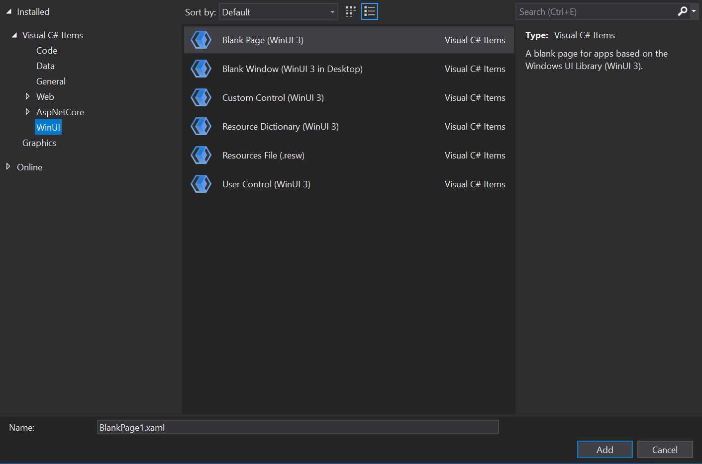

# Create your first WinUI 3 (Windows App SDK) project

In this topic we'll see how to use Visual Studio to create a new [Windows App SDK](/windows/apps/windows-app-sdk/) project for a C# .NET or C++ app that has a [WinUI 3](/windows/apps/winui/winui3/) user interface (UI). We'll also take a look at some of the code in the resulting project, what it does, and how it works.

Links to full installation details are in the steps below. We recommend that you install and target the latest Stable release of the Windows App SDK (see [Stable channel release notes](/windows/apps/windows-app-sdk/stable-channel)).

> [!TIP]
> No matter what version of the Windows App SDK you choose to install and target (or what version of Visual Studio you use), it's important to check any *limitations and known issues* in the release notes for that version (see [Windows App SDK release channels](/windows/apps/windows-app-sdk/release-channels)). By knowing about any *limitations and known issues* for your version of the Windows App SDK, you'll be able to work around them should you run into any of them while following along with the steps in this topic.
>
> If you encounter any other issues, then you'll likely find info about them in GitHub issues, or on the [Discussions tab](https://github.com/microsoft/WindowsAppSDK/discussions), of the **WindowsAppSDK** GitHub repo; or via an online search.

[!INCLUDE [UWP migration guidance](../../windows-app-sdk/includes/uwp-app-sdk-migration-pointer.md)]

## Packaged, unpackaged, and packaged with external location

Packaging is an important consideration of any Windows App SDK project. For more info about your packaging options, see [Advantages and disadvantages of packaging your app](/windows/apps/package-and-deploy/#advantages-and-disadvantages-of-packaging-your-app).

## Packaged: Create a new project for a packaged C# or C++ WinUI 3 desktop app

1. To set up your development computer, see [Install tools for the Windows App SDK](/windows/apps/windows-app-sdk/set-up-your-development-environment).

1. In Visual Studio, select **File** > **New** > **Project**.

1. In the **New Project** dialog's drop-down filters, select **C#**/**C++**, **Windows**, and **winui**, respectively.

1. Select the **Blank App, Packaged (WinUI 3 in Desktop)** project template, and click **Next**. That template creates a desktop app with a WinUI 3-based user interface. The generated project is configured with the package manifest and other support needed to build the app into an MSIX package (see [What is MSIX?](/windows/msix/overview)). For more information about this project template, see [Package your app using single-project MSIX](/windows/apps/windows-app-sdk/single-project-msix).

    :::image type="content" source="images/WinUI3-csharp-newproject-1.0-later.png" alt-text="Screenshot of Create a new project wizard with the Blank App Packaged (Win UI in Desktop) option highlighted." lightbox="images/WinUI3-csharp-newproject-1.0-later.png":::

1. Enter a project name, choose any other options as desired, and click **Create**.

1. The project that Visual Studio generates contains your app's code. The **App.xaml** file and code-behind file(s) define an **Application**-derived class that represents your running app. The **MainWindow.xaml** file and code-behind file(s) define a **MainWindow** class that represents the main window displayed by your app. Those classes derive from types in the **Microsoft.UI.Xaml** namespace provided by WinUI 3.

    The project also includes the package manifest for building the app into an [MSIX package](/windows/msix/overview).

    

1. To add a new item to your app, right-click the project node in **Solution Explorer**, and select **Add** > **New Item**. In the **Add New Item** dialog box, select the **WinUI** tab, choose the item you want to add, and then click **Add**. For more details about the available items, see [WinUI 3 templates in Visual Studio](/windows/apps/winui/winui3/winui-project-templates-in-visual-studio).

    

1. Build and run your solution on your development computer to confirm that the app runs without errors.

## Unpackaged: Create a new project for an unpackaged C# or C++ WinUI 3 desktop app

> [!IMPORTANT]
> Beginning in the Windows App SDK 1.0, the default approach to loading the Windows App SDK from a packaged with external location or unpackaged app is to use *auto-initialization* via the `<WindowsPackageType>` project property (as well as making additional configuration changes). For the steps involved in auto-initialization in the context of WinUI 3 project, continue reading this section. Or, if you have an existing project that's not WinUI 3, then see [Use the Windows App SDK in an existing project](/windows/apps/windows-app-sdk/use-windows-app-sdk-in-existing-project).

1. To set up your development computer, see [Install tools for the Windows App SDK](/windows/apps/windows-app-sdk/set-up-your-development-environment).

1. Download and run the latest *installer* for the Windows App SDK from [Downloads for the Windows App SDK](/windows/apps/windows-app-sdk/downloads). That will install the runtime package dependencies required to run and deploy a packaged with external location or unpackaged app on the target device (see [Windows App SDK deployment guide for framework-dependent apps packaged with external location or unpackaged](/windows/apps/windows-app-sdk/deploy-unpackaged-apps)).

1. **C++**. Install the [Microsoft Visual C++ Redistributable (VCRedist)](/cpp/windows/latest-supported-vc-redist) appropriate for the architecture of the target device.

    - The latest version of the VCRedist is compatible with the latest Visual Studio generally-available (GA) release (that is, not preview), as well as all versions of Visual Studio that can be used to build Windows App SDK binaries.
    - Insider builds of Visual Studio might have installed a later version of the VCRedist, and running the public version will then fail with this error (which you can ignore): **Error 0x80070666: Cannot install a product when a newer version is installed.**

    > [!NOTE]
    > If you don't have the VCRedist installed on the target device, then dynamic links to `c:\windows\system32\vcruntime140.dll` fail. That failure can manifest to end users in various ways.

1. In Visual Studio, select **File** > **New** > **Project**.

1. In the New Project dialog's drop-down filters, select **C#**/**C++**, **Windows**, and **WinUI**, respectively.

1. You need to start with a packaged project in order to use XAML diagnostics. So select the **Blank App, Packaged (WinUI 3 in Desktop)** project template, and click **Next**.

    > [!IMPORTANT]
    > Make sure that the project you just created is targeting the version of the Windows App SDK that you installed with the *installer* in step 2. To do that, in Visual Studio, click **Tools** > **NuGet Package Manager** > **Manage NuGet Packages for Solution...** > **Updates**. And if necessary update the reference to the *Microsoft.WindowsAppSDK* NuGet package. You can see which version is installed on the **Installed** tab.

1. Add the following property to your project file&mdash;either your `.csproj` (C#) or `.vcxproj` (C++) file. Put it inside the **PropertyGroup** element that's already there (for C++, the element will have `Label="Globals"`):

   ```xml
   <Project ...>
     ...
     <PropertyGroup>
       ...
       <WindowsPackageType>None</WindowsPackageType>
       ...
     </PropertyGroup> 
     ...
   </Project>
   ```

1. **C++**. In your C++ project (`.vcxproj`) file, inside the **PropertyGroup** element that's already there, set the *AppxPackage* property to *false*:

   ```xml
   <Project ...>
     ...
     <PropertyGroup Label="Globals">
       ...
       <AppxPackage>false</AppxPackage>
       ...
     </PropertyGroup> 
     ...
   </Project>
   ```

1. **C#**. To start a C# app from Visual Studio (either **Debugging** or **Without Debugging**), select the *Unpackaged* launch profile from the **Start** drop-down. If the *Package* profile is selected, then you'll see a deployment error in Visual Studio. This step isn't necessary if you start the application (`.exe`) from the command line or from Windows File Explorer.
  
      :::image type="content" source="images/winui3-csharp-launch-profile.png" alt-text="Visual Studio - Start drop-down with C# application unpackaged launch profile highlighted":::

1. Build and run.

### The bootstrapper API

Setting the `<WindowsPackageType>None</WindowsPackageType>` project property causes the *auto-initializer* to locate and load a version of the Windows App SDK version that's most appropriate for your app.

If you have advanced needs (such as custom error handling, or to load a specific version of the Windows App SDK), then you can instead call the bootstrapper API explicitly. For more info, see [Use the Windows App SDK runtime for apps packaged with external location or unpackaged](/windows/apps/windows-app-sdk/use-windows-app-sdk-run-time), and [Tutorial: Use the bootstrapper API in an app packaged with external location or unpackaged that uses the Windows App SDK](/windows/apps/windows-app-sdk/tutorial-unpackaged-deployment).

For more info about the bootstrapper, see [Deployment architecture and overview for framework-dependent apps](/windows/apps/windows-app-sdk/deployment-architecture#bootstrapper).

## A look at the code in the project template

In this walkthough, we used the **Blank App, Packaged (WinUI 3 in Desktop)** project template, which creates a desktop app with a WinUI 3-based user interface. Let's take a look at some of the code that comes with that template, and what it does. For more info on available WinUI 3 project and item templates, see [WinUI 3 templates in Visual Studio](/windows/apps/winui/winui3/winui-project-templates-in-visual-studio).

### The app's entry point

When the Windows operating system (OS) runs an app, the OS begins execution in the app's *entry point*. That entry point takes the form of a **Main** (or **wWinMain** for C++/WinRT) function. Ordinarily, a new project configures that function to be auto-generated by the Visual Studio build process. And it's hidden by default, so you don't need to be concerned with it. But if you *are* curious for more info, then see [Single-instancing in Main or wWinMain](/windows/apps/windows-app-sdk/migrate-to-windows-app-sdk/guides/applifecycle#single-instancing-in-main-or-wwinmain).

### The App class

The app as a whole is represented by a class that's typically called simply **App**. That class is defined in **App.xaml** and in its code-behind file(s) (`App.xaml.cs`, or `App.xaml.h` and `.cpp`). **App** is derived from the WinUI 3 [**Microsoft.UI.Xaml.Application**](/windows/windows-app-sdk/api/winrt/microsoft.ui.xaml.application) class.

The generated code in the entry point creates an instance of **App**, and sets it running.

In the constructor of **App**, you'll see the **InitializeComponent** method being called. That method essentially parses the contents of **App.xaml**, which is XAML markup. And that's important because **App.xaml** contains merged resources that need to be resolved and loaded into a dictionary for the running app to use.

Another interesting method of **App** is **OnLaunched**. In there we create and activate a new instance of the **MainWindow** class (which we'll look at next).

### The MainWindow class

The main window displayed by the app is of course represented by the **MainWindow** class. That class is defined in **MainWindow.xaml** and in its code-behind file(s) (`MainWindow.xaml.cs`, or `MainWindow.xaml.h` and `.cpp`). **MainWindow** is derived from the WinUI 3 [**Microsoft.UI.Xaml.Window**](/windows/windows-app-sdk/api/winrt/microsoft.ui.xaml.window) class.

The constructor of **MainWindow** calls its own **InitializeComponent** method. Again, its job is to turn the XAML markup inside **MainWindow.xaml** into a graph of user interface (UI) objects.

In **MainWindow.xaml** you'll see the basic layout of **MainWindow**. At the layout root is a dynamic panel called a [**Microsoft.UI.Xaml.Controls.StackPanel**](/windows/windows-app-sdk/api/winrt/microsoft.ui.xaml.controls.stackpanel). For more info about layout panels, see [Layout panels](/windows/apps/design/layout/layout-panels).

Inside that **StackPanel** is a [**Microsoft.UI.Xaml.Controls.Button**](/uwp/api/windows.ui.xaml.controls.button). And that **Button** uses the markup `Click="myButton_Click"` to declaratively hook up an event handler method for the [**Click**](/uwp/api/windows.ui.xaml.controls.primitives.buttonbase.click) event.

That method is named **myButton_Click**, and you can find the implementation of that method in `MainWindow.xaml.cs`, or in `MainWindow.xaml.cpp`. In it, the content of the button is changed from the default "Click Me" to "Clicked".

**C++**. If you created a C++ project, then you'll also see a `MainWindow.idl` file. For more info, see the [C++/WinRT](/windows/uwp/cpp-and-winrt-apis/) documentation. [XAML controls; bind to a C++/WinRT property](/windows/uwp/cpp-and-winrt-apis/binding-property) is a good place to start learning about the purpose and usage of `.idl` files.

## Next steps

This topic showed how to create a Visual Studio project for a packaged or an unpackaged app. For an example of adding functionality to such an app, see [Tutorial: Create a simple photo viewer with WinUI 3](/windows/apps/get-started/simple-photo-viewer-winui3). That topic walks through the process of building a simple app to display photos.

Then, to continue your development journey with the Windows App SDK, see [Develop Windows desktop apps](/windows/apps/develop/).

## Related topics

* [WinUI 3](/windows/apps/winui/winui3/)
* [Windows App SDK release channels](/windows/apps/windows-app-sdk/release-channels)
* [Install tools for the Windows App SDK](/windows/apps/windows-app-sdk/set-up-your-development-environment)
* [What is MSIX?](/windows/msix/overview)
* [Package your app using single-project MSIX](/windows/apps/windows-app-sdk/single-project-msix)
* [WinUI 3 project templates in Visual Studio](/windows/apps/winui/winui3/winui-project-templates-in-visual-studio)
* [Windows App SDK deployment guide for framework-dependent apps packaged with external location or unpackaged](/windows/apps/windows-app-sdk/deploy-unpackaged-apps)
* [Microsoft Visual C++ Redistributable (VCRedist)](/cpp/windows/latest-supported-vc-redist)
* [Use the Windows App SDK runtime for apps packaged with external location or unpackaged](/windows/apps/windows-app-sdk/use-windows-app-sdk-run-time)
* [Deployment architecture for the Windows App SDK](/windows/apps/windows-app-sdk/deployment-architecture)
* [Tutorial: Use the bootstrapper API in an app packaged with external location or unpackaged that uses the Windows App SDK](/windows/apps/windows-app-sdk/tutorial-unpackaged-deployment)
* [Develop Windows desktop apps](/windows/apps/develop/)
