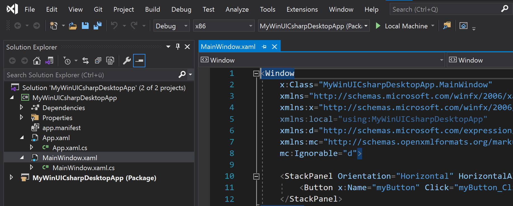
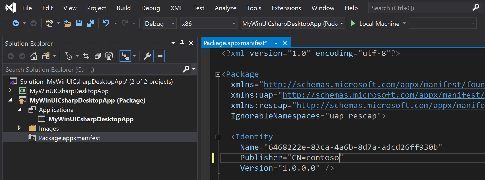
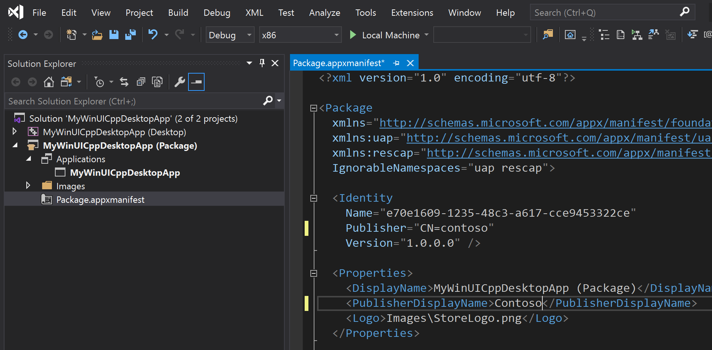
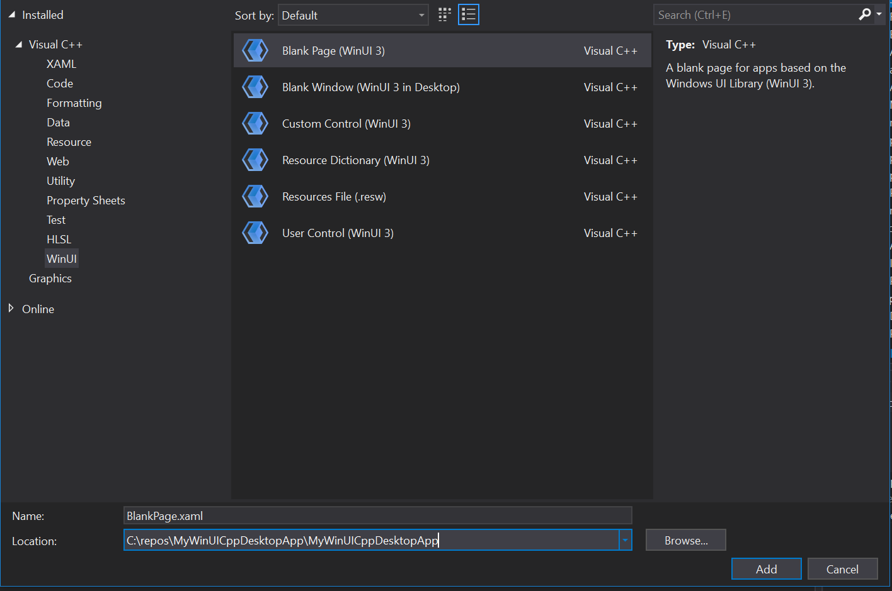

# Create your first WinUI 3 app

The Windows App SDK includes WinUI 3 project templates that enable you to create desktop and UWP apps with an entirely WinUI-based user interface. When you create apps using these project templates, the entire user interface of your application is implemented using windows, controls, and other UI types provided by WinUI 3. For a complete list of the project templates, see [Project templates for WinUI 3](winui-project-templates-in-visual-studio.md#project-templates-for-winui-3).

WinUI 3 ships as a part of the Windows App SDK. For more information, see [Build desktop Windows apps with the Windows App SDK](../../windows-app-sdk/index.md).

> [!NOTE]
> **Project Reunion** is the previous code name for the [Windows App SDK](../../windows-app-sdk/index.md).

## Prerequisites

To use the WinUI 3 project templates described in this article, configure your development computer and install the Windows App SDK extension for Visual Studio. For details, see [Set up your development environment](../../windows-app-sdk/set-up-your-development-environment.md).

> [!NOTE]
> Certain fundamental WinRT types including [CoreWindow](/uwp/api/Windows.UI.Core.CoreWindow), [ApplicationView](/uwp/api/Windows.UI.ViewManagement.ApplicationView), [CoreApplicationView](/uwp/api/Windows.ApplicationModel.Core.CoreApplicationView) [CoreDispatcher](/uwp/api/Windows.UI.Core.CoreDispatcher), and their dependencies are not available in desktop apps. These types were designed specifically for UI scenarios in UWP apps, and they do not behave properly in desktop apps due to threading models and other platform differences. For more information including recommended alternative APIs, see [Windows Runtime APIs not supported in desktop apps](../../desktop/modernize/desktop-to-uwp-supported-api.md).

## Instructions

Choose from one of the following sets of instructions.

### [Desktop - C#/.NET](#tab/desktop-csharp)

To create a WinUI 3 desktop app with C# and .NET 5:

1. In Visual Studio 2019, select **File** -> **New** -> **Project**.

2. In the project drop-down filters, select **C#**, **Windows**, and **WinUI**, respectively.

3. Select the **Blank App, Packaged (WinUI 3 in Desktop)** project type and click **Next**.

    

4. Enter a project name, choose any other options as desired, and click **Create**.

5. In the following dialog box, set the **Target version** to Windows 10, version 2004 (build 19041) and **Minimum version** to Windows 10, version 1809 (build 17763) and then click **OK**.

    

6. At this point, Visual Studio generates two projects:

    * **_Project name_ (Desktop)**: This project contains your app's code. The **App.xaml** file and **App.xaml.cs** code-behind file define an `Application` class that represents your app instance. The **MainWindow.xaml** file and **MainWindow.xaml.cs** code-behind file define a `MainWindow` class that represents the main window displayed by your app. These classes derive from types in the **Microsoft.UI.Xaml** namespace provided by WinUI.

        

    * **_Project name_ (Package)**: This is a [Windows Application Packaging Project](/windows/msix/desktop/desktop-to-uwp-packaging-dot-net) that is configured to build the app into an [MSIX package](/windows/msix/overview). This provides a modern deployment experience, the ability to integrate with Windows 10 and later features via package extensions, and much more. This project contains the [package manifest](/uwp/schemas/appxpackage/uapmanifestschema/schema-root) for your app, and it is the startup project for your solution by default.

        

7. To add a new item to your app project, right-click the **_Project name_ (Desktop)** project node in **Solution Explorer** and select **Add** -> **New Item**. In the **Add New Item** dialog box, select the **WinUI** tab, choose the item you want to add, and then click **Add**. For more details about the available items, see [Item templates for WinUI 3](winui-project-templates-in-visual-studio.md#item-templates-for-winui-3).

    

8. Build and run your solution to confirm that the app runs without errors.

### Localize your WinUI desktop app

To support multiple languages in a WinUI desktop app, and ensure proper localization of your packaged project, add the appropriate resources to the project (see [App resources and the Resource Management System](/windows/uwp/app-resources/)) and declare each supported language in the `package.appxmanifest` file of your project. When you build the project, the specified languages are added to the generated app manifest (`AppxManifest.xml`) and the corresponding resources are used.

1. Open the .wapproj's `package.appxmanifest` in a text editor and locate the following section:

    ```xml
    <Resources>
        <Resource Language="x-generate"/>
    </Resources>
    ```

2. Replace the `<Resource Language="x-generate">` with `<Resource />` elements for each of your supported languages. For example, the following markup specifies that "en-US" and "es-ES" localized resources are available:

    ```xml
    <Resources>
        <Resource Language="en-US"/>
        <Resource Language="es-ES"/>
    </Resources>
    ```

### [Desktop - C++](#tab/desktop-cpp)

To create a WinUI 3 desktop app with C++:

1. In Visual Studio 2019, select **File** -> **New** -> **Project**.

2. In the project drop-down filters, select **C++**, **Windows**, and **WinUI**.

3. Select the **Blank App, Packaged (WinUI 3 in Desktop)** project type and click **Next**.

    

4. Enter a project name, choose any other options as desired, and click **Create**.

5. In the following dialog box, set the **Target version** to Windows 10, version 20004 (build 19041) and **Minimum version** to Windows 10, version 1809 (build 17763) and then click **OK**.

    

6. At this point, Visual Studio generates two projects:

    * **_Project name_ (Desktop)**: This project contains your app's code. The **App.xaml** and various **App** code files define an `Application` class that represents your app instance, and the **MainWindow.xaml** and various **MainWindow** code files define a `MainWindow` class that represents the main window displayed by your app. These classes derive from types in the **Microsoft.UI.Xaml** namespace provided by WinUI.

        

    * **_Project name_ (Package)**: This is a [Windows Application Packaging Project](/windows/msix/desktop/desktop-to-uwp-packaging-dot-net) that is configured to build the app into an [MSIX package](/windows/msix/overview). This provides a modern deployment experience, the ability to integrate with Windows 10 and later features via package extensions, and much more. This project contains the [package manifest](/uwp/schemas/appxpackage/uapmanifestschema/schema-root) for your app, and it is the startup project for your solution by default.

        

7. To add a new item to your app project, right-click the **_Project name_ (Desktop)** project node in **Solution Explorer** and select **Add** -> **New Item**. In the **Add New Item** dialog box, select the **WinUI** tab, choose the item you want to add, and then click **Add**. For more details about the available items, see [Item templates for WinUI 3](winui-project-templates-in-visual-studio.md#item-templates-for-winui-3).

    

8. Build and run your solution to confirm that the app runs without errors.

   > [!NOTE]
   > Only the packaged project will launch, so make sure that one is set as the Startup Project.

### Localize your WinUI desktop app

To support multiple languages in a WinUI desktop app, and ensure proper localization of your packaged project, add the appropriate resources to the project (see [App resources and the Resource Management System](/windows/uwp/app-resources/)) and declare each supported language in the `package.appxmanifest` file of your project. When you build the project, the specified languages are added to the generated app manifest (`AppxManifest.xml`) and the corresponding resources are used.

1. Open the .wapproj's `package.appxmanifest` in a text editor and locate the following section:

    ```xml
    <Resources>
        <Resource Language="x-generate"/>
    </Resources>
    ```

2. Replace the `<Resource Language="x-generate">` with `<Resource />` elements for each of your supported languages. For example, the following markup specifies that "en-US" and "es-ES" localized resources are available:

    ```xml
    <Resources>
        <Resource Language="en-US"/>
        <Resource Language="es-ES"/>
    </Resources>
    ```

### [UWP - C#/.NET](#tab/uwp)

> [!NOTE]
> WinUI 3 support for building UWP apps is currently in preview, and is not production-ready. You will not be able to ship WinUI 3 UWP apps to the Microsoft Store.
>
> You must download the [Windows App SDK Preview Extension for Visual Studio](https://aka.ms/projectreunion/previewdownload) to get the UWP Preview project templates and build UWP apps with WinUI 3.

To create a "WinUI 3 app in UWP" for C#:

1. Using Visual Studio 2019, create a new project.
   - If Visual Studio is running already, select **File** -> **New** -> **Project**.

       :::image type="content" source="images/WinUI-and-UWP/vs2019-menu-file-new-project.png" alt-text="Visual Studio 2019 - File -> New -> Project menu":::

   - Otherwise, launch Visual Studio and select **Create a new project**.

       :::image type="content" source="images/WinUI-and-UWP/vs2019-splash-new-project.png" alt-text="Visual Studio 2019 - Create a new project":::

2. In the **Create a new project** dialog, select **C#**, **Windows**, and **WinUI**, respectively from the project drop-down filters.

3. Select the **[Experimental] Blank App (WinUI in UWP)** project type and click **Next**.

    :::image type="content" source="images/WinUI-and-UWP/vs2019-create-new-project-dialog.png" alt-text="Visual Studio 2019 - Create a new project dialog":::

4. Enter a project name, choose any other options as desired, and click **Create**.

    :::image type="content" source="images/WinUI-and-UWP/vs2019-configure-new-project-dialog.png" alt-text="Screenshot of the Configure your new project dialog box with the Location text box and the Create option highlighted.":::

5. In the following dialog box, set the **Target version** to Windows 10, version 2004 (build 19041) and **Minimum version** to Windows 10, version 1809 (build 17763) and then click **OK**.

    :::image type="content" source="images/WinUI-min-target-version.png" alt-text="Target and Min Version dialog":::

6. Visual Studio generates the **WinUI in UWP** project with the following objects:

    - ***Project name* (Universal Windows)**: Contains your application code. This is the default startup project for your project solution.

        :::image type="content" source="images/WinUI-and-UWP/vs2019-project.png" alt-text="Screenshot of the Solution Explorer panel with the Universal Windows solution highlighted.":::

    - **Package.appxmanifest**: Contains info the system needs to deploy, display, or update your app. For more details, see [App package manifest](/uwp/schemas/appxpackage/appx-package-manifest)

        :::image type="content" source="images/WinUI-and-UWP/vs2019-file-package-manifest.png" alt-text="Visual Studio 2019 - App package manifest":::

    - **App.xaml/App.xaml.cs**: Code files that define the `Application` class, which represents your app instance.

        :::image type="content" source="images/WinUI-and-UWP/vs2019-file-app-xaml.png" alt-text="Visual Studio 2019 - App.xaml file":::

        :::image type="content" source="images/WinUI-and-UWP/vs2019-file-app-xaml-cs.png" alt-text="Visual Studio 2019 - App.xaml.cs file":::

    - **MainPage.xaml/MainPage.xaml.cs**: Code files that represent the main windows displayed by your app. These classes derive from types in the **Microsoft.UI.Xaml** namespace provided by WinUI.

        :::image type="content" source="images/WinUI-and-UWP/vs2019-file-mainpage-xaml.png" alt-text="Visual Studio 2019 - MainPage.xaml file":::

        :::image type="content" source="images/WinUI-and-UWP/vs2019-file-mainpage-xaml-cs.png" alt-text="Visual Studio 2019 - MainPage.xaml.cs file":::

7. To add a new item to your app project, right-click the ***Project name* (Universal Windows)** project node in **Solution Explorer** and select **Add** -> **New Item**. In the **Add New Item** dialog box, select the **WinUI** tab, choose the item you want to add, and then click **Add**. For more details about the available items, see [Item templates for WinUI 3](winui-project-templates-in-visual-studio.md#item-templates-for-winui-3).

    :::image type="content" source="images/WinUI-and-UWP/vs2019-add-new-item-dialog.png" alt-text="Visual Studio 2019 - Add new item dialog":::

8. Build, deploy, and launch your app to see what it looks like.

    1. You can debug your app on the local machine, in a simulator or emulator, or on a remote device. Select your target device from the drop down.

        :::image type="content" source="images/WinUI-and-UWP/vs2019-menu-target-device.png" alt-text="Screenshot of the Local Machine dropdown list.":::

    1. Press F5, click the **Build** button, or select **Debug -> Start Debugging** to build and run your solution and confirm the app runs without errors.

        :::image type="content" source="images/WinUI-and-UWP/vs2019-project-running.png" alt-text="Screenshot of the app running showing the Click Me button.":::

---
