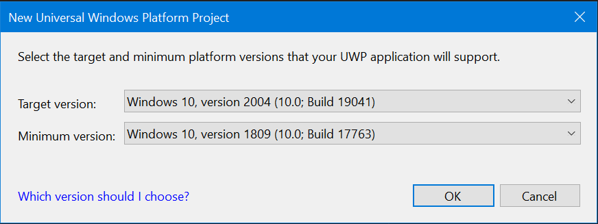

# Get started with WinUI 3 for desktop apps

WinUI 3 Preview 2 introduces new project templates that enable you to create managed desktop C#/.NET Core and native C++/Win32 desktop apps with an entirely WinUI-based user interface. When you create apps using these project templates, the entire user interface of your application is implemented using windows, controls, and other UI types provided by WinUI 3. For a complete list of the project templates, see [this section](index.md#project-templates-for-winui-3).

## Prerequisites

To use the WinUI 3 for desktop project templates described in this article, configure your development computer and install WinUI 3 Preview 2 by following the instructions [here](index.md#install-winui-3-preview-2).

## Create a WinUI 3 desktop app for C# and .NET 5

1. In Visual Studio 2019, select **File** -> **New** -> **Project**.

2. In the project drop-down filters, select **C#**, **Windows**, and **WinUI**, respectively.

3. Select the **Blank App, Packaged (WinUI in Desktop)** project type and click **Next**.

    

4. Enter a project name, choose any other options as desired, and click **Create**.

5. In the following dialog box, set the **Target version** to Windows 10, version 1903 (build 18362) and **Minimum version** to Windows 10, version 1803 (build 17134) and then click **OK**.

    

6. At this point, Visual Studio generates two projects:

    * ***Project name* (Desktop)**: This project contains your app's code. The **App.xaml.cs** code file defines an `Application` class that represents your app instance, and the **MainWindow.xaml.cs** code file defines a `MainWindow` class that represents the main window displayed by your app. These classes derive from types in the **Microsoft.UI.Xaml** namespace provided by WinUI.

        

    * ***Project name* (Package)**: This is a [Windows Application Packaging Project](/windows/msix/desktop/desktop-to-uwp-packaging-dot-net) that is configured to build the app into an [MSIX package](/windows/msix/overview). This provides a modern deployment experience, the ability to integrate with Windows 10 features via package extensions, and much more. This project contains the [package manifest](/uwp/schemas/appxpackage/uapmanifestschema/schema-root) for your app, and it is the startup project for your solution by default.

        

7. To add a new item to your app project, right-click the ***Project name* (Desktop)** project node in **Solution Explorer** and select **Add** -> **New Item**. In the **Add New Item** dialog box, select the **WinUI** tab, choose the item you want to add, and then click **Add**. For more details about the available items, see [this section](index.md#item-templates-for-winui-3).

    

8. Build and run your solution to confirm that the app runs without errors.

## Create a WinUI 3 desktop app for C++/Win32

1. In Visual Studio 2019, select **File** -> **New** -> **Project**.

2. In the project drop-down filters, select **C++**, **Windows**, and **WinUI**.

3. Select the **Blank App, Packaged (WinUI in Desktop)** project type and click **Next**.

    

4. Enter a project name, choose any other options as desired, and click **Create**.

5. In the following dialog box, set the **Target version** to Windows 10, version 1903 (build 18362) and **Minimum version** to Windows 10, version 1803 (build 17134) and then click **OK**.

    

6. At this point, Visual Studio generates two projects:

    * ***Project name* (Desktop)**: This project contains your app's code. The **App.xaml** and various **App** code files define an `Application` class that represents your app instance, and the **MainWindow.xaml** and various **MainWindow** code files define a `MainWindow` class that represents the main window displayed by your app. These classes derive from types in the **Microsoft.UI.Xaml** namespace provided by WinUI.

        

    * ***Project name* (Package)**: This is a [Windows Application Packaging Project](/windows/msix/desktop/desktop-to-uwp-packaging-dot-net) that is configured to build the app into an [MSIX package](/windows/msix/overview). This provides a modern deployment experience, the ability to integrate with Windows 10 features via package extensions, and much more. This project contains the [package manifest](/uwp/schemas/appxpackage/uapmanifestschema/schema-root) for your app, and it is the startup project for your solution by default.

        

7. To add a new item to your app project, right-click the ***Project name* (Desktop)** project node in **Solution Explorer** and select **Add** -> **New Item**. In the **Add New Item** dialog box, select the **WinUI** tab, choose the item you want to add, and then click **Add**. For more details about the available items, see [this section](index.md#item-templates-for-winui-3).

    

8. Build and run your solution to confirm that the app runs without errors.

## Known issues and limitations

For a list of known issues and limitations, see [this section](index.md#preview-2-limitations-and-known-issues).

## Related topics

* [Windows UI Library 3](index.md)