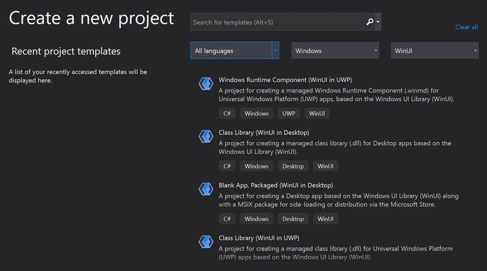
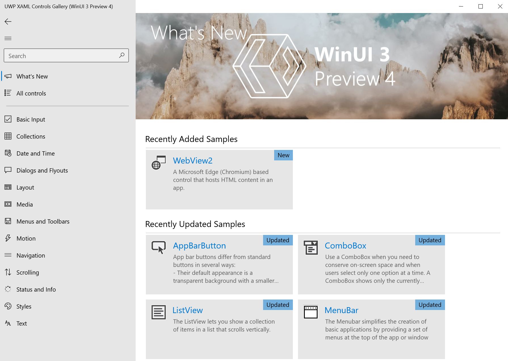

# Windows UI Library 3.0 Preview 1 (May 2020)

Windows UI Library (WinUI) 3.0 is a major update that transforms WinUI into a full UX framework for all types of Windows apps—from Win32 to UWP.

> [!Important]
> This WinUI 3.0 preview release is intended for early evaluation and to gather feedback from the developer community. It should **NOT** be used for production apps.
>
> **See [Preview 1 limitations and known issues](#preview-1-limitations-and-known-issues)**.
## New features in WinUI 3.0 Preview 1

- Ability to create Desktop apps with WinUI, including [.NET 5](https://github.com/dotnet/core/tree/master/release-notes/5.0) for Win32 apps
- [RadialGradientBrush](/windows/uwp/design/style/brushes#radial-gradient-brushes)
- [TabView updates](/windows/uwp/design/controls-and-patterns/tab-view)
- Dark theme updates
- Improvements and updates to [WebView2](https://docs.microsoft.com/microsoft-edge/hosting/webview2)
  - Support for High DPI
  - Support for window resizing and moving
  - Updated to target more recent version of Edge
  - No longer necessary to reference a WebView2-specific Nuget package
- SwapChainPanel
- Improvements required for open source migration

For more information on both the benefits of WinUI 3.0 and the WinUI roadmap, see the [Windows UI Library Roadmap](https://github.com/microsoft/microsoft-ui-xaml/blob/master/docs/roadmap.md) on GitHub.

### Provide feedback and suggestions

We welcome your feedback in the [WinUI GitHub repo](https://github.com/microsoft/microsoft-ui-xaml/issues/new/choose).

## Try WinUI 3.0 Preview 1

Configure your development environment (for detailed instructions see [Configure your dev environment](#configure-your-dev-environment)), install the WinUI 3.0 Preview 1 VSIX from the following link, and try out the WinUI 3.0 project templates.

<table>
<tr>
<td align="center">

<!--
 
<a href="https://aka.ms/winui3/previewdownload">Download the WinUI 3.0 Preview 1 VSIX</a>
-->
</td>
</tr>
</table>

You can also clone and build the WinUI 3.0 Preview 1 version of the [Xaml Controls Gallery](#xaml-controls-gallery-winui-30-preview-1-branch).

### Configure your dev environment

Ensure that your development computer has Windows 10 April 2018 Update (version 1803 - build 17134) or newer installed.

Install Visual Studio 2019, version 16.7 Preview 1. You can download this from  [Visual Studio Preview](https://visualstudio.microsoft.com/vs/preview).

You must include the following workloads when installing the Visual Studio Preview:

- .NET Desktop Development
- Universal Windows Platform development

To build C++ apps you must also include the following workloads:

- Desktop development with C++
- The *C++ (v142) Universal Windows Platform tools* optional component for the Universal Windows Platform workload

### Visual Studio project templates

To access the WinUI 3.0 Preview 1 and project templates, go to **https://aka.ms/winui3/previewdownload**

Download the Visual Studio Extension (`.vsix`) to add the WinUI project templates and NuGget package to Visual Studio 2019.

For directions on how to add the `.vsix` to Visual Studio, see [Finding and Using Visual Studio Extensions](https://docs.microsoft.com/visualstudio/ide/finding-and-using-visual-studio-extensions?view=vs-2019#install-without-using-the-manage-extensions-dialog-box).

After installing the `.vsix` extension you can create a new WinUI 3.0 project by searching for "WinUI" and selecting one of the available C# or C++ templates.

 
*Example of the WinUI 3.0 Visual Studio Templates*

### Visual Studio project configuration

When you create a project using one of the WinUI 3.0 Preview 1 templates, set the **Target version** to Windows 10, version 1903 (build 18362) and **Minimum version** to Windows 10, version 1803 (build 17134).

To change these values after you create a project, right-click the project in **Solution Explorer** and select **Properties**.

### Creating a Desktop Win32 app with WinUI 3.0 Preview 1

See [Get started with WinUI 3.0 for desktop apps](get-started-winui3-for-desktop.md).

Aside from the limitations and known issues outlined below, building an app using WinUI 3.0 Preview 1 is very similar to building a UWP app with Xaml and WinUI 2.x, so most of the guidance and documentation for UWP apps and `Windows.UI` APIs is applicable.

## Preview 1 limitations and known issues

The Preview 1 release is just that, a preview. The scenarios around Desktop Win32 apps are especially new. Please expect bugs, limitations, and issues.

The following items are some of the known issues with WinUI 3.0 Preview 1. If you find an issue that isn't listed below, please let us know by contributing to an existing issue or filing a new issue on the [WinUI GitHub repo](https://github.com/microsoft/microsoft-ui-xaml/issues/new/choose).

### Platform and OS support

WinUI 3.0 Preview 1 is compatible with PCs running the Windows 10 April 2018 Update (version 1803 - build 17134) and newer.

### Developer tools

- Desktop apps support .NET 5 and C# 8, and must be packaged.
- UWP apps support .NET Native and C# 7.3
- Intellisense is incomplete
- No visual designer
- No hot reload
- No live visual tree
- Development with VS Code is not yet supported
- New C++/CX apps are not supported, however, your existing apps will continue to function (please move to C++/WinRT as soon as possible)
- WinUI 3.0 content can only be in one window per process or one ApplicationView per app
- Unpackaged desktop deployment is not supported
- No ARM64 support

### Missing Platform Features

- No support for Xbox
- No support for HoloLens
- No support for windowed popups
- No inking support
- Background Acrylic
- MediaElement and MediaPlayerElement
- RenderTargetBitmap
- MapControl
- Hierarchical navigation with NavigationView
- SwapChainPanel does not support transparency
- Global Reveal uses fallback behavior, a solid brush
- XAML Islands is not supported in this release
- 3rd party ecosystem libraries will not fully function
- IMEs do not work
- Methods on Windows.UI.Text namespace cannot be called

### Known issues

- In C# Desktop apps:
   - You need to use `WinRT.WeakReference<T>` rather than `System.WeakReference<T>` for weak references to Windows objects (including Xaml objects).
   - The [Point](https://docs.microsoft.com/uwp/api/Windows.Foundation.Point), [Rect](https://docs.microsoft.com/uwp/api/Windows.Foundation.Rect), and [Size](https://docs.microsoft.com/uwp/api/Windows.Foundation.Size) structs have members that are of type Float rather than Double.

## Xaml Controls Gallery (WinUI 3.0 Preview 1 branch)

See the [WinUI 3.0 Preview 1 branch of the Xaml Controls Gallery](https://github.com/microsoft/Xaml-Controls-Gallery/tree/winui3preview) for a sample app that includes all WinUI 3.0 Preview 1 controls and features.

 
*Example of the WinUI 3.0 Preview 1 Xaml Controls Gallery app*

To download the sample, clone the **winui3preview** branch using the following command:

> `git clone --single-branch --branch winui3preview https://github.com/microsoft/Xaml-Controls-Gallery.git`

After cloning, ensure that you switch to the **winui3preview** branch in your local Git environment:

> `git checkout winui3preview`
