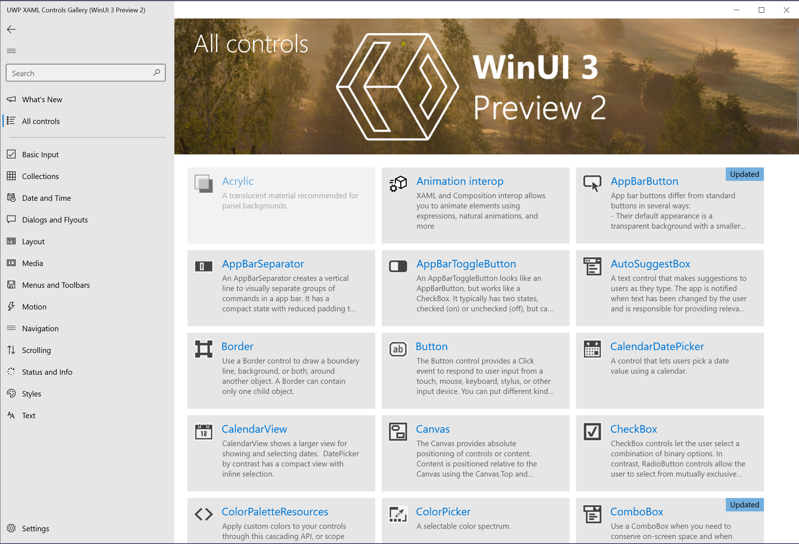

# Windows UI Library 3 Preview 2 (July 2020)

Windows UI Library (WinUI) 3 is a native user experience (UX) framework for both Windows Desktop and UWP apps.

**WinUI 3 Preview 2** is a quality and stability-driven release with a focus on fixing bugs and known issues from the Preview 1 release.

**See [Preview 2 limitations and known issues](#preview-2-limitations-and-known-issues)**.

> [!Important]
> This WinUI 3 preview release is intended for early evaluation and to gather feedback from the developer community. It should **NOT** be used for production apps.
>
> We will continue shipping preview releases of WinUI 3 throughout 2020 and into early 2021, after which the first official release will be made available.
>
> Please use the [WinUI GitHub repo](https://github.com/microsoft/microsoft-ui-xaml) to provide feedback and log suggestions and issues.

## Install WinUI 3 Preview 2

WinUI 3 Preview 2 includes Visual Studio project templates to help get started building apps with a WinUI-based user interface, and a NuGet package that contains the WinUI libraries. To install WinUI 3 Preview 2, follow these steps.

> [!NOTE]
> You can also clone and build the WinUI 3 Preview 2 version of the [XAML Controls Gallery](#xaml-controls-gallery-winui-3-preview-2-branch).

1. Ensure that your development computer has Windows 10, version 1803 (build 17134), or newer installed.

2. Install [Visual Studio 2019, version 16.7.2](https://visualstudio.microsoft.com/vs/)

    You must include the following workloads when installing Visual Studio:
    - .NET Desktop Development
    - Universal Windows Platform development

    To build C++ apps, you must also include the following workloads:
    - Desktop development with C++
    - The *C++ (v142) Universal Windows Platform tools* optional component for the Universal Windows Platform workload (see "Installation Details" under the "Universal Windows Platform development" section, on the right pane)

    Once you've downloaded Visual Studio, make sure you enable .NET previews within the program: 
    - Go to Tools > Options > Preview Features > Select "Use previews of the .NET Core SDK (requires restart)". 

3. If you want to create desktop WinUI projects for C#/.NET 5 and C++/Win32 apps, you must also install both x64 and x86 versions of .NET 5 Preview 5. **Note that .NET 5 Preview 5 is currently the only supported .NET 5 preview for WinUI 3**:

    - x64: [https://aka.ms/dotnet/net5/preview5/Sdk/dotnet-sdk-win-x64.exe](https://aka.ms/dotnet/net5/preview5/Sdk/dotnet-sdk-win-x64.exe)
    - x86: [https://aka.ms/dotnet/net5/preview5/Sdk/dotnet-sdk-win-x86.exe](https://aka.ms/dotnet/net5/preview5/Sdk/dotnet-sdk-win-x86.exe)

4. Download and install the [WinUI 3 Preview 2 VSIX package](https://aka.ms/winui3/previewdownload). This VSIX package adds the WinUI 3 project templates and NuGet package containing the WinUI 3 libraries to Visual Studio 2019.

    For directions on how to add the VSIX package to Visual Studio, see [Finding and Using Visual Studio Extensions](/visualstudio/ide/finding-and-using-visual-studio-extensions?view=vs-2019#install-without-using-the-manage-extensions-dialog-box).


## Create WinUI projects

After installing the WinUI 3 Preview 2 VSIX package, you're ready to create a new project using one of the WinUI project templates in Visual Studio. To access the WinUI project templates in the **Create a new project** dialog, filter the language to **C++** or **C#**, the platform to **Windows**, and the project type to **WinUI**. Alternatively, you can search for *WinUI* and select one of the available C# or C++ templates.


For more information about getting started with the WinUI project templates, see the following articles:

- [Get started with WinUI 3 for desktop apps](get-started-winui3-for-desktop.md)
- [Get started with WinUI 3 for UWP apps](get-started-winui3-for-uwp.md)

Aside from the [limitations and known issues](#preview-2-limitations-and-known-issues), building an app using the WinUI projects is  similar to building a UWP app with XAML and WinUI 2.x. Therefore, most of the guidance and documentation for UWP apps and the **Windows.UI** WinRT namespaces in the Windows SDK is applicable.

If you created a project using WinUI 3 Preview 1, you can upgrade your project to use Preview 2. See the detailed instructions on [our GitHub repository](https://aka.ms/winui3/upgrade-instructions).

### Project templates for WinUI 3

You can use these WinUI project templates to create apps.

| Template | Language | Description |
|----------|----------|-------------|
| Blank App, Packaged (WinUI in Desktop) | C# and C++ | Creates a desktop .NET 5 (C#) or native Win32 (C++) app with a WinUI-based user interface. The generated project includes a basic window that derives from the **Microsoft.UI.Xaml.Window** class in the WinUI library that you can use to start building your UI. For more information about this project type, see [Get started with WinUI 3 for desktop apps](get-started-winui3-for-desktop.md).<p></p>The solution also includes a [Windows Application Packaging Project](/windows/msix/desktop/desktop-to-uwp-packaging-dot-net) that is configured to build the app into an [MSIX package](/windows/msix/overview). This provides a modern deployment experience, the ability to integrate with Windows 10 features via package extensions, and much more.  |
| Blank App (WinUI in UWP)  | C# and C++ | Creates a UWP app that with a WinUI-based user interface. The generated project includes a basic page that derives from the **Microsoft.UI.Xaml.Controls.Page** class in the WinUI library that you can use to start building your UI. For more information about this project type, see [Get started with WinUI 3 for UWP apps](get-started-winui3-for-uwp.md). |

You can use these WinUI project templates to build components that can be loaded and used by a WinUI-based app.

| Template | Language | Description |
|----------|----------|-------------|
| Class Library (WinUI in Desktop) | C# only | Creates a .NET 5 managed class library (DLL) in C# that can be used by other .NET 5 desktop apps with a WinUI-based user interface.  |
| Class Library (WinUI in UWP)  | C# only | Creates a managed class library (DLL) in C# that can be used by other UWP apps with a WinUI-based user interface. |
| Windows Runtime Component (WinUI in UWP) | C# and C++ | Creates a [Windows Runtime component](/windows/uwp/winrt-components/) written in C# or C++/WinRT that can be consumed by any UWP app with a WinUI-based user interface, regardless of the programming language in which the app is written. |

### Item templates for WinUI 3

The following item templates are available to be used in a WinUI project. To access these WinUI project templates, right-click the project node in **Solution Explorer**, select **Add** -> **New item**, and click **WinUI** in the **Add New Item** dialog.


| Template | Language | Description |
|----------|----------|-------------|
| Blank Page (WinUI) | C# and C++ | Adds a XAML file and code file that defines a new page that derives from the **Microsoft.UI.Xaml.Controls.Page** class in the WinUI library. |
| Blank Window (WinUI in Desktop) | C# and C++ | Adds a XAML file and code file that defines a new window that derives from the **Microsoft.UI.Xaml.Window** class in the WinUI library. |
| Custom Control (WinUI) | C# and C++ | Adds a code file for creating a templated control with a default style. The templated control derives from the **Microsoft.UI.Xaml.Controls.Control** class in the WinUI library.<p></p>For a walkthrough that demonstrates how to use this item template, see [Templated XAML controls for UWP and WinUI 3 apps with C++/WinRT](xaml-templated-controls-cppwinrt-winui3.md). For more information about templated controls, see [Custom XAML Controls](/archive/msdn-magazine/2019/may/xaml-custom-xaml-controls). |
| Resource Dictionary (WinUI) | C# and C++ | Adds an empty, keyed collection of XAML resources. For more information, see [ResourceDictionary and XAML resource references](/windows/uwp/design/controls-and-patterns/resourcedictionary-and-xaml-resource-references). |
| Resources File (WinUI) | C# and C++ | Adds a file for storing string and conditional resources for your app. You can use this item to help localize your app. For more info, see [Localize strings in your UI and app package manifest](/windows/uwp/app-resources/localize-strings-ui-manifest). |
| User Control (WinUI) | C# and C++ | Adds a XAML file and code file for creating a user control that derives from the **Microsoft.UI.Xaml.Controls.UserControl** class in the WinUI library. Typically, a user control encapsulates related existing controls and provide its own logic.<p></p>For more information about user controls, see [Custom XAML Controls](/archive/msdn-magazine/2019/may/xaml-custom-xaml-controls). |

## Bug fixes and other improvements in WinUI 3 Preview 2

This is a comprehensive list of bug fixes and other updates for Preview 2. See our [release announcement](https://aka.ms/winui3/preview2-announcement) for a list of the most critical bug fixes addressed in this release.

> [!NOTE]
> WinUI 3 Preview 2 uses version 2.4.2 of the WinUI 2 Library. 

- [INotifyCollectionChanged](/dotnet/api/system.collections.specialized.inotifycollectionchanged?view=net-5.0) and [INotifyPropertyChanged](/dotnet/api/system.componentmodel.inotifypropertychanged?view=net-5.0) now work as expected in C# Desktop apps
  - This cleared up a couple of other issues that revolved around collections controls not updating in the UI while being updated in the backend.
  - *Thanks to @hshristov for filing a [similar issue](https://github.com/microsoft/microsoft-ui-xaml/issues/2490) on GitHub!*
- Preview 2 is now compatible with [.NET 5 Preview 5](/dotnet/api/?view=net-5.0) for Desktop apps
- WinUI 3 now has parity with [WinUI 2.4](../winui2/release-notes/winui-2.4.md), which includes new controls and features like [hierarchical NavigationView](../winui2/release-notes/winui-2.4.md#hierarchical-navigation) and [ProgressRing](../winui2/release-notes/winui-2.4.md#progressring).
- Crash fixed: Using [TabView](/windows/uwp/design/controls-and-patterns/tab-view) with touch
- [NavigationView](/windows/uwp/design/controls-and-patterns/navigationview) in the [XAML Controls Gallery sample](#xaml-controls-gallery-winui-3-preview-2-branch) now uses Left mode instead of Left-compact mode
- Crash fixed: typing too quickly in Input Validation and [RichEditBox](/windows/uwp/design/controls-and-patterns/rich-edit-box)
  - *Thanks to @paulovilla for filing [this issue](https://github.com/microsoft/microsoft-ui-xaml/issues/2563) on GitHub!*
- Crash fixed: interacting with XAML UI while the [TextBox](/windows/uwp/design/controls-and-patterns/text-box) menu is up
- [XAML Controls Gallery sample](#xaml-controls-gallery-winui-3-preview-2-branch) title text is no longer scrambled after navigating to multiple pages
- Using touch with [WebView2](/microsoft-edge/webview2/) no longer gives you a slight offset in position
- Classes in WinUIEdit.dll have been moved from Windows.UI.Text namespace to Microsoft.UI.Text namespace
- Crash fixed: selecting item in [TreeView](/windows/uwp/design/controls-and-patterns/tree-view) in multi-select mode (in  Windows 10 version 1803)
- Point, Rect, and Size members are now Double-type in the C# projection of the APIs for Desktop apps.
  - *Thanks to @dotMorten for filing [this issue](https://github.com/microsoft/microsoft-ui-xaml/issues/2474) on GitHub!*
- Crash fixed: using [RichEditBox](/windows/uwp/design/controls-and-patterns/rich-edit-box) with an .rtf file
- [TabView](/windows/uwp/design/controls-and-patterns/tab-view) close button no longer has a blank tooltip
- [Image](/windows/uwp/design/controls-and-patterns/images-imagebrushes) control now correctly renders SVG files
  - *Thanks to @mqudsi for filing [this issue](https://github.com/microsoft/microsoft-ui-xaml/issues/2565) on GitHub!*
- Crash fixed: using/navigating to Page element
- Using touch to select items in a [NavigationView](/windows/uwp/design/controls-and-patterns/navigationview) now deselects all other items (in single selection mode)
- Crash fixed: LayoutSliderException due to value set on specifically-sized [Slider](/windows/uwp/design/controls-and-patterns/slider) control no longer occurs 
  - *Thanks to @hig-dev for filing [this issue](https://github.com/microsoft/microsoft-ui-xaml/issues/477) on GitHub!*
- Crash fixed: using [ColorPicker](/windows/uwp/design/controls-and-patterns/color-picker) caused a crash at shutdown
- Crash fixed: using [Pivot](/windows/uwp/design/controls-and-patterns/pivot) caused a crash at shutdown
- Crash fixed: [NavigationView](/windows/uwp/design/controls-and-patterns/navigationview) crash caused by missing resource in Windows 10 version 1803
- Crash fixed: Focusing on [RichEditBox](/windows/uwp/design/controls-and-patterns/rich-edit-box) custom editor 
- Crash fixed: [SemanticZoom](/windows/uwp/design/controls-and-patterns/semantic-zoom) 
- Binding now works as expected in markup with Mode=OneWay being implicit
  - *Thanks to @tomasfabian for filing [this issue](https://github.com/microsoft/microsoft-ui-xaml/issues/2630) on GitHub!*
- Fixed animation: What's New in [XAML Controls Gallery sample](#xaml-controls-gallery-winui-3-preview-2-branch)

## New features and capabilities introduced in WinUI 3 Preview 1

The following features and capabilities were introduced in WinUI 3 Preview 1 and continue to be supported in WinUI 3 Preview 2.

- Ability to create Desktop apps with WinUI, including [.NET 5](https://github.com/dotnet/core/tree/master/release-notes/5.0) for Win32 apps
- [RadialGradientBrush](/windows/uwp/design/style/brushes#radial-gradient-brushes)
- [TabView updates](/windows/uwp/design/controls-and-patterns/tab-view)
- Dark theme updates
- Improvements and updates to [WebView2](/microsoft-edge/hosting/webview2)
  - Support for High DPI
  - Support for window resizing and moving
  - Updated to target more recent version of Edge
  - No longer necessary to reference a WebView2-specific Nuget package
- SwapChainPanel
- Improvements required for open source migration

For more information on both the benefits of WinUI 3 and the WinUI roadmap, see the [Windows UI Library Roadmap](https://github.com/microsoft/microsoft-ui-xaml/blob/master/docs/roadmap.md) on GitHub.

### Provide feedback and suggestions

We welcome your feedback in the [WinUI GitHub repo](https://github.com/microsoft/microsoft-ui-xaml/issues/new/choose).

## Preview 2 limitations and known issues

The Preview 2 release is just that, a preview. The scenarios around Desktop Win32 apps are especially new. Please expect bugs, limitations, and other issues.

The following items are some of the known issues with WinUI 3 Preview 2. If you find an issue that isn't listed below, please let us know by contributing to an existing issue or filing a new issue on the [WinUI GitHub repo](https://github.com/microsoft/microsoft-ui-xaml/issues/new/choose).

### Platform and OS support

WinUI 3 Preview 2 is compatible with PCs running the Windows 10 April 2018 Update (version 1803 - build 17134) and newer.

### Developer tools

- Only C# and C++/WinRT apps are supported at this time
- Desktop apps support .NET 5 and C# 8, and must be packaged
- UWP apps support .NET Native and C# 7.3
- Intellisense is incomplete
- No visual designer
- No hot reload
- No live visual tree
- Development with VS Code is not yet supported
- New C++/CX apps are not supported, however, your existing apps will continue to function (please move to C++/WinRT as soon as possible)
- WinUI 3 content can only be in one window per process or one ApplicationView per app
- Unpackaged desktop deployment is not supported
- No ARM64 support
- C# Custom Controls in UWP apps: `Themes/Generic.xaml` is not automatically generated. You can work around this by manually creating a Themes folder in your class and putting a XAML file inside of it called `Generic.xaml`.
- After adding a WinUI custom control to your project, your files may be missing the "CustomControl.h" header. You can workaround this by manually adding that header into your `pch.h` file.
- Adding DataGrid, other Windows Community Toolkit controls, and third-party library controls may cause your build to fail. To work around this issue, add this merged dictionary to your `App.xaml` file:
  ```xaml
  <ResourceDictionary Source="ms-appx:///<library_name>/Themes/Generic.xaml"/>
  ```

### Missing Platform Features

- Xbox support
- HoloLens support
- Windowed popups
- Inking support
- Background Acrylic
- MediaElement and MediaPlayerElement
- RenderTargetBitmap
- MapControl
- SwapChainPanel does not support transparency
- Global Reveal uses fallback behavior, a solid brush
- XAML Islands is not supported in this release
- 3rd party ecosystem libraries will not fully function
- IMEs do not work

### Known issues


- C# UWP apps:

  The WinUI 3 framework is a set of WinRT components, and while WinRT has similar types and objects like those found in .NET, they are not inherently compatible.  The C#/WinRT projections handle the interop between .NET and WinRT in .NET 5, allowing you to freely use .NET interfaces in your .NET 5 app today. 
  
  However, C#/WinRT is not able to handle the interop in .NET Native apps, so the WinUI 3 APIs are projected directly in UWP apps. Thus, you are no longer able to use those same .NET interfaces. **Once UWP apps are no longer using .NET Native, this limitation will no longer exist**.

  For example, the `INotifyPropertyChanged` API is projected in the `System.ComponentModel` namespace for WinUI3 in Desktop apps, but it appears in the `Microsoft.UI.Xaml.Data` namespace for WinUI3 in UWP apps (and all C++ apps). 
  
  This issue applies to:
    - `INotifyPropertyChanged` (and related types)
    - `INotifyCollectionChanged`
    - `ICommand`

> [!Note] 
> With `INotifyPropertyChanged` and `INotifyCollectionChanged` not working as expected, the `ObservableCollection<T>` class will also be affected. For an example of implementing your own version of `ObservableCollection<T>`, see [this sample](https://github.com/microsoft/Xaml-Controls-Gallery/blob/winui3preview/XamlControlsGallery/CollectionsInterop.cs). 


## XAML Controls Gallery (WinUI 3 Preview 2 branch)

See the [WinUI 3 Preview 2 branch of the XAML Controls Gallery](https://github.com/microsoft/Xaml-Controls-Gallery/tree/winui3preview) for a sample app that includes all WinUI 3 Preview 2 controls and features.

<br/>
*Example of the WinUI 3 Preview 2 XAML Controls Gallery app*

To download the sample, clone the **winui3preview** branch using the following command:

```
git clone --single-branch --branch winui3preview https://github.com/microsoft/Xaml-Controls-Gallery.git
```

After cloning, ensure that you switch to the **winui3preview** branch in your local Git environment:

```
git checkout winui3preview
```