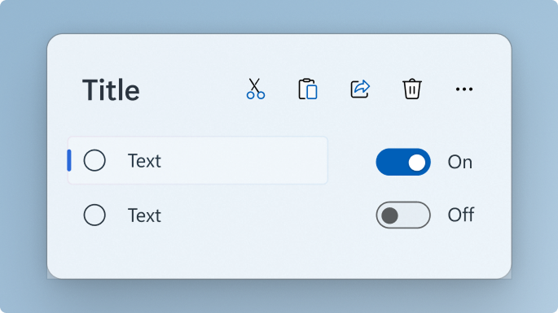
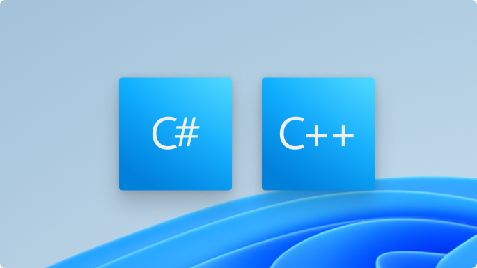
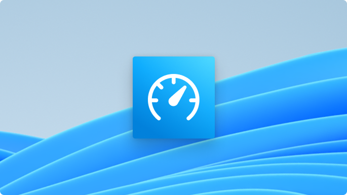
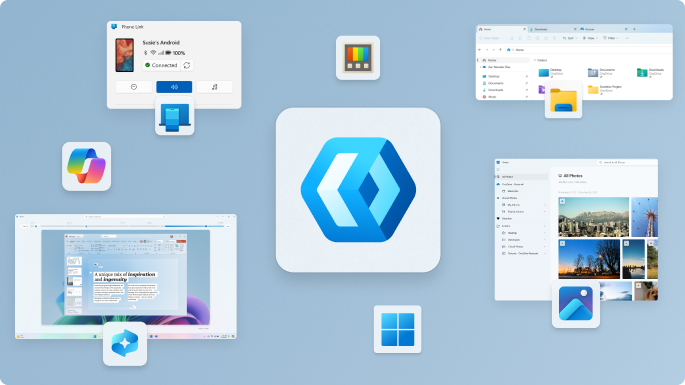
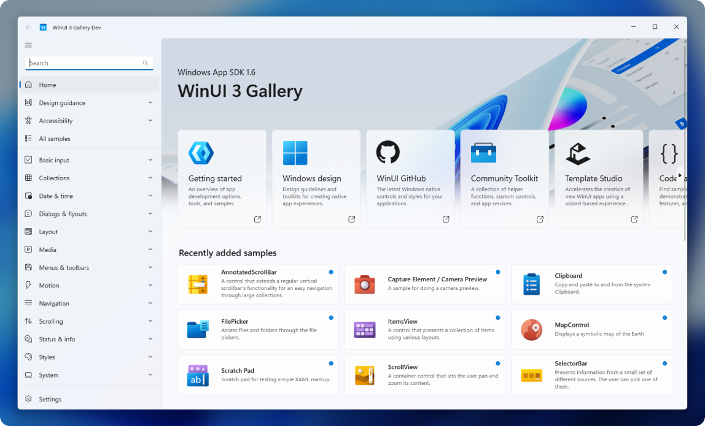

# WinUI 3

:::image type="icon" source="images/winui-hero.png":::

WinUI 3 is the recommended native UI framework for building new Windows desktop applications. It brings the Fluent Design System, high-performance rendering, and a powerful XAML-based programming model to both C# and C++ developers.

Delivered as part of the [Windows App SDK](../../windows-app-sdk/index.md), WinUI enables you to create modern, polished, and responsive desktop experiences that run on Windows 10, version 1809 (build 17763) and later, including Windows 11.

WinUI is built in the open, and contributions or discussions are welcome. Visit the repository for details:

	<a href="https://github.com/microsoft/microsoft-ui-xaml" class="button button-sm">View on GitHub</a>

To stay up to date with what's new with WinUI, check out the [latest Windows App SDK release notes](../../windows-app-sdk/release-notes/windows-app-sdk-1-8.md).

:::image type="content" source="images/hero-controlset.png" alt-text="Diagram of the Windows App SDK architecture" border="false":::

### Key benefits of WinUI

WinUI combines the flexibility of the Win32 app model with the richness of modern Windows UX. It's designed for developers who want to build production-grade desktop apps using the same design language and system features as built-in Windows experiences.

:::row:::
    :::column:::
        
    :::column-end:::
    :::column span="2":::
        **Modern UI** 
         WinUI includes a comprehensive set of modern UI controls and styles, designed for usability, adaptability, and a polished, Fluent look and feel.
         
         [Explore Fluent Design](../../design/index.md)
    :::column-end:::    
:::row-end:::

:::row:::
    :::column:::
        
    :::column-end:::
    :::column span="2":::
        **Code in your preferred language** 
         Use .NET (C#) or C++ with XAML markup to build apps that run seamlessly across x86, x64, and ARM devices.
    :::column-end:::    
:::row-end:::

:::row:::
    :::column:::
        
    :::column-end:::
    :::column span="2":::
        **Optimized for modern experiences and hardware** 
         Create rich, high-performance apps with advanced pixel rendering, high-DPI visuals, and smooth animations, optimized for modern hardware and input methods such as touch, pen, keyboard, and mouse.
    :::column-end:::    
:::row-end:::

:::row:::
    :::column:::
        
    :::column-end:::
    :::column span="2":::
        **Built on the Windows App SDK** 
         WinUI is part of the Windows App SDK, giving you access to modern Windows APIs, consistent app behaviors, and tools that simplify development and deployment.
          
         [Learn more about the Windows App SDK](../../windows-app-sdk/index.md)
    :::column-end:::    
:::row-end:::

:::row:::
    :::column:::
        
    :::column-end:::
    :::column span="2":::
        **Powers key experiences in Windows** 
        Parts of the Windows shell and its built-in apps are built with WinUI. Open-source projects like [PowerToys](/windows/powertoys/) are also built with WinUI.
    :::column-end:::    
:::row-end:::

---

## Get started with WinUI

To get started with WinUI, try out these resources:

:::row:::
    :::column:::
         
        **[Hello, WinUI](../../get-started/start-here.md)** 
        Setup your development environment and build your first WinUI app.
    :::column-end:::
    :::column:::
         
        **[WinUI 3 Gallery](../../dev-tools/samples.md#winui-3-gallery)** 
        Explore interactive examples of WinUI controls, features, and functionality.
    :::column-end:::
    :::column:::
         
        **[Tools and samples](../../dev-tools/samples.md)** 
        Tools, samples, and AI-powered resources to help you apps faster.
    :::column-end:::
:::row-end:::
