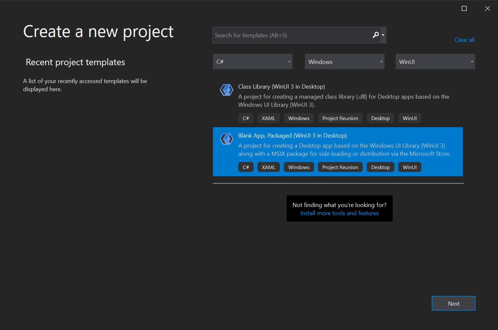

# WinUI 3 project templates in Visual Studio

After installing the Windows App SDK VSIX [and setting up your dev environment](../../windows-app-sdk/set-up-your-development-environment.md), you're ready to create a WinUI 3 app using one of the WinUI project templates in Visual Studio. To access the WinUI project templates in the **Create a new project** dialog, filter the language to **C++** or **C#**, the platform to **Windows**, and the project type to **WinUI**. Alternatively, you can search for *WinUI* and select one of the available C# or C++ templates.

Note that there are two versions of the Windows App SDK Visual Studio Extension available: the [stable VSIX](https://aka.ms/windowsappsdk/stable-vsix) and the [experimental VSIX](https://aka.ms/windowsappsdk/experimental-vsix). The stable VSIX includes project templates that can be used for building MSIX-packaged desktop production apps. The experimental VSIX includes project templates that enable experimental features and can be used for building MSIX-packaged desktop apps, non-packaged desktop apps, or UWP apps. 

## Project templates for WinUI 3

You can use these WinUI project templates to create apps.

| Template | Language | Description |
|----------|----------|-------------|
| Blank App, Packaged (WinUI 3 in Desktop) | C# and C++ | Creates a desktop .NET 5 (C#) or native Win32 (C++) app with a WinUI-based user interface. The generated project includes a basic window that derives from the **Microsoft.UI.Xaml.Window** class in the WinUI library that you can use to start building your UI. For more information about this project type, see [Create your first WinUI 3 app](create-your-first-winui3-app.md).

The solution also includes a [Windows Application Packaging Project](/windows/msix/desktop/desktop-to-uwp-packaging-dot-net) that is configured to build the app into an [MSIX package](/windows/msix/overview). This provides a modern deployment experience, the ability to integrate with Windows 10 and later features via package extensions, and much more.  |
| [Experimental] Blank App (WinUI 3 in UWP) | C# and C++ | Creates a UWP app that with a WinUI-based user interface. The generated project includes a basic page that derives from the **Microsoft.UI.Xaml.Controls.Page** class in the WinUI library that you can use to start building your UI. For more information about this project type, see [Create your first WinUI 3 app](create-your-first-winui3-app.md). |

> [!NOTE]
> To enhance the developer experience of working in the **WinUI 3 in Desktop** projects, you can optionally install the single-project MSIX packaging tools extension for Visual Studio and combine the packaging project settings into your application project. This extension enables you to develop and build your MSIX-packaged application without requiring a separate packaging project. For more information, see [Package your app using single-project MSIX](../../windows-app-sdk/single-project-msix.md).

You can use these WinUI project templates to build components that can be loaded and used by a WinUI-based app.

| Template | Language | Description |
|----------|----------|-------------|
| Class Library (WinUI 3 in Desktop) | C# only | Creates a .NET 5 managed class library (DLL) in C# that can be used by other .NET 5 desktop apps with a WinUI-based user interface.  |
| [Experimental] Class Library (WinUI 3 in UWP)  | C# only | Creates a managed class library (DLL) in C# that can be used by other UWP apps with a WinUI-based user interface. |
| Windows Runtime Component (WinUI 3) | C++ | Creates a [Windows Runtime component](/windows/uwp/winrt-components/) written in C++/WinRT that can be consumed by any UWP or desktop app with a WinUI-based user interface, regardless of the programming language in which the app is written. |
| [Experimental] Windows Runtime Component (WinUI 3 in UWP) | C# | Creates a [Windows Runtime component](/windows/uwp/winrt-components/) written in C# that can be consumed by any UWP app with a WinUI-based user interface, regardless of the programming language in which the app is written. |

## Item templates for WinUI 3

The following item templates are available for use in a WinUI project. To access these WinUI item templates, right-click the project node in **Solution Explorer**, select **Add** -> **New item**, and click **WinUI** in the **Add New Item** dialog.

> [!NOTE]
> If you have the [experimental channel](../../windows-app-sdk/experimental-channel.md) or an older preview release of the Windows App SDK installed, you may see a second set of Item Templates that have the [Experimental] prefix. We recommend that you use those [Experimental] item templates if you're building a non-production/preview app, and use the stable, non-marked item templates if you're building a production desktop app.

| Template | Language | Description |
|----------|----------|-------------|
| Blank Page (WinUI 3) | C# and C++ | Adds a XAML file and code file that defines a new page derived from the **Microsoft.UI.Xaml.Controls.Page** class in the WinUI library. |
| Blank Window (WinUI 3 in Desktop) | C# and C++ | Adds a XAML file and code file that defines a new window derived from the **Microsoft.UI.Xaml.Window** class in the WinUI library. |
| Custom Control (WinUI 3) | C# and C++ | Adds a code file for creating a templated control with a default style. The templated control is derived from the **Microsoft.UI.Xaml.Controls.Control** class in the WinUI library.

For a walkthrough that demonstrates how to use this item template, see [Templated XAML controls for UWP and WinUI 3 apps with C++/WinRT](xaml-templated-controls-cppwinrt-winui-3.md) and [Templated XAML controls for UWP and WinUI 3 apps with C#](xaml-templated-controls-csharp-winui-3.md). For more information about templated controls, see [Custom XAML Controls](/archive/msdn-magazine/2019/may/xaml-custom-xaml-controls). |
| Resource Dictionary (WinUI 3) | C# and C++ | Adds an empty, keyed collection of XAML resources. For more information, see [ResourceDictionary and XAML resource references](/windows/uwp/design/controls-and-patterns/resourcedictionary-and-xaml-resource-references). |
| Resources File (WinUI 3) | C# and C++ | Adds a file for storing string and conditional resources for your app. You can use this item to help localize your app. For more info, see [Localize strings in your UI and app package manifest](/windows/uwp/app-resources/localize-strings-ui-manifest). |
| User Control (WinUI 3) | C# and C++ | Adds a XAML file and code file for creating a user control that derives from the **Microsoft.UI.Xaml.Controls.UserControl** class in the WinUI library. Typically, a user control encapsulates related existing controls and provide its own logic.

For more information about user controls, see [Custom XAML Controls](/archive/msdn-magazine/2019/may/xaml-custom-xaml-controls). |

## See also

- [Windows App SDK](../../windows-app-sdk/index.md)
- [Stable release channel for the Windows App SDK](../../windows-app-sdk/stable-channel.md)
- [Windows App SDK Samples](https://github.com/microsoft/WindowsAppSDK-Samples)
