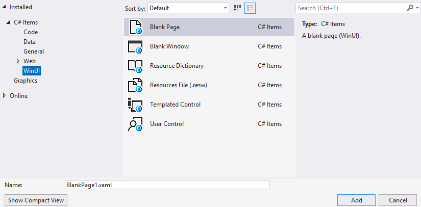

# WinUI 3 templates in Visual Studio

Once you've set up your development computer (see [Start developing Windows apps](../../get-started/start-here.md)), you're ready to create a WinUI 3 app by starting from one of the project templates in Visual Studio. This topic describes the available project and item templates.

To access the WinUI 3 project templates, in the **New Project** dialog's drop-down filters, select **WinUI** in the project type drop-down. Alternatively, you can search for *WinUI*, and select one of the available C# or C++ templates.

:::image type="content" source="images/WinUI3-csharp-newproject-1.0-later.png" alt-text="WinUI project templates" border="true":::

## Project templates for WinUI 3

You can use these WinUI 3 project templates to start creating an app.

### WinUI Blank App (Packaged)

This project template creates a desktop .NET (C#) or native Win32 (C++) app with a WinUI 3-based user interface. The generated project includes a basic window that derives from the **Microsoft.UI.Xaml.Window** class in the WinUI 3 library that you can use to start building your UI. For more information about using this project template, see [Start developing Windows apps](../../get-started/start-here.md).

### WinUI Blank App (Packaged with Windows Application Packaging Project)

This project template creates a desktop .NET (C#) or native Win32 (C++) app with a WinUI 3-based user interface. The generated project includes a basic window that derives from the **Microsoft.UI.Xaml.Window** class in the WinUI 3 library that you can use to start building your UI.

The solution also includes a separate [Windows Application Packaging Project](/windows/msix/desktop/desktop-to-uwp-packaging-dot-net) that is configured to build the app into an [MSIX package](/windows/msix/overview). You can optionally install the [single-project MSIX packaging tools extension for Visual Studio](../../windows-app-sdk/single-project-msix.md) and combine the packaging project settings into your application project so you no longer need to maintain a separate packaging project.

### WinUI project templates for other components

You can use these WinUI 3 project templates to build components that can be loaded and used by a WinUI 3-based app.

| Template | Language | Description |
|----------|----------|-------------|
| WinUI Class Library | C# only | Creates a .NET managed class library (DLL) in C# that can be used by other .NET desktop apps with a WinUI 3-based user interface. |
| Windows Runtime Component (WinUI 3) | C++ only | Creates a [Windows Runtime component](/windows/uwp/winrt-components/) written in C++/WinRT that can be consumed by any UWP or desktop app with a WinUI 3-based user interface, regardless of the programming language in which the app is written. |
| WinUI Unit Test App | C#/C++ | Creates a unit test project using MSTest to help you write and run automated tests for your app. |

## Item templates for WinUI 3

The following item templates are available for use in a WinUI 3 project. To access these WinUI 3 item templates, right-click the project node in **Solution Explorer**, select **Add** -> **New item**, and click **WinUI** in the **Add New Item** dialog.

| Template | Language | Description |
|----------|----------|-------------|
| Blank Page | C# and C++ | Adds a XAML file and code file that defines a new page derived from the **Microsoft.UI.Xaml.Controls.Page** class. |
| Blank Window | C# and C++ | Adds a XAML file and code file that defines a new window derived from the **Microsoft.UI.Xaml.Window** class. |
| Resource Dictionary | C# and C++ | Adds an empty, keyed collection of XAML resources. For more information, see [ResourceDictionary and XAML resource references](../../develop/platform/xaml/xaml-resource-dictionary.md). |
| Resources File (.resw) | C# and C++ | Adds a file for storing string and conditional resources for your app. You can use this item to help localize your app. For more info, see [Localize strings in your UI and app package manifest](/windows/uwp/app-resources/localize-strings-ui-manifest). |
| Templated Control | C# and C++ | Adds a code file for creating a templated control with a default style. The templated control is derived from the **Microsoft.UI.Xaml.Controls.Control** class.

For a walkthrough that demonstrates how to use this item template, see [Templated XAML controls for UWP and WinUI 3 apps with C++/WinRT](xaml-templated-controls-cppwinrt-winui-3.md) and [Templated XAML controls for UWP and WinUI 3 apps with C#](xaml-templated-controls-csharp-winui-3.md). For more information about templated controls, see [Custom XAML Controls](/archive/msdn-magazine/2019/may/xaml-custom-xaml-controls). |
| User Control | C# and C++ | Adds a XAML file and code file for creating a user control that derives from the **Microsoft.UI.Xaml.Controls.UserControl** class. Typically, a user control encapsulates related existing controls and provide its own logic.

For more information about user controls, see [Custom XAML Controls](/archive/msdn-magazine/2019/may/xaml-custom-xaml-controls). |

## See also

* [Windows App SDK](../../windows-app-sdk/index.md)
* [Start developing Windows apps](../../get-started/start-here.md)
* [Windows App SDK Samples](https://github.com/microsoft/WindowsAppSDK-Samples)
