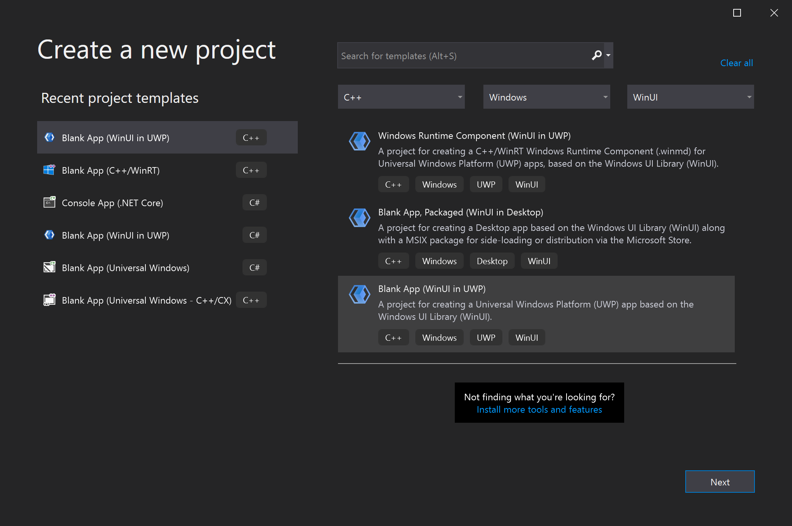
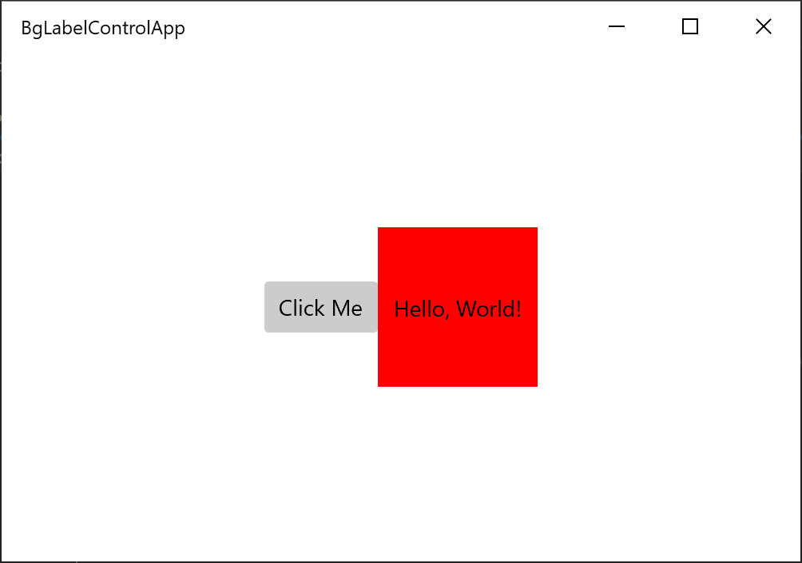

# Build XAML controls with C++/WinRT

This article walks you through creating a templated XAML control for WinUI 3 with C++/WinRT. Templated controls inherit from **Microsoft.UI.Xaml.Controls.Control** and have visual structure and visual behavior that can be customized using XAML control templates. This article describes the same scenario as the article [XAML custom (templated) controls with C++/WinRT](/windows/uwp/cpp-and-winrt-apis/xaml-cust-ctrl) but has been adapted to use WinUI 3.

## Prerequisites

1. Set up your development environment&mdash;see [Install tools for the Windows App SDK](../../windows-app-sdk/set-up-your-development-environment.md).
2. Download and install the latest version of the [C++/WinRT Visual Studio Extension (VSIX)](https://marketplace.visualstudio.com/items?itemName=CppWinRTTeam.cppwinrt101804264)
3. Follow the instructions on how to [Create your first WinUI 3 project](create-your-first-winui3-app.md). 

## Create a Blank App (BgLabelControlApp)

Begin by creating a new project in Microsoft Visual Studio. In the `Create a new project` dialog, select the **Blank App (WinUI in UWP)** project template, making sure to select the C++ language version. Set the project name to "BgLabelControlApp" so that the file names align with the code in the examples below. Set the **Target version** to Windows 10, version 1903 (build 18362) and **Minimum version** to Windows 10, version 1803 (build 17134). This walkthrough will also work for desktop apps created with the **Blank App, Packaged (WinUI in Desktop)** project template, just make sure to perform all of the steps in the **BgLabelControlApp (Desktop)** project.



## Add a templated control to your app

To add a templated control, click the **Project** menu in the toolbar or right-click your project in **Solution Explorer** and select  **Add New Item** . Under **Visual C++->WinUI** select the **Custom Control (WinUI)** template. Name the new control "BgLabelControl" and click *Add*. This will add three new files to your project. `BgLabelControl.h` is the header containing the control declarations and `BgLabelControl.cpp` contains the C++/WinRT implementation of the control. `BgLabelControl.idl` is the Interface Definition file that allows the control to be instantiated as a runtime class.

## Implement the BgLabelControl custom control class

In the following steps you will update the code in the `BgLabelControl.idl`, `BgLabelControl.h`, and `BgLabelControl.cpp` files in the project directory to implement the runtime class. 

The templated control class will be instantiated from XAML markup, and for that reason it's going to be a runtime class. When you build the finished project, the MIDL compiler (midl.exe) will use the `BgLabelControl.idl` file to a generate the Windows Runtime metadata file (.winmd) for your control, which consumers of your component will reference. For more information on creating runtime classes, see [Author APIs with C++/WinRT](/windows/uwp/cpp-and-winrt-apis/author-apis).

The templated control we are creating will expose a single property which is a string that will be used as a label for the control. Replace the contents of `BgLabelControl.idl` with the following code..

```cppwinrt
// BgLabelControl.idl
namespace BgLabelControlApp
{
    runtimeclass BgLabelControl : Microsoft.UI.Xaml.Controls.Control
    {
        BgLabelControl();
        static Microsoft.UI.Xaml.DependencyProperty LabelProperty{ get; };
        String Label;
    }
}
```

The listing above shows the pattern that you follow when declaring a dependency property (DP). There are two pieces to each DP. First, you declare a read-only static property of type DependencyProperty. It has the name of your DP plus Property. You'll use this static property in your implementation. Second, you declare a read-write instance property with the type and name of your DP. If you wish to author an attached property (rather than a DP), then see the code examples in [Custom attached properties](/windows/uwp/xaml-platform/custom-attached-properties).

Note that the XAML classes referenced in the code above are in Microsoft.UI.Xaml namespaces. This is what distinguishes them as WinUI controls as opposed to UWP XAML controls, which are defined in Windows.UI.XAML namespaces.

Replace the contents of BgLabelControl.h with the following code.

```cppwinrt
// BgLabelControl.h
#pragma once
#include "BgLabelControl.g.h"

namespace winrt::BgLabelControlApp::implementation
{
    struct BgLabelControl : BgLabelControlT<BgLabelControl>
    {
        BgLabelControl() { DefaultStyleKey(winrt::box_value(L"BgLabelControlApp.BgLabelControl")); }

        winrt::hstring Label()
        {
            return winrt::unbox_value<winrt::hstring>(GetValue(m_labelProperty));
        }

        void Label(winrt::hstring const& value)
        {
            SetValue(m_labelProperty, winrt::box_value(value));
        }

        static Microsoft::UI::Xaml::DependencyProperty LabelProperty() { return m_labelProperty; }

        static void OnLabelChanged(Microsoft::UI::Xaml::DependencyObject const&, Microsoft::UI::Xaml::DependencyPropertyChangedEventArgs const&);

    private:
        static Microsoft::UI::Xaml::DependencyProperty m_labelProperty;
    };
}
namespace winrt::BgLabelControlApp::factory_implementation
{
    struct BgLabelControl : BgLabelControlT<BgLabelControl, implementation::BgLabelControl>
    {
    };
}
```

The code shown above implements the **Label** and **LabelProperty** properties, add a static event handler named **OnLabelChanged** to process changes to the value of the dependency property, and adds a private member to store the backing field for **LabelProperty**. Again, note that the XAML classes referenced in the header file are in the Microsoft.UI.Xaml namespaces that belong to the WinUI 3 framework instead of the Windows.UI.Xaml namespaces used by the UWP UI framework.


Next, replace the contents of BgLabelControl.cpp with the following code.

```cppwinrt
// BgLabelControl.cpp
#include "pch.h"
#include "BgLabelControl.h"
#if __has_include("BgLabelControl.g.cpp")
#include "BgLabelControl.g.cpp"
#endif

namespace winrt::BgLabelControlApp::implementation
{
    Microsoft::UI::Xaml::DependencyProperty BgLabelControl::m_labelProperty =
        Microsoft::UI::Xaml::DependencyProperty::Register(
            L"Label",
            winrt::xaml_typename<winrt::hstring>(),
            winrt::xaml_typename<BgLabelControlApp::BgLabelControl>(),
            Microsoft::UI::Xaml::PropertyMetadata{ winrt::box_value(L"default label"), Microsoft::UI::Xaml::PropertyChangedCallback{ &BgLabelControl::OnLabelChanged } }
    );

    void BgLabelControl::OnLabelChanged(Microsoft::UI::Xaml::DependencyObject const& d, Microsoft::UI::Xaml::DependencyPropertyChangedEventArgs const& /* e */)
    {
        if (BgLabelControlApp::BgLabelControl theControl{ d.try_as<BgLabelControlApp::BgLabelControl>() })
        {
            // Call members of the projected type via theControl.

            BgLabelControlApp::implementation::BgLabelControl* ptr{ winrt::get_self<BgLabelControlApp::implementation::BgLabelControl>(theControl) };
            // Call members of the implementation type via ptr.
        }
    }
}
```
This walkthrough won't use the **OnLabelChanged** callback, but it's provided so that you can see how to register a dependency property with a property-changed callback. The implementation of **OnLabelChanged** also shows how to obtain a derived projected type from a base projected type (the base projected type is DependencyObject, in this case). And it shows how to then obtain a pointer to the type that implements the projected type. That second operation will naturally only be possible in the project that implements the projected type (that is, the project that implements the runtime class).

The [xaml_typename](/uwp/cpp-ref-for-winrt/xaml-typename) function is provided by the Windows.UI.Xaml.Interop namespace that is not included by default in the WinUI 3 project template. Add a line to the precompiled header file for your project, `pch.h`, to include the header file associated with this namespace.

```cppwinrt
// pch.h
...
#include <winrt/Windows.UI.Xaml.Interop.h>
...
```


## Define the default style for BgLabelControl

In its constructor, **BgLabelControl** sets a default style key for itself. A templated control needs to have a default style — containing a default control template — which it can use to render itself with in case the consumer of the control doesn't set a style and/or template. In this section we'll add a markup file to the project containing our default style.

Make sure that **Show All Files** is still toggled on (in **Solution Explorer**). Under your project node, create a new folder (not a filter, but a folder) and name it "Themes". Under `Themes`, add a new item of type **Visual C++ > WinUI > Resource Dictionary (WinUI)**, and name it "Generic.xaml". The folder and file names have to be like this in order for the XAML framework to find the default style for a templated control. Delete the default contents of Generic.xaml, and paste in the markup below.

```xaml
<!-- \Themes\Generic.xaml -->
<ResourceDictionary
    xmlns="http://schemas.microsoft.com/winfx/2006/xaml/presentation"
    xmlns:x="http://schemas.microsoft.com/winfx/2006/xaml"
    xmlns:local="using:BgLabelControlApp">

    <Style TargetType="local:BgLabelControl" >
        <Setter Property="Template">
            <Setter.Value>
                <ControlTemplate TargetType="local:BgLabelControl">
                    <Grid Width="100" Height="100" Background="{TemplateBinding Background}">
                        <TextBlock HorizontalAlignment="Center" VerticalAlignment="Center" Text="{TemplateBinding Label}"/>
                    </Grid>
                </ControlTemplate>
            </Setter.Value>
        </Setter>
    </Style>
</ResourceDictionary>
```

In this case, the only property that the default style sets is the control template. The template consists of a square (whose background is bound to the **Background** property that all instances of the XAML **Control** type have), and a text element (whose text is bound to the **BgLabelControl::Label** dependency property).

## Add an instance of BgLabelControl to the main UI page

Open `MainPage.xaml`, which contains the XAML markup for our main UI page. Immediately after the **Button** element (inside the **StackPanel**), add the following markup.

```xaml
<local:BgLabelControl Background="Red" Label="Hello, World!"/>
```

Also, add the following include directive to `MainPage.h` so that the **MainPage** type (a combination of compiling XAML markup and imperative code) is aware of the **BgLabelControl** templated control type. If you want to use **BgLabelControl** from another XAML page, then add this same include directive to the header file for that page, too. Or, alternatively, just put a single include directive in your precompiled header file.

```cppwinrt
//MainPage.h
...
#include "BgLabelControl.h"
...
```

Now build and run the project. You'll see that the default control template is binding to the background brush, and to the label, of the **BgLabelControl** instance in the markup.



## Implementing overridable functions, such as **MeasureOverride** and **OnApplyTemplate**

You derive a templated control from the **Control** runtime class, which itself further derives from base runtime classes. And there are overridable methods of **Control**, **FrameworkElement**, and **UIElement** that you can override in your derived class. Here's a code example showing you how to do that.

```cppwinrt
// Control overrides.
void OnPointerPressed(Microsoft::UI::Xaml::Input::PointerRoutedEventArgs const& /* e */) const { ... };

// FrameworkElement overrides.
Windows::Foundation::Size MeasureOverride(Windows::Foundation::Size const& /* availableSize */) const { ... };
void OnApplyTemplate() const { ... };

// UIElement overrides.
Microsoft::UI::Xaml::Automation::Peers::AutomationPeer OnCreateAutomationPeer() const { ... };
```

*Overridable* functions present themselves differently in different language projections. In C#, for example, overridable functions typically appear as protected virtual functions. In C++/WinRT, they're neither virtual nor protected, but you can still override them and provide your own implementation, as shown above.


## Generating the control source files without using a template.

This section shows how you can generate the necessary source files for creating your custom control without using the **Custom Control** item template. 

First, add a new Midl File (.idl) item to the project. From the **Project** menu, select **Add New Item...** and type "MIDL" in the search box to find the .idl file item. Name the new file `BgLabelControl.idl` so that the name will be consistent with the steps in this article. Delete the default contents of `BgLabelControl.idl`, and paste in the runtime class declaration shown in the steps above.


After saving the new .idl file, the next step is to generate the Windows Runtime metadata file (.winmd) and stubs for the .cpp and .h implementation files that you will use to implement the templated control. Generate these files by building the solution, which will cause the MIDL compiler (midl.exe) to compile the .idl file you created. Note that the Solution will not build successfully and Visual Studio will show build errors in the output window, but the necessary files will be generated.

Copy the stub files BgLabelControl.h and BgLabelControl.cpp from \BgLabelControlApp\BgLabelControlApp\Generated Files\sources\ into the project folder. In **Solution Explorer**, make sure Show All Files is toggled on. Right-click the stub files that you copied, and click **Include In Project**.

The compiler places a static_assert line at the top of BgLabelControl.h and BgLabelControl.cpp to prevent the generated files from being compiled. When implementing your control, you should remove these lines from the files you have placed in your project directory. For this walkthrough, you can just overwrite the entire contents of the files with the code provided above.

## See also

- [Windows App SDK](../../windows-app-sdk/index.md)
- [Stable release channel for the Windows App SDK](../../windows-app-sdk/stable-channel.md)
- [Windows App SDK Samples](https://github.com/microsoft/WindowsAppSDK-Samples)
