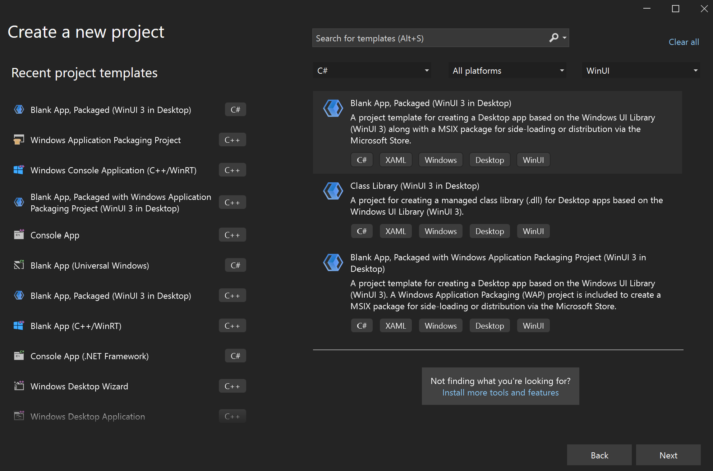

# Build XAML controls with C#

This article walks you through creating a templated XAML control for WinUI 3 with C#. Templated controls inherit from **Microsoft.UI.Xaml.Controls.Control** and have visual structure and visual behavior that can be customized using XAML control templates.

To create standalone WinUI 3 components in C# for consumption from both C# and C++/WinRT apps, see the article [Walkthrough: Create a C# component with WinUI 3 controls, and consume it from a C++ Windows App SDK application](../../develop/platform/csharp-winrt/create-winrt-component-winui-cswinrt.md).

## Prerequisites

1. Set up your development environment&mdash;see [Install tools for the Windows App SDK](../../windows-app-sdk/set-up-your-development-environment.md).
2. Follow the instructions on how to [Create your first WinUI 3 project](create-your-first-winui3-app.md).

## Create a Blank App (BgLabelControlApp)

Begin by creating a new project in Microsoft Visual Studio. In the **Create a new project** dialog, select the **Blank App, Packaged (WinUI 3 in Desktop)** project template, making sure to select the C# language version. Set the project name to "BgLabelControlApp" so that the file names align with the code in the examples below. 



## Add a templated control to your app

To add a templated control, click the **Project** menu in the toolbar or right-click your project in **Solution Explorer** and select  **Add New Item** . Under **Visual C#->WinUI** select the **Custom Control (WinUI 3)** template. Name the new control "BgLabelControl" and click *Add*. 

## Update the custom control C# file

In the C# file, BgLabelControl.cs, note that the constructor defines the **DefaultStyleKey** property for our control. This key identifies the default template that will be used if the consumer of the control doesn't explicitly specify a template. The key value is the *type* of our control. We will see this key in use later when we implement our generic template file.

```csharp
public BgLabelControl()
{
    this.DefaultStyleKey = typeof(BgLabelControl);
}
```

Our templated control will have a text label that can be set programmatically in code, in XAML, or via data binding. In order for the system to keep the text of our control's label up to date, it needs to be implemented as a [DependencyPropety](/uwp/api/Windows.UI.Xaml.DependencyProperty). To do this, first we declare a string property and call it **Label**. Instead of using a backing variable, we set and get the value of our dependency property by calling [GetValue](/uwp/api/windows.ui.xaml.dependencyobject.getvalue) and [SetValue](/uwp/api/windows.ui.xaml.dependencyobject.setvalue). These methods are provided by the [DependencyObject](/uwp/api/windows.ui.xaml.dependencyobject), which **Microsoft.UI.Xaml.Controls.Control** inherits.

```csharp
public string Label
{
    get => (string)GetValue(LabelProperty);
    set => SetValue(LabelProperty, value);
}
```
Next, declare the dependency property and register it with the system by calling [DependencyProperty.Register](/uwp/api/windows.ui.xaml.dependencyproperty.register). This method specifies the name and type of our **Label** property, the type of the owner of the property, our **BgLabelControl** class, and the default value for the property.

```csharp
DependencyProperty LabelProperty = DependencyProperty.Register(
    nameof(Label), 
    typeof(string),
    typeof(BgLabelControl), 
    new PropertyMetadata(default(string), new PropertyChangedCallback(OnLabelChanged)));
```

These two steps are all that's required to implement a dependency property, but for this example, we'll add an optional handler for the **OnLabelChanged** event. This event is raised by the system whenever the property value is updated. In this case we check to see if the new label text is an empty string or not and update a class variable accordingly.

```csharp
public bool HasLabelValue { get; set; }

private static void OnLabelChanged(DependencyObject d, DependencyPropertyChangedEventArgs e)
{
    BgLabelControl labelControl = d as BgLabelControl; //null checks omitted
    String s = e.NewValue as String; //null checks omitted
    if (s == String.Empty)
    {
        labelControl.HasLabelValue = false;
    }
    else
    {
        labelControl.HasLabelValue = true;
    }
}
```

For more information on how dependency properties work, see [Dependency properties overview](/windows/uwp/xaml-platform/dependency-properties-overview).

## Define the default style for BgLabelControl
A templated control must provide a default style template that is used if the user of the control doesn't explicitly set a style. In this step, we will modify the generic template file for our control.

The generic template file is generated when you add the **Custom Control (WinUI)** to your app. The file is named "Generic.xaml" and is generated in the **Themes** folder in solution explorer. The folder and file names are required in order for the XAML framework to find the default style for a templated control. Delete the default contents of Generic.xaml, and paste in the markup below.


```xaml
<!-- \Themes\Generic.xaml -->
<ResourceDictionary
    xmlns="http://schemas.microsoft.com/winfx/2006/xaml/presentation"
    xmlns:x="http://schemas.microsoft.com/winfx/2006/xaml"
    xmlns:local="using:BgLabelControlApp">

    <Style TargetType="local:BgLabelControl" >
        <Setter Property="Template">
            <Setter.Value>
                <ControlTemplate TargetType="local:BgLabelControl">
                    <Grid Width="100" Height="100" Background="{TemplateBinding Background}">
                        <TextBlock HorizontalAlignment="Center" VerticalAlignment="Center" Text="{TemplateBinding Label}"/>
                    </Grid>
                </ControlTemplate>
            </Setter.Value>
        </Setter>
    </Style>
</ResourceDictionary>
```

In this example you can see that the **TargetType** attribute of the **Style** element is set to our **BgLabelControl** type within the **BgLabelControlApp** namespace. This type is the same value as we specified above for the **DefaultStyleKey** property in the control's constructor which identifies this as the default style for the control.

The **Text** property of the **TextBlock** in the control template is bound to our control's **Label** dependency property. The property is bound using the [TemplateBinding](/windows/uwp/xaml-platform/templatebinding-markup-extension) markup extension. This example also binds the **Grid** background to the **Background** dependency property which is inherited from the **Control** class.

## Add an instance of BgLabelControl to the main UI page

Open `MainWindow.xaml`, which contains the XAML markup for our main UI page. Immediately after the **Button** element (inside the **StackPanel**), add the following markup.

```xaml
<local:BgLabelControl Background="Red" Label="Hello, World!"/>
```

Build and run the app and you will see the templated control, with the background color and label we specified.


## See also

- [Windows App SDK](../../windows-app-sdk/index.md)
- [Stable release channel for the Windows App SDK](../../windows-app-sdk/stable-channel.md)
- [Windows App SDK Samples](https://github.com/microsoft/WindowsAppSDK-Samples)
