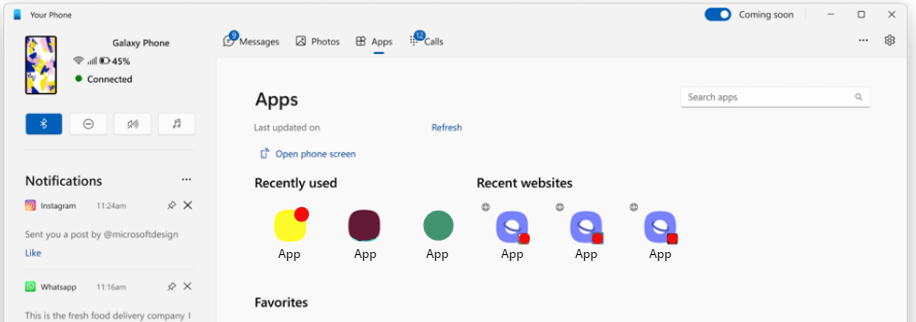

# Phone Link for Cross-Device Task Continuity

Your mobile application can programmatically share recent website URLs and document links to a Windows PC that has [set up Phone Link](https://www.microsoft.com/windows/sync-across-your-devices). This task continuity feature is available on Android devices integrated with the "Link to Windows" experience.

This feature is only available on [Supported devices for Phone Link experiences](https://aka.ms/TaskContinuityAPI).

This documentation will cover how to integrate your app with the **Phone Link Task Continuity API**, including the scenario requirements, surface area, and Limited Access Feature (LAF) approval.

Learn more about Phone Link: [Sync Your Smartphone to Your Windows Computer](https://www.microsoft.com/windows/sync-across-your-devices).

## Scenario Requirements

The task continuity API lets you sync content from your Android app over to a Windows PC that has [set up Phone Link](https://www.microsoft.com/windows/sync-across-your-devices). The following conditions must be met for access to this API to be granted:

- DO sync web URLs that are valid URLs that are accessible by the Windows PC
- DO sync cloud document links that are accessible by the Windows PC
- DO sync local document links to the Windows PC that must be accessible on the mobile device through your application
- DO NOT sync more than 60 times per minute
- DO NOT sync content if the user is not engaging with your app experience

## Phone Link surface

Phone Link will surface your sync'ed content in the Apps node under "Recently used" and "Recent websites" and in a notification flyout.



## Limited Access Feature (LAF) approval

Phone Link Task Continuity is a Limited Access Feature (LAF). To gain access to this API, you will need to get approval from Microsoft to interoperate with the "Link to Windows" package preloaded on Android mobile devices.

To request access, email `wincrossdeviceapi@microsoft.com` with the information listed below.

- Description of your user experience
- Screenshot of your application where a user natively accesses web or documents
- PackageId of your application
- Google Play store link for your application

If the request is approved, you will receive instructions on how to unlock the feature. Approvals will be based on your communication, provided that your scenario meets the [Scenario Requirements](#scenario-requirements) outlined above.

## Data Handling

By using the Phone Link Task Continuity API, Microsoft will process and transfer your data in accordance with the [Microsoft Services Agreement](https://www.microsoft.com/servicesagreement) and the [Microsoft Privacy Statement](https://privacy.microsoft.com/privacystatement). Data that is transferred to the user’s linked devices may be processed through Microsoft’s cloud services to ensure reliable data transfer between devices. The data handled by this API is not retained by Microsoft's cloud services subject to end user control.

The Cross-Device SDK that you will integrate in your package ensures that data provided to the API is only handled by trusted Microsoft packages.

## How to integrate your app with the Phone Link Task Continuity API
  
To integrate your Android mobile app with the Phone Link Task Continuity API, you will need to update your manifest declarations and then send the app context. See the sample code examples below.

### Android app manifest declarations

Your app should register a broadcast receiver for the cross-device app context provider to participate in the contract. The registration should be in the manifest as follows.

```xml
<?xml version="1.0" encoding="utf-8"?>   
<manifest xmlns:android="http://schemas.android.com/apk/res/android"   
    <!--   
        If the app targets API 30 or higher, be sure to use the <queries>   
        and add com.microsoft.appmanager to the included packages.   
    -->   
    <queries>   
        <package android:name="com.microsoft.appmanager" />   
    </queries>   
    <application …     
        <!-- … -->   
       <!--   
           This is the receiver declaration for receiving broadcasts from LTW.   
           It needs to be exported with meta-data as this is checked for    

           The package before we send the broadcast.   
       -->   
       <receiver   
           android:name="com.microsoft.crossdevicesdk.continuity.AppContextBroadcastReceiver"  
           android:enabled="true"   
           android:exported="true">   
           <intent-filter>   
               <action android:name="com.microsoft.crossdevice.appcontextrequest" />   
           </intent-filter>   
   
            <meta-data   
                android:name="com.microsoft.crossdevice.sampleProviderMetadataName"   
                android:value="true" />   
        </receiver>   
    </application>   
</manifest>
```

### Code samples for sending app context

Once the manifest declarations are added, partner apps can send their app context as seen in the code sample examples below.

This example demonstrates using the `IAppContextEventHandler` interface with Java.

```java
IAppContextEventHandler appContextEventHandler = new IAppContextEventHandler() {  
    @Override  
    public void onContextRequestReceived(ContextRequestInfo contextRequestInfo) {  
        Log.d(TAG, String.format("onContextRequestReceived, type:%s", contextRequestInfo.getType()));  
        //Not necessary to do following things in here, just  
        //make sure to send app context after receiving broadcast.  
        AppContext appContext = new AppContext();  
        //...  
        //set parameter  
        appContext.setType(ProtocolConstants.TYPE_APPLICATION_CONTEXT);  
        appContext.setCreateTime(System.currentTimeMillis());  
        appContext.setLastUpdatedTime(System.currentTimeMillis());  
        appContext.setTitle("New PowerPoint Presentation");  
        appContext.setExtras("{\"DocInfo\":\"[{\"timestamp\":1672,\"DocTitle\":\"Book Sharing\",\"Index\":\"8\"}]\"}");  
        //...  
        AppContextManager.INSTANCE.sendAppContext(getApplicationContext(),appContext);  
    }  
  
    @Override  
    public void onInvalidContextRequestReceived(@NonNull Throwable throwable) {  
        Log.e(TAG, String.format("onInvalidContextRequestReceived: " + throwable.getMessage()));  
    }  

    @Override   
    public void onSyncServiceDisconnected() {   
        Log.d(TAG, String.format("onSyncServiceDisconnected"));   
    }  
};  
AppContextManager.INSTANCE.setAppContextEventHandler(appContextEventHandler);
```

This example demonstrates using an object expression to implement the `IAppContextEventHandler` interface with Kotlin.

```kotlin
val appContextEventHandler = object : IAppContextEventHandler { 
    override fun onContextRequestReceived(contextRequestInfo: ContextRequestInfo) { 
        Log.d(TAG, String.format("onContextRequestReceived, type:%s", contextRequestInfo.type)); 
        //Not necessary to do following things in here, just 
        //make sure to send app context after receiving broadcast. 
        var appContext = AppContext() 
        //... 
        //set parameter 
        appContext.type = ProtocolConstants.TYPE_APPLICATION_CONTEXT 
        appContext.createTime = System.currentTimeMillis() 
        appContext.lastUpdatedTime = System.currentTimeMillis() 
        appContext.setTitle("New PowerPoint Presentation") 
        appContext.setExtras("{\"DocInfo\":\"[{\"timestamp\":1672,\"DocTitle\":\"Book Sharing\",\"Index\":\"8\"}]\"}") 
        //... 
        AppContextManager.sendAppContext(applicationContext,appContext) 
    } 
 
    override fun onInvalidContextRequestReceived(throwable: Throwable) { 
        Log.e(TAG, String.format("onInvalidContextRequestReceived: " + throwable.message)) 
    } 
 
    override fun onSyncServiceDisconnected() { 
        Log.d(TAG, String.format("onSyncServiceDisconnected")) 
    } 
} 
AppContextManager.setAppContextEventHandler(appContextEventHandler)
```

### Protocol description

The protocol is a simple broadcast that is sent from "Link to Windows" to each of the packages that support a specific type of app context feature when "Link to Windows" is ready to get the app context.


| Intent field | Key | Value |
| --- | --- | --- |
| Action | N/A | `com.microsoft.crossdevice.appcontextrequest` Fixed for link to Windows. The requester will be `com.microsoft.appmanager` |
| Extras (bundle) | `version` | 2.0 (version [minor].[major]) |
| Extras (bundle) | `contentProviderUri` | `content://com.microsoft.taskcontinuity/b695d1d8` Uniquely generated for each package. |
| Extras (bundle) | `requestedContextType` | If provided, indicate what app context type is requested. This is a binary flag, for now we have two types... Application context: 0x01, and Browser history context: 0x02. |

After receiving the broadcast, the SDK will be responsible for validation and handling the information. The expectation from packages that receive the broadcast is to send the app context to link to Windows. The following values should be provided by partner apps when sending app context:

| Key | Value | Extra information |
| --- | --- | --- |
| `type` [required] | A binary flag that indicates what app context type is sent to LTW. The value should be consistent with the `requestedContextType`. |
| `createTime` [required] | Timestamp representing the create time of the app context. | |
| `lastUpdatedTime` [required] | Timestamp representing the last updated time of the app context. | Any time when any fields of app context is updated, the updated time needs to be recorded. |
| `teamId` [optional] | Used to identify the organization or group the app belongs to. | |
| `intentUri` [optional] | Used to indicate which app can continue the app context handed over from the originating device. | |
| `appId` [optional] | The package of the application the context is for. | Only context service providers need to use this. Refer to the Java docs. If omitted, the calling response provider's package will be used. |
| `title` [optional] | The title of this app context, such as a document name or web page title. | |
| `weblink` [optional] | The URL of the webpage to load in a browser to continue the app context. | |
| `preview` [optional] | Bytes of the preview image that can represent the app context. | |
| `extras` [optional] | A key-value pair object containing app-specific state information needed to continue an app context on the continuing device. | Need to provide when the app context has its unique data. |
| `LifeTime` [optional] | The lifetime of the app context in milliseconds. | Only used for ongoing scenario, if not set, the default value is -1. |

To be compatible with the previous "Browser Continuity" feature using **X-Device SDK 1.0**, we have another two additional methods added. The following values should be provided when using this feature:

| Intent field | Key | Value |
| --- | --- | --- |
| `browserContextEmptyFlag` [optional] | Flag to indicate if browser context is empty. | This is only for Browser Continuity feature. |
| `browserHistory` [optional] | Browsing history context for the app. | This is only for the Browser Continuity feature. Currently recommend providing up to 3 URIs. If more are provided, they will be ignored. |

Partner apps can call `addBrowserContext` method to add browser history.
The following values should be provided when adding browser history:

| Key | Value |
| --- | --- |
| `browserWebUri` | A web URI that will open in browser on PC.
(http: or https:) |
| `title` | The title of the web page. |
| `timestamp` | The timestamp that the web page was first opened or last refreshed. |
| `favIcon` [optional] | The favicon of the web page in bytes, should be small in general. |

## Windows Cross-Device repo on GitHub

Find information about integrating the Windows Cross-Device SDK into your project in the [Windows-Cross-Device repo on GitHub](https://github.com/microsoft/Windows-Cross-Device/).

## Phone Link FAQs

For a list of FAQs, see [Phone Link Frequently Asked Questions](https://www.microsoft.com/windows/sync-across-your-devices).
