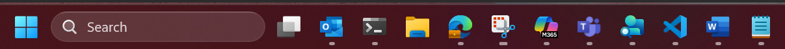

# Phone Link - Seamless task continuity

Android mobile devices that have installed the "Link to Windows" package can programmatically share recent tasks from your Android app to be continued on your Windows PC (such as website URLs, document links, music tracks, etc.).

Cross Device Task Continuity is evolving to use the Continuity SDK to offer a deeper native integration with Windows Taskbar, better serving customers in a natural and intuitive way. While the original implementation of Phone Link task continuity app is still supported, for new implementations, we recommend using Cross Device Resume (XDR) in the Continuity SDK for Windows Taskbar integration. Learn more: [Cross Device Resume (XDR) using Continuity SDK (Android and Windows Applications)](/windows/apps/develop/windows-integration/cross-device-resume).

The Continuity SDK enables more seamless cross-device experiences with Cross Device Resume (XDR) displaying task continuation icons to help you to resume your recent Android device tasks directly from the Windows Taskbar (without the need to rely on the Phone Link app interface).

## How to integrate your Android app with Phone Link task continuity

Learn how to programmatically share recent tasks from your Android app (such as website URLs, document links, music tracks, etc.) to a Windows PC that has [set up Phone Link](https://www.microsoft.com/windows/sync-across-your-devices). This feature is only available on [supported devices for Phone Link experiences](https://support.microsoft.com/topic/supported-devices-for-phone-link-experiences-cb044172-87aa-9e41-d446-c4ac83ce8807#bkmk_task_continuity_api).

### Scenario requirements

The following conditions must be met for your Android app to access "Link to Windows" task continuity:

- DO sync valid web URLs to be accessible by the Windows PC
- DO sync cloud document links to be accessible by the Windows PC
- DO sync local document links to the Windows PC that must be accessible on the mobile device through your app
- DO NOT sync more than 60 times per minute
- DO NOT sync content if the user is not engaging with your app experience

### Phone Link and Cross Device Resume surface

The Phone Link will surface your sync'ed content in the Apps node under "Recently used" and "Recent websites" and in a notification flyout.


[Cross Device Resume (XDR) using Continuity SDK (Android and Windows Applications)](/windows/apps/develop/windows-integration/cross-device-resume) will surface your sync'ed content on the Windows Taskbar.



### Limited Access Feature (LAF) approval

Phone Link task continuity is a Limited Access Feature (LAF). To gain access, you will need to get approval from Microsoft to interoperate with the "Link to Windows" package preloaded on Android mobile devices.

To request access, email `wincrossdeviceapi@microsoft.com` with the information listed below.

- Description of your user experience
- Screenshot of your application where a user natively accesses web or documents
- PackageId of your application
- Google Play store link for your application

If the request is approved, you will receive instructions on how to unlock the feature. Approvals will be based on your communication, provided that your scenario meets the [Scenario Requirements](#scenario-requirements) outlined above.

### Data Handling

By using the Phone Link task continuity, Microsoft will process and transfer your data in accordance with the [Microsoft Services Agreement](https://www.microsoft.com/servicesagreement) and the [Microsoft Privacy Statement](https://privacy.microsoft.com/privacystatement). Data that is transferred to the user's linked devices may be processed through Microsoft's cloud services to ensure reliable data transfer between devices. The data handled by this API is not retained by Microsoft's cloud services subject to end user control.

The Continuity SDK that you will integrate in your app package ensures that data provided to the API is only handled by trusted Microsoft packages.

## Phone Link integration code samples
  
Below are general guidelines and code samples for integration. For detailed integration guidance, refer to the Kotlin doc of the SDK.

### Android app manifest declarations

The app manifest is an XML file that serves as a blueprint for your Android app. The declaration file provides information to the operating system about your app’s structure, components, permissions, etc. The follow declarations are required for task continuity with "Link to Windows".

#### Feature Metadata

Partner apps need to first register meta-data in your app manifest.

To participate in the app context contract, meta-data must be declared for the supported type of app context. For example, to add app context provider metadata for the **App Handoff** feature:

```xml
<application...>
<meta-data
android:name="com.microsoft.crossdevice.applicationContextProvider"
android:value="true" />
</application>
```

If your app supports more than one type of app context, each type of meta-data must be added. The types of meta-data currently supported, include:

```xml
<meta-data
android:name="com.microsoft.crossdevice.browserContextProvider"
android:value="true" />

<meta-data
android:name="com.microsoft.crossdevice.applicationContextProvider"
android:value="true" />

<meta-data
android:name="com.microsoft.crossdevice.resumeActivityProvider
android:value="true" />
```

To add a new type, the meta-data name format should be "com.microsoft.crossdevice.xxxProvider".

Apps must also declare the trigger type meta-data in the manifest. These declarations help the system determine how and when the app should notify Load-Time Weaving (LTW) about certain features being active.

For a self-notifying trigger, where the app itself is responsible for notifying the system and is enabled on all devices, regardless of Original Equipment Manufacturer (OEM), the trigger type should be declared as:

```xml
<application ...
<meta-data
android:name="com.microsoft.crossdevice.trigger.PartnerApp"
android:value="the sum value of all features' binary codes" />

</application>
```

For a system API trigger, in which the app relies on system APIs to trigger the "Link to Windows" feature, enabled only on specific OEM devices, the trigger type should be declared as:

```xml
<application ...
<meta-data
android:name="com.microsoft.crossdevice.trigger.SystemApi"
android:value="the sum value of all features' binary codes" />

</application>
```

The features' binary codes are now:

```xml
APPLICATION_CONTEXT: 1
BROWSER_HISTORY:     2
RESUME_ACTIVITY:     4
```

The app manifest registration may look like this example:

```xml
<?xml version="1.0" encoding="utf-8"?> 
<manifest xmlns:android="http://schemas.android.com/apk/res/android" 

    <application … 
 
       <!-- 
           This is the meta-data represents this app supports XDR, LTW will check  
           the package before we request app context. 
       --> 
       <meta-data 
                android:name="com.microsoft.crossdevice.resumeActivityProvider" 
                android:value="true" />

             <!-- 
           This is the meta-data represents this app supports trigger from app, the
           Value is the code of XDR feature, LTW will check if the app support partner
           app trigger when receiving trigger broadcast.
           --> 
       <meta-data 
                android:name="com.microsoft.crossdevice.trigger.PartnerApp" 
                android:value="4" />

    </application>  
</manifest> 
```

## Code sample for sending app context

Once the app manifest declarations have been added, "Link to Windows" partner apps will need to:

1. Determine the appropriate timing to call the **Initialize and DeInitialize functions** for the Continuity SDK. After calling the Initialize function, a callback that implements `IAppContextEventHandler` should be triggered.

2. After initializing the Continuity SDK, if `onContextRequestReceived()` is called, it indicates the connection is established. The app can then **send `AppContext`** (including create and update) to LTW or **delete `AppContext`** from LTW.

Be sure to avoid sending any sensitive data in `AppContext`, such as access tokens. Additionally, if the lifetime is set too short, the `AppContext` may expire before it is sent to the PC. It is recommended to set a minimum lifetime of at least 5 minutes.

```kotlin
class MainActivity : AppCompatActivity() {

    private val appContextResponse = object : IAppContextResponse {
        override fun onContextResponseSuccess(response: AppContext) {
            Log.d("MainActivity", "onContextResponseSuccess")
            runOnUiThread {
                Toast.makeText(
                    this@MainActivity,
                    "Context response success: ${response.contextId}",
                    Toast.LENGTH_SHORT
                ).show()
            }
        }

        override fun onContextResponseError(response: AppContext, throwable: Throwable) {
            Log.d("MainActivity", "onContextResponseError: ${throwable.message}")
            runOnUiThread {
                Toast.makeText(
                    this@MainActivity,
                    "Context response error: ${throwable.message}",
                    Toast.LENGTH_SHORT
                ).show()
            }
        }
    }

    private lateinit var appContextEventHandler: IAppContextEventHandler

    private val _currentAppContext = MutableLiveData<AppContext?>()
    private val currentAppContext: LiveData<AppContext?> get() = _currentAppContext


    override fun onCreate(savedInstanceState: Bundle?) {
        super.onCreate(savedInstanceState)
        enableEdgeToEdge()
        setContentView(R.layout.activity_main)
        ViewCompat.setOnApplyWindowInsetsListener(findViewById(R.id.main)) { v, insets ->
            val systemBars = insets.getInsets(WindowInsetsCompat.Type.systemBars())
            v.setPadding(systemBars.left, systemBars.top, systemBars.right, systemBars.bottom)
            insets
        }
        LogUtils.setDebugMode(true)
        var ready = false
        val buttonSend: Button = findViewById(R.id.buttonSend)
        val buttonDelete: Button = findViewById(R.id.buttonDelete)
        val buttonUpdate: Button = findViewById(R.id.buttonUpdate)
        setButtonDisabled(buttonSend)
        setButtonDisabled(buttonDelete)
        setButtonDisabled(buttonUpdate)
        buttonSend.setOnClickListener {
            if (ready) {
                sendAppContext()
            }
        }
        buttonDelete.setOnClickListener {
            if (ready) {
                deleteAppContext()
            }
        }
        buttonUpdate.setOnClickListener {
            if (ready) {
                updateAppContext()
            }
        }
        appContextEventHandler = object : IAppContextEventHandler {
            override fun onContextRequestReceived(contextRequestInfo: ContextRequestInfo) {
                LogUtils.d("MainActivity", "onContextRequestReceived")
                ready = true
                setButtonEnabled(buttonSend)
                setButtonEnabled(buttonDelete)
                setButtonEnabled(buttonUpdate)
            }

            override fun onInvalidContextRequestReceived(throwable: Throwable) {
                Log.d("MainActivity", "onInvalidContextRequestReceived")
            }

            override fun onSyncServiceDisconnected() {
                Log.d("MainActivity", "onSyncServiceDisconnected")
                ready = false
                setButtonDisabled(buttonSend)
                setButtonDisabled(buttonDelete)
            }
        }
        // Initialize the AppContextManager
        AppContextManager.initialize(this.applicationContext, appContextEventHandler)


        // Update currentAppContext text view.
        val textView = findViewById<TextView>(R.id.appContext)
        currentAppContext.observe(this, Observer { appContext ->
            appContext?.let {
                textView.text =
                    "Current app context: ${it.contextId}\n App ID: ${it.appId}\n Created: ${it.createTime}\n Updated: ${it.lastUpdatedTime}\n Type: ${it.type}"
                Log.d("MainActivity", "Current app context: ${it.contextId}")
            } ?: run {
                textView.text = "No current app context available"
                Log.d("MainActivity", "No current app context available")
            }
        })

    }

    // Send app context to LTW
    private fun sendAppContext() {
        val appContext = AppContext().apply {
            this.contextId = generateContextId()
            this.appId = applicationContext.packageName
            this.createTime = System.currentTimeMillis()
            this.lastUpdatedTime = System.currentTimeMillis()
            // Set the type of app context, for example, resume activity.
            this.type = ProtocolConstants.TYPE_RESUME_ACTIVITY
            // Set the rest fields in appContext
            //……
        }
        _currentAppContext.value = appContext
        AppContextManager.sendAppContext(this.applicationContext, appContext, appContextResponse)
    }

    // Delete app context from LTW
    private fun deleteAppContext() {
        currentAppContext.value?.let {
            AppContextManager.deleteAppContext(
                this.applicationContext,
                it.contextId,
                appContextResponse
            )
            _currentAppContext.value = null
        } ?: run {
            Toast.makeText(this, "No resume activity to delete", Toast.LENGTH_SHORT).show()
            Log.d("MainActivity", "No resume activity to delete")
        }
    }

    // Update app context from LTW
    private fun updateAppContext() {
        currentAppContext.value?.let {
            it.lastUpdatedTime = System.currentTimeMillis()
            AppContextManager.sendAppContext(this.applicationContext, it, appContextResponse)
            _currentAppContext.postValue(it)
        } ?: run {
            Toast.makeText(this, "No resume activity to update", Toast.LENGTH_SHORT).show()
            Log.d("MainActivity", "No resume activity to update")
        }
    }

    private fun setButtonDisabled(button: Button) {
        button.isEnabled = false
        button.alpha = 0.5f
    }

    private fun setButtonEnabled(button: Button) {
        button.isEnabled = true
        button.alpha = 1.0f
    }

    override fun onDestroy() {
        super.onDestroy()
        // Deinitialize the AppContextManager
        AppContextManager.deInitialize(this.applicationContext)
    }

    private fun generateContextId(): String {
        return "${packageName}.${UUID.randomUUID()}"
    }
}
```

For all the **required** and **optional** fields, refer to [AppContext Description](#appcontext-description).

### AppContext description

The following values should be provided by partner apps when sending app context:

| Key | Value | Extra information |
| --- | --- | --- |
| contextId [required] | Used to distinguish it from other app contexts. | Unique for each app context.Format: "${packageName}.${UUID.randomUUID()}" |
| type [required] | A binary flag that indicates what app context type is sent to LTW. | The value should be consistent with requestedContextType above |
| createTime[required] [FR1] | Timestamp representing the create time of the app context. |  |
| lastUpdatedTime[required] | Timestamp representing the last updated time of the app context. | Any time when any fields of app context is updated, the updated time needs to be recorded. |
| teamId [optional] | Used to identify the organization or group the app belongs to. |  |
| intentUri [optional] | Used to indicate which app can continue the app context handed over from the originating device. | The maximum length is 2083 characters. |
| appId [optional] | The package of the application the context is for. |  |
| title[optional] | The title of this app context, such as a document name or web page title. |  |
| weblink[optional] | The URL of the webpage to load in a browser to continue the app context. | The maximum length is 2083 characters. |
| preview[optional] | Bytes of the preview image that can represent the app context |  |
| extras[optional] | A key-value pair object containing app-specific state information needed to continue an app context on the continuing device. | Need to provide when the app context has its unique data. |
| LifeTime[optional] | The lifetime of the app context in milliseconds. | Only used for ongoing scenario, if not set, the default value is 30 days). |

## Browser Continuity code sample

This sample highlights use of the **Browser Continuity** type, which differs from other `AppContext` types.

```kotlin
class MainActivity : AppCompatActivity() {

    private val appContextResponse = object : IAppContextResponse {
        override fun onContextResponseSuccess(response: AppContext) {
            Log.d("MainActivity", "onContextResponseSuccess")
        }

        override fun onContextResponseError(response: AppContext, throwable: Throwable) {
            Log.d("MainActivity", "onContextResponseError: ${throwable.message}")
        }
    }

    private lateinit var appContextEventHandler: IAppContextEventHandler

    private val browserHistoryContext: BrowserHistoryContext = BrowserHistoryContext()


    override fun onCreate(savedInstanceState: Bundle?) {
        super.onCreate(savedInstanceState)
        //……
        LogUtils.setDebugMode(true)
        var ready = false
        val buttonSend: Button = findViewById(R.id.buttonSend)
        val buttonDelete: Button = findViewById(R.id.buttonDelete)
        setButtonDisabled(buttonSend)
        setButtonDisabled(buttonDelete)
        buttonSend.setOnClickListener {
            if (ready) {
                sendBrowserHistory ()
            }
        }
        buttonDelete.setOnClickListener {
            if (ready) {
                clearBrowserHistory ()
            }
        }
        appContextEventHandler = object : IAppContextEventHandler {
            override fun onContextRequestReceived(contextRequestInfo: ContextRequestInfo) {
                LogUtils.d("MainActivity", "onContextRequestReceived")
                ready = true
                setButtonEnabled(buttonSend)
                setButtonEnabled(buttonDelete)
            }

            override fun onInvalidContextRequestReceived(throwable: Throwable) {
                Log.d("MainActivity", "onInvalidContextRequestReceived")
            }

            override fun onSyncServiceDisconnected() {
                Log.d("MainActivity", "onSyncServiceDisconnected")
                ready = false
                setButtonDisabled(buttonSend)
                setButtonDisabled(buttonDelete)
            }
        }
        // Initialize the AppContextManager
        AppContextManager.initialize(this.applicationContext, appContextEventHandler)
    }

    // Send browser history to LTW
    private fun sendBrowserHistory () {
        browserHistoryContext.setAppId(this.packageName)
        browserHistoryContext.addBrowserContext(System.currentTimeMillis(),
             Uri.parse("https://www.bing.com/"), "Bing Search", null
        )
        AppContextManager.sendAppContext(this.applicationContext, browserHistoryContext, appContextResponse)

    }

    // Clear browser history from LTW
         private fun clearBrowserHistory() {
        browserHistoryContext.setAppId(this.packageName)
        browserHistoryContext.setBrowserContextEmptyFlag(true)
        AppContextManager.sendAppContext(this.applicationContext, browserHistoryContext, appContextResponse)
    }

    private fun setButtonDisabled(button: Button) {
        button.isEnabled = false
        button.alpha = 0.5f
    }

    private fun setButtonEnabled(button: Button) {
        button.isEnabled = true
        button.alpha = 1.0f
    }

    override fun onDestroy() {
        super.onDestroy()
        // Deinitialize the AppContextManager
        AppContextManager.deInitialize(this.applicationContext)
    }

    //……
}
```

For all the **required** and **optional** fields, see [BrowserContext Description](#browsercontext-description).

### BrowserContext description

Partner apps can call the `addBrowserContext` method to add browser history. The following values should be provided when adding browser history:

| Key | Value |
| --- | --- |
| browserWebUri [required] | A web URI that will open in browser on PC (http: or https:). |
| title [required] | The title of the web page. |
| timestamp [required] | The timestamp that the web page was first opened or last refreshed. |
| favIcon [optional] | The favicon of the web page in bytes, should be small in general. |

## Integration validation steps

1. **Prepare** by ensuring that private LTW is installed. Confirm that LTW is connected to PC: [How to manage your mobile device on your PC](https://support.microsoft.com/topic/phone-link-requirements-and-setup-cd2a1ee7-75a7-66a6-9d4e-bf22e735f9e3#bkmk_cdeh_learn_more). Confirm that LTW is connected to Phone Link: [Phone Link requirements and setup](https://support.microsoft.com/topic/phone-link-requirements-and-setup-cd2a1ee7-75a7-66a6-9d4e-bf22e735f9e3). If after scanning the QR code, you cannot jump into LTW, open LTW first and scan the QR code within the app. Lastly, verify that the partner app has integrated the Continuity SDK.

2. **Validate** by launching the app adn initializing the Continuity SDK. Confirm that `onContextRequestReceived()` is called. Once `onContextRequestReceived()` is called, the app can send the app context to LTW. If `onContextResponseSuccess()` is called after sending app context, the SDK integration is successful.

## Windows Cross-Device repo on GitHub

Find information about integrating the Windows Cross-Device SDK into your project in the [Windows-Cross-Device repo on GitHub](https://github.com/microsoft/Windows-Cross-Device/).

## Phone Link FAQs

For a list of FAQs, see [Phone Link Frequently Asked Questions](https://www.microsoft.com/windows/sync-across-your-devices).
