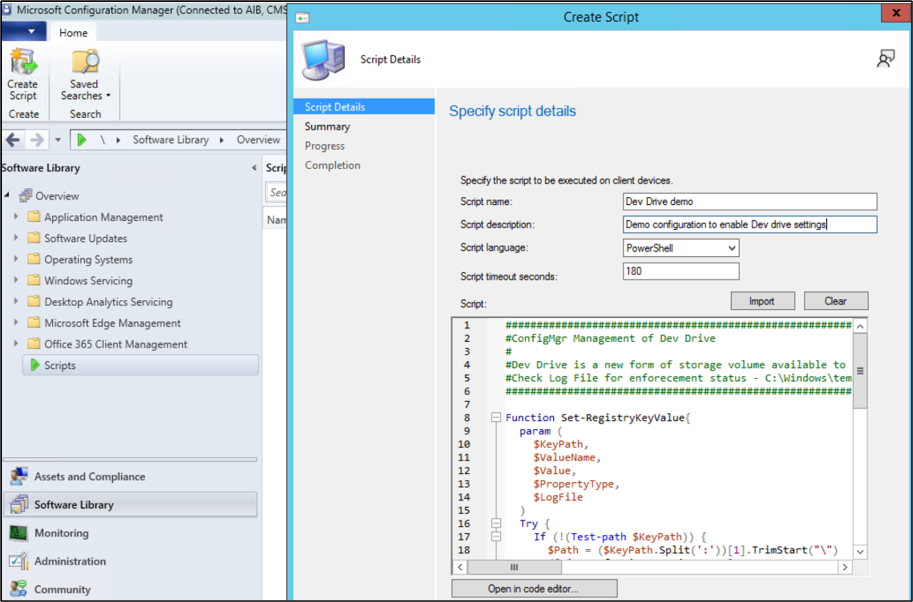
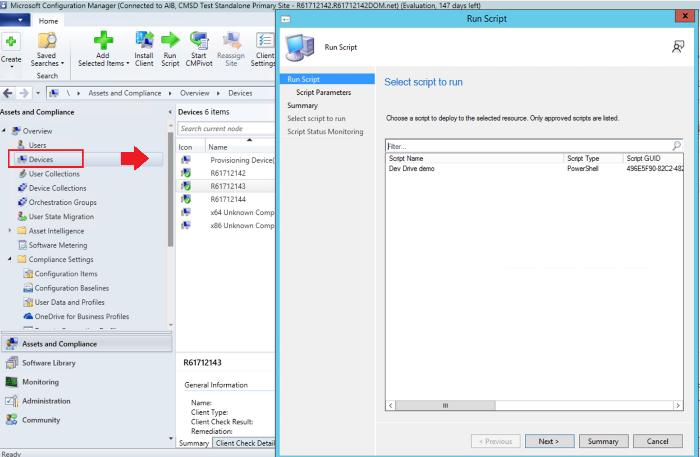
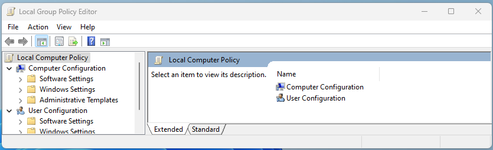
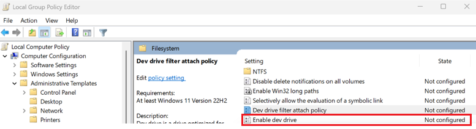
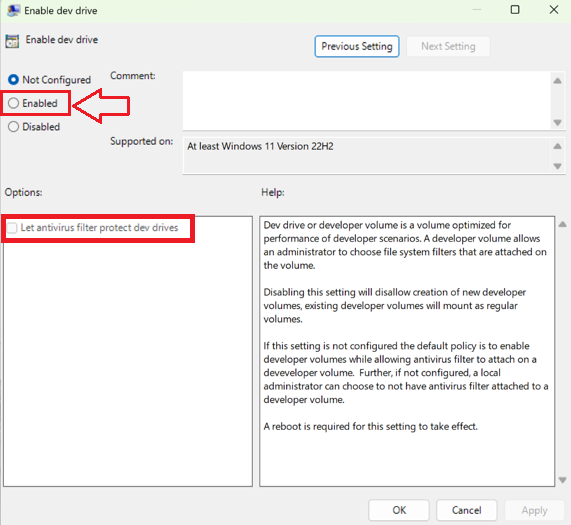
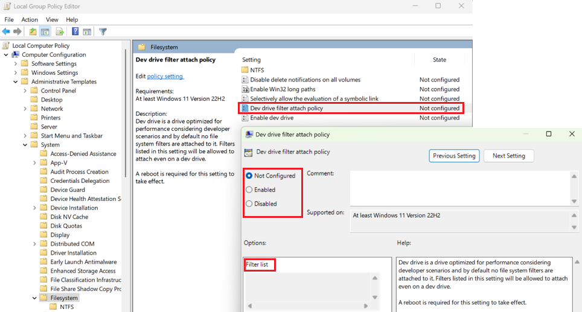

# How to configure Dev Drive security policy for enterprise business devices

Enterprise-level administrators are often responsible for managing security across many different Windows devices within an organization. There are multiple ways to configure the policies that control whether new features are enabled as the become available in new Windows releases. This guide covers important information about Windows 11 [Dev Drive](index.md) storage volume features and how to configure Group Policy for your organization to enable developers to use this performance-optimized storage format while maintaining security and control over attaching file system filters.

Guidance on how to enable Group Policy can be found below using your preferred policy management tool:

- [Microsoft Intune](#use-microsoft-intune-to-update-group-policy-for-dev-drive),
- [Microsoft Configuration Manager](#use-microsoft-configuration-manager-to-update-group-policy-for-dev-drive) (ConfigMgr, formerly MEMCM/SCCM), or
- [Windows 11 Local Group Policy Editor](#use-windows-11-local-group-policy-editor-to-update-group-policy-for-dev-drive).

## Prerequisites

- Windows 11, Build #10.0.22621.2338 or later ([Check for Windows updates](ms-settings:windowsupdate))
- Recommend 16gb memory (minimum of 8gb)
- Minimum 50gb free disk space
- Dev Drives are available on all Windows SKU versions.

## Temporary enterprise feature control disables Dev Drive

New features and enhancements are introduced through the monthly cumulative update to provide continuous innovation for Windows 11. To give organizations time to plan and prepare, some of these new features are temporarily turned off by default using [Temporary enterprise feature control in Windows 11](/windows/whats-new/temporary-enterprise-feature-control).

**Dev Drive will be automatically disabled for devices that have their Windows updates managed by policies.** Disabling the ability to create a Dev Drive is only temporary to allow security administrators time to decide on and roll out new policy updates. Guidance for determining and configuring those policy updates is outlined below.

## Determine Group Policy for Dev Drive storage enablement and antivirus filter security

Group Policy is a Windows feature that lets enterprise administrators manage the settings of work devices and have some control over what setting changes user accounts (local administrators) are allowed to make in a business environment.

Antivirus filters, including both Microsoft Defender and 3rd-party antivirus filters, are attached to a Dev Drive by default. The default settings for Dev Drive storage volumes also allow local device administrators to control what filters are attached. This means that a local device administrator could configure the system to remove default antivirus filters, so that no antivirus filters are attached to the Dev Drive. If this is a concern, Group Policy may be configured to ensure that antivirus filters remain attached when Dev Drive is enabled. Additionally, an allowed file system filter list may be defined.

## Update Group Policy to enable Dev Drive

The **Enable Dev Drive** policy settings include:

- **Not Configured**: By default, the Dev Drive storage volume option will be turned off under the Temporary enterprise feature control policy until enabled by an enterprise administrator in the Group Policy.
- **Enabled**: Enabling turns on the option to create [Dev Drive](index.md) storage volumes.
- **Options - Let antivirus filter protect Dev Drives**: Dev Drives are optimized for performance in developer scenarios, allowing the **local** administrator (user account) to choose which file system filters are attached. This also allows local administrators to detach the default antivirus features, unless the option to "Let antivirus filter protect Dev Drives" is checked. Checking this option forces default antivirus filters to remain attached.
- **Disabled**: Disabling this setting turns off the ability to create and use Dev Drive storage volumes.

## Update Dev Drive filter attach policy

Additionally, there is a **Dev Drive filter attach policy** setting, which offers enterprise administrators control over what filters can be attached to a Dev Drive. Settings include:

- **Not Configured**: By default, Dev Drive is optimized for performance, with Microsoft Defender and 3rd-party antivirus filters attached, but with no other file system filters. This default setting allows local administrators to attach or detach filters, including the default antivirus filters. Checking the optional "Let antivirus filter protect Dev Drives" in the Enable Dev Drive policy above will force antivirus filters to remain attached even if no further filter policy is defined.
- **Enabled**: Local administrators (user accounts) are allowed to attach or detach filters. Adding a Filter list enables enterprise administrators (at the Group Policy Domain level) to define what filters can be attached. Not including a filter list will enable any filter to be attached.
- **Disabled**: Local administrators (user accounts) are not allowed to attach or detach filters.

There are a few ways to enable the Dev Drive feature and update Group Policy:

- [Update Group Policy using Microsoft Intune](#use-microsoft-intune-to-update-group-policy-for-dev-drive)
- [Update Group Policy using Microsoft Configuration Manager](#use-microsoft-configuration-manager-to-update-group-policy-for-dev-drive)
- [Update Group Policy using Windows 11 Local Group Policy Editor](#use-windows-11-local-group-policy-editor-to-update-group-policy-for-dev-drive)

## Use Microsoft Intune to update Group Policy for Dev Drive

To update Group Policy and enable [Dev Drive](index.md) using [Microsoft Intune)](/mem/intune/):

1. Open the Intune portal ([https://endpoint.microsoft.com](https://endpoint.microsoft.com)) and log in with your credentials.

2. Create a profile:
    1. Devices > Windows > Configuration profiles > Create profile
    1. Select Platform > Windows 10 and later
    1. Select Profile type > Settings catalog

    

3. Set a custom profile name and description.

    

4. Configure Dev Drive related settings:
    1. Search “Dev Drive” in settings picker or navigate to “Administrative Templates\System\Filesystem”
    1. Select Dev Drive related policies: **Enable Dev Drive** and **Let antivirus filter protect Dev Drives**, **Dev Drive filter attach policy** and **Filter list**

    

5. Configure the Dev Drive policy settings, complete the remaining configuration of Scope tags and Assignments, then select **Create**

    

## Use Microsoft Configuration Manager to update Group Policy for Dev Drive

To update Group Policy and enable [Dev Drive](index.md) using [Microsoft Configuration Manager](/mem/configmgr/) (ConfigMgr, formerly MEMCM/SCCM), you can use the following PowerShell scripts. ([What is Configuration Manager?](/mem/configmgr/core/understand/introduction))

The [Configuration Manager console](/mem/configmgr/core/understand/introduction#BKMK_Console) has an integrated ability to run PowerShell scripts to update Group Policy settings across all computers in your network.

1. Open the Microsoft Configuration Manager console. Select **Software Library** > **Scripts** > **Create Script**.

    

2. Enter the script name (for example, Dev Drive demo), description (Demo configuration to enable Dev Drive settings), language (PowerShell), timeout seconds (180), and then paste in the following "Dev Drive demo" script example to use as a template.

    ```powershell
    ######
    #ConfigMgr Management of Dev Drive
    #Dev Drive is a new form of storage volume available to improve performance for key developer workloads.
    #Check Log File for enforcement status - C:\Windows\temp\ConfigDevDrive-<TimeStamp>.log
    ######

    Function Set-RegistryKeyValue{
    param (
    $KeyPath,
    $ValueName,
    $Value,
    $PropertyType,
    $LogFile
    )
    Try {
        If (!(Test-path $KeyPath)) {
        $Path = ($KeyPath.Split(':'))[1].TrimStart("\")
        ([Microsoft.Win32.RegistryKey]::OpenRemoteBaseKey([Microsoft.Win32.RegistryHive]::LocalMachine,$env:COMPUTERNAME)).CreateSubKey($Path)
        New-ItemProperty -path $KeyPath -name $ValueName -value $Value -PropertyType $PropertyType -Force | Out-Null
        }
        Else {
        New-ItemProperty -path $KeyPath -name $ValueName -value $Value -PropertyType $PropertyType -Force | Out-Null
        }
        $TestValue = (Get-ItemProperty -Path $KeyPath)."$ValueName"
        If ($TestValue -eq $Value){ Add-Content -Path $LogFile -Value "$KeyPath,$ValueName,$Value,$PropertyType,$TestValue,Success" }
        Else { Add-Content -Path $LogFile -Value "$KeyPath,$ValueName,$Value,$PropertyType,$TestValue,Failure" }
        }
        Catch {
        $ExceptionMessage = $($PSItem.ToString()) -replace [Environment]::NewLine,"";
        Add-Content -Path $LogFile -Value "$KeyPath,$ValueName,$Value,$PropertyType,$TestValue,Failure - $ExceptionMessage"
        }
    }
    $ExecutionTime = Get-Date
    $StartTime = Get-Date $ExecutionTime -Format yyyyMMdd-HHmmss
    $LogFile = "C:\Windows\temp\ConfigDevDrive-$StartTime.log"
    Add-Content -Path $LogFile -Value "------------------------------------V 1.0 $ExecutionTime - Execution Starts -------------------------------------------"
    Add-Content -Path $LogFile -Value "RegistryKeyPath,ValueName,ExpectedValue,PropertyType,CurrentValue,ComparisonResult"
    #Set up a Dev Drive
    Set-RegistryKeyValue -KeyPath "HKLM:\System\CurrentControlSet\Policies\" -ValueName "FsEnableDevDrive" -Value "1" -PropertyType "Dword" -LogFile $LogFile
    Set-RegistryKeyValue -KeyPath "HKLM:\System\CurrentControlSet\Policies\" -ValueName "FltmgrDevDriveAllowAntivirusFilter" -Value "1" -PropertyType "Dword" -LogFile $LogFile
    Set-RegistryKeyValue -KeyPath "HKLM:\System\CurrentControlSet\Policies\" -ValueName "FltmgrDevDriveAttachPolicy" -Value "PrjFlt, MsSecFlt, WdFilter, bindFlt, wcifs, FileInfo" -PropertyType "MultiString" -LogFile $LogFile
    $ExecutionTime = Get-Date
    Add-Content -Path $LogFile -Value "------------------------------------ $ExecutionTime - Execution Ends -------------------------------------------"
    --------------------
    ``````

3. When adding a new script, you must select and approve it. The approval state will change from "Waiting for approval" to "Approved".

4. Once approved, right-click a single device or device collection and select **Run script**.

    

5. On the script page of the Run Script wizard, choose your script from the list (*Dev Drive demo* in our example). Only approved scripts are displayed. Select **Next** and complete the wizard.

See [Query policies with FsUtil](#query-policies-with-fsutil) to check that Group Policy settings were accurately updated.

To learn more, see [Create and run PowerShell scripts from the Configuration Manager console](/mem/configmgr/apps/deploy-use/create-deploy-scripts).

## Use Windows 11 Local Group Policy Editor to update Group Policy for Dev Drive

To update Group Policy and enable [Dev Drive](index.md) using Windows 11 Local Group Policy Editor:

1. Open the **Local Group Policy Editor** in Windows Control Panel.

    

2. Under **Computer Configuration**, select **Administrative Templates** > **System** > **Filesystem** and in the Setting list, select **Enable dev drive**.

    

3. Select **Enabled** to enable Dev Drive in your Group Policy.

    

To update this filter attach policy, select **Dev Drive filter attach policy** from the **Local Group Policy Editor** in Windows Control Panel.



## Query policies with FsUtil

FSUtil can be used to query the Group Policy configured for Dev Drive. Here is the output from an FsUtil query for a Dev Drive Group Policy configured to:

- Enable Dev Drive
- Let antivirus filters protect Dev Drives (`MsSecFlt`)
- `FileInfo` minifilter has been added to the **Filter list** as an allowed filter

Enter the FSUtil command:

```powershell
fsutil devdrv query
```

Result:

```powershell
Developer volumes are enabled. 
Developer volumes are protected by antivirus filter, by group policy. 
Filters allowed on any developer volume, by group policy: 
    MsSecFlt 
Filters allowed on any developer volume: 
    FileInfo 
```

This same query can be run on a specific Dev Drive to see the attached filters. To run the command on a specific Dev Drive, enter the command:

```powershell
fsutil devdrv query d:
```

Result:

```powershell
This is a trusted developer volume. 
Developer volumes are protected by antivirus filter, by group policy. 
Filters allowed on any developer volume, by group policy: 
    MsSecFlt 
Filters allowed on any developer volume: 
    FileInfo 
Filters currently attached to this developer volume: 
    MsSecFlt, WdFilter, FileInfo 
```

## Additional resources

- [Delivering continuous innovation in Windows 11 (Microsoft Support)](https://support.microsoft.com/windows/delivering-continuous-innovation-in-windows-11-b0aa0a27-ea9a-4365-9224-cb155e517f12)

- [Temporary enterprise feature control in Windows 11](/windows/whats-new/temporary-enterprise-feature-control)

- [Manage additional Windows Update settings (Windows Deployment)](/windows/deployment/update/waas-wu-settings)
