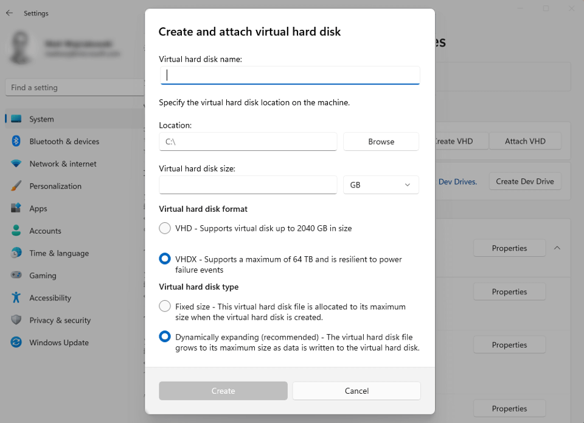

# Set up a Dev Drive on Windows 11 (Public Preview)

**Dev Drive** is a new form of storage volume available to improve performance for key developer workloads.

Dev Drive builds on [ReFS](/windows-server/storage/refs/refs-overview) technology to employ targeted file system optimizations and provide more control over storage volume settings and security, including trust designation, antivirus configuration, and administrative control over what filters are attached.

<!-- See the blog post: [Dev Drive for Performance Improvements in Visual Studio and Dev Boxes]( https://aka.ms/vsdevdrive) for some average improvement measurements across common dev operations. -->

> [!IMPORTANT]
> Dev Drive is currently only available via public preview (see [prerequisities](#prerequisites)). Some information relating to this prerelease product may be substantially modified before it's commercially released. Microsoft makes no warranties, express or implied, with respect to the information provided here.

## How to set up a Dev Drive

To set up a new Dev Drive, open Windows **Settings** and navigate to **System** > **Storage** > **Advanced Store Settings** > **Disks & volumes**. Select **Create dev drive**. **Before setting up a Dev Drive, ensure that the prerequisites are met.* You can also set up a Dev Drive using **[Dev Home's Machine configuration](../dev-home/setup.md#clone-a-github-repo-and-store-it-on-a-dev-drive)**.


### Prerequisites

- [Windows 11 Insider Program Build](https://www.microsoft.com/windowsinsider/): Dev Channel.
- Recommend 16gb memory (minimum of 8gb)
- Minimum 50gb free disk space
- Dev Drives are available on all Windows SKU versions.

> [!WARNING]
> Dev Drive is intended only for [key developer scenarios](#what-should-i-put-on-my-dev-drive) and any custom settings will still be covered by [Group Policy](/windows/client-management/manage-settings-app-with-group-policy) settings in Business or Enterprise work environments.

### Set up options

You will be given three options:

1. **Create new VHD** - Build volume on a new virtual hard disk
2. **Resize an existing volume** - Create new unallocated space to build on
3. **Unallocated space on disk** - Use the unallocated space on an existing disk. **This option will only display if you have previously set up unallocated space in your storage.*


### Create new VHD

When choosing the **Create new VHD** option to set up a Dev Drive, you will then need to determine the following:

- **Virtual hard disk name**: Give a name to your VHD (Dev Drive).
- **Location**: Assign a directory path where the Dev Drive VHD will be located on your machine. Default is `%userprofile%\DevDrives`. Recommended to store in a per-user directory path to avoid any unintentional sharing.
- **Virtual hard disk size**: Assign the amount of disk space that will be allocated for the volume to use, minimum size is 50GB.
- **Virtual hard disk format**:
  - **VHD**: Supports virtual disks up to 2040GB in size.
  - **VHDX**: Supports virtual disks up to 64TB in size and offers more resilient protection against unexpected IO failure caused by issues like power outage). [Learn more about Managing VHDs](/windows-server/storage/disk-management/manage-virtual-hard-disks).
- **Disk type**:
  - **Fixed size** - This virtual hard disk file is allocated to the maximum size when created (Recommended for efficiency)
  - **Dynamically expanding** - Grows to maximum size as data is written

Once you complete the process of selecting between these options, your Dev Drive will be created.



Existing storage volumes cannot be converted to be a Dev Drive. The Dev Drive designation happens only at the original format time.

### Resize an existing volume or use unallocated space on an existing disk

To **Resize an existing volume**:

1. Choose a volume to resize.

    

2. Choose a new size for the volume. You will need to have at least 50GB of unallocated space available, the minimum size needed for a Dev Drive. Once the size is set, select **Next**.

    

3. To format a Dev Drive on the new free space, specify the **Label** (drive name), **Drive Letter**, and **Size** allocation. The maximum size will be the amount of free space you allocated in the previous step, the minimum size for a Dev Drive is 50GB.

    

Congratulations! You've now resized your Dev Drive.

To find and **use unallocated space on an existing drive**, you can open **System** > **Storage** > **Disks & volumes**, look through the page to see whether any storage space is listed as "Unallocated". Select **Create volume** and you will be given the choices to **Create Simple Volume** (a standard NTFS storage volume) or **Create Dev Drive**. To create a Dev Drive, the steps are the same as above, you will need to add a **Label** (drive name), **Drive Letter**, and confirm the **Size** allocation.


## How does Dev Drive work?

A [Storage Volume](/windows-hardware/drivers/ifs/storage-device-stacks--storage-volumes--and-file-system-stacks#storage-volumes) specifies how data is stored on the file system, via directories and files, in a particular format. Windows uses NTFS for the system drive and, by default, for most non-removable drives. The [Resilient File System (ReFS)](/windows-server/storage/refs/refs-overview) is a newer Microsoft file system format, designed to maximize data availability, scale efficiently to large data sets across diverse workloads, and provide data integrity with resiliency to corruption. It seeks to address an expanding set of storage scenarios and establish a foundation for future innovations.

The **Dev Drive** utilizes ReFS enabling you to initialize a storage volume specifically for development workloads, providing faster performance, and customizable settings that are optimized for development scenarios. ReFS contains several file system specific optimizations to improve the performance of key developer scenarios.

There is typically a tradeoff between performance and security. Using a Dev Drive places control over this balance in the hands of Developers and Enterprises. Administrators can now choose between these options:

- Real-time protection
- [Antivirus performance mode](#what-is-microsoft-defender-performance-mode)
- Control over filters attached to Dev Drive

Microsoft generally recommends applying the performance mode option when using a Dev Drive.

## What should I put on my Dev Drive?

The Dev Drive is intended for:

- Source code repositories and project files
- Package caches
- Build output and intermediate files

Dev Drive is **not** intended to store developer tools, such as:

- Visual Studio
- MSBuild
- .NET SDK
- Windows SDK, etc.

These tools should be stored on your main C:\ drive.

> [!NOTE]
> IT Admins will want to create per-user Access Control List (ACL) folders for multi-user devices as a best practice to avoid EOP attacks.

### Storing package cache on Dev Drive

A package cache is the global folder location used by applications to store files for installed software. These source files are needed when you want to update, uninstall, or repair the installed software. Visual Studio is one such application that stores a large portion of its data in the Package Cache.

- **Npm cache (NodeJS)**: Create an npm cache directory in your Dev Drive, e.g. `D:\packages\npm`, then set a global environment variable `npm_config_cache` to that path, e.g. `setx /M npm_config_cache D:\packages\npm`. If you have already installed NodeJS on your machine, move the contents of `%AppData%\npm-cache` to this directory. Learn more in the npm docs: [npm-cache](https://docs.npmjs.com/cli/v6/commands/npm-cache) and [npm config: cache](https://docs.npmjs.com/cli/v9/using-npm/config#cache).

- **NuGet global-packages folder**: The NuGet global-packages folder is used by dotnet, MSBuild, and Visual Studio. Create a user specific NuGet directory in your CopyOnWrite (CoW) filesystem. For example: `D:\<username>\.nuget\packages`. Use one of the following ways to change the global-packages folder from the default location to your newly created folder (to manage the globally installed packages):

  - Set a global environment variable `NUGET_PACKAGES` to that path. For example: `setx /M NUGET_PACKAGES D:\<username>\.nuget\packages`.
  - Set `globalPackagesFolder`, when using `PackageReference`, or `repositoryPath`, when using `packages.config`, to that path in configuration settings.
  - Set the `RestorePackagesPath` MSBuild property (MSBuild only) to that path.

    To verify the global-packages folder, run the dotnet nuget locals command: `dotnet nuget locals global-packages --list`. The retore will install and download packages into the new path. The default NuGet global-packages folder can be deleted. Learn more in the [NuGet docs: Managing the global packages, cache, and temp folders](/nuget/consume-packages/managing-the-global-packages-and-cache-folders).

- **vcpkg cache**: Create a vcpkg cache directory in your Dev Drive, e.g. `D:\packages\vcpkg`, then set a global environment variable `VCPKG_DEFAULT_BINARY_CACHE` to that path, e.g. `setx /M VCPKG_DEFAULT_BINARY_CACHE D:\packages\vcpkg`. If you have already installed packages, move the contents of `%LOCALAPPDATA%\vcpkg\archives` or `%APPDATA%\vcpkg\archives` to this directory. Learn more in the vcpkg docs: [vcpkg Binary Caching](/vcpkg/users/binarycaching).

- **Pip cache (Python)**: Create a pip cache directory in your Dev Drive, e.g. `D:\packages\pip`, then set a global environment variable `PIP_CACHE_DIR` to that path, e.g. `setx /M PIP_CACHE_DIR D:\packages\pip`. If you have already restored pip packages and Wheels on your machine, move the contents of `%LocalAppData%\pip\Cache` to this directory. Learn more in the pip docs: [pip caching](https://pip.pypa.io/en/stable/topics/caching/) and see StackOverflow to [Change directory of pip cache on Linux?](https://stackoverflow.com/questions/64180511/pip-change-directory-of-pip-cache-on-linux).

- **Cargo cache (Rust)**: Create a Cargo cache directory in your Dev Drive, e.g. `D:\packages\cargo`, then set a global environment variable `CARGO_HOME` to that path, e.g. `setx /M CARGO_HOME D:\packages\cargo`. If you have already restored Cargo packages on your machine, move the contents of `%USERPROFILE%\.cargo` to this directory. Learn more in the Cargo docs: [Cargo Environmental Variables](https://doc.rust-lang.org/cargo/reference/environment-variables.html).

- **Maven cache (Java)**: Create a Maven cache directory in your Dev Drive, e.g. `D:\packages\maven`, then set a global environment variable `MAVEN_OPTS` to add a configuration setting to that path, e.g. `setx /M MAVEN_OPTS "-Dmaven.repo.local=D:\packages\maven %MAVEN_OPTS%"`. Move the contents of `%USERPROFILE%\.m2` to this directory. Learn more in the [Maven docs](https://maven.apache.org/settings.html) and see StackOverflow for [How to specify an alternate location for the .m2 folder or settings.xml permanently?](https://stackoverflow.com/questions/16649420/how-to-specify-an-alternate-location-for-the-m2-folder-or-settings-xml-permanen).

## Understanding security risks and trust in relation to Dev Drive

Security and trust are important considerations when working with project files. [Windows Security](https://support.microsoft.com/windows/stay-protected-with-windows-security-2ae0363d-0ada-c064-8b56-6a39afb6a963) continually scans for malware (malicious software), viruses, and security threats using Microsoft Defender. With Dev Drive, you are offered more control over this security, with the ability to:

- [designate trust](#what-is-a-trusted-dev-drive),
- utilize the [performance mode](#what-is-microsoft-defender-performance-mode) for antivirus scanning with Microsoft Defender, and
- [configure additional security filters](#how-do-i-configure-additional-security-filters-on-dev-drive).

### What is a “trusted” Dev Drive?

Dev Drives are automatically designated as *trusted* using a flag stored in the system registry during the original formatting time, providing the best possible performance by default. A *trusted* Dev Drive means that the developer using the volume has high confidence in the security of the content stored there.

Similar to when a developer chooses to [Add an exclusion to Windows Security](https://support.microsoft.com/windows/add-an-exclusion-to-windows-security-811816c0-4dfd-af4a-47e4-c301afe13b26), the developer takes on the responsibility for managing the security of the content stored in order to gain additional performance.

A Dev Drive marked as *trusted* is a signal for Microsoft Defender to run in [performance mode](#what-is-microsoft-defender-performance-mode). Running Microsoft Defender in performance mode provides a balance between threat protection and performance. Real-time protection will still be enabled on all other storage volumes.

Due to the security considerations of having filters detached, transporting a dev drive between machines will result in the volume being treated as an ordinary volume without special filter attach policies. The volume needs to be marked as *trusted* when it is attached to a new machine. See [How do I designate a Dev Drive as trusted?](#how-do-i-designate-a-dev-drive-as-trusted).

An *untrusted* Dev Drive will not have the same privileges as a *trusted* Dev Drive. Security will run in real-time protection mode when a Dev Drive is *untrusted*. Exercise caution if designating trust to a Dev Drive outside of the time that it is first created.

### How do I designate a Dev Drive as trusted?

To designate a Dev Drive as *trusted*:

1. Open PowerShell (or CMD) with elevated permissions by right-clicking and selecting "Run as Administrator".
2. To designate your Dev Drive as *trusted* enter the command below, replacing `<drive-letter>` with the letter of the storage drive you are designating trust to. For example, `fsutil devdrv trust D:`.

```powershell
fsutil devdrv trust <drive-letter>:
```

To confirm whether a Dev Drive is trusted, enter the command:

```powershell
fsutil devdrv query <drive-letter>:
```

The C: drive on your machine cannot be designated as a Dev Drive. Developer tools, such as Visual Studio, MSBuild, .NET SDK, Windows SDK, etc, should be stored on your C:/ drive and not in a Dev Drive.

### What is Microsoft Defender performance mode?

Performance mode is now available on Windows 11 as a new Microsoft Defender Antivirus capability. This capability reduces the performance impact of Microsoft Defender Antivirus scans for files stored on a designated Dev Drive.

To learn more about performance mode and how it compares with real-time protection, see [Microsoft Defender: Protecting Dev Drive using performance mode](/microsoft-365/security/defender-endpoint/microsoft-defender-endpoint-antivirus-performance-mode).

For performance mode to be enabled, the Dev Drive must be designated as *trusted* and Microsoft Defender Real-time protection must be set to "On".

### How do I configure additional security filters on Dev Drive?

By default, [Filter Manager](/windows-hardware/drivers/ifs/filter-manager-concepts) will turn OFF all filters on a Dev Drive, with the exception of antivirus filters. An antivirus filter is a filter that's attached in the `FSFilter Anti-Virus` altitude range (i.e., 320000-329999). `FSFilter Anti-Virus` includes filters that detect and disinfect viruses during file I/O. If you are working in a business or enterprise environment, your company's group policy may be configured for select filters to attach on Dev Drives, this will override the default OFF setting.

A system administrator can attach additional filters to a specific Dev Drive or all Dev Drives using an **allow list**.

A system admin may want to add a security filter called "Foo", we will refer to it as `FooFlt`, and may only want that filter enabled on the Dev Drive mounted as `D:`. They do not need this filter on another Dev Drive mounted as `E:`. The admin can make changes to an allow list of filters on the Dev Drive using [fsutil.exe](/windows-server/administration/windows-commands/fsutil), a system-supplied command line utility.

Only filters specifically set as **Allowed** can attach to a Dev Drive.

#### Allow list security filter examples

The following examples demonstrate an administrator's ability to set filters allowed on all Dev Drives on a machine, using an allow list.

To use the `setfiltersallowed` command to allow `Filter-01` and `Filter-02` on all Dev Drives, use the command:

```powershell
fsutil devdrv setfiltersallowed Filter-01, Filter-02
```

To display the filter attach policy for all Dev Drives, use the command:

```powershell
fsutil devdrv query
```

The result will display the following:

- Developer volumes are enabled.
- Developer volumes are protected by antivirus filter.
- Filters allowed on any Dev Drive: `Filter-01`, `Filter-02`

To change this Dev Drive configuration to allow only `Filter-03` on your Dev Drive(s), with `Filter-01` and `Filter-02` no longer allowed to attach, use the command:

```powershell
fsutil devdrv setfiltersallowed Filter-03
```

See `fsutil devdrv /?` for other related commands.

<!-- Not yet supported in Public Preview:
To add the example filters `FooFlt` and `BarFlt` to an allow list for the mounted `D:` drive, use the command:

```powershell
fsutil devdrv setfiltersallowed /volume D: "FooFlt, BarFlt"
```

To add the example filter `OmniFlt` to an allow list for all Dev Drives on a given machine, use the command:

```powershell
fsutil devdrv setfiltersallowed OmniFlt
```

To display the filter attach policy for the mounted `D:` drive, use the command:

```powershell
fsutil devdrv query D:
```

The result will display the following:

- This is a trusted Dev Drive (or "untrusted" if that is the case).
- Filters allowed on any Dev Drive: `OmniFlt`
- Filters allowed on this Dev Drive: `FooFlt`, `BarFlt`
- Filters currently attached to this Dev Drive: `WdFilter`, `OmniFlt`, `FooFlt`, `BarFlt` 
-->

#### Filters for common scenarios

The following filters may be used with Dev Drive:

| Scenario: Description | Filter Name |
| --- | --- |
| GVFS: Sparse enlistments of Windows | PrjFlt |
| MSSense:  Microsoft Defender for Endpoint for EDR Sensor | MsSecFlt |
| Defender:  Windows Defender Filter | WdFilter |
| Docker: Running containers out of dev drive | bindFlt, wcifs |
| Windows Performance Recorder:  Measure file system operations | FileInfo |

The `WdFilt` is attached by default. The following command is an example demonstrating how to attach all of these additional filters to a Dev Drive:

```powershell
fsutil devdrv setfiltersallowed PrjFlt, MsSecFlt, WdFilter, bindFlt, wcifs, FileInfo
```

> [!TIP]
> To determine the filters required for a specific scenario, you may need to temporarily mark a Dev Drive as *untrusted*. Then, run the scenario and make note of all filters that attached to the volume. Designate the Dev Drive as [*trusted*](#how-do-i-designate-a-dev-drive-as-trusted) again and then add the filters to the Allow list for that Dev Drive to ensure the scenario succeeds. Finally, remove any filters that may not be needed, one at a time, while ensuring that the scenario works as expected.

## What scenarios are unsupported by Dev Drive? What are the limitations?

There are a few scenarios in which we do not recommend using a Dev Drive. These include:

- Reformatting an existing storage volume to be a "Dev Drive" will destroy any content stored in that volume. Reformatting an existing volume while preserving the content stored there is not supported.
- When creating a VHD hosted by a fixed disk, it is not safe to copy the VHD, move it to a different machine, and then return to using it as a Dev Drive.
- A volume stored on a removable or hot-pluggable disk (such as a USB, HDD, or SSD external drive) does not support designation as a Dev Drive.
- A volume in a VHD hosted by a removable or hot-pluggable disk does not support designation as a Dev Drive.
- The C: drive on your machine cannot be designated as a Dev Drive.
- The purpose of a Dev Drive is to host files for building and debugging software projects designated to store repositories, package caches, working directories, and temp folders. We do not recommend installing applications on a Dev Drive.

## Dev Drive FAQs

Some frequently asked questions about Dev Drive, include:

### How can I customize a Dev Drive to meet my needs?

The Dev Drive default settings have been optimized for common development scenarios, but can be customized, allowing control over drivers and services run on the storage volume. To customize Dev Drive settings, open the **Settings** menu. Under **System** > **Storage** > **Disks & volumes**, go to **Properties**.

> [!IMPORTANT]
> If working for a business or enterprise, the Dev Drive would still be managed by your enterprise settings. Some customizations may therefore be unavailable depending on the company policy.

### Do I need to reinstall my applications to use a Dev Drive?

No, applications or tools installed on your machine’s C: drive can utilize files from a Dev Drive. For development projects, however, we recommend storing any project-specific directories, files, and package caches inside the Dev Drive. The Dev Drive can be pinned to File Explorer’s **Quick Access** as a reminder.

### Does ReFS use more memory than NTFS does?

Yes, ReFS uses slightly more memory than NTFS. We recommend a machine with at least 8gb of memory, ideally 16gb.

### Can I only have a single Dev Drive on my machine?

No. If you have the space, you can create as many Dev Drives as you would like. Using a separate Dev Drive for each software development project would allow you to simply delete the drive at the end of development, rather than repartitioning your disk again. However, keep in mind that the minimum size for a Dev Drive is 50GB.

### What do I need to know about using Dev Drive with Visual Studio?

Once you have a Dev Drive created, Visual Studio will automatically recognize it when you're creating a new project and pick that filepath by default. To optimize performance when using Visual Studio, we recommend moving any project code, [package caches](#storing-package-cache-on-dev-drive), and `Copy on write` MS Build tasks to the Dev Drive that may have previously been saved elsewhere. (See [How to change the build output directory](/visualstudio/ide/how-to-change-the-build-output-directory) in the Visual Studio docs.) We also recommend that you consider redirecting `%TEMP%` and `%TMP%` envvars to Dev Drive. Many programs use these, so beware of potential side effects. We also recommend using [performance mode for Microsoft Defender](#what-is-microsoft-defender-performance-mode) for asychronous performance gains using Dev Drive. Turning Microsoft Defender completely off may result in the most maximum performance gains, but this may increase security risks and is a setting controlled by the system admin.

<!-- For more information, see the blog post: [Dev Drive for Performance Improvements in Visual Studio and Dev Boxes]( https://aka.ms/vsdevdrive).
 -->
### Does Dev Drive work with WSL project files?

You can access Dev Drive project files, which run on the Windows file system, from a Linux distribution running via WSL. However, WSL runs in a VHD and for the best performance files should be stored on the Linux file system. WSL is out of the scope of Windows file system so you should not expect to see any performance improvement when accessing project files in Dev Drive from a Linux distribution running via WSL.

### What method is used to format a Windows storage volume?

See [`MSFT_Volume class`](/windows-hardware/drivers/storage/format-msft-volume) in the Windows Driver docs.

### How to contribute to these docs and FAQs?

If you find any issues in this documentation or would like to contribute additional FAQ suggestions, visit the [Windows Dev Docs open source repo on GitHub](https://github.com/MicrosoftDocs/windows-dev-docs/issues).
