# Overview of Docker remote development on Windows

Using containers for remote development and deploying applications with the Docker platform is a very popular solution with many benefits. Learn more about the variety of support offered by Microsoft tools and services, including Windows Subsystem for Linux (WSL), Visual Studio, Visual Studio Code, .NET, and a broad variety of Azure services.

## Docker on Windows 

:::row:::
    :::column:::
       [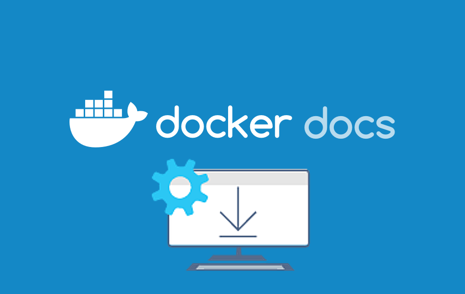](https://docs.docker.com/docker-for-windows/install/) 
        **[Install Docker Desktop for Windows](https://docs.docker.com/docker-for-windows/install/)** 
        Find installation steps, system requirements, what's included in the installer, how to uninstall, differences between stable and edge versions, and how to switch between Windows and Linux containers.
    :::column-end:::
    :::column:::
       [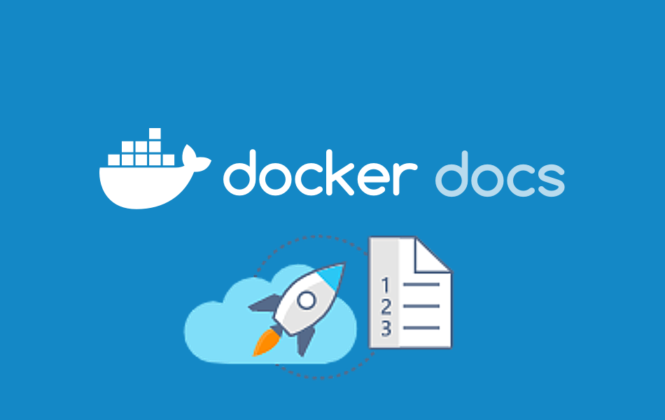](https://docs.docker.com/get-started/) 
        **[Get started with Docker](https://docs.docker.com/get-started/)** 
        Docker orientation and setup docs with step-by-step instructions on how to get started, including a video walk-through.
    :::column-end:::
    :::column:::
       [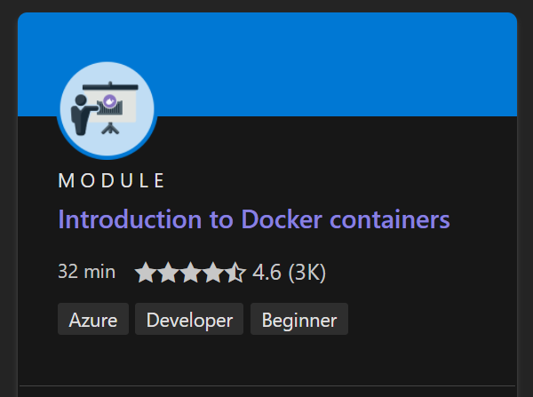](/training/modules/intro-to-docker-containers/) 
        **[MS Learn course: Introduction to Docker containers](/training/modules/intro-to-docker-containers/)** 
        Microsoft Learn offers a free intro course on Docker containers, in addition to a [variety of courses](/training/browse/?terms=docker) on get started with Docker and connecting with Azure services.
    :::column-end:::
    :::column:::
       [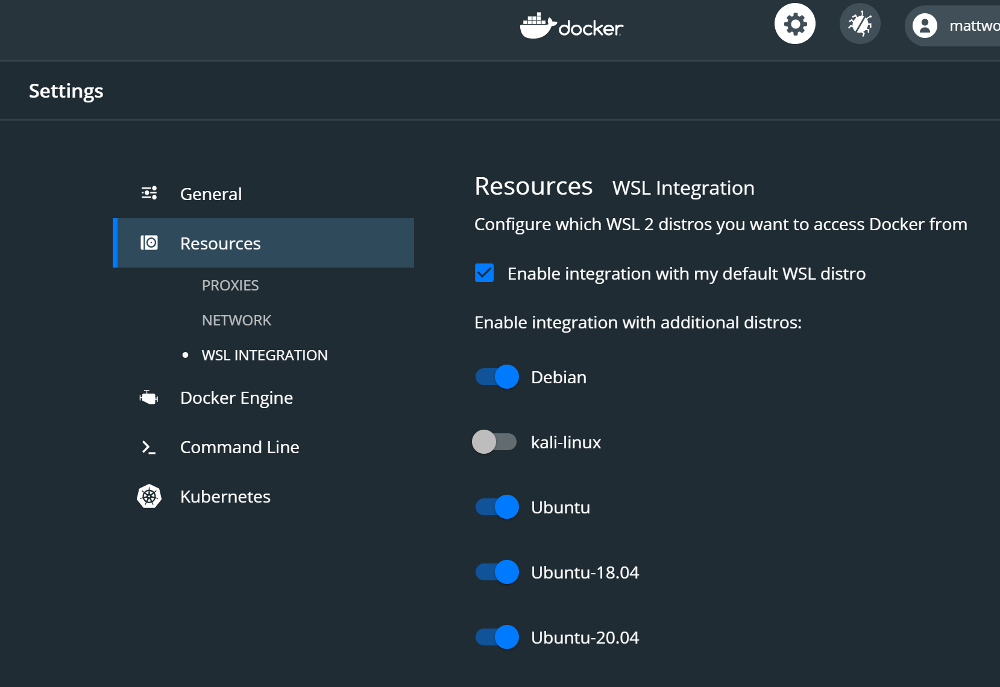](/windows/wsl/tutorials/wsl-containers) 
        **[Get started with Docker remote containers on WSL 2](/windows/wsl/tutorials/wsl-containers)** 
        Learn how to set up Docker Desktop for Windows to use with a Linux command line (Ubuntu, Debian, SUSE, etc) using WSL 2 (Windows Subsystem for Linux, version 2).
    :::column-end:::
:::row-end:::

## VS Code and Docker

:::row:::
    :::column:::
       [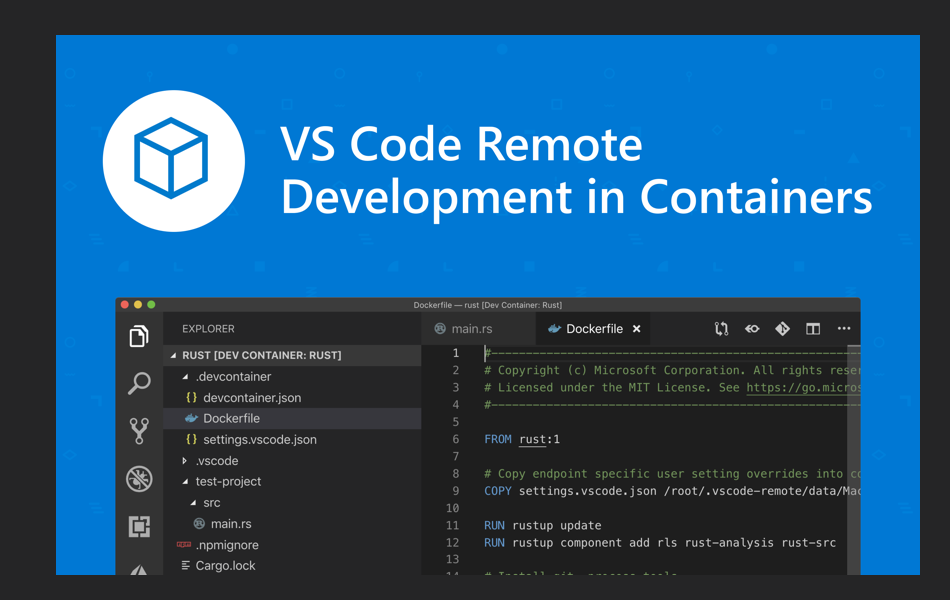](https://code.visualstudio.com/docs/remote/create-dev-container) 
        **[Create a Docker container with VS Code](https://code.visualstudio.com/docs/remote/containers-tutorial)** 
        Set up a full-featured dev environment inside of a container with the [Remote - Containers extension](https://marketplace.visualstudio.com/items?itemName=ms-vscode-remote.remote-containers) and find tutorials to set up a [NodeJS container](https://code.visualstudio.com/docs/containers/quickstart-node), a [Python container](https://code.visualstudio.com/docs/containers/quickstart-python), or a [ASP.NET Core container](https://code.visualstudio.com/docs/containers/quickstart-aspnet-core).
    :::column-end:::
    :::column:::
       [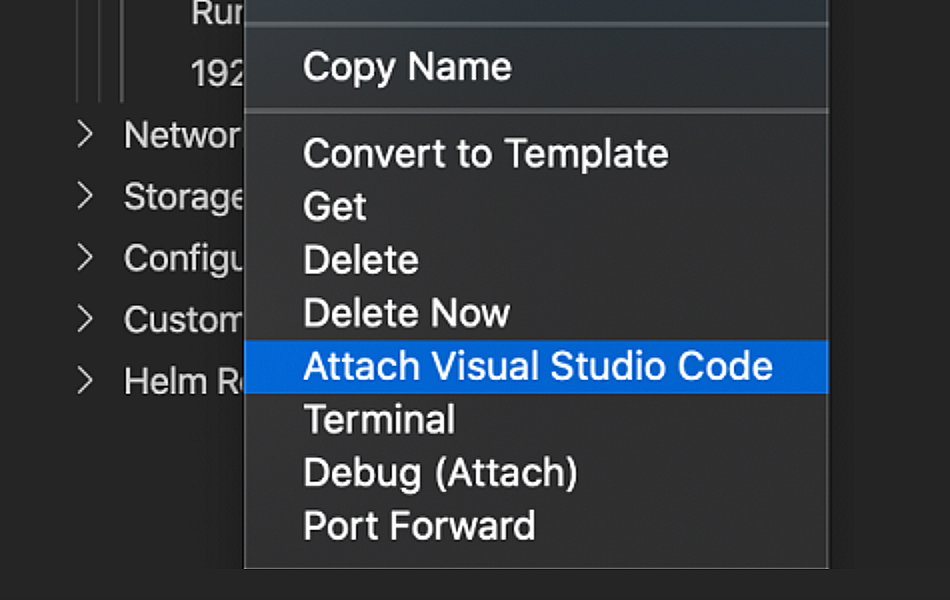](https://code.visualstudio.com/docs/remote/attach-container) 
        **[Attach VS Code to a Docker container](https://code.visualstudio.com/docs/remote/attach-container)** 
        Learn how to attach Visual Studio Code to a Docker container that is already running or to a [container in a Kubernetes cluster](https://code.visualstudio.com/docs/remote/attach-container#_attach-to-a-container-in-a-kubernetes-cluster).
    :::column-end:::
    :::column:::
       [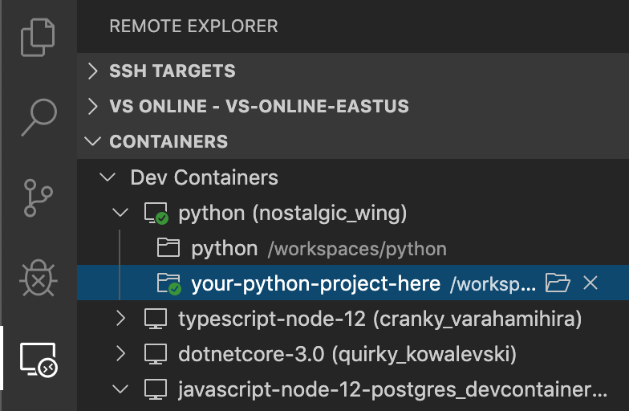](https://code.visualstudio.com/docs/remote/containers-advanced) 
        **[Advanced Container Configuration](https://code.visualstudio.com/docs/remote/containers-advanced)** 
        Learn about advanced setup scenarios for using Docker containers with Visual Studio Code or read this article on how to [Inspect Containers](https://code.visualstudio.com/blogs/2019/10/31/inspecting-containers) for debugging with VS Code.
    :::column-end:::
    :::column:::
       [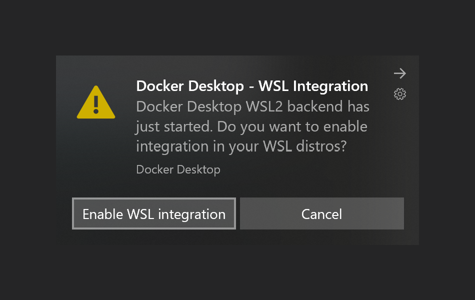](https://code.visualstudio.com/blogs/2020/07/01/containers-wsl) 
        **[Using Remote Containers in WSL 2](https://code.visualstudio.com/blogs/2020/07/01/containers-wsl)** 
        Read about using Docker containers with WSL 2 (Windows Subsystem for Linux, version 2) and how to set everything up with VS Code. You can also read about [how it works](https://code.visualstudio.com/blogs/2020/03/02/docker-in-wsl2#_how-it-works).
    :::column-end:::
:::row-end:::

## Visual Studio and Docker

:::row:::
    :::column:::
       [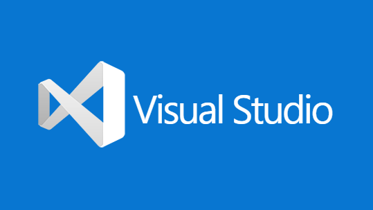](/visualstudio/containers/overview#docker-support-in-visual-studio-1) 
        **[Docker support in Visual Studio](/visualstudio/containers/overview#docker-support-in-visual-studio-1)** 
        Learn about the Docker support available for ASP.NET projects, ASP.NET Core projects, and .NET Core and .NET Framework console projects in Visual Studio, in addition to support for container orchestration.
    :::column-end:::
    :::column:::
       [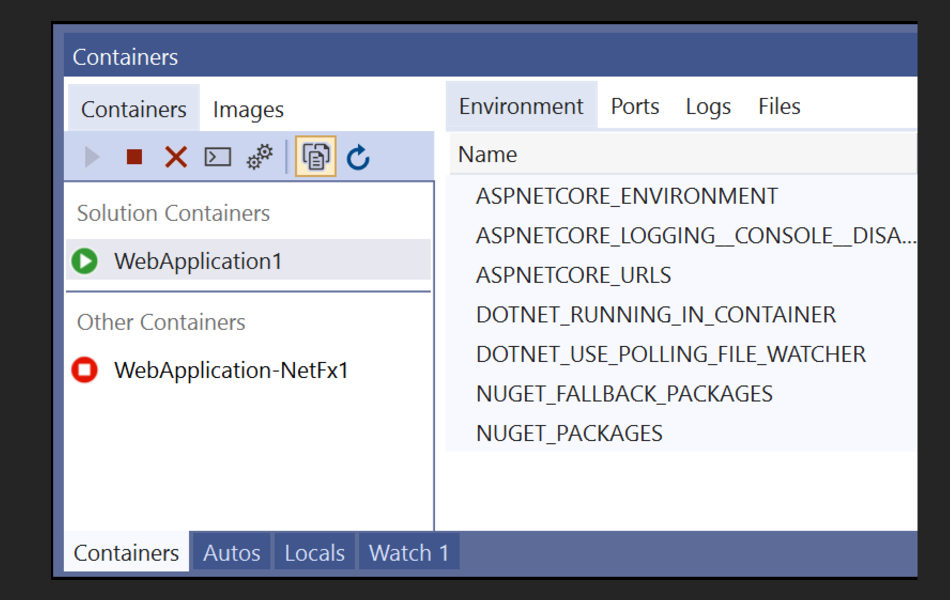](/visualstudio/containers/container-tools) 
        **[Quickstart: Docker in Visual Studio](/visualstudio/containers/container-tools)** 
        Learn how to build, debug, and run containerized .NET, ASP.NET, and ASP.NET Core apps and publish them to Azure Container Registry (ACR), Docker Hub, Azure App Service, or your own container registry with Visual Studio.
    :::column-end:::
    :::column:::
       [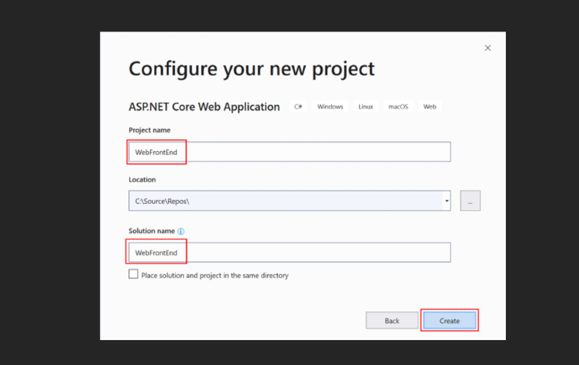](/visualstudio/containers/tutorial-multicontainer) 
        **[Tutorial: Create a multi-container app with Docker Compose](/visualstudio/containers/tutorial-multicontainer)** 
        Learn how to manage more than one container and communicate between them when using Container Tools in Visual Studio. You can also find links to tutorials like how to [Use Docker with a React Single-page App](/visualstudio/containers/container-tools-react).
    :::column-end:::
    :::column:::
       [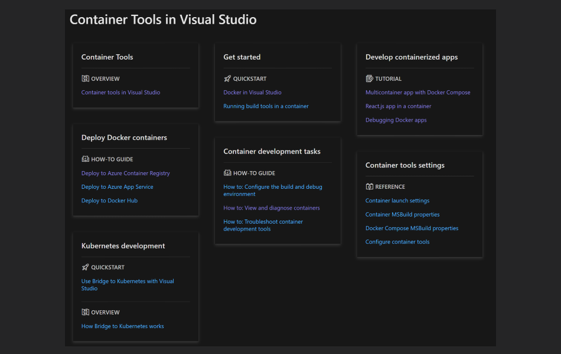](/visualstudio/containers) 
        **[Container Tools in Visual Studio](/visualstudio/containers)** 
        Find topics covering how to run build tools in a container, [debugging Docker apps](/visualstudio/containers/edit-and-refresh), troubleshoot development tools, deploy Docker containers, and bridge Kubernetes with Visual Studio.
    :::column-end:::
:::row-end:::

## .NET and Docker

:::row:::
    :::column:::
       [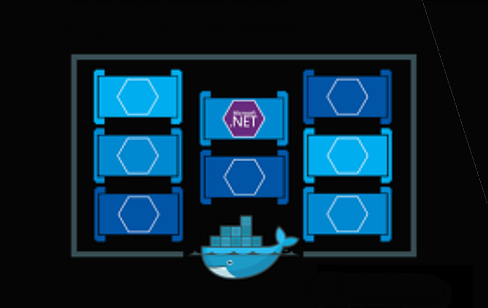](/dotnet/architecture/microservices/) 
        **[.NET Guide: Microservice apps and containers](/dotnet/architecture/microservices/)** 
        Intro guide to microservices-based apps managed with containers.
    :::column-end:::
    :::column:::
       [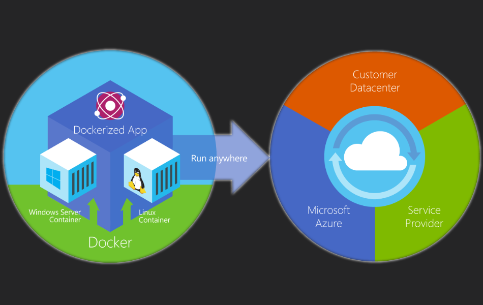](/dotnet/architecture/microservices/container-docker-introduction/docker-defined) 
        **[What is Docker?](/dotnet/architecture/microservices/container-docker-introduction/docker-defined)** 
        Basic explanation of Docker containers, including [Comparing Docker containers with Virtual machines](/dotnet/architecture/microservices/container-docker-introduction/docker-defined#comparing-docker-containers-with-virtual-machines) and a basic [taxonomy of Docker terms and concepts](/dotnet/architecture/microservices/container-docker-introduction/docker-containers-images-registries) explaining the difference between containers, images, and registries.
    :::column-end:::
    :::column:::
        
        **[Tutorial: Containerize a .NET app](/dotnet/core/docker/build-container?tabs=windows)** 
        Learn how to containerize a .NET application with Docker, including creation of a Dockerfile, essential commands, and cleaning up resources.
    :::column-end:::
    :::column:::
       [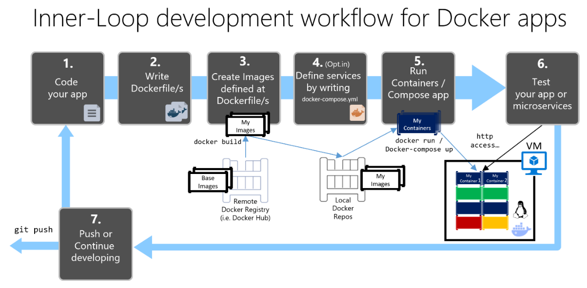](/dotnet/architecture/microservices/docker-application-development-process/docker-app-development-workflow) 
        **[Development workflow for Docker apps](/dotnet/architecture/microservices/docker-application-development-process/docker-app-development-workflow)** 
        Describes the inner-loop development workflow for Docker container-based applications.
    :::column-end:::
:::row-end:::

## Azure Container Services

:::row:::
    :::column:::
       [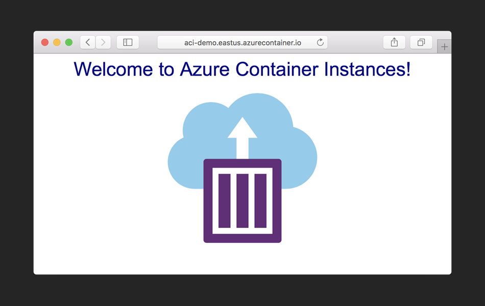](/azure/container-instances/) 
        **[Azure Container Instances](/azure/container-instances/)** 
        Learn how to run Docker containers on-demand in a managed, serverless Azure environment, includes ways to deploy with Docker CLI, ARM, Azure Portal, create multi-container groups, share data between containers, connect to a virtual network, and more.
    :::column-end:::
    :::column:::
       [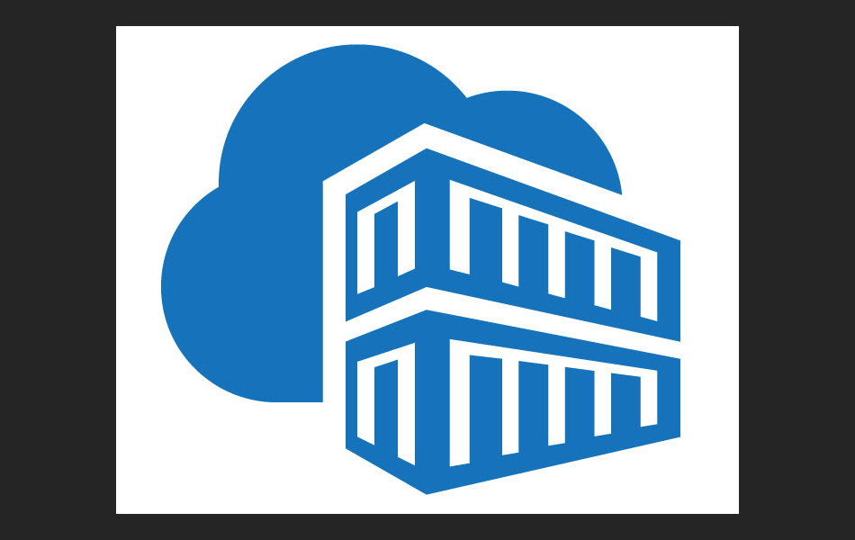](/azure/container-registry) 
        **[Azure Container Registry](/azure/container-registry)** 
        Learn how to build, store, and manage container images and artifacts in a private registry for all types of container deployments. Create Azure container registries for your existing container development and deployment pipelines, set up automation tasks, and learn how to manage your registries, including geo-replication and best practices.
    :::column-end:::
    :::column:::
       [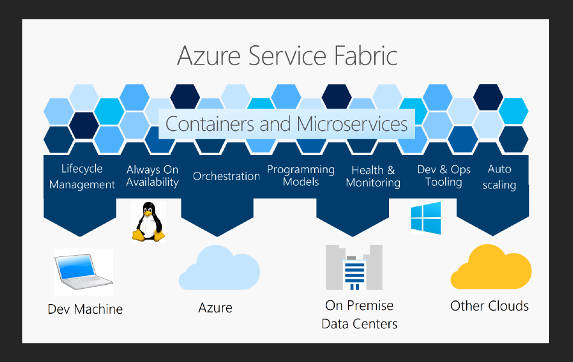](/azure/service-fabric) 
        **[Azure Service Fabric](/azure/service-fabric)** 
        Learn about Azure Service Fabric, a distributed systems platform for packaging, deploying, and managing scalable and reliable microservices and containers.
    :::column-end:::
    :::column:::
       [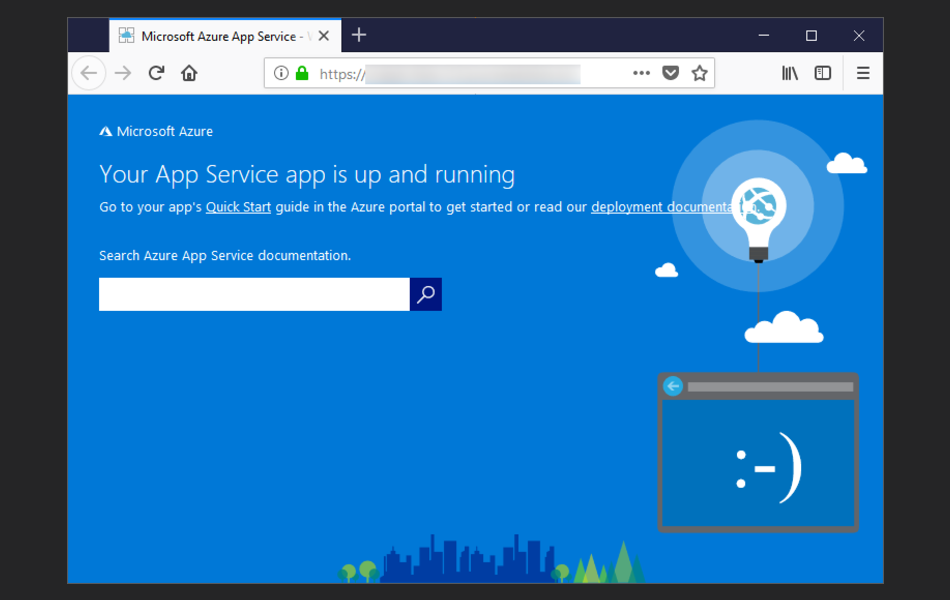](/azure/app-service) 
        **[Azure App Service](/azure/app-service)** 
        Learn how to build and host web apps, mobile back ends, and RESTful APIs in the programming language of your choice without managing infrastructure. Try the [Azure App Service](/training/modules/deploy-run-container-app-service) Learn module to deploy a web app based on a Docker image and configure continuous deployment.
    :::column-end:::
:::row-end:::

Learn about more [Azure services that support containers](https://azure.microsoft.com/overview/containers/).

## Docker Containers Explainer Video

> [!VIDEO https://www.youtube.com/embed/0oEsMwSxBsk]

## Kubernetes and Container Orchestration Explainer Video

> [!VIDEO https://www.youtube.com/embed/3RTvoI-A7UQ]

## Containers on Windows

:::row:::
    :::column:::
       [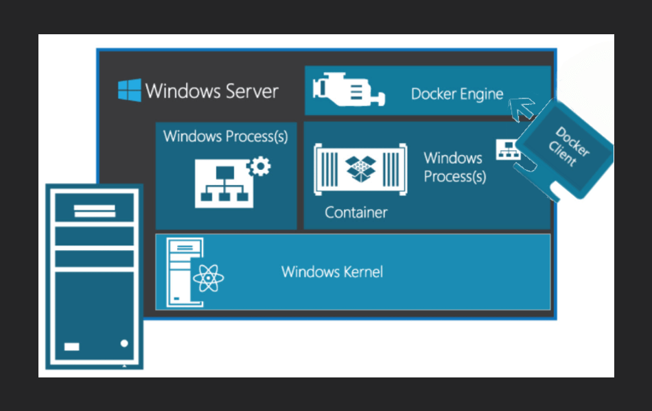](/virtualization/windowscontainers) 
        **[Containers on Windows docs](/virtualization/windowscontainers)** 
        Package apps with their dependencies and leverage operating system-level virtualization for fast, fully isolated environments on a single system. Learn [about Windows containers](/virtualization/windowscontainers/about), including quick starts, deployment guides, and samples.
    :::column-end:::
    :::column:::
        
        **[FAQs about Windows containers](/virtualization/windowscontainers/about/faq)** 
        Find frequently asked questions about containers. Also see this explanation in StackOverflow on "[What's the difference between Docker for Windows and Docker on Windows?](https://stackoverflow.com/questions/38464724/whats-the-difference-between-docker-for-windows-and-docker-on-windows/40320748)"
    :::column-end:::
    :::column:::
       [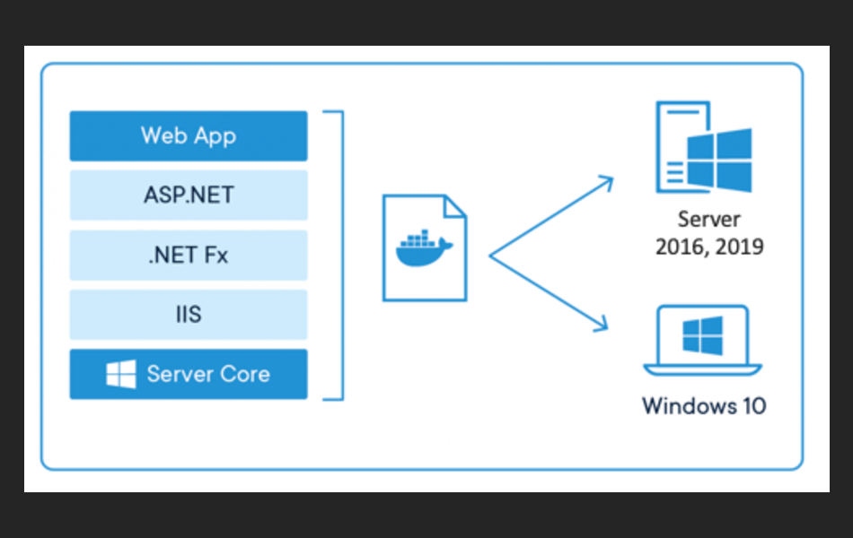](/virtualization/windowscontainers/quick-start/set-up-environment?tabs=Windows-10-Client) 
        **[Set up your environment](/virtualization/windowscontainers/quick-start/set-up-environment?tabs=Windows-10-Client)** 
        Learn how to set up Windows 11, Windows 10, or Windows Server to create, run, and deploy containers, including prerequisites, installing Docker, and working with [Windows Container Base Images](/virtualization/windowscontainers/manage-containers/container-base-images).
    :::column-end:::
    :::column:::
        
        **[Create a Windows Server container on an Azure Kubernetes Service (AKS)](/azure/aks/windows-container-cli)** 
        Learn how to deploy an ASP.NET sample app in a Windows Server container to an AKS cluster using the Azure CLI.
    :::column-end:::
:::row-end:::
