# Set up your development environment on Windows

Windows invites you to code as you are. Use whatever coding language or framework you prefer - whether developing with tools on Windows or with Linux tools on the Windows Subsystem for Linux, this guide will help you get set up and install what you need to start coding, debugging, and accessing services to put your work into production.

## Developer tools

:::row:::
    :::column:::
       [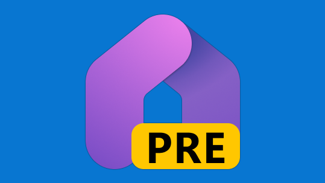](/windows/dev-home) 
        **[Dev Home](/windows/dev-home/)** 
        Monitor your work in the centralized dashboard, GitHub and System performance widgets. Get setup and onboard new projects with the Machine configuration tool. 
        [Install Dev Home](https://aka.ms/devhome)
    :::column-end:::
    :::column:::
       [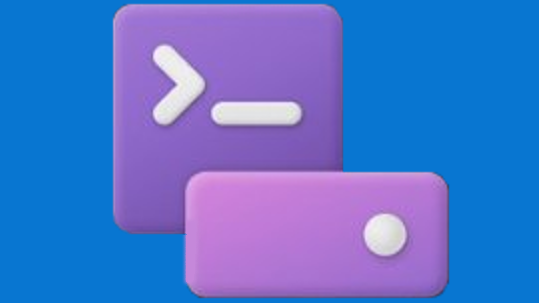](/windows/dev-drive) 
        **[Dev Drive](/windows/dev-drive/)** 
        Improve performance by storing project files on a Dev Drive and keep files secure with trust designation, antivirus configuration, and attached filters.
         
        [Create a Dev Drive](/windows/dev-drive#how-to-set-up-a-dev-drive)
    :::column-end:::
    :::column:::
       [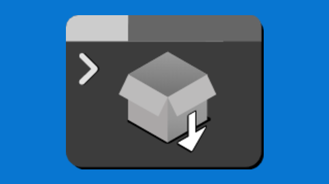](../package-manager/configuration/index.md) 
        **[WinGet Configuration](../package-manager/configuration/index.md)** 
        Consolidate manual machine setup and project onboarding to a single command that is reliable and repeatable. 
        [Author a configuration file](../package-manager/configuration/create.md)
    :::column-end:::
    :::column:::
        
        **[Windows Subsystem for Linux](/windows/wsl/)** 
        Use your favorite Linux distribution fully integrated with Windows (no more need for dual-boot). 
        [Install WSL](/windows/wsl/install)
    :::column-end:::
:::row-end:::

:::row:::
    :::column:::
       [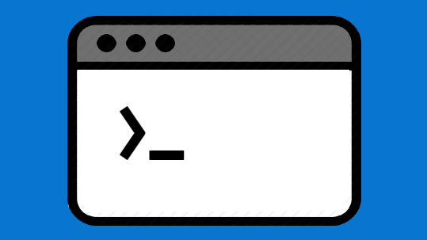](/windows/terminal/) 
        **[Windows Terminal](/windows/terminal/)** 
        Customize your terminal environment to work with multiple command line shells.
         
        [Install Terminal](https://www.microsoft.com/p/windows-terminal/9n0dx20hk701?rtc=1&activetab=pivot:overviewtab)
    :::column-end:::
    :::column:::
        
        **[Windows Package Manager](../package-manager/index.md)** 
        Use the winget.exe client, a comprehensive package manager, with your command line to install applications on Windows. 
        [Install Windows Package Manager](../package-manager/winget/index.md#install-winget)
    :::column-end:::
    :::column:::
        
        **[Microsoft PowerToys](../powertoys/index.md)** 
        Tune and streamline your Windows experience for greater productivity with this set of power user utilities. 
        [Install PowerToys](../powertoys/install.md)
    :::column-end:::
    :::column:::
        
        **[Windows Subsystem for Android](/windows/android/wsa/)** 
        Windows Subsystem for Android™️ enables your Windows 11 device to run Android applications that are available in the Amazon Appstore. 
        [Learn more](/windows/android/wsa/)
    :::column-end:::
:::row-end:::

 

> [!VIDEO 54e6c532-a86c-4a39-81ab-40e28ce2ba96]

## Windows Copilot

The first PC platform to provide centralized AI assistance and designed to help people easily take action and get things done is coming soon! See the [Blog announcement](https://blogs.windows.com/windowsdeveloper/2023/05/23/bringing-the-power-of-ai-to-windows-11-unlocking-a-new-era-of-productivity-for-customers-and-developers-with-windows-copilot-and-dev-home/).

[Sign up to receive updates](https://aka.ms/PluginsForWindows)

 

> [!VIDEO 72ad293b-b7aa-4a78-9111-46eb0e072d7b]

## Development paths

:::row:::
    :::column:::
       [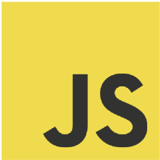](./javascript/index.md) 
        **[Get started with JavaScript](./javascript/index.md)** 
        Get started with JavaScript by setting up your development environment on Windows or Windows Subsystem for Linux and install [Node.js](./javascript/nodejs-overview.md), [React](./javascript/react-overview.md), [Vue](./javascript/vue-overview.md), [Express](./javascript/nodejs-beginners-tutorial.md), [Gatsby](./javascript/gatsby-on-wsl.md), [Next.js](./javascript/nextjs-on-wsl.md), or [Nuxt.js](./javascript/nuxtjs-on-wsl.md).
    :::column-end:::
    :::column:::
        
        **[Get started with Python](../python/index.yml)** 
        Install Python and get your development environment setup on Windows or Windows Subsystem for Linux.
    :::column-end:::
    :::column:::
        
        **[Get started with Android](/windows/android)** 
        Install Android Studio, or choose a cross-platform solution like .NET MAUI, React, or creating a PWA, and get your development environment setup on Windows.
    :::column-end:::
    :::column:::
       [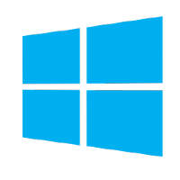](../apps/index.yml) 
        **[Get started building Windows apps](../apps/index.yml)** 
        Get started building desktop apps for Windows using the Windows App SDK, UWP, Win32, WPF, Windows Forms, or updating and deploying existing desktop apps with MSIX and XAML Islands.
    :::column-end:::
:::row-end:::

:::row:::
    :::column:::
       [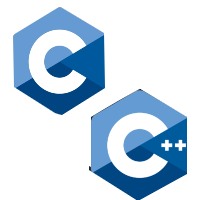](/cpp/) 
        **[Get started with C++ and C](/cpp/)** 
        Get started with C++, C, and assembly to develop apps, services, and tools.
    :::column-end:::
    :::column:::
       [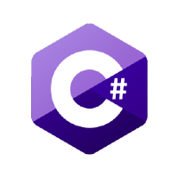](/dotnet/csharp/) 
        **[Get started with C#](/dotnet/csharp/)** 
        Get started building apps using C# and .NET.
    :::column-end:::
    :::column:::
        
        **[Get started with F#](/dotnet/fsharp/)** 
        Get started building apps using F# and .NET.
    :::column-end:::
    :::column:::
        
        **[Get started with Rust](./rust/index.yml)** 
        Get started programming with Rust&mdash;including how to set up Rust for Windows by consuming the *windows* crate.
    :::column-end:::
:::row-end:::

:::row:::
    :::column:::
       [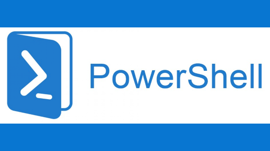](/powershell/) 
        **[Get started with PowerShell](/powershell/)** 
        Get started with cross-platform task automation and configuration management using PowerShell, a command-line shell and scripting language.
    :::column-end:::
    :::column:::
       [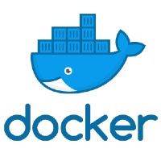](../dev-environment/docker/overview.md) 
        **[Get started with Docker Desktop for Windows](../dev-environment/docker/overview.md)** 
        Create remote development containers with support from Visual Studio, VS Code, .NET, Windows Subsystem for Linux, or a variety of Azure services.
    :::column-end:::
    :::column:::
        
        **[Get started with Blazor](https://dotnet.microsoft.com/apps/aspnet/web-apps/blazor)** 
        Get started with Blazor, a client-side UI framework within ASP.NET Core. Use HTML, CSS, and C# (rather than JavaScript) to create UI components and single page applications for the web.
    :::column-end:::
:::row-end:::

## More for developers

:::row:::
    :::column:::
        
        **[VS Code](https://code.visualstudio.com/docs)** 
        A lightweight source code editor with built-in support for JavaScript, TypeScript, Node.js, a rich ecosystem of extensions (C++, C#, Java, Python, PHP, Go) and runtimes (such as .NET and Unity). 
        [Install VS Code](https://code.visualstudio.com/download)
    :::column-end:::
    :::column:::
        
        **[Visual Studio](/visualstudio/windows/)** 
        An integrated development environment that you can use to edit, debug, build code, and publish apps, including compilers, intellisense code completion, and many more features. 
        [Install Visual Studio](/visualstudio/install/install-visual-studio)
    :::column-end:::
    :::column:::
        
        **[Azure](/azure/guides/developer/azure-developer-guide)** 
        A complete cloud platform to host your existing apps and streamline new development. Azure services integrate everything you need to develop, test, deploy, and manage your apps. 
        [Set up an Azure account](https://azure.microsoft.com/free/)
    :::column-end:::
    :::column:::
       [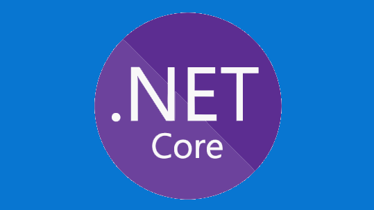](https://dotnet.microsoft.com/) 
        **[.NET](/dotnet/standard/get-started/)** 
        An open source development platform with tools and libraries for building any type of app, including web, mobile, desktop, gaming, IoT, cloud, and microservices. 
        [Install .NET](https://dotnet.microsoft.com/download)
    :::column-end:::
:::row-end:::

 

## Run Windows and Linux

Windows Subsystem for Linux (WSL) allows developers to run a Linux operating system right alongside Windows. Both share the same hard drive (and can access each other’s files), the clipboard supports copy-and-paste between the two naturally, there's no need for dual-booting. WSL enables you to use BASH and will provide the kind of environment most familiar to Mac users.

Learn more in the [WSL docs](/windows/wsl).

> [!VIDEO https://learn.microsoft.com/shows/One-Dev-Minute/What-can-I-do-with-WSL--One-Dev-Question/player?format=ny]

You can also use Windows Terminal to open all of your favorite command line tools in the same window with multiple tabs, or in multiple panes, whether that's PowerShell, Windows Command Prompt, Ubuntu, Debian, Azure CLI, Oh-my-Zsh, Git Bash, or all of the above.

Learn more in the [Windows Terminal docs](/windows/terminal).

> [!VIDEO https://learn.microsoft.com/shows/One-Dev-Minute/What-are-the-main-features-of-the-new-Terminal--One-Dev-Question/player?format=ny]

## Transitioning between Mac and Windows

Check out our [guide to transitioning between between a Mac and Windows](./mac-to-windows.md) (or Windows Subsystem for Linux) development environment. It can help you map the difference between:

- [Keyboard shortcuts](./mac-to-windows.md#keyboard-shortcuts)
- [Trackpad shortcuts](./mac-to-windows.md#trackpad-shortcuts)
- [Terminal and shell tools](./mac-to-windows.md#command-line-shells-and-terminals)
- [Apps and utilities](./mac-to-windows.md#apps-and-utilities)

## Game development documentation

- [Microsoft's Game Dev documentation](/gaming/)

