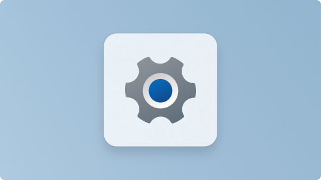
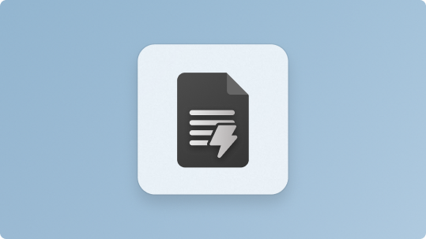
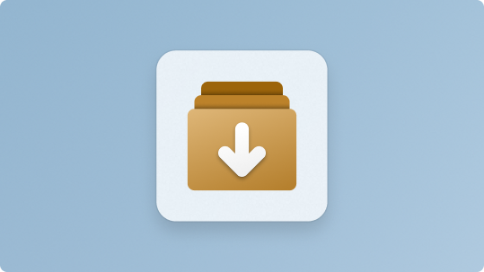
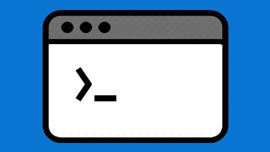
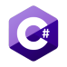
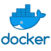

# Windows developer tools

Windows supports a wide range of development workflows. Tools like Visual Studio Code and GitHub Copilot are well-integrated on Windows, and with AI assistance built into your editor and terminal, it's straightforward to write scripts and build utilities to automate your work. Whether you're developing for Windows, the web, or cross-platform, this page points you to the tools and setup guides to get started.

## Tools to get you started

:::row:::
    :::column:::
        
        **[Advanced Settings](../advanced-settings/index.md)** 
        Configure Windows settings like Developer Mode and File Explorer source control.
    :::column-end:::
    :::column:::
        
        **[CLI tools](../core-utils/overview.md)** 
        Built-in command-line utilities for Windows, including Coreutils, curl, Edit, sudo, and tar.
    :::column-end:::
    :::column:::
        
         **[Dev Configs](../dev-configs/index.md)** 
        Curated, declarative setups that configure your Windows dev environment in one step.
    :::column-end:::
:::row-end:::

:::row:::
    :::column:::
        
        **[Microsoft PowerToys](../powertoys/index.md)** 
        A set of power user utilities to tune and streamline your Windows experience.
    :::column-end:::
    :::column:::
        
        **[WinGet](../package-manager/index.md)** 
        Install and configure packages through command-line or declarative manifests.
    :::column-end:::
    :::column:::
        
        **[Windows Subsystem for Linux](/windows/wsl/)** 
        Run your favorite Linux distribution fully integrated with Windows.
    :::column-end:::
:::row-end:::

:::row:::
    :::column:::
        
        **[Windows Terminal](/windows/terminal/)** 
        Customize your terminal environment to work with multiple command line shells.
    :::column-end:::
    :::column:::
    :::column-end:::
    :::column:::
    :::column-end:::
:::row-end:::
 

---

Watch the Windows developer tools overview from Microsoft Ignite to see these tools in action.
  

<iframe width="600" height="338" src="https://www.youtube.com/embed/mJQxAKYkCBk?si=y6-YTNGHkuDpFzZn" title="YouTube video player" frameborder="0" allow="accelerometer; autoplay; clipboard-write; encrypted-media; gyroscope; picture-in-picture; web-share" allowfullscreen></iframe>

---

## Setup guides

Follow these guides to set up your development environment for your preferred language or framework on Windows.

:::row:::
    :::column:::
        
        **[JavaScript](./javascript/index.md)** 
        Set up your JavaScript development environment with Node.js, React, Vue, and more.
    :::column-end:::
    :::column:::
        
        **[Python](./python.md)** 
        Install Python and set up your development environment on Windows.
    :::column-end:::
    :::column:::
        
        **[Java](./java.md)** 
        Install a JDK, configure JAVA_HOME, and set up your Java development environment on Windows.
    :::column-end:::
:::row-end:::
:::row:::
    :::column:::
        
        **[C and C++](/cpp/)** 
        Develop apps, services, and tools with C++, C, and assembly.
    :::column-end:::
    :::column:::
        
        **[C#](/dotnet/csharp/)** 
        Build apps using C# and .NET.
    :::column-end:::
    :::column:::
        
        **[Docker](./docker/overview.md)** 
        Create remote development containers with support from VS, VS Code, .NET, and WSL.
    :::column-end:::
:::row-end:::

:::row:::
    :::column:::
        
        **[PowerShell](/powershell/)** 
        Cross-platform task automation and configuration management using PowerShell.
    :::column-end:::
    :::column:::
        
        **[Rust](./rust/overview.md)** 
        Get started programming with Rust, including how to set up Rust for Windows.
    :::column-end:::
    :::column:::
        
        **[Windows app development](../apps/index.yml)** 
        Build desktop apps with WinUI and the Windows App SDK.
    :::column-end:::
:::row-end:::

:::row:::
    :::column:::
        
        **[Mac to Windows guide](./mac-to-windows.md)** 
        Transition between a Mac and Windows (or Windows Subsystem for Linux) development environment.
    :::column-end:::
    :::column:::
    :::column-end:::
    :::column:::
    :::column-end:::
:::row-end:::
---

