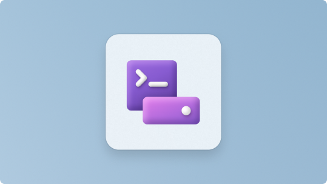
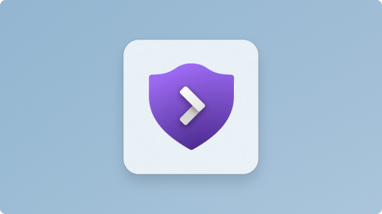

# Development environment on Windows

Windows invites you to code as you are. Use whatever coding language or framework you prefer - whether developing with tools on Windows or with Linux tools on the Windows Subsystem for Linux, this guide will help you get set up and install what you need to start coding, debugging, and accessing services to put your work into production.

## Developer tools

:::row:::
    :::column:::
        
        **[Windows Terminal](/windows/terminal/)** 
        Customize your terminal environment to work with multiple command line shells.
    :::column-end:::
    :::column:::
        
        **[WinGet](../package-manager/index.md)** 
        Install and configure packages through command-line or declarative manifests.
    :::column-end:::
    :::column:::
        
        **[Windows Subsystem for Linux](/windows/wsl/)** 
        Run your favorite Linux distribution fully integrated with Windows.
    :::column-end:::
:::row-end:::

:::row:::
    :::column:::
        
        **[Microsoft PowerToys](../powertoys/index.md)** 
        A set of power user utilities to tune and streamline your Windows experience.
    :::column-end:::
    :::column:::
        
        **[Dev Drive](/windows/dev-drive/)** 
        A storage volume optimized for performance in developer scenarios.
    :::column-end:::
    :::column:::
        
        **[Sudo for Windows](/windows/sudo/)** 
        Run elevated commands directly from an unelevated console session.
    :::column-end:::
:::row-end:::
 

Watch the Windows developer tools overview from Microsoft Ignite to see these tools in action.

<iframe style="position: absolute; top: 0; left: 0; width: 100%; height: 100%;" src="https://www.youtube.com/embed/mJQxAKYkCBk?si=y6-YTNGHkuDpFzZn" title="YouTube video player" frameborder="0" allow="accelerometer; autoplay; clipboard-write; encrypted-media; gyroscope; picture-in-picture; web-share" referrerpolicy="strict-origin-when-cross-origin" allowfullscreen></iframe>

## Development paths

Follow these guides to set up your Windows development environment for your preferred language or framework.

:::row:::
    :::column:::
        
        **[Get started with JavaScript](./javascript/index.md)** 
        Set up your JavaScript development environment with Node.js, React, Vue, and more.
    :::column-end:::
    :::column:::
        
        **[Get started with Python](./python.md)** 
        Install Python and set up your development environment on Windows.
    :::column-end:::
    :::column:::
        
        **[Get started building Windows apps](../apps/index.yml)** 
        Build desktop apps with WinUI and the Windows App SDK.
    :::column-end:::
    :::column:::
        
        **[Get started with Windows AI](/windows/ai)** 
        Build next-generation applications with local AI running on NPU-powered devices.
    :::column-end:::
:::row-end:::

:::row:::
    :::column:::
        
        **[Get started with Android](/windows/android)** 
        Build Android apps on Windows with Android Studio, .NET MAUI, React, or PWAs.
    :::column-end:::
    :::column:::
        
        **[Get started with C++ and C](/cpp/)** 
        Develop apps, services, and tools with C++, C, and assembly.
    :::column-end:::
    :::column:::
        
        **[Get started with C#](/dotnet/csharp/)** 
        Build apps using C# and .NET.
    :::column-end:::
    :::column:::
        
        **[Get started with Game Development](/gaming/)** 
        Build games for Windows using Microsoft's game development tools and services.
    :::column-end:::
:::row-end:::

:::row:::
    :::column:::
        
        **[Get started with Rust](./rust/index.yml)** 
        Get started programming with Rust, including how to set up Rust for Windows.
    :::column-end:::
    :::column:::
        
        **[Get started with PowerShell](/powershell/)** 
        Cross-platform task automation and configuration management using PowerShell.
    :::column-end:::
    :::column:::
        
        **[Get started with Docker](../dev-environment/docker/overview.md)** 
        Create remote development containers with support from VS, VS Code, .NET, and WSL.
    :::column-end:::
    :::column:::
        
        **[Get started with Blazor](https://dotnet.microsoft.com/apps/aspnet/web-apps/blazor)** 
        Build web UI components and single page applications with C# instead of JavaScript.
    :::column-end:::
:::row-end:::

## Transitioning between Mac and Windows

Check out our [guide to transitioning between a Mac and Windows](./mac-to-windows.md) (or Windows Subsystem for Linux) development environment. It can help you map the difference between:

- [Keyboard shortcuts](./mac-to-windows.md#keyboard-shortcuts)
- [Trackpad shortcuts](./mac-to-windows.md#trackpad-shortcuts)
- [Terminal and shell tools](./mac-to-windows.md#command-line-shells-and-terminals)
- [Apps and utilities](./mac-to-windows.md#apps-and-utilities)

