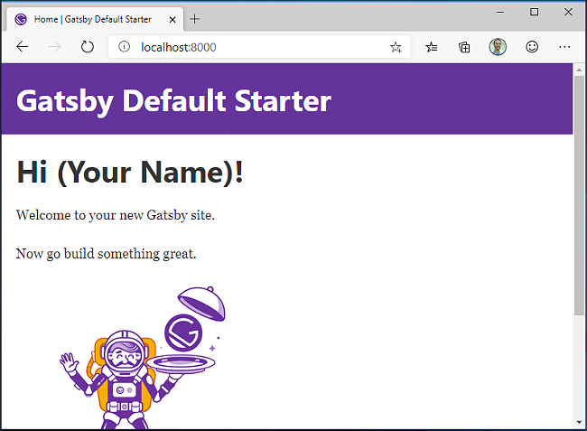

# Get started with Gatsby.js on Windows

A guide to help you install the Gatsby.js web framework and get up and running on Windows.

Gatsby.js is a static site generator framework based on React.js, as opposed to being server-rendered like Next.js. A static site generator generates static HTML on build time. It doesn’t require a server. Next.js generates HTML on runtime (each time a new request comes in), requiring a server to run. Gatsby also dictates how to handle data in your app (with GraphQL), whereas Next.js leaves that decision up to you.

To learn more about React and other JavaScript frameworks based on React, see the [React overview](./react-overview.md) page.

## Prerequisites

This guide assumes that you've already completed the steps to set up your Node.js development environment, including:

- Install the latest version of Windows 10 (Version 1903+, Build 18362+) or Windows 11
- [Install Windows Subsystem for Linux (WSL)](/windows/wsl/install-win10), including a Linux distribution (like Ubuntu) and make sure it is running in WSL 2 mode. You can check this by opening PowerShell and entering: `wsl -l -v`
- [Install Node.js on WSL 2](./nodejs-on-wsl.md): This includes a version manager, package manager, Visual Studio Code, and the Remote Development extension.

We recommend using the Windows Subsystem for Linux when working with NodeJS apps for better performance speed, system call compatibility, and for parody when running Linux servers or Docker containers.

> [!IMPORTANT]
> Installing a Linux distribution with WSL will create a directory for storing files: `\\wsl\Ubuntu-20.04` (substitute Ubuntu-20.04 with whatever Linux distribution you're using). To open this directory in Windows File Explorer, open your WSL command line, select your home directory using `cd ~`, then enter the command `explorer.exe .` Be careful not to install NodeJS or store files that you will be working with on the mounted C drive (`/mnt/c/Users/yourname$`). Doing so will significantly slow down your install and build times.

## Install Gatsby.js

To create a Gatsby.js project:

1. Open your WSL terminal (ie. Ubuntu).
2. Create a new project folder: `mkdir GatsbyProjects` and enter that directory: `cd GatsbyProjects`
3. Use npm to install the Gatsby CLI: `npm install -g gatsby-cli`. Once installed, check the version with `gatsby --version`.
4. Create your Gatsby.js project: `gatsby new my-gatsby-app`
5. Once the package has been installed, change directories into your new app folder, `cd my-gatsby-app`, then use `code .` to open your Gatsby project in VS Code. This will allow you to look at the Gatsby.js framework that has been created for your app using VS Code's File Explorer. Notice that VS Code opened your app in a WSL-Remote environment (as indicated in the green tab on the bottom-left of your VS Code window). This means that while you are using VS Code for editing on the Windows OS, it is still running your app on the Linux OS.

    

6. There are 3 commands you need to know once Gatsby is installed:

    - `gatsby develop` for running a development instance with hot-reloading.
    - `gatsby build` for creating a production build.
    - `gatsby serve` for starting your app in production mode.

    Open the WSL terminal integrated in VS Code (**View > Terminal**). Make sure that the terminal path is pointed to your project directory (ie. `~/GatsbyProjects/my-gatsby-app$`). Then try running a development instance of your new app using: `gatsby develop`

7. Once your new Gatsby project finishes compiling, your terminal will display.`You can now view gatsby-starter-default in the browser. http://localhost:8000/`. Select this localhost link to view your new project built in a web browser.

> [!NOTE]
> You'll notice that your terminal output also let's you know that you can "View GraphiQL, an in-browser IDE, to explore your site's data and schema: `http://localhost:8000/___graphql`." GraphQL consolidates your APIs into a self-documenting IDE (GraphiQL) built into Gatsby. In addition to exploring your site's data and schema, you can perform GraphQL operations such as queries, mutations, and subscriptions. For more info, see [Introducing GraphiQL](https://www.gatsbyjs.com/docs/how-to/querying-data/running-queries-with-graphiql/).

8. Open the `src/pages/index.js` file in your VS Code editor. Find the page title `<h1>Welcome to <b>Gatsby!</b></h1>` and change it to `<h1>Hello <b>World!</b></h1>`. With your web browser still open to `http://localhost:8000`, save your change and notice the hot-reloading feature automatically compile and update your change in the browser.

    

You can use VS Code's debugger with your Gatsby app by selecting the F5 key, or by going to **View > Debug** (Ctrl+Shift+D) and **View > Debug Console** (Ctrl+Shift+Y) in the menu bar. If you select the gear icon in the Debug window, a launch configuration (`launch.json`) file will be created for you to save debugging setup details. To learn more, see [VS Code Debugging](https://code.visualstudio.com/docs/nodejs/nodejs-debugging).

To learn more about Gatsby, see the [Gatsby.js docs](https://www.gatsbyjs.com/docs/).