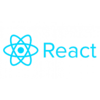
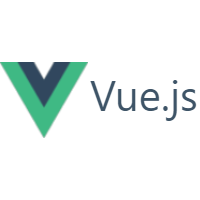
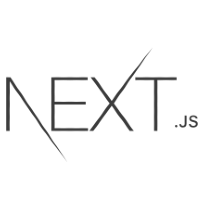
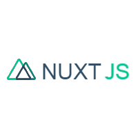

# Install JavaScript frameworks on Windows

This guide will help you get started using JavaScript frameworks on Windows, including Node.js, React.js, Vue.js, Next.js, Nuxt.js, or Gatsby.

## Choose a JavaScript framework to install and set up your dev environment

:::row:::
    :::column:::
        
        **[Node.js overview](./nodejs-overview.md)** 
        Learn about what you can do with Node.js and how to set up a Node.js development environment.
        - [Install on Windows](./nodejs-on-windows.md)
        - [Install on WSL](./nodejs-on-wsl.md)
        - [Try a beginner-level tutorial](./nodejs-beginners-tutorial.md)
    :::column-end:::
    :::column:::
        
        **[React overview](./react-overview.md)** 
        Learn about what you can do with React and how to set up a React development environment.
        - [Install on Windows for building web apps](./react-on-windows.md)
        - [Install on WSL for building web apps](./react-on-wsl.md)
        - [Install on Windows for building desktop apps](./react-native-for-windows.md)
        - [Install on Windows for building Android mobile apps](./react-native-for-android.md)
        - [Try a beginner-level tutorial](./react-beginners-tutorial.md)
    :::column-end:::
    :::column:::
        
        **[Vue.js overview](./vue-overview.md)** 
        Learn about what you can do with Vue.js and how to set up a Vue.js development environment.
        - [Install on Windows](./vue-on-windows.md)
        - [Install on WSL](./vue-on-wsl.md)
        - [Try a beginner-level tutorial](./vue-beginners-tutorial.md)
    :::column-end:::
:::row-end:::

:::row:::
    :::column:::
        
        **[Install Next.js on WSL](./nextjs-on-wsl.md)** 
        Next.js is a framework for creating server-rendered JavaScript apps based on React.js, Node.js, Webpack and Babel.js. Learn how to install it on the Windows Subsystem for Linux.
    :::column-end:::
    :::column:::
        
        **[Install Nuxt.js on WSL](./nuxtjs-on-wsl.md)** 
        Nuxt.js is a framework for creating server-rendered JavaScript apps based on Vue.js, Node.js, Webpack and Babel.js. Learn how to install it on the Windows Subsystem for Linux.
    :::column-end:::
    :::column:::
        
        **[Install Gatsby on WSL](./gatsby-on-wsl.md)** 
        Gatsby is a static site generator framework based on React.js. Learn how to install it on the Windows Subsystem for Linux.
    :::column-end:::
:::row-end:::

