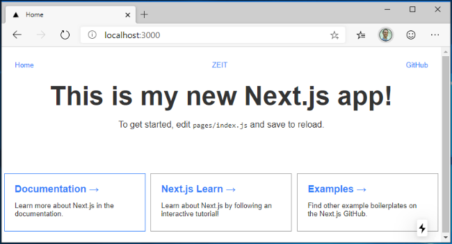

# Get started with Next.js on Windows

A guide to help you install the Next.js web framework and get up and running on Windows.

Next.js is a JavaScript framework tailored for building React-based web applications, offering support for both static and server-side rendered web applicaions. Built with best practices in mind, Next.js enables you to create "universal" web apps in a consistent manner, requiring mininmal configuration. These "universal" server-rendered web apps, also referred to as “isomorphic”, share code between the client and server.
Next.js enables developers to create fast, scalable, and SEO-friendly web applications with ease.

To learn more about React and other JavaScript frameworks based on React, see the [React overview](./react-overview.md) page.

## Prerequisites

This guide assumes that you've already completed the steps to set up your Node.js development environment, including:

- Install the latest version of Windows 10 (Version 1903+, Build 18362+) or Windows 11
- [Install Windows Subsystem for Linux (WSL)](/windows/wsl/install-win10), including a Linux distribution (like Ubuntu) and make sure it is running in WSL 2 mode. You can check this by opening PowerShell and entering: `wsl -l -v`
- [Install Node.js on WSL 2](./nodejs-on-wsl.md): This includes a version manager, package manager, Visual Studio Code, and the Remote Development extension.

We recommend using the Windows Subsystem for Linux when working with NodeJS apps for better performance speed, system call compatibility, and for parity when running Linux servers or Docker containers.

> [!IMPORTANT]
> Installing a Linux distribution with WSL will create a directory for storing files: `\\wsl\Ubuntu-20.04` (substitute Ubuntu-20.04 with whatever Linux distribution you're using). To open this directory in Windows File Explorer, open your WSL command line, select your home directory using `cd ~`, then enter the command `explorer.exe .` Be careful not to install NodeJS or store files that you will be working with on the mounted C drive (`/mnt/c/Users/yourname$`). Doing so will significantly slow down your install and build times.

## Install Next.js

To install Next.js, which includes installing next, react, and react-dom:

1. Open a WSL command line (ie. Ubuntu).

2. Create a new project folder: `mkdir NextProjects` and enter that directory: `cd NextProjects`.

3. Install Next.js and create a project (replacing 'my-next-app' with whatever you'd like to call your app): `npx create-next-app@latest my-next-app`.

4. Once the package has been installed, change directories into your new app folder, `cd my-next-app`, then use `code .` to open your Next.js project in VS Code. This will allow you to look at the Next.js framework that has been created for your app. Notice that VS Code opened your app in a WSL-Remote environment (as indicated in the green tab on the bottom-left of your VS Code window). This means that while you are using VS Code for editing on the Windows OS, it is still running your app on the Linux OS.

    

5. There are 3 commands you need to know once Next.js is installed:

    - `npm run dev` to start Next.js in development mode.
    - `npm run build` to build the application for production usage.
    - `npm start` to start a Next.js production server.

    Open the WSL terminal integrated in VS Code (**View > Terminal**). Make sure that the terminal path is pointed to your project directory (ie. `~/NextProjects/my-next-app$`). Then try running a development instance of your new Next.js app using: `npm run dev`

6. The local development server will start and once your project pages are done building, your terminal will display

    ```terminal
    - Local: http://localhost:3000
    ✔ Ready
    ```
    Select this localhost link to open your new Next.js app in a web browser.

    

7. Open the `app/page.tsx` file in your VS Code editor. Find `Get started by editing..` and replace everthing inside the `<p>` tag with `This is my new Next.js app!the page title`. With your web browser still open to localhost:3000, save your change and notice the hot-reloading feature automatically compile and update your change in the browser.

You can use VS Code's debugger with your Next.js app by selecting the F5 key, or by going to **View > Debug** (Ctrl+Shift+D) and **View > Debug Console** (Ctrl+Shift+Y) in the menu bar. If you select the gear icon in the Debug window, a launch configuration (`launch.json`) file will be created for you to save debugging setup details. To learn more, see [VS Code Debugging](https://code.visualstudio.com/docs/nodejs/nodejs-debugging).


To learn more about Next.js, see the [Next.js docs](https://nextjs.org/docs).
